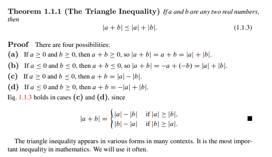
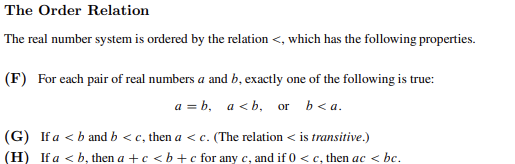
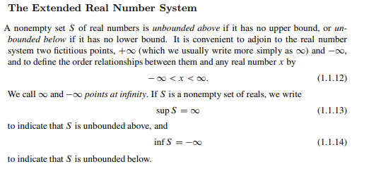

## 1.1: 2 

Q: Verify that the set consisting of two members, 0 and 1, with operations defined by Equations (1.1.1) and (1.1.2), is a field. Then show that it is impossible to define an order on this field that has properties (F), (G), and (H).

(1.1.1) 
```{r 111, echo=FALSE, fig.cap="1.1.1", out.width = '100%'}

```

(1.1.2)
```{r 112, echo=FALSE, fig.cap="1.1.2", out.width = '100%'}
knitr::include_graphics("112.png")
```

(F), (G), (H)
```{r FGH, echo=FALSE, fig.cap="(F), (G), (H) axioms", out.width = '100%'}

```

To consist of two members (elements) we show that the third member must be either 0 or 1, and G and H cannot follow.


## 1.1: 4

Q: Show that $\sqrt{p}$ is irrational if $p$ is prime. 

Suppose $p$ is a real number and is not prime. 

We may write p as the ratio of two numbers. 

We show that the fraction m/n is not in its lowest terms because p is a factor of both m and n.


## 1.1: 5
(a) 1 (no); 1 (yes) (b) 3 (no); 3 (no) (c) 7 (yes); 7 (yes) (d) 2 (no); 3 (no) (e) 1 (no); 1 (no) (f) 7 (no);

Q: Find the suprenum and infimum of each $S$. State whether they are in S. 

(a) $S =  \{ x | x = -\frac{1}{n} + [1 + (-1)^{n}]{n^2}, n \geq1 \}$

(b) $S = \{ x | x^2 < 9 \}$

(c) $S = \{ x | x^2 \leq 7 \}$

(d) $S = \{ x | \space |2x + 1| < 5 \}$

(e) $S = \{ x | (x^2 + 1)^{-1} > \frac{1}{2} \}$

(f) $S = \{ x | x = \text{rational and }x^2 \leq 7\}$


## 1.1: 7

Q: Show that

(a) inf S $\leq$ sup S for any nonempty set S of real numbers, and give necessary and sufficient conditions for equality

$s \leq sup(S)$ and $inf(S) \leq s$

Thus, for any nonempty set S 

$inf(S) \leq s \leq sup(S)$ 

and order relation (G) we have

$inf(S) \leq sup(S)$ 

the above holds strict equality when S is a set of one member.

(b) if S is unbounded then (a) holds if it is interpreted according to Equation (1.1.12) and the definition of Equations (1.1.13) and (1.1.14)

$-\infty < x < \infty \rightarrow inf(S) < x < sup(S)$ 

and order relation (G) we have

$inf(S) \leq sup(S)$ 

(1.1.12), (1.1.13), (1.1.14)
```{r 12to14, echo=FALSE, fig.cap="1.1.12, 13, and 14", out.width = '100%'}

```

## 1.1: 8

Let S and T be nonempty sets of real numbers such that every real number is in S or T and if $s \in S$ and $t \in T$, then $s < t$. Prove that there is a unique real number $\beta$ such that every real number less than $\beta$ is in S and every real number greater than $\beta$ is in T. (Also know as Dedekind's theorem). 

See: https://proofwiki.org/wiki/Dedekind%27s_Theorem

## 1.1: 9

Q: Using properties (A) - (H) of real numbers and taking Dedekind's theorem (Exercise 1.1.8, above) as given, show that every nonempty set U of real numbers that is bounded above has a suprenum. 

Hint: Let T be the set of upper bounds of U and S be the set of real numbers that are not upper bounds of U. 

## 1.1: 10

Q: Let $S$ and $T$ be nonempty sets of real numbers and define

$$S + T = \{ s + t | s \in S, t \in T\}$$

(a) Show that

(A): $\text{sup(S + T) = sup S + sup T}$
if S and T are bounded above and

(B): $\text{inf(S + T) = inf S + inf T}$
if S and T are bounded below 

(b) Show that if they are properly interpreted and extended reals, then (A) and (B) hold if S and T are arbitrary nonempty sets of real numbers 
