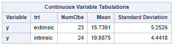
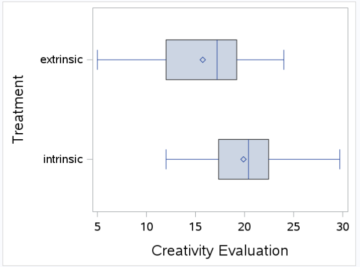
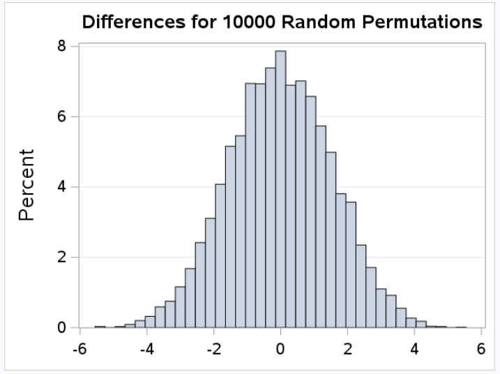
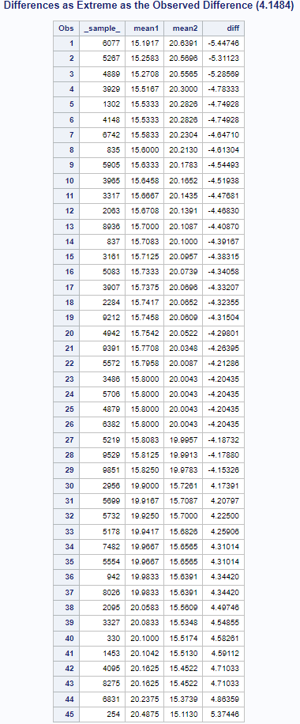

[Stat 5000]{.smallcaps}[Lab #1]{.smallcaps}\
[Fall 2024]{.smallcaps} [Due Tue Sept 3rd]{.smallcaps}
[Name: Sam Olson]{.smallcaps} \

**Directions:** Complete the exercises below. When you are finished,
turn in any required files online in Canvas, then check-in with the Lab
TA for dismissal.\

**[Assignment]{.underline}**

## Q: 1.  Calculate the sample mean score for each treatment group. What is the difference in the two sample means?

### A: 

```{r Means, echo=FALSE, fig.cap="Sample Means by Intrinsic/Extrinsic", out.width = '100%'}

```

Sample mean for extrinsic: $\approx{15.7391}$

Sample mean for intrinsic: $\approx{19.8875}$

Difference in sample means: $\text{Intrinsic Mean - Extrinsic Mean} = 19.888 - 15.739 = 4.1484$

\pagebreak

## Q: 2.  Use SAS to create a comparative box-plot for the sample mean score for each treatment group. Describe what you see.

### A: 

```{r BoxplotSamples, echo=FALSE, fig.cap="Boxplot of Samples by Treatment Type", out.width = '100%'}

```

Broadly speaking, we see that the scores of the intrinsic group tend to be larger than the scores of the extrinsic group. The first quartile, mean, and third quartile are all comparatively higher values than their corresponding statistic in the extrinsic group. We see from the above box and whisker plots that the IQR of the intrinsic group is roughly equal to or greater than the upper quartile of the extrinsic group (the values of the box from the mean to Q3 of extrinsic are values that are contained in Q1 to the mean of the intrinsic group). 

\pagebreak

## Q: 3.  What are the null and alternative hypotheses for the randomization test necessary to explore the research question?

### A: 

The null hypothesis is that there is no difference between the average instrinic score and the average extrinsic score, with the alternate hypothesis being that the difference between the average scores in each group is not zero. We denote this as $H_0: \mu_{intrinsic} = \mu_{extrinsic}$, with $H_A: \mu_{intrinsic} \neq \mu_{extrinsic}$, where $\mu_{intrinsic}$ is the average score for study participants receiving the intrinsic treatment and similarly $\mu_{extrinsic}$ is the average score for study participants receiving the extrinsic treatment. 

\pagebreak

## Q: 4.  Conduct a randomization test for these data in SAS (be sure to keep the random seed set at 500 so everyone gets the same answer) and study the reference distribution for the difference in the sample means for the 10,000 random assignments of treatments to subjects. Describe the shape, center and variability of this distribution.

### A: 

```{r permTest, echo=FALSE, fig.cap="Permutation Test Results", out.width = '100%'}

```

The shape of the above distribution is approximately normal centered at mean 0. There appears to be near zero in both skewness and kurtosis as well, and symmetric variance about the mean (roughly equal number of values greater than 0 as there are values less than 0); the distribution also resembles the standard normal, i.e. $\sigma \approx 1$, $\sigma^2 = 1$.

\pagebreak

## Q: 5.  Locate the observed difference in the sample means from part (a) on the reference distribution. Given the observed difference in the sample means from part (a), what is the p-value for this randomization test?

### A: 

```{r differences, echo=FALSE, fig.cap="Table of Results as Extreme as Observed", out.width = '100%'}

```

There were $45$ results as extreme as the observed value in the study (from the total 10,000 studies simulated during the permutation test). This gives us the following (one-sided) p-value calculation: 

$\text{p-value} = \frac{\text{simulated results as Extreme as observed}}{total simulated observations} = \frac{45}{10,000} = 0.0045$

\pagebreak

6.  Interpret the results of the test in the context of the research question.

### A: 

Having a p-value of 0.0045 means that we calculate the probability that randomization alone leads to a test statistic as extreme as or more extreme than the one observed in the study (of the mean score of intrinsic group being 4.1484 higher than the mean score of the extrinsic group) is 0.0045, or slightly less than half of one percent. This lends support to the belief that receiving the intrinsic treatment during the study contributed to an average increase in the score (of the haiku). 

\pagebreak

## Q: 7.  What aspects of the data collection in this experiment would need special attention by the researcher?
    
### A: 

Of particular note: Researchers should be especially weary of generalizing and applying the results of this study to a broader population of interest. There is a bit of bias on part of selection of participants for the study, in addition to having a relatively small sample of participants. Furthermore, the scores being used should be given further attention: Though the scores are being generated from non-participants in the study ("experts grading haikus"), the score is given as a compositive of multiple metrics, and inevitably lead to some fuzziness, e.g. what's the difference between a 14 and a 15 score, and is that difference the same as the difference between a 16 and a 17? 

**Total:** 20 points **\# correct:** **%:**
