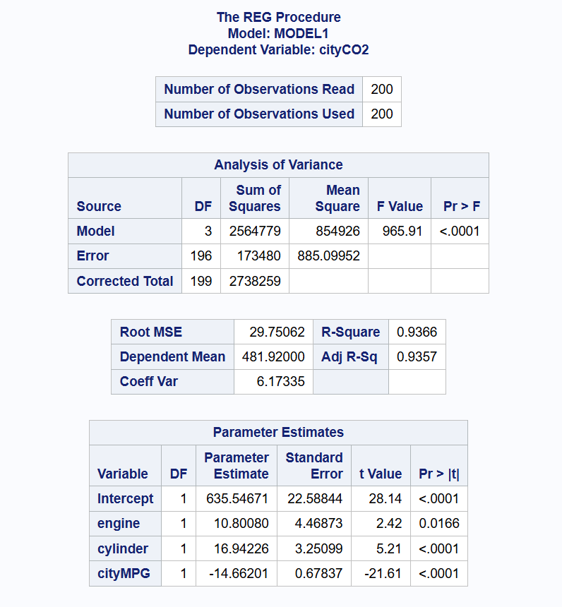
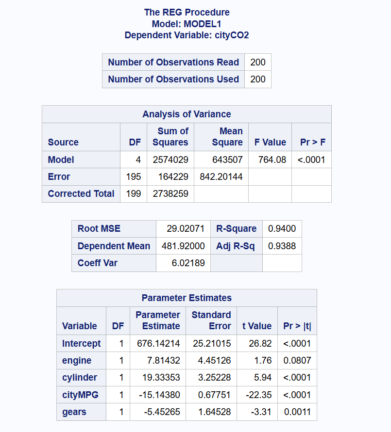
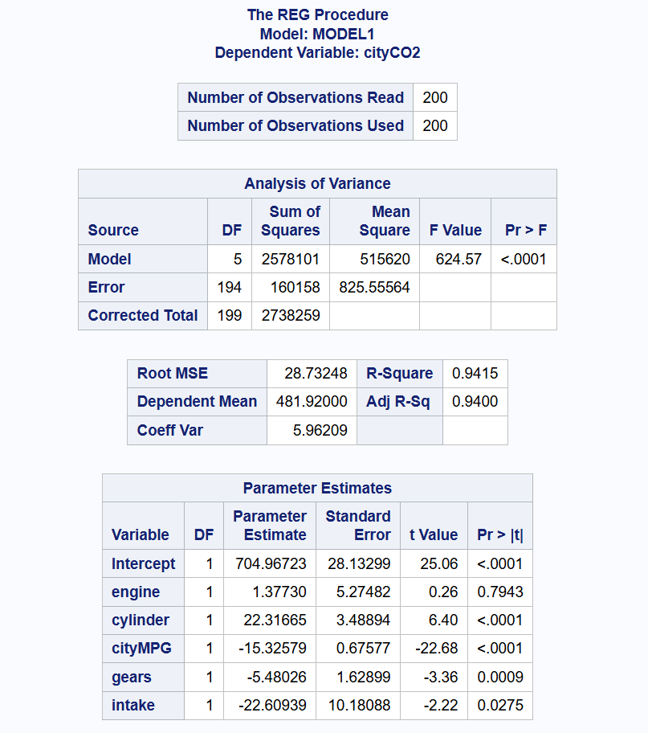

# Clarifications

  - Q1 (d): Interpretation of significance, does it require note of the other explanatory variables? 
  - Q2 (c): Partial F-test or overall; if partial, how do you get the p-value 
  - Q3 (b): Same question as Q1 (d) 
  - Anything additional for us to add aside from overall model summary comparisons? 

# Q1 

Use SAS to run the multiple linear regression model for cityCO2 with Engine, Cylinder, and CityMPG as explanatory variables. Use the output to complete the following exercises.

```{r, echo=FALSE, fig.cap="CocoMelon", out.width = '100%'}

```

\newpage

## (a) 

Give the equation for predicting the cityCO2 values from the three explanatory variables

$$
\hat{Y_i} = b_0 + b_1x_{(i, engine)} + b_2x_{(i, cylinder)} + b_3x_{(i, cityMP{G})}
$$

$$
\hat{Y_i} = 635.54671 + 10.80x_{(i, engine)} + 16.94x_{(i, cylinder)} - 14.66x_{(i, cityMPG)}
$$

## (b) 

Conduct an F-test for the overall model in helping to explain the cityCO2 values. Report the null and alternative hypotheses, test statistic and p-value, and interpret the result in the context of the study.

F-statistic: 965.91
p-value: < 0.0001

$H_0: \beta_1 = \beta_2 = \beta_3 = 0$
$H_A: \text{at least one } \beta_i \neq 0 \text{ for i = 1, 2, 3}$

Interpretation: We have overwhelming evidence to reject the null hypothesis (at the $\alpha = 0.05$ level in particular) in favor of evidence of the alternative hypothesis that at least one of our explantatory variables is significantly different from zero. Said differently, there is evidence that at least one of the following variables is statistically significant in predicting the mean C02 emissions of vehicles in city driving: Engine displacement, number of cylinders, and Fuel economy in city driving. 

## (c) 

Give the value of $R^2$ for this model and interpret its value (in context).

$R^2 = 0.9366$, or 93.66% of variability in the response variable (C02 emissions) can be explained by the multiple linear regression model using Engine displacement, number of cylinders, and Fuel economy as explanatory variables. 

## (d) 

Conduct a t-test for the significance of Engine in the model that includes Cylinder and CityMPG. Report the null and alternative hypotheses, test statistic and p-value, and interpret the result in the context of the study.

t-statistic: 2.42
p-value: 0.0166 

$H_0: \beta_1 = 0 \text{ or } \beta_{Engine} = 0$
$H_A: \beta_1 \neq 0 \text{ or } \beta_{Engine} = 0$

Where the slope parameter for the Engine explanatory variable corresponds to the index value 1 in our model. 

Interpretation: We have evidence to reject the null hypothesis at the $\alpha  = 0.05$ level, such that we have evidence to support the alternative hypothesis that the slope parameter for the Engine explanatory variable (displacement of the engine in liters) is not equal to zero. This suggests evidence that increasing the displacement of the engine (in liters) is associated with an increase in C02 emissions, all else being equal (or holding the other explanatory variables in the above model constant). 

\newpage

# Q2 

Use SAS to run the multiple linear regression model for cityCO2 with Engine, Cylinder, CityMPG, and Gears as explanatory variables. Use the output to complete the following exercises.

```{r, echo=FALSE, fig.cap="CocoMelon", out.width = '100%'}

```

\newpage

## (a) 

How much does adding Gears to the multiple linear regression model with Engine, Cylinder, and CityMPG reduce the sums of squared errors?

$$
SS_{error, model 1} = 173480
$$

$$
SS_{error, model 2} = 164229
$$

Difference: $SS_{error, model 1} - SS_{error, model 2}$ = 173480 - 164229 = 9251

Sum of Squared errors is reduced by 9251 by adding the Gears explanatory variable to the prior model. 

## (b) 

How much does adding Gears to the multiple linear regression model with Engine, Cylinder, and CityMPG increase the value of $R^2$?

$$
R^2_{model 1} = 0.9366
$$

$$
R^2_{model 2} = 0.94
$$

Difference: $SS_{error, model 2} - SS_{error, model 1}$ = 0.94 - 0.9366 = 0.0034

$R^2$ increases by 0.0034, or we add an additional 0.34% of variability being explained. 

## (c) 

Conduct an F-test for the effect of adding Gears to the multiple linear regression model with Engine, Cylinder, and CityMPG. Report the null and alternative hypotheses, test statistic and p-value, and interpret the result in the context of the study.


By adding 1 explanatory variable to the model, our F-statistic is: 

$$
F = \frac{(SSE_{reduced} - SSE_{full}) / m }{MSE_{full}} = ((173480 - 164229) / 1) / 842.20144 = 10.98431
$$

```{r}
p_value <- pf(10.98431, df1 = 1, df2 = 195, lower.tail = FALSE)
p_value
```

F-statistic: 10.98431
p-value: 0.0011 (From the model output). 

$H_0: \beta_{Gears} = 0$ 
$H_A: \beta_{Gears} \neq 0$ 

We have evidence to reject the null hypothesis at the $\alpha = 0.05$ level, such that we have evidence in support of the alternative hypothesis that the slope of the Gears explanatory variable is not zero. This is to say that we have evidence that increasing the number of the gears (in a car) is associated with an decrease in C02 emissions, all else being equal (or holding the other explanatory variables in the above model constant). We have evidence to suggest  that including Gears as an explanatory variable improves the model's ability to explain variability in CO2 emissions. 

\newpage

# Q3 

Use SAS to run the multiple linear regression model for cityCO2 with Engine, Cylinder, CityMPG, Gears, and Intake as explanatory variables. Use the output to complete the following exercises.

```{r, echo=FALSE, fig.cap="CocoMelon", out.width = '100%'}

```

\newpage

## (a) 

Give the equation for predicting the cityCO2 values from the four explanatory variables for vehicles with two intake valves per cylinder and for vehicles that do not have two intake valves per cylinder. What is the difference in these two equations?

With 2 exhaust vales per cylinder:

$$
\hat{Y_i} = b_0 + b_1x_{(i, engine)} + b_2x_{(i, cylinder)} + b_3x_{(i, cityMP{G})} + b_4x_{(i, Gears)} + b_4x_+{(i, Intake)}
$$

$$
\hat{Y_i} = 704.967 + 1.3773x_{(i, engine)} + 22.3167x_{(i, cylinder)} -15.3258x_{(i, cityMPG)} - 5.48x_{(i, Gears)} - 22.609
$$

$$
\hat{Y_i} = 682.358 + 1.3773x_{(i, engine)} + 22.3167x_{(i, cylinder)} -15.3258x_{(i, cityMPG)} - 5.48x_{(i, Gears)}
$$

Without 2 exhaust vales per cylinder:

$$
\hat{Y_i} = b_0 + b_1x_{(i, engine)} + b_2x_{(i, cylinder)} + b_3x_{(i, cityMP{G})} + b_4x_{(i, Gears)}
$$

$$
\hat{Y_i} = 704.967 + 1.3773x_{(i, engine)} + 22.3167x_{(i, cylinder)} -15.3258x_{(i, cityMPG)} - 5.48x_{(i, Gears)}
$$

The difference between these two equations is the intercept term, or the predicted mean C02 emissions when we have 0 input for all the other explanatory variables. 

## (b) 

Conduct a t-test for the significance of Intake in the model that includes Engine, Cylinder, CityMPG, and Gears. Report the null and alternative hypotheses, test statistic and p-value, and interpret the result in the context of the study

t-statistic: -2.22
p-value: 0.0275

$H_0: \beta_{Intake} = 0$ 
$H_A: \beta_{Intake} \neq 0$ 

Interpretation: We have evidence to reject the null hypothesis at the $\alpha  = 0.05$ level, such that we have evidence to support the alternative hypothesis that the slope parameter for the Intake explanatory variable (having 2 exhaust valves per cylinder) is not equal to zero. This suggests evidence that changing the number of intake values per cylinder to 2 is associated with a decrease in C02 emissions, all else being equal (or holding the other explanatory variables in the above model constant). 

\newpage

# Q4 

How do the 3 MLR models compare?

Overall: Model 3 performs best in terms of SSE, MSE (minimizing these two statistics), $R^2$, and Adjusted $R^2$ (maximizing these two statistics). Additionally, while all models have consistently significant variables of cityMPG and cylinder, the significance of the engine explanatory variables diminishes (becomes less significant in explaining variability in C02 emissions) as more variables are included, suggesting potential collinearity or redundancy. Lastly, adding more explanatory variables improves the fit, in $R^2$ as well as Adjusted $R^2$. 

Specific notes are included below: 

## Summary Statistics Comparisons: 

### SSE 
  1. Model 1 SSE = 173480
  2. Model 2 SSE = 164229
  3. Model 3 SSE = 160158

SSE decreases as we add more explanatory variables, indicating that the additional variables help explain more variation in C02 emissions.

### MSE 
  1. Model 1 MSE = 885.10
  2. Model 2 MSE = 842.20
  3. Model 3 MSE = 825.56

MSE also decreases with additional variables, reflecting better model fit (which we see when we then look at...)

### $R^2$ 
  1. Model 1 $R^2 = 0.9366$
  2. Model 2 $R^2 = 0.9400$
  3. Model 3 $R^2 = 0.9415$

$R^2$ increases as more predictors are added, though this is expected, which is why we then turn to...

### Adjusted $R^2$

  1. Model 1 $Adj. R^2 = 0.9357$
  2. Model 2 $Adj. R^2 = 0.9388$
  3. Model 3 $Adj. R^2 = 0.9400$

Adjusted $R^2$ also increases for each successive model, but at a slower rate than $R^2$, which is good as it means despite penalizing the inclusion of an additional explanatory variable, the variable(s) being added still provide more explanatory power than the penalization. Model 3 nonetheless has highest adjusted $R^2$ across the three models.  

## Significance of Explanatory Variables 

The general threshold of meeting the $\alpha = 0.05$ level is used for defining an explanatory variable as "significant", which is to say we have evidence at the $\alpha = 0.05$ level that the estimated slope parameter is not equal to 0, which is to say the inclusion of the particular explanatory variable improves the amount of variability in C02 emissions our model is able to explain by including the explanatory variable. 

### Consistently Significant Explanatory Variables:

Interpretation of the Intercept does not provide an especially compelling research interpretation and as such is not considered. That being said: 

  - All Models: cityMPG is significant (p-value < 0.0001) 
  - All Models: cylinder is significant (p-value < 0.0001) 

### Changes in Significance:

Engine Explanatory Variable 
  - As we move from Model 1 to 2 to 3, the p-value becomes larger, meaning the Engine variable becomes less significant
  - Model 1: Significant (p-value = 0.0166)
  - Model 2: On the cusp of significance (p-value = 0.0807)
  - Model 3: Not significant (p-value = 0.7943)
  
Gears Explanatory Variable
  - Only included in Models 2 and 3. 
  - Model 2: Significant (p-value = 0.0011)
  - Model 3: Significant (p-value = 0.0009) 
  
Intake Explanatory variable
  - Though only included in Model 3, it is significant (p-value = 0.0275) in Model 3
