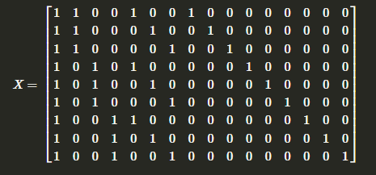

```{r, eval = T, results = F, echo = F, warning = F, message = F}
library(knitr)
```

# Q1 

For the models below, determine whether the OLS estimator of the parameter vector is (i) unique, (ii) identifiable, (iii) estimable. (iv) Briefly justify your response.

## (a) 

One-Way Cell Means ANOVA

Uniqueness: Unique. The design matrix is full rank and the vector of response means uniquely determines the values of the parameter vector $\beta$. 

Identifiability: Identifiable. Parameters $\mu_i$ are identifiable without constraints (e.g., sum-to-zero), but are also identifiable with constraints.

Estimability: Contrasts (e.g., $\beta_1 - \beta_2$) and individual cell means are estimable. 

## (b) 

One-Way Effects ANOVA

Uniqueness: Not Unique. The design matrix is not full rank due to the inclusion of an intercept alongside group indicator variables.

Identifiability: "Not Always"; Not Identifiable. Group effects $\alpha_i$ are not identifiable without constraints, e.g. sum-to-zero or setting one group effect to zero.

Estimability: "Not Always"; Contrasts (e.g., $\alpha_i - \alpha_j$) are estimable, but individual group effects are not.

## (c) 

Randomized Complete Block Design (RCBD)

Uniqueness: Not Unique. The design matrix is not full rank due to the inclusion of both block and treatment indicator variables without constraints.

Identifiability: "Not Always"; Not Identifiable. Treatment effects $\tau_i$ and block effects $\beta_j$ are not identifiable without constraints, e.g. sum-to-zero for treatments and blocks. But with constraints, they are identifiable. 

Estimability: "Not Always"; Contrasts of treatment effects (e.g., $\tau_i - \tau_k$) and block effects (e.g., $\beta_j - \beta_l$) are estimable, but individual effects are not.

## (d) 

Two-Way Effects ANOVA

Uniqueness: Not Unique. The design matrix is not full rank due to the inclusion of an intercept alongside group indicator variables.

Identifiability: "Not Always"; Not Identifiable. Group effects $\alpha_i$ are not identifiable without constraints, e.g. sum-to-zero or setting one group effect to zero.

Estimability: "Not Always"; Contrasts (e.g., $\alpha_i - \alpha_j$) are estimable, but individual group effects are not.

## (e) 

Two-Way Cell Means ANOVA

Uniqueness: X can/does have full column rank. 

Extra info: *Can be unique without constraints*, but can also be unique with constraints. The design matrix can be full rank but possibly is not (may be affected by overparameterization caused by main effects and interaction terms). Uniqueness may also be achieved by applying constraints (e.g., sum-to-zero constraints).

Identifiability: Identifiable (should be). 

Extra info: Identifiable with and without constraints. The parameters may not be identifiable without constraints due to *possible* overparameterization but are certainly identifiable when constraints, e.g. sum-to-zero constraints, are applied.

Estimability: Overall, estimable. 

Extra info: Individual cell means ($\mu_{ij}$) are estimable, as they correspond directly to observed responses. Contrasts, such as $\beta_1 - \beta_2$, are estimable if they lie within the row space of the design matrix.

\newpage 

# Q2 

A completely randomized two-factor experiment described by Hunter (1989) consisted of burning fuel with levels of two additives in a laboratory setting and determining the CO (carbon monoxide) emissions released. Eighteen batches of a standard fuel were available for this study. Two of the batches were randomly assigned to each of nine combinations of two additives corresponding to three levels of added ethanol (0.1, 0.2, or 0.3) and three air/fuel ratio settings (14, 15, or 16). Units for the ethanol levels were not reported. CO emissions concentrations (g/meter³) were determined for each burning the same amount of fuel from each of the 18 batches. The data are shown below.

| Added Ethanol | Air/Fuel Ratio 14 | Air/Fuel Ratio 15 | Air/Fuel Ratio 16 |
|---------------|-------------------|-------------------|-------------------|
| 0.1           | 66, 62            | 72, 67            | 68, 66           |
| 0.2           | 78, 81            | 80, 81            | 66, 69           |
| 0.3           | 90, 94            | 75, 78            | 60, 58           |

Consider the model: 

$$
Y_{ijk} = \mu + \alpha_i + \tau_j + (\alpha \tau)_{ij} + \epsilon_{ijk}
$$

Where $\alpha_i$ represents the i-th level of added ethanol effect, $\tau_j$ represents the j-th level of air/fuel ratio effect, and k denotes the replicates.

## (a) 

Show this model meets the definition of a linear model by writing the design matrix X and the parameter vector $\bf{\beta}$. To save time and room, only write the unique rows of the design matrix X.

Column descriptions: 

$$
(\mu, \alpha_1, \alpha_2, \alpha_3, \tau_1, \tau_2, \tau_3, (\alpha\tau)_{11}, (\alpha\tau)_{12}, (\alpha\tau)_{13}, (\alpha\tau)_{21}, (\alpha\tau)_{22}, (\alpha\tau)_{23}, (\alpha\tau)_{31}, (\alpha\tau)_{32}, (\alpha\tau)_{33})
$$

I needed to actually write out and then knit as an image the design matrix. The size of it was not allowing me to knit in environment. So apologies if the design matrix is located in a weird spot of my output. 

```{r, eval = T, echo=FALSE, fig.cap="CocoMelon", out.width = '100%'}

```

$$
\boldsymbol{\beta} = 
\begin{bmatrix}
\mu \\
\alpha_1 \\
\alpha_2 \\
\alpha_3 \\
\tau_1 \\
\tau_2 \\
\tau_3 \\
(\alpha\tau)_{11} \\
(\alpha\tau)_{12} \\
(\alpha\tau)_{13} \\
(\alpha\tau)_{21} \\
(\alpha\tau)_{22} \\
(\alpha\tau)_{23} \\
(\alpha\tau)_{31} \\
(\alpha\tau)_{32} \\
(\alpha\tau)_{33}
\end{bmatrix}
$$

$$
\mathbf{X\beta} = 
\begin{bmatrix}
\mu + \alpha_1 + \tau_1 + (\alpha\tau)_{11} \\
\mu + \alpha_1 + \tau_2 + (\alpha\tau)_{12} \\
\mu + \alpha_1 + \tau_3 + (\alpha\tau)_{13} \\
\mu + \alpha_2 + \tau_1 + (\alpha\tau)_{21} \\
\mu + \alpha_2 + \tau_2 + (\alpha\tau)_{22} \\
\mu + \alpha_2 + \tau_3 + (\alpha\tau)_{23} \\
\mu + \alpha_3 + \tau_1 + (\alpha\tau)_{31} \\
\mu + \alpha_3 + \tau_2 + (\alpha\tau)_{32} \\
\mu + \alpha_3 + \tau_3 + (\alpha\tau)_{33}
\end{bmatrix}
$$

So we do satisfy the equation for the general linear model: 

$$
\mathbf{Y} = \mathbf{X\beta} + \boldsymbol{\epsilon}
$$

\newpage 

## (b) 

What extra assumption must be added to the linear model in part (a) for the model to be considered a Gauss-Markov linear model?

We have additional assumptions regarding the error term, $\boldsymbol{\epsilon}$, specifically Constant variance: $\mathrm{Var}(\epsilon_{ijk}) = \sigma^2$ for all (i, j, k). 

## (c) 

For the Gauss-Markov model, list the conditions under which $Y^{T} (I-P_{X})Y$ has a quadratic form.

$\boldsymbol{Y}$ is an n-dimensional random vector.

$(I - P_{X})$ is a non-random n by n matrix with symmetry and idempotent. 

## (d) 

For the Normal-theory Gauss-Markov model, explain why the value $\frac{Y^{T} (I-P_{X})Y}{\sigma^2}$ has a Central Chi-square distribution with 9 degrees of freedom.

$Y^T (I - P_X) Y$ is a quadratic form of the normal vector $\epsilon$ (and the residuals are orthogonal to the column space of X).

$I - P_X$ is symmetric, idempotent, and has rank 9, providing the 9 degrees of freedom for its associated distribution. So we have: 

$$
A = \frac{(I - P_{X})}{\sigma^2}
$$

Where dividing by $\sigma^2$ standardizes the variance.

In our design matrix, we have n = 18 (number of observations). 

To get the ending rank of A, we have: 

$$
rank(A) = 18 - rank(X) = 18 - 9 = 9
$$

So our degrees of freedom for the associated $\chi^2$ distribution is 9 degrees of freedom.

## (e) 

Show the function $\alpha_1 + \alpha_2$ is not estimable.

### No constraints imposed: 

$$
E(Y_{1,j,k}) = \mu + \alpha_1 + \tau_j + (\alpha \tau)_{1,j}
$$

$$
E(Y_{2,j,k}) = \mu + \alpha_2 + \tau_j + (\alpha \tau)_{2,j}
$$

$$
E(Y_{1,j,k}) + E(Y_{2,j,k}) = [\mu + \alpha_1 + \tau_j + (\alpha \tau)_{1,j}] + [\mu + \alpha_2 + \tau_j + (\alpha \tau)_{2,j}]
$$
There is no way to separate $\alpha_1 + \alpha_2$ without also including estimates of $\mu, (\alpha \tau)_{1,j}, (\alpha \tau)_{2,j}$

### Alternative, with a constraint

Under the "sum-to-zero" constraint, we know: 

$$
\alpha_1 + \alpha_2 + \alpha_3 = 0 \rightarrow \alpha_1 + \alpha_2 = - \alpha_3
$$

Since $\alpha_1 + \alpha_2$ depends on $\alpha_3$, it cannot be expressed solely in terms of the observed data. This makes $\alpha_1 + \alpha_2$ unidentifiable from the data and as a result not estimable.

The linear combination $\alpha_1 + \alpha_2$ cannot be written as a linear combination of the rows of $X$, as the columns corresponding to $\alpha_1, \alpha_2,$ and $\alpha_3$ are linearly dependent due to the sum-to-zero constraint (means we do not have full rank of the design matrix).

## (f) 

Show the function $\tau_2 - \tau_3$ is not estimable.

### No constraints imposed: 

$$
E(Y_{i,2,k}) = \mu + \alpha_i + \tau_2 + (\alpha \tau)_{i,2}
$$

$$
E(Y_{i,3,k}) = \mu + \alpha_i + \tau_3 + (\alpha \tau)_{i,3}
$$

$$
E(Y_{i,2,k}) - E(Y_{i,3,k}) = [\mu + \alpha_i + \tau_2 + (\alpha \tau)_{i,2}] - [\mu + \alpha_i + \tau_3 + (\alpha \tau)_{i,3}] = \tau_2 + (\alpha \tau)_{i,2} - \tau_3 - (\alpha \tau)_{i,3}
$$

Similar to (e), there is no way to separate $\tau_2 - \tau_3$ without also including estimates of $(\alpha \tau)_{i,2}, (\alpha \tau)_{i,3}$

### Alternative, constraints imposed: 

Similar to part (e), the "sum-to-zero" constraint on the tau's means: 

$$
\sum_{j=1}^3 \tau_j = 0 \rightarrow \tau_1 + \tau_2 + \tau_3 = 0 \rightarrow \tau_2 = -\tau_1 - \tau_3 \rightarrow \tau_2 - \tau_3 = -\tau_1 - 2\tau_3
$$

Since $\tau_2 - \tau_3$ depends on $\tau_1$, it cannot be determined uniquely from the observed data. This dependence prevents $\tau_2 - \tau_3$ from being identifiable and hence estimable.

The columns of $X$ corresponding to $\tau_1$, $\tau_2$, and $\tau_3$ are linearly dependent because of the sum-to-zero constraint. This prevents the linear combination $\tau_2 - \tau_3$ from being expressed as a linear combination of the rows of $X$.

## (g) 

Show the function $(\tau_1 - \tau_2) + [(\alpha \tau)_{11} - (\alpha \tau)_{12}]$ is estimable.

### No constraints imposed: 

$$
E(Y_{1,1,k}) = \mu + \alpha_1 + \tau_1 + (\alpha \tau)_{1,1}
$$

$$
E(Y_{1,2,k}) = \mu + \alpha_1 + \tau_2 + (\alpha \tau)_{1,2}
$$

$$
E(Y_{1,1,k}) - E(Y_{1,2,k}) = [\mu + \alpha_1 + \tau_1 + (\alpha \tau)_{1,1}] - [\mu + \alpha_1 + \tau_2 + (\alpha \tau)_{1,2}] = (\tau_1 - \tau_2) + [(\alpha \tau)_{11} - (\alpha \tau)_{12}]
$$

We we are able to estimate $(\tau_1 - \tau_2) + [(\alpha \tau)_{11} - (\alpha \tau)_{12}]$, making it estimable. 

### Alternative, constraints imposed: 

$\tau_1 - \tau_2$ represents a contrast between air/fuel ratio levels. While contrasts of main effects are generally estimable, in a two-way design, this contrast may be confounded with interaction terms, making it not directly estimable without imposing constraints or by including additional parameters (such as the interaction terms).

$(\alpha \tau)_{11} - (\alpha \tau)_{12}$ is a contrast within interaction terms for a fixed ethanol level ($\alpha_1$) and two different air/fuel ratios ($\tau_1$ and $\tau_2$). Contrasts of interaction terms are estimable under the sum-to-zero constraints on interactions.

The inclusion of the interaction term contrast $(\alpha \tau)_{11} - (\alpha \tau)_{12}$ resolves any confounding of $\tau_1 - \tau_2$, ensuring that the combined function $(\tau_1 - \tau_2) + [(\alpha \tau)_{11} - (\alpha \tau)_{12}]$ lies entirely within the row space of the design matrix $\mathbf{X}$, meaning that we satisfy the full rank requirement of the design matrix X and as a result have identifiability and subsequently satisfy estimability.

