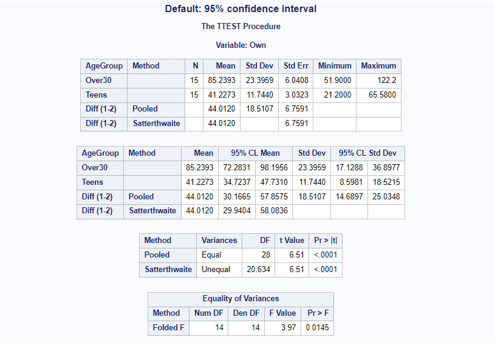

---
output:
  pdf_document: default
  html_document: default
---
[Stat 5000]{.smallcaps}[Lab #3]{.smallcaps}\
[Fall 2024]{.smallcaps} [Due Tue Sep 17th]{.smallcaps}
[Name: Sam Olson]{.smallcaps} \

**Directions:** Complete the exercises below. When you are finished,
turn in any required files online in Canvas, then check-in with the Lab
TA for dismissal.\

**[Introduction to Confidence Intervals in SAS]{.underline}**

The same SAS code that conducts the two-sample t-test in SAS will also
provide a corresponding confidence interval. As an example, consider the
observational study on texting speeds from last time:

For a school statistics poster competition in 2006, students timed 15
randomly selected teenagers from the school and 15 randomly selected
staff from the school over the age of 30 on how long it took each person
to text the following sentence on their phone: "the quick brown fox
jumps over the lazy dog.\" Each subject had the sentence in front of
them while they were typing. The text message had to be typed with no
errors, no abbreviations, and no use of the phone directory. Time was
measured using a stop watch to within 0.01 seconds. Participants were
timed using two phones - their own phone and a "control\" phone, which
was the same for all participants. We would like to determine if
teenagers were faster "texters,\" on average, than adults. The data are
located in the `smsspeed.csv` file and the full SAS program in
`smsspeed_Lab3.sas` within our course's shared folder in SAS Studio.

-   First, load in the dataset:

            data SMS;
                 infile `~/my_shared_file_links/u63538023/STAT5000_Fall2024_ISU/
                         smsspeed.csv' dlm=`,' firstobs=2;
                 input Age AgeGroup $ Own Control;
            run;

-   Then, use the `proc ttest` command to conduct a test and obtain the
    corresponding confidence interval for the difference in mean speed
    between the teenagers and adults. Use the `class` option to specify
    the category variable and the `var` option to specify the response
    variable.

            title1 `T-test for Difference in Mean Times - Own Phone';
            proc ttest data=SMS; 
                 class AgeGroup;
                 var Own;
            run;

    You'll find the corresponding 95% confidence interval in the columns
    of the output table for `95% CL Mean` and then look at the row for
    `Diff (1-2) Pooled`.

-   You can change the confidence level using the `alpha=` parameter.
    For example, a 99% confidence interval can be obtained by:

            proc ttest data=SMS alpha=0.01; 
                 class AgeGroup;
                 var Own;
            run;

**[Sample Size Simulations in SAS]{.underline}**

In lecture, we looked at an example of a randomized experiment to
determine which of two treatments was the most effective at reducing
bone loss in elderly women. In this experiment, we will assume equal
sample sizes, equal population variances, and normally distributed
response variables in both samples. We will also assume an estimate of
the pooled sample variance for the response variable is available from
previous studies, denoted as $S_p^2$. The SAS code to calculate sample
sizes is provided in the `power_Lab3.sas` file in the course's shared
folder in SAS Studio.

-   Suppose our research question is to determine whether or not the two
    treatment means are different. We will use a hypothesis test with
    Type I error rate of $\alpha$ and will want the power to detect a
    difference of $\delta$ units between the treatment means to be
    $1-\beta$.

    In lecture, our example used $\alpha=0.05$ (`alpha`), $1-\beta=0.8$
    (`power`), $\delta=4$ (`meandiff`), and $S_p^2=25$ (take the square
    root and enter as `stddev`). The code that produced the result of
    $26$ subjects in each treatment group (specified using a period for
    `npergroup`, meaning this is what you want SAS to solve for) is
    given below.

                proc power;
                     twosamplemeans test=diff
                     alpha = 0.05
                     meandiff = 4.0
                     stddev= 5
                     npergroup = .
                     power = 0.80;
                run;

-   Then, use SAS to help you determine the effect of changes to the
    values of $\alpha$, $1-\beta$, $\delta$, and $S_p^2$ on the sample
    size ($n$). To make it easier to study these changes, you can modify
    the SAS code to study the sample size for multiple values of an
    input value at the same time. For example, to study the effect of
    increasing power $1-\beta$, you can change the power command to

                     power = 0.80 to 0.95 by 0.05;

    or you can list values to study, like

                     power = 0.80, 0.9, 0.95, 0.99;

-   Instead of the analysis above, suppose our research question is to
    estimate the difference between the two treatment means using a
    $100(1-\alpha)$% confidence with width of no more than $\delta$
    units.

    In lecture, our example used $\alpha=0.05$, $\delta=4$, and
    $S_p^2=25$. From the calculation, we obtained a sample size of $50$
    from each sample. The code that produced this result is given below.

            proc power; 
                 twosamplemeans test=diff
                 alpha = 0.05
                 meandiff = 4.0
                 stddev= 5
                 npergroup = .
                 power = 0.975;
            run;

    Note: For sample size determinations using the confidence interval
    method, the value of `power` should always be set to the confidence
    level, $1-(\alpha/2)$.

\newpage

**[Assignment]{.underline}**

1.  Conduct the t-test for the SMS speed example in SAS and complete the following exercises:

> 1.  Using the formula from the notes, calculate by hand a 95% confidence interval for the difference in the two treatment means. Use $t_{28,0.975}=2.0484$.

Formula: 
$$\text{95\% Confidence Interval} \space = (\bar{Y_1} - \bar{Y_2}) \pm t_{28,0.975} S_p \sqrt{\frac{1}{n_1} + \frac{1}{n_2}}$$
Where: 
$$S_p = \frac{(n_1-1)S_1^2 + (n_2-1)S_2^2}{n_1+n_2-2}$$

Calculation
```{r}
# Load Data 
library(readr)
smsspeed_1 <- read_csv("C:/Users/samue/OneDrive/Desktop/Iowa_State_PS/STAT 5000/Labs/Lab 3/smsspeed-1.csv")
```

```{r}
library(dplyr)
data1 <- smsspeed_1 %>% 
  filter(smsspeed_1$AgeGroup == "Over30")

data2 <- smsspeed_1 %>% 
  filter(smsspeed_1$AgeGroup == "Teens")

sampleMean1 <- mean(data1$`Own Phone`)
sampleMean2 <- mean(data2$`Own Phone`)
difference <- sampleMean1 - sampleMean2 
difference
```

```{r}
#Step 2: Finding standard deviation 
s1 <- sd(data1$`Own Phone`)
s2 <- sd(data2$`Own Phone`)

#Step 3: Finding sample size 
n1 <- length(data1$`Own Phone`)
n2 <- length(data2$`Own Phone`)

numerator <- (n1-1)*(s1^2) + (n2-1)*(s2^2)
denom <- n1 + n2 - 2
pooled <- sqrt( numerator / denom )  
sqrtFactor <- sqrt(1/n1 + 1/n2)

tStatDf <-  2.0484

rightSide <- tStatDf*pooled*sqrtFactor 

pooled
rightSide 
```

```{r}
lb <- difference - rightSide
ub <- difference + rightSide

lb
ub
```
This gives a 95% Confidence Interval for the Difference to be between (30.167, 57.857).

\newpage

> 2.  Provide a screenshot of the SAS output and use it to verify your calculation.

```{r CI95, echo=FALSE, fig.cap="95% Confidence Interval SAS", out.width = '100%'}

```

\newpage 

> 3.  Interpret the confidence interval in the context of the problem.

A 95% Confidence Interval can be interpreted as a calculated range within which we can be 95% certain the true effect (true difference between two groups) lies. 

Within the context of this particular question, it can be interpreted as: We are 95% Confident that the true difference between people Over 30 and Teens texting speeds is between 30.167 and 57.857 seconds; or is would take people Over 30 30.167 to 57.857 more seconds to type a specified message compared to Teens (within the context of being 95% confident). 

This may also be interpreted as a commentary on the procedure of calculating the Confidence Interval: If we repeated this procedure of experimentation and calculation and constructed their respective 95% confidence intervals, these confidence intervals would contain the true difference between Over 30 and Teens texting times 95% of the time. 

\newpage

2.  Use SAS to explore sample size determinations for the bone loss example using the **hypothesis testing method** and complete the following exercises:

> 1.  Explore the effect of changing just the significance level - For $\alpha = 0.01, 0.05, 0.1$, what are the resulting sample sizes? Summarize your findings in one concise sentence.

```{r Alpha, echo=FALSE, fig.cap="Alpha", out.width = '100%'}
knitr::include_graphics("significance.PNG")
```

For greater significance levels we calculate needing an increasing number of sampels per Group, and the amount these sample sizes increase by is non-linear, i.e. each decrease of $0.01$ in $\alpha$ (greater significant level) requires a larger number of samples to be added per Group compared to its prior significance level. 

\newpage

> 2.  Explore the effect of changing just the power - For $1-\beta = 0.99, 0.95, 0.9, 0.8, 0.7$, what are the resulting sample sizes? Summarize your findings in one concise sentence.

```{r Beta, echo=FALSE, fig.cap="Beta", out.width = '100%'}
knitr::include_graphics("power.PNG")
```

When changing just the power in relation to the estimated sample size, we see that greater power (smaller $\beta$) requires larger sample sizes, and the increase in sample sizes between power levels becomes larger and larger for smaller and smaller $\beta$'s. 

\newpage

> 3.  Explore the effect of changing just the true effect size - For $\delta = 1, 2, 3, 4, 5, 6$, what are the resulting sample sizes? Summarize your findings in one concise sentence.

```{r Delta, echo=FALSE, fig.cap="Effect Size", out.width = '100%'}
knitr::include_graphics("effectSize.PNG")
```

We require significantly larger sample sizes to detect smaller effect sizes, i.e. the larger the effect size, the smaller the estimated sample size required, holding all else equal. 

\newpage

> 4.  Explore the effect of changing just the estimated population variance - For $S_p^2 = 1, 4, 9, 16, 25, 36$, what are the resulting sample sizes? Summarize your findings in one concise sentence.

```{r stdDev, echo=FALSE, fig.cap="95% Confidence Interval SAS", out.width = '100%'}
knitr::include_graphics("stdDev.PNG")
```

As the estimated population variance increases, we estimate needing increasing larger sample sizes, and the rate at which this increased sample size is estimated is increasing, e.g. the difference between 5 and 6 Std Dev is larger than the difference between 1 and 2 Std Dev. 


\newpage

3.  Use SAS to explore sample size determinations for the bone loss example using the **confidence interval method** and complete the following exercises:

> 1.  Explore the effect of changing just the significance level - For $\alpha = 0.01, 0.05, 0.1$, what are the resulting sample sizes? Summarize your findings in one concise sentence.

```{r CI1, echo=FALSE, fig.cap="", out.width = '100%'}
knitr::include_graphics("CI1.PNG")
```

Consistent with the findings of Q2, albeit for a difference method: Higher significance levels (lower $\alpha$) require significantly larger sample sizes per group. 

\newpage

> 2.  Explore the effect of changing just the true effect size - For $\delta = 1, 2, 3, 4, 5, 6$, what are the resulting sample sizes? Summarize your findings in one concise sentence.

```{r CI2, echo=FALSE, fig.cap="", out.width = '100%'}
knitr::include_graphics("CI2.PNG")
```
Consistent with the findings of Q2, 3. albeit for a difference method: We require much larger sample sizes per Group for smaller differences between groups, and smaller sample sizes per Group for larger differences between groups. 

\newpage

> 3.  Explore the effect of changing just the estimated population variance - For $S_p^2 = 1, 4, 9, 16, 25, 36$, what are the resulting sample sizes? Summarize your findings in one concise sentence.

```{r CI3, echo=FALSE, fig.cap="", out.width = '100%'}
knitr::include_graphics("CI3.PNG")
```

Consistent with the findings of Q2, 4. albeit for a difference method: Increasing estimated population variance results in much larger estimations for sample sizes, and the rate of increase for these samples grows larger as the variance increases. 

\newpage

> 4.  Think about how the sample size determination using the confidence interval method relates to the **standard error method**. Summarize your findings in one concise sentence.

These two methods are related in that both methods require and take as input the **pooled estimate of the population variance** to estimate the required sample size. 

**Total:** 50 points **\# correct:** **%:**
