# Assignment - Lab 5
Due October 8th 

## 1. 
Refer to the ANOVA results for the donut example to complete the following exercises:

### (a) 
Construct a scatter plot of the absorption to visualize potential differences between oil treatment groups. Include a screenshot of the plot.

```{r, echo=FALSE, fig.cap="Scatter Plot of Absorption", out.width = '100%'}
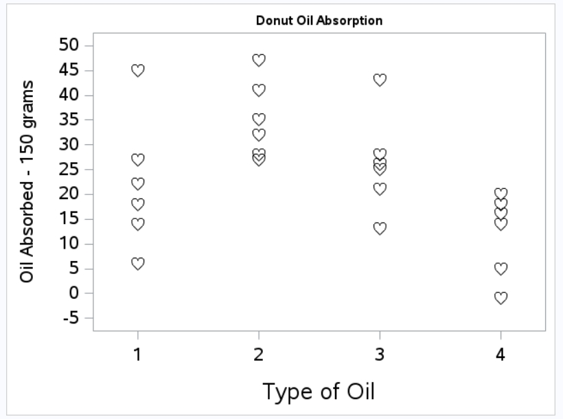
```

### (b) 
Compute the relevant summary statistics to compare the amount of oil absorbed for each  type. Include a screenshot or record the means and standard deviations.

```{r, echo=FALSE, fig.cap="Summaries of Absorption", out.width = '100%'}
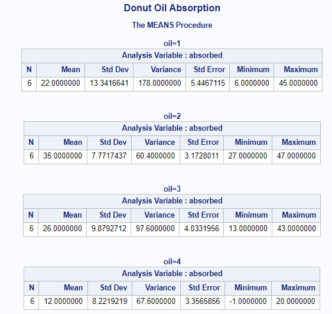
```

### (c) 
Conduct the F-test for the equality of the four means. Provide a screenshot of the full ANOVA table for the different types of cooking oil and absorption measurements.

```{r, echo=FALSE, fig.cap="F-Test", out.width = '100%'}
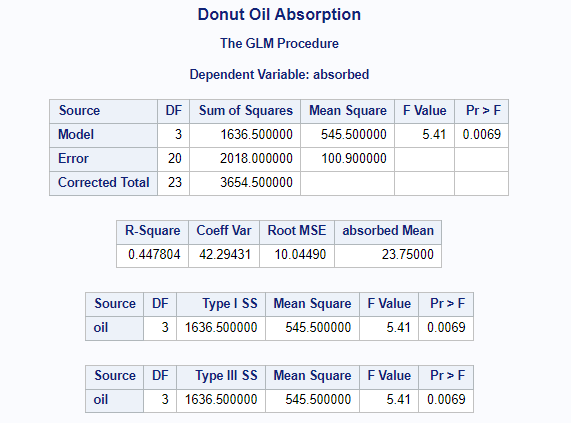
```

\newpage
### (d) 
Given the results in part (c), state the null and alternative hypotheses, test statistic, p-value, and interpretation of the result in the context of the study.

$H_0$: Null Hypothesis: $\mu_1 = \mu_2 = \mu_3 = \mu_4$; the mean absorption of donuts is the same across all groups of oils. 

$H_A$: Alternative Hypothesis: At least one $\mu_i$ is different for $i = 1, 2, 3, 4$; at least one mean absorption of a group of donuts is different than the mean absorption of the other donuts  

Test Statistic: F-Value: 5.41 

p-value: Pr > F: 0.0069

Interpretation: 

We have evidence to reject the null hypothesis that mean donut absorption of oil is the same for all groups of oil treatments, specifically at the $\alpha = 0.05$ or 95% confidence level. We can be more confidence as well though given the p-value of 0.0069, which is a low probability that we observed the differences in mean absorption between groups that we did under the null hypothesis being true. This lends evidence in support of the alternative hypothesis that at least one group has a mean absorption of oil different from the mean absorption of oil in the other groups. 

\newpage
## 2. 
Refer to the process of diagnosing the ANOVA assumptions for the donut example to complete the following exercises:

### (a) 
Discuss the independence assumption in the context of the study. Is it satisfied for the donut example?

We most definitely have independence between groups, as different oils were used and each type of oil was distinct (presumably) from the others. The within group independence is a bit trickier by comparison, though I would say we satisfy (do not violate) that assumption of independence as well. 

My reasoning is as follows: We are cooking in batches, so we guarantee that our observational units (a batch of donuts) is not repeated (used again for frying). Because we go from raw dough to cooked donuts, and because we only cook one batch of donuts at a time, we avoid any cross contamination of either mixing batches or of mixing oils, meaning independence is satisfied within and between groups. 

However, the above does rest upon batches being cooked separately, which is a jump of logic; though the contrapositive (that multiple batches were cooked at once) was not noted. 

### (b) 
Check the assumption of equal variances and provide a screenshot of any relevant tables and/or figures that you used. Is it satisfied for the donut example?

Overall Methods: 

    - Different plots of the residuals, including residual plots (Fit Diagnostics)
    - Standard side-by-side boxplot of the responses within each group
    - Brown-Forsythe test for equal variances
    - Summary statistics 
  
Overall Assessment: 
Overall we have reason to believe our equal variances assumption is not violated. 

The Brown-Forsythe test provides a large p-value which provides evidence to support the null hypothesis of equal variances between groups. Though visually, we see some differences in the variability/spread of absorption values between groups, such as those visually displayed in the box plots, we must take these with a grain of salt given we only have $n=6$, 6 batches per oil type group. It is also worth noting that the reported summary statistics for each group (standard deviation) are all in the same orders of magnitude, ranging from approx. 7.7 to approx 13.3.  

When we then turn our attention to the residual plots, we notice a number of things to further support the notion that our equal variances assumption is not violated. Particularly, the residual plot by group does not show a general pattern, meaning we have constant variance in the residuals. 

Figures: 

```{r, echo=FALSE, fig.cap="Observed Variances", out.width = '100%'}
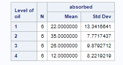
```

```{r, echo=FALSE, fig.cap="Lots of Plots", out.width = '100%'}
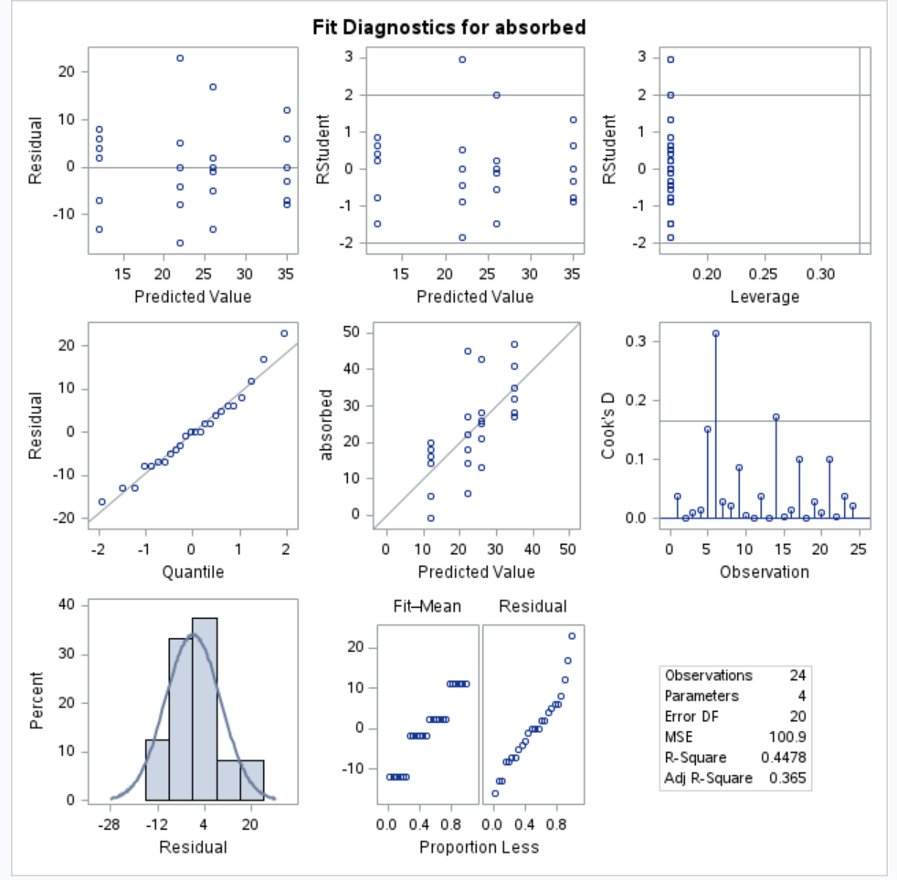
```

```{r, echo=FALSE, fig.cap="BoxPlots", out.width = '100%'}
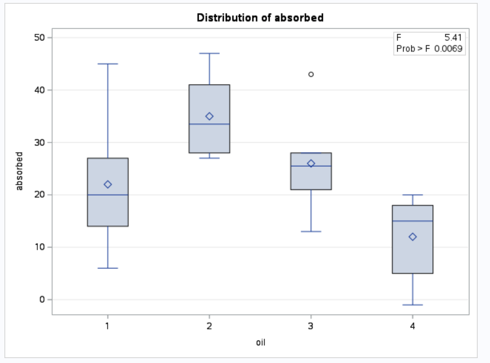
```

```{r, echo=FALSE, fig.cap="Residual Plot By Group", out.width = '100%'}
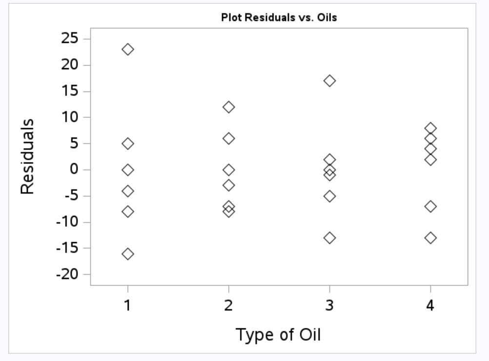
```

### (c) 
Check the assumptions of normality and provide a screenshot of any relevant tables and/or figures that you used. Is it satisfied for the donut example?

Overall Methods: 
    
    - different plots of the residuals, including residual plots 
    - standard side-by-side boxplot of the responses within each group
    - summary statistics 
    - Univariate procedure on the residuals, including: 
      - Summary statistics, which includes skewness, excess kurtosis, mean, and median
      - Normality tests 
    - QQ Plot
  
Overall Assessment: 
Overall, normality in the data appears not to be violated, at least at the overall (non-grouped) level, which similarly carries over to the residuals not violating normality.

For the sake of brevity, the below plots are only **new** plots for the purpose of diagnosing potential normality violations. The assessment was also done using a number of the plots given above used in part (c) variance assessment. 

That being said: 

Observations: From above figures, the residuals average to around zero, which we also see when assessing the summary statistics. The overall distribution of the observations appear normally distributed visually, with regards to the histogram. However, when looking at individual groups, the shape of the distributions appear somewhat non-normal, e.g. box plots by group have means not equal to medians, unequal spreads in variability such that there is not symmetry in variability about the mean. 

Residuals: Mean and median of the residuals are both zero, which are two details in favor of normality not being violated. We see a little amount of skewness (below 1) and a smidgen of excess kurtosis (also below 1). The Shapiro-Wilk test provides a large p-value that would provide support of the null hypothesis of normality for the residuals (which are further supported by the other named statistical tests of normality). Additionally, the QQ Plot of the residuals closely follows along the reference line with minor deviations around the tails of the distribution. 

Figures: 

```{r, echo=FALSE, fig.cap="Normality Pt1", out.width = '100%'}
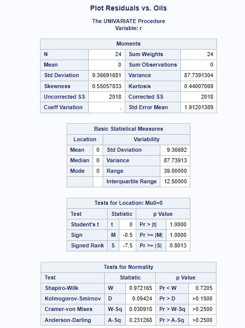
```

```{r, echo=FALSE, fig.cap="Normality Pt2", out.width = '100%'}
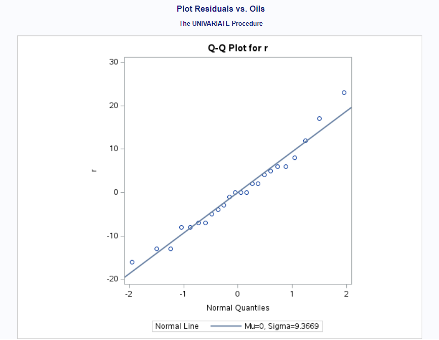
```

\newpage
## 3. 
Refer to the results of the Kruskal-Wallis test for the donut example to complete the following exercises:

### (a) 
Conduct the Kruskal-Wallis test to analyze the different types of cooking oil on the oil absorbed. Provide a screenshot of the results obtained.

```{r, echo=FALSE, fig.cap="Kruskal-Wallis test", out.width = '100%'}
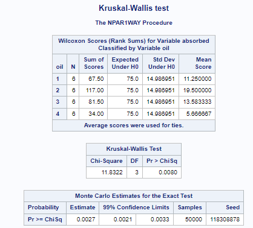
```

```{r, echo=FALSE, fig.cap="Kruskal-Wallis test Distribution", out.width = '100%'}
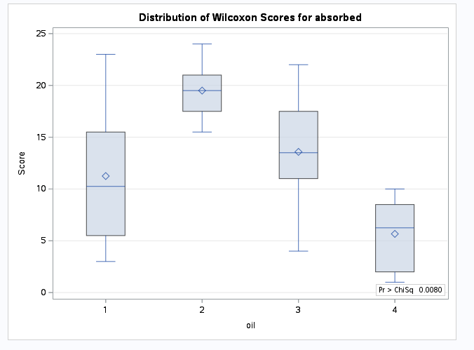
```

\newpage
### (b) 
Given the results in part (a), state the null and alternative hypotheses, test statistic, and p-value.

$H_0$: Null Hypothesis: r populations have the same distribution; each oil group of the four different types of frying oil have the same distributions 

$H_A$: Alternative Hypothesis: At least one group has a different distribution; at least one oil group of the four different types of frying oil has a different distribution than the others 

Test Statistic: Chi-Square: 11.8322	

p-value: Pr > ChiSq: 0.0080

### (c) 
Interpret the result from part (b) in the context of the study.

We have evidence to reject the null hypothesis the distributions of oil absoprtion between the four groups of frying oil are all the same. We have evidence to reject the null hypothesis at the $\alpha = 0.05$ level, and have evidence to support the alternative hypothesis that at least one of the types of oil has a distribution that is different from the distributions of the other types of oil used in the study. 