# Q1 

The full SAS program to analyze the penicillin data is provided in the penicillin Lab7.sas file located in our course’s shared folder in SAS Studio. Refer to the output (and modify the code where necessary) to complete the following exercises:

## (a) 

From the SAS output, find the full ANOVA table and provide an appropriate summary of results for analyzing the different processes on the yield of penicillin.

```{r, echo=FALSE, fig.cap="Img", out.width = '100%'}
knitr::include_graphics("Anove1.png")
```

With a p-value of 0.0407, we reject the null hypothesis that the batch has no effect on the yield of penicillin at the $\alpha = 0.05$ level. However, with a p-value of 0.3387 we do not reject the null hypothesis that the process has no effect on the yield of the penicillin. Overall, this is somewhat consistent with the p-value derived for the F-test, 0.0754, which would provide evidence to reject the null hypothesis at the $\alpha = 0.10$ level that all variables (batch and process) have no effect on the yield of penicillin. 

## (b)

Perform all pairwise comparisons of treatment means using Tukey’s HSD method. Write a summary of your findings

```{r, echo=FALSE, fig.cap="Img", out.width = '100%'}
knitr::include_graphics("Tukey1.png")
```

All pairwise comparisons of treatment (process) have relatively large p-values, such that we do not reject the null hypothesis that any of the processes are on average different from any other process used, with reference to their average penicillin yields. 

## (c) 

There are three orthogonal contrasts specified in the SAS code. Describe the analysis provided by these contrasts and determine which are statistically significant. Write a summary of your findings.

```{r, echo=FALSE, fig.cap="Img", out.width = '100%'}
knitr::include_graphics("Contrasts1.png")
```

A-B: With a p-value of 0.7219, we do not have evidence to reject the null hypothesis that processes A and B are different in their average penicillin yield. 

C - (A+B)/2: This contrast is whether process C is different from the average of processes A and B. With a p-value of 0.0827, we have evidence at the $\alpha = 0.10$ level to reject the null hypothesis that C is the same as A and B in favor of there being a difference in penicillin yields for process C.

D - (A+B+C)/3: This contrast is whether process D is different from processes A, B, and C. With a p-value of 1.00, we do not have evidence to reject the null hypothesis of there being no difference between process D and the average of processes A, B, and C regarding their penicillin yields. 

## (d) 

Check the assumptions for the RCBD analysis using SAS output. Write a summary of your findings.

There are 4 assumptions in the RCBD: 
  1. Independence of residuals: assessed through the study design principles

  2. Homogeneous (equal) residual variance: assessed through boxplots of residuals within each treatment, ratio of standard deviations, and equal variance statistical tests such as the Brown Forsythe

  3. Normality of residuals: assessed through histograms, normal Q-Q plots, summary statistics (mean, median, skewness, excess kurtosis), and tests for normality of the residuals

  4. Additive block and treatment effects: Using the penicillin example as illustration, the additivity assumption for the RCBD can be checked in SAS using both graphs and statistical tests 
    • Residual vs. Fitted Graph (no replication required): The easiest method for diagnosing this new assumption is to plot the fitted values on the x-axis and the residuals on the y-axis and then examine this plot for any trends (trends indicate an interaction between blocks and treatments, whereas random scatter indicates additive effects).

Overall: We do not have evidence to suspect that our key assumptions for the analysis are being violated. However, the assumption of additivity is somewhat suspect, as there may be some evidence of there being interaction effects. 

Independence: We do not have reason to believe this assumption is violated, as 5 random batches were selected for each process. Though not explicitly stated, we may reasonably infer that batches were not reused/recycled or otherwise "repeated" in this process; if this were violated however, our independence assumption would likely be violated.  

```{r}
sds <- c(5.1231, 5.9582, 6.2849, 5.5227)
max(sds)/min(sds)
```

Homogenous variances: The ratio of standard deviations by process is 1.2267, which is not especially problematic for our equal variances assumption. Turning to the residuals by group (process), we observe the spread of residuals is similar across groups, with a minor exception being the residuals for process "A" being relatively more narrow compared to groups "B", "C", and "D". Finally, turning to statistical tests we utilize the Brown-Forsythe test and do not reject the null hypothesis of homogenous variances between treatments (p-value of 0.9388). Use of Leven's Test provides consistent conclusions as well (not rejecting the null hypothesis of equal variances, albeit with p-value of 0.7620). 

Normality: The QQ plot appearss generally normal (closely aligns with the reference line), with a minor exception being the tails of the distribution. Via Shapiro-Wilk, we do not reject the null hypothesis of normally distributed (via a p-value of 0.95). Looking at the summary statistics: While Mean is not equal to median, it is close (0 vs. -0.5 resp.); additionally skewness and excess kurtosis are close to zero (their magnitude is no greater than 1). Taken together, there is nothing glaringly obvious that something is being violated for this assumption.  

Block and Treatment effects: To test this we primarily use visual inspection of the fitted vs. residual plot. I want to be completely honest: I believe this could go either way and I'd recommend we actually estimate whether there are interactions in order to be more certain. 

My gut instinct on the visual inspection is that there is a bit of a trend, as we have a more narrow spread in larger fitted values (around 90-95), though overall there appears to be a random scatter of points. If we see no trend then we would say we likely have additive effects, but as I believe there is a slight trend I would argue there is some (though sparing) evidence that there is an interaction between blocks and treatments. The visual evidence is not especially striking. 

```{r, echo=FALSE, fig.cap="Img", out.width = '100%'}
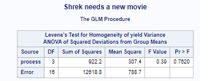
```

```{r, echo=FALSE, fig.cap="Img", out.width = '100%'}
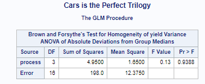
```

```{r, echo=FALSE, fig.cap="Img", out.width = '100%'}
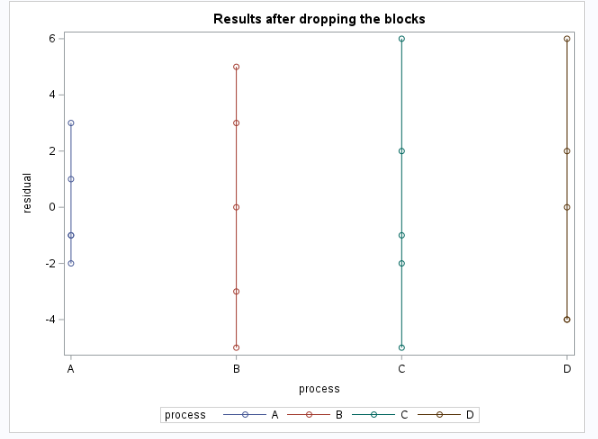
```

```{r, echo=FALSE, fig.cap="Img", out.width = '100%'}
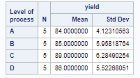
```

```{r, echo=FALSE, fig.cap="Img", out.width = '100%'}
knitr::include_graphics("Fitted1.png")
```

```{r, echo=FALSE, fig.cap="Img", out.width = '100%'}
knitr::include_graphics("Summary1.png")
```

```{r, echo=FALSE, fig.cap="Img", out.width = '100%'}
knitr::include_graphics("StatTests.png")
```

```{r, echo=FALSE, fig.cap="Img", out.width = '100%'}
knitr::include_graphics("QQ1.png")
```
```{r, echo=FALSE, fig.cap="Img", out.width = '100%'}
knitr::include_graphics("Boxplots1.png")
```

## (e) 

Did blocking help? Compare the RCBD design with a design dropping the block effect and summarize your findings. Include a discussion of efficiency

```{r, echo=FALSE, fig.cap="Img", out.width = '100%'}
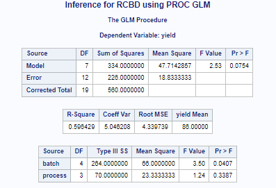
```

```{r, echo=FALSE, fig.cap="Img", out.width = '100%'}
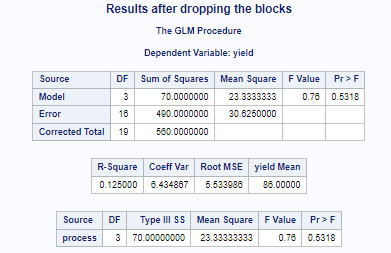
```

Blocking (inclusion of the "batch" variable) significantly improves the efficiency of the model, as evidenced by the relatively higher R-squared (0.5984 vs. 0.125) and a lower Root MSE (4.33 vs. 5.53). Furthermore, we saw that the variable for block effect, "batch", is statistically significant at the $\alpha = 0.05$ level, such that we had evidence to reject the null hypothesis that the blocking had no impact on the average penicillin yields. We additionally see that our model has a greater Sum of Squares and MSE when we incorporate the blocking factor in our model, which indicates that this model is able  to better explain the variability in our data. 

This, despite the "process" factor not not being significant (do not reject the null hypothesis of "process" having no effect on penicillin yield) in either model. With such reasoning we find the initial RCBD design with blocks is more effective than the model without blocks.

On the topic of efficiency gains: The model with blocking is more efficient. By including blocking we effectively reduce the Sum of Squares error, which in turn indicates that the estimates being produced as more efficient (precise). This is to be expected though, to a certain extent. During lectures we made note that that the RCBD design is more efficient than CRD, for a fixed number of units/observations (in one example we required 1.48 times the number of units/observations of the RCBD study in order to have similar/equal efficiency). 

\newpage 

# Q2 

The full SAS program to analyze the brome data is provided in the brome Lab7.sas file located in our course’s shared folder in SAS Studio. Refer to the output (and modify the code where necessary) to complete the following exercises:

## (a) 

Find the full ANOVA table and provide an appropriate summary of results for analyzing the different management plans on the yield of brome.

```{r, echo=FALSE, fig.cap="Img", out.width = '100%'}
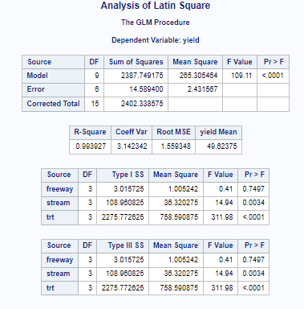
```

We do not have evidence to reject the null hypothesis that the average yield of brome is different from the average yield of brome "in situ" (as-is). However, we do have evidence to reject the null hypothesis (both at the $\alpha = 0.01$ level) that the average yield of brome is different from the stream compared to "in situ" as well as from the trt compared to "in situ". This in consistent with our F-test findings via the $<0.0001$ p-value (significant at the $\alpha = 0.001$ level) that at least one of our variables of interest is different from 0 (different from "in situ"). 

## (b) 

Is there any difference between the management plan of “in situ” versus the other plans? Provide appropriate output from SAS and summarize your findings.

```{r, echo=FALSE, fig.cap="Img", out.width = '100%'}
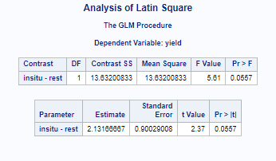
```

Directly comparing "in situ" to the rest of the plans, we do have evidence to reject the null hypothesis at the $\alpha = 0.10$ level (p-value of 0.0557) in favor of the alternative hypothesis that the rest of the plans on average have different brome yields compared to "in situ". 

## (c) 

Did the consideration of the stream block help? Compare the LS design with a design dropping the stream effect and summarize your findings. Include a discussion of efficiency.

```{r, echo=FALSE, fig.cap="Img", out.width = '100%'}
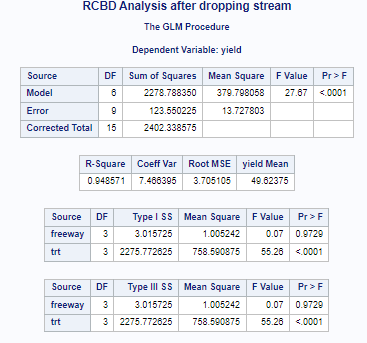
```

```{r, echo=FALSE, fig.cap="Img", out.width = '100%'}
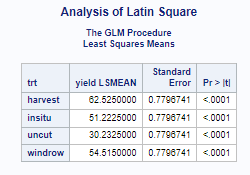
```

```{r, echo=FALSE, fig.cap="Img", out.width = '100%'}
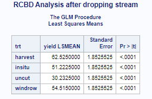
```

As the "stream" variable is significant in the Latin Squares design (significant as in has a p-value of 0.0041 leading us to reject the null hypothesis of no difference between "stream" and "in situ" at the $\alpha = 0.01$ level), we believe that dropping this from our model will decrease efficiency, increase the Sum of Squares Error, and overall decrease the precision of our estimates. 

On the other hand, in both models we do not reject the null hypothesis that "freeway" is different from "in situ", meaning that the continued inclusion of this variable will have very little (if any) impact on our overall model. 

Taken together, we do believe, or at least have some evidence, to suggest that the inclusion of the "stream" variable helps, insomuch as it provides greater efficiency, precision, and predictive power in our overall model. Specifically, when comparing overall model diagnostics such as MSE/R-Squared, we observe relatively higher R-Squared in our Latin Squares Model compared to the one when stream is dropped (0.9939 vs. 0.94857) as well as Root MSE (1.5590 vs. 3.7051). 

By considering the stream as a block, the model becomes more effective at estimating treatment effects, as evidenced by the much higher F value for treatment ("trt") in the Latin Squares design (311.98 vs. 55.68 specifically for "trt"). Furthermore, when directly comparing the Standard Errors of the different treatments, we see significantly lower SEs when utilizing "stream" (0.77967 vs. 1.85255). 