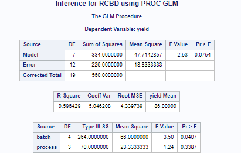
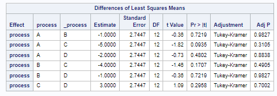
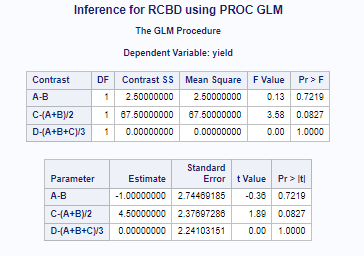
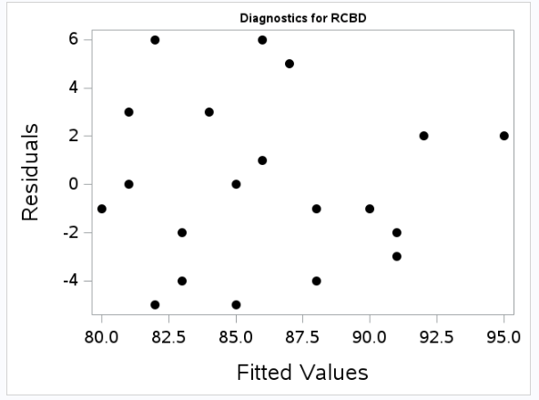
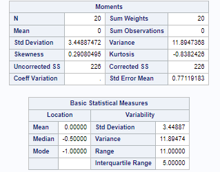
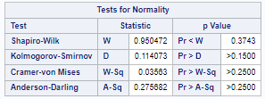
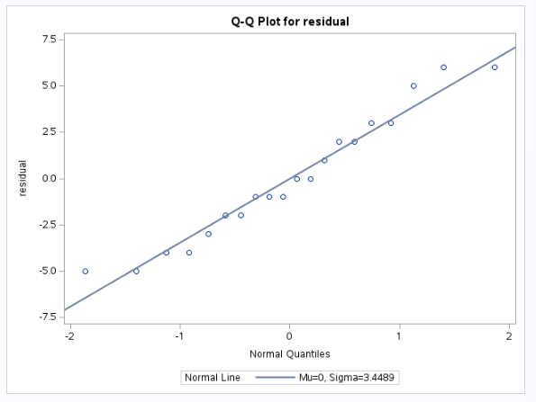
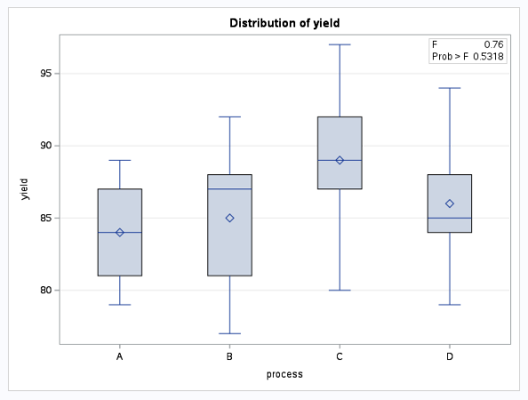

# Q1 

The full SAS program to analyze the penicillin data is provided in the penicillin Lab7.sas file located in our course’s shared folder in SAS Studio. Refer to the output (and modify the code where necessary) to complete the following exercises:

## (a) 

From the SAS output, find the full ANOVA table and provide an appropriate summary of results for analyzing the different processes on the yield of penicillin.

```{r, echo=FALSE, fig.cap="Img", out.width = '100%'}

```

## (b)

Perform all pairwise comparisons of treatment means using Tukey’s HSD method. Write a summary of your findings

```{r, echo=FALSE, fig.cap="Img", out.width = '100%'}

```

## (c) 

There are three orthogonal contrasts specified in the SAS code. Describe the analysis provided by these contrasts and determine which are statistically significant. Write a summary of your findings.

```{r, echo=FALSE, fig.cap="Img", out.width = '100%'}

```

## (d) 

Check the assumptions for the RCBD analysis using SAS output. Write a summary of your findings.

There are 4 assumptions in the RCBD: 
  1. Independence of residuals: assessed through the study design principles

  2. Homogeneous (equal) residual variance: assessed through boxplots of residuals within each treatment, ratio of standard deviations, and equal variance statistical tests such as the Brown Forsythe

  3. Normality of residuals: assessed through histograms, normal Q-Q plots, summary statistics (mean, median, skewness, excess kurtosis), and tests for normality of the residuals

  4. Additive block and treatment effects: Using the penicillin example as illustration, the additivity assumption for the RCBD can be checked in SAS using both graphs and statistical tests 
    • Residual vs. Fitted Graph (no replication required): The easiest method for diagnosing this new assumption is to plot the fitted values on the x-axis and the residuals on the y-axis and then examine this plot for any trends (trends indicate an interaction between blocks and treatments, whereas random scatter indicates additive effects).
    


```{r, echo=FALSE, fig.cap="Img", out.width = '100%'}

```

```{r, echo=FALSE, fig.cap="Img", out.width = '100%'}

```

```{r, echo=FALSE, fig.cap="Img", out.width = '100%'}

```

```{r, echo=FALSE, fig.cap="Img", out.width = '100%'}

```
```{r, echo=FALSE, fig.cap="Img", out.width = '100%'}

```

## (e) 

Did blocking help? Compare the RCBD design with a design dropping the block effect and summarize your findings. Include a discussion of efficiency

\newpage 

# Q2 

The full SAS program to analyze the brome data is provided in the brome Lab7.sas file located in our course’s shared folder in SAS Studio. Refer to the output (and modify the code where necessary) to complete the following exercises:

## (a) 

Find the full ANOVA table and provide an appropriate summary of results for analyzing the different management plans on the yield of brome.

## (b) 

Is there any difference between the management plan of “in situ” versus the other plans? Provide appropriate output from SAS and summarize your findings.

## (c) 

Did the consideration of the stream block help? Compare the LS design with a design dropping the stream effect and summarize your findings. Include a discussion of efficiency.
