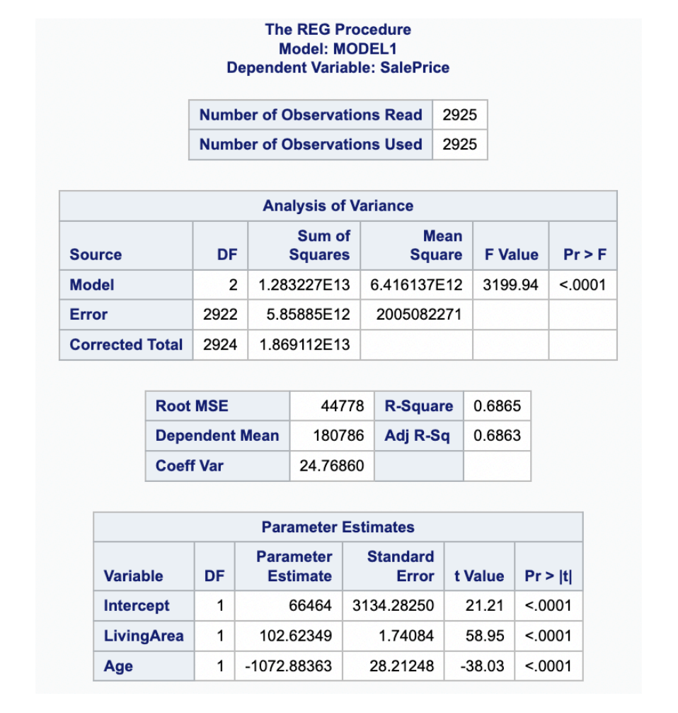
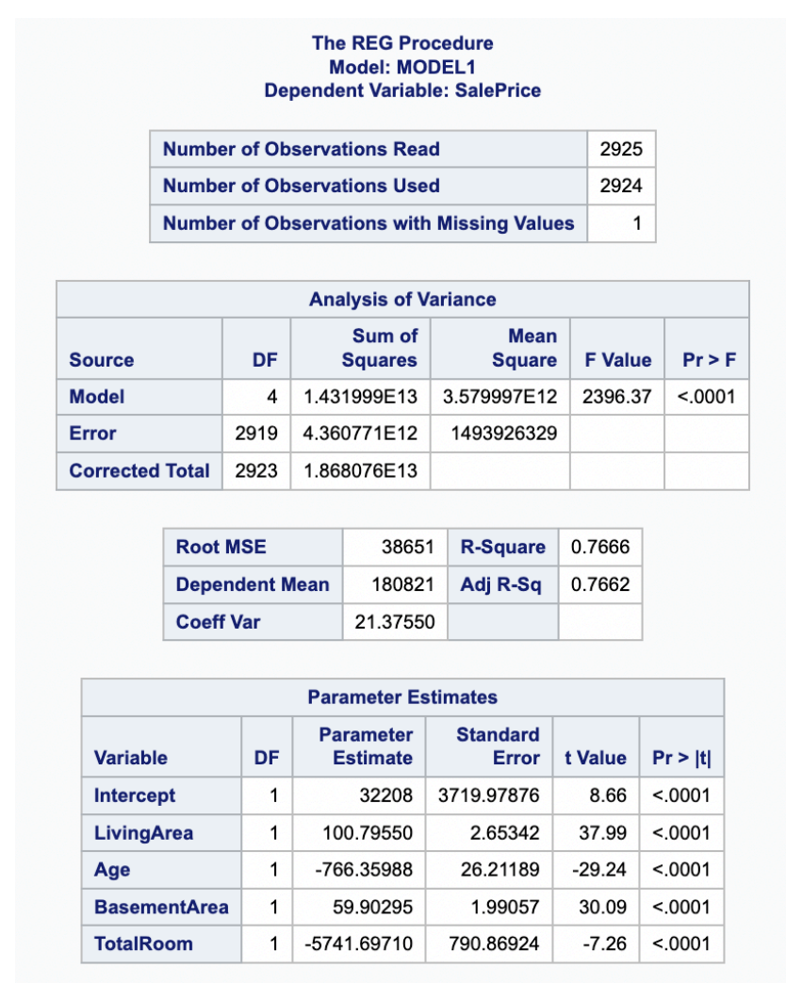

[Stat 5000]{.smallcaps}
[Homework #10]{.smallcaps}\
[Fall 2024]{.smallcaps} 
[due Fri, November 22nd @ 11:59 pm]{.smallcaps}
[Name: Sam Olson]{.smallcaps} \
[Collaborators: Craig, Ethan, Ben, Sabrina, Olivia, The Hatman]{.smallcaps} \

```{r, eval = T, results = F, echo = F, warning=F, message=F}
library(knitr)
```

# Q1 

In the last homework assignment, the relationship between weight and height of 18 year old girls was examined. For this assignment, you will examine additional variables collected in the Berkeley Guidance Study. The data are posted in the file BGSgirls2.txt. There is one line of data for each of 70 girls with the variables appearing in the following order:

  - ID: Girl identification number
  - WT2: Weight (kg) at 2 years
  - HT2: Height (cm) at 2 years
  - WT9: Weight (kg) at 9 years
  - HT9: Height (cm) at 9 years
  - LG9: Leg circumference (cm) at 9 years
  - ST9: Strength (kg) at 9 years
  - WT18: Weight (kg) at 18 years
  - HT18: Height (cm) at 18 years
  - LG18: Leg circumference (cm) at 18 years
  - ST18: Strength (kg) at 18 years
  - BMI: Body Mass Index at 18 years
  - SOMA: Somatotype (SOMA), on a scale from 1, very thin, to 7, very obese

The goal of this exercise is to determine how well the measurements at ages 2 and 9 can predict BMI at age 18.

Use R to complete the following exercises:

## (a) 

Compute the sample correlations between BMI at age 18 and each of the following explanatory variables HT2, HT9, WT2, WT9, and ST9. Which of these explanatory variables have significant correlations with BMI at age 18?

```{r}
data <- read.table("BGSgirls2.txt", header = F)

colnames(data) <- c(
  "ID",       # Girl identification number
  "WT2",      # Weight (kg) at 2 years
  "HT2",      # Height (cm) at 2 years
  "WT9",      # Weight (kg) at 9 years
  "HT9",      # Height (cm) at 9 years
  "LG9",      # Leg circumference (cm) at 9 years
  "ST9",      # Strength (kg) at 9 years
  "WT18",     # Weight (kg) at 18 years
  "HT18",     # Height (cm) at 18 years
  "LG18",     # Leg circumference (cm) at 18 years
  "ST18",     # Strength (kg) at 18 years
  "BMI",      # Body Mass Index at 18 years
  "SOMA"      # Somatotype (SOMA), on a scale from 1, very thin, to 7, very obese
)

response_var <- "BMI"
explanatory_vars <- c("HT2", "HT9", "WT2", "WT9", "ST9")

correlations <- sapply(X = explanatory_vars, 
                       FUN = function(var) {
                         cor(data[[var]], data[[response_var]])
                         })
correlations

correlation_results <- sapply(X = explanatory_vars, 
                              FUN = function(var) {
                                test <- cor.test(data[[var]], data[[response_var]])
                                c("correlation" = round(test$estimate, 4), "p-value" = round(test$p.value, 4))
                                })

correlation_results_df <- as.data.frame(t(correlation_results))
correlation_results_df <- cbind(variable = explanatory_vars, correlation_results_df)
correlation_results_df
```

Using `cor.test` we are able to extract both the correlation coefficient as well as its associated p-value for determining significance. For something to be "significant", we evaluate it at the $\alpha = 0.05$ level, such that we are testing whether the explanatory variable in question has a correlation coefficient with the response variable (BMI) significantly different from 0 (null hypothesis, alternative being the correlation is not zero). That being said: 

### Significant Findings

The only significant explanatory variables are for WT9 and HT9 at the level specified above are: 

WT9: Weight (kg) at 9 years
   - Correlation: $0.5459$
   - $p$-value: $1.018837 e{-6}$
   - Significant: The correlation is strong, greater in magnitude to 0.5, and the p-value is smaller than our reference threshold. 

HT9: Height (cm) at 9 years
   - Correlation: $0.2369$
   - $p$-value: $0.0483$
   - Significant: The correlation is not especially strong, but the p-value is below the 0.05 threshold.

### Not Significant Findings

The other explanatory variables considered had small (close to zero estimated sample) correlations, and as such are found not to meet the significance threshold. 

ST9:
   - Correlation: $0.0056$
   - $p$-value: $0.9633$
   - Not Significant: The correlation is near zero and the p-value is nearly 1.

HT2:
   - Correlation: $0.0426$
   - $p$-value: $0.7264$
   - Not Significant: The correlation is near zero and the p-value is rather large.

WT2:
   - Correlation: $0.1909$
   - $p$-value: $0.1133$
   - Not Significant: While the correlation is not especially strong, and despite being a somewhat small p-value it is nonetheless larger than the comparison value of 0.05.

## (b) 

Compute the sample correlations among the five explanatory variables HT2, HT9, WT2, WT9, and ST9. Which of these explanatory variables have significant correlations with other explanatory variables?

```{r}
explanatory_vars <- c("HT2", "HT9", "WT2", "WT9", "ST9")
explanatory_data <- data[, explanatory_vars]
cor_matrix <- cor(explanatory_data)
n <- nrow(explanatory_data) 
p_values <- matrix(NA, nrow = length(explanatory_vars), ncol = length(explanatory_vars))
rownames(p_values) <- colnames(p_values) <- explanatory_vars

# For loops are allowed
# Yipee! 
for (i in 1:length(explanatory_vars)) {
  for (j in 1:length(explanatory_vars)) {
    if (i != j) {
      test <- cor.test(explanatory_data[[i]], explanatory_data[[j]])
      p_values[i, j] <- test$p.value
    }
  }
}

significant_correlations <- which(p_values < 0.05, arr.ind = TRUE)
significant_results <- data.frame(
  Var1 = rownames(p_values)[significant_correlations[, 1]],
  Var2 = colnames(p_values)[significant_correlations[, 2]],
  "correlation" = round(cor_matrix[significant_correlations], 4),
  "p-Value" = round(p_values[significant_correlations], 4)
)

significant_results <- significant_results[!duplicated(t(apply(significant_results, 1, sort))), ]
significant_results
```

$\text{HT9}, \text{WT9}, \text{WT2}$, and $\text{ST9}$ are strongly or moderately correlated with multiple other variables, where "strongly" or "moderately" is whether the magnitude of correlation (|Rho|) is greater than or equal to 0.35 (for moderate, 0.50 for strong). Pairwise comparisons are listed below for variables with correlations stronger in magnitude than 0.05, which is all of them. Additionally, all of the pairwise comparisons considered had significant p-values, or p-values whose values are below the $\alpha = 0.05$ threshold. 

Please pardon the redundancies as Cor(HT9, HT2) = Cor(HT2, HT9): 

### HT2

   - $\text{HT9}$ $r = 0.7384$, $p \approx 3.00 e-13$
   - $\text{WT2}$ $r = 0.6445$, $p \approx 1.73 e-9$
   - $\text{WT9}$ $r = 0.5229$, $p \approx 3.42 e-6$
   - $\text{ST9}$ $r = 0.3617$, $p \approx 2.09 e-3$

### HT9

   - $\text{HT2}$ $r = 0.7384$, $p \approx 3.00 e-13$
   - $\text{WT9}$ $r = 0.7276$, $p \approx 9.69 e-13$
   - $\text{WT2}$ $r = 0.6071$, $p \approx 2.52 e-8$
   - $\text{ST9}$ $r = 0.6034$, $p \approx 3.23 e-8$

### WT2

   - $\text{WT9}$ $r = 0.6925$, $p \approx 3.11 e-11$
   - $\text{HT2}$ $r = 0.6445$, $p \approx 1.73 e-9$
   - $\text{HT9}$ $r = 0.6071$, $p \approx 2.52 e-8$
   - $\text{ST9}$ $r = 0.4516$, $p \approx 8.71 e-5$

### WT9

   - $\text{HT9}$ $r = 0.7276$, $p \approx 9.69 e-13$
   - $\text{WT2}$ $r = 0.6925$, $p \approx 3.11 e-11$
   - $\text{HT2}$ $r = 0.5229$, $p \approx 3.42 e-6$
   - $\text{ST9}$ $r = 0.4530$, $p \approx 8.22 e-5$

### ST9

   - $\text{HT9}$ $r = 0.6034$, $p \approx 3.23 e-8$
   - $\text{WT2}$ $r = 0.4516$, $p \approx 8.71 e-5$
   - $\text{WT9}$ $r = 0.4530$, $p \approx 8.22 e-5$
   - $\text{HT2}$ $r = 0.3617$, $p \approx 2.09 e-3$

## (c) 

Find least squares estimates of the parameters in the regression of BMI at age 18 on strength at age 9,

$$
BMI_i = \beta_0 + \beta_1 ST9_i + \epsilon_i, \text{ for } i = 1, ..., 70
$$

Is the slope significantly different from zero? What do the residual plots reveal?

```{r}
model <- lm(BMI ~ ST9, data = data)
summary(model)
```

```{r}
plot(data$ST9, resid(model), main = "Residuals vs ST9", xlab = "ST9 (Strength at 9)", ylab = "Residuals")
abline(h = 0, col = "black")
qqnorm(resid(model))
qqline(resid(model), col = "black")
```

```{r}
library(MASS)
stdresids <- studres(model) 

plot(data$ST9, stdresids, main = "Studentized Residuals vs ST9", xlab = "ST9 (Strength at 9)", ylab = "Studentized Residuals")
abline(h = 0, col = "black")
qqnorm(stdresids)
qqline(stdresids, col = "black")
```

### Least Squares Formula:

$$
\hat{Y_i} = b_0 + b_1x_{(i, ST9)} 
$$

$$
\hat{Y_i} = 21.471009 + 0.001023x_{(i, ST9)}
$$

So our estimated intercept of the least squares model, $b_0$ is 21.471009, and for $b_1$ we have 0.001023. 

Our response variable for the above model is BMI at at 18 years old. 

### Significance of Slope:

  - $H_0$: $\beta_1 = 0$ 
  - $H_a$: $\beta_1 \neq 0$ 
  - $t$-value for the slope: $t = 0.046$.
  - $p$-value for the slope: $p = 0.963$.

For $p = 0.963$, we do not meet the threshold of $\alpha = 0.05$, such that we fail to reject the null hypothesis. This means we do not have evidence to support the slope of the linear regression to be significantly different from zero. (We do not have evidence to reject that strength at age 9 does not significantly predict BMI at age 18.) 

### Residual Plots:

Note, the interpretation of both the Residual Plots vs. Fitted and the QQ-Plot are consistent for both the non-studentized as well as the studentized residuals. 

The residuals plots below are used primarily to assess three assumptions of the linear regression: linearity, constant variance, and normality.

#### Residuals Plot:

  - The residuals are scattered randomly around 0, which indicates no clear pattern and suggests that the assumption of linearity is reasonable (not being violated). Furthermore as the spread of residuals across fitted values tends to be consistent (constant, no increase or decrease in variance for fitted values), we have further evidence to believe constant variance assumption is also reasonable (not being violated). 
  - The aforementioned point is conditional on the removal of outliers though, as there are a few points that fall outside the "typical" boundary of points in the residual plot. As these few points could be considered outliers in the data, their removal would provide a residual plot that looks even better, i.e. conforms even more to our expectations of what to expect under the pretense that our our assumptions (of linearity and of constant variances) are not being violated.

#### Normal Q-Q Plot:

  - The residuals generally follow the reference line for the first few theoretical quantiles, though we do observe some deviations from the reference line at the tails of the distribution. Generally, it appears that our assumption of normality of errors is not being violated. 
  - Again, we do observe some points that could be considered outliers, such that their possible removal would help to further validate our assumption of normality to not be violated.

A Quick Note on Model Fit: $R^2 = 0.00003139$: This indicates that only 0.003% of the variation in BMI at age 18 is explained by strength at age 9. And Adj. $R^2 = -0.01467$ is negative. So this really is not an especially great model fit. 

## (d) 

Now compute the multiple regression of the body mass index at age 18 on both weight at age 9 and strength at age 9, i.e. fit the model

$$
BMI_i = \beta_0 + \beta_1 ST9_i + \beta_2 WT9_i + \epsilon_i, \text{ for } i = 1, ..., 70
$$

Is the estimate of $\beta_1$ for this model, the coefficient for strength at age 9, the same as the estimate of $\beta_1$ for the model in part (c)? Did you expect the estimates to be different? Explain. Is the effect of strength at age 9 significant in this model?

```{r}
multi_model <- lm(BMI ~ ST9 + WT9, data = data)
summary(multi_model)
```

### Estimates of $\beta_1$ (Effect of Strength at Age 9):

  - From the multiple regression model: $\hat{\beta}_1 = -0.05552$ 
  - From the simple regression model in part (c): $\hat{\beta}_1 = 0.001023$
  - These two values are different! 

### Comparison:

  - Between the two models, the estimates for $\beta_1$ differ significantly, both in sign (positive to negative), to magnitude (from decimal place of hundreths to decimal place of thousanths). 
  - This is somewhat understandable though, as their interpretations between models differ: In the simple regression model, the estimate reflects the total (unadjusted) association between $\text{ST9}$ and BMI. By contrast, in the multiple regression model, the estimate reflects the unique contribution of $\text{ST9}$ to BMI, after adjusting for $\text{WT9}$. The negative coefficient in the multiple regression suggests that, after accounting for weight at age 9, greater strength is associated with lower BMI.
  - I would argue that this change is not unexpected, but instead expected, because $\text{WT9}$ and $\text{ST9}$ are likely correlated given our prior correlations (the two variables ST9 and WT9 in our multiple regression are positively correlated with one another). 

### Is the Effect of Strength at Age 9 Significant (In the Multiple Regression Model)?

  - The $t$-value (test statistic) for ST9: $t = -2.799$.
  - The $p$-value for the estimated parameter ST9: $p = 0.00668$.

Since the above p-value is smaller than the $\alpha = 0.05$ level threshold, we have evidence to reject the null hypothesis. This means we have evidence that strength at age 9 ($\text{ST9}$) is statistically significant in the multiple regression model estimating BMI at age 18 that includes WT9 as an explanatory variable. This indicates that strength at age 9 has a significant relationship with BMI at age 18, after adjusting for weight at age 9 ($\text{WT9}$) (or for a constant/fixed value of WT9).

## (e) 

Fit the multiple regression model

$$
BMI_i = \beta_0 + \beta_1 WT2_i + \beta_2 HT2_i + \beta_3 WT9_i + \beta_4 HT9_i + \beta_5 ST9_i + \epsilon_i, \text{ for } i = 1, ..., 70
$$

Report and interpret in context the $R^2$ value.

```{r}
full_model <- lm(BMI ~ WT2 + HT2 + WT9 + HT9 + ST9, data = data)
summary(full_model)
```

$R^2 = 0.4431$:

Interpretation: 44.31% of the variability in BMI at age 18 is explained by the multiple linear regression that uses weight and height at ages 2 and 9 ($\text{WT2}, \text{HT2}, \text{WT9}, \text{HT9}$), and strength at age 9 ($\text{ST9}$) as explanatory variables. Frankly, this isn't especially great, as we can explain less than half the variability in what we are attempting to estimate. 

## (f) 

Report estimates of the six partial regression coefficients for the model in part (e), their standard errors, and the value of the corresponding t-tests and p-values (for two-sided alternatives to the null hypothesis). For each t-test, explicitly state the null hypothesis that is tested and interpret the result in context.

```{r}
summary(full_model)
```

### Intercept ($\beta_0$):

  - $H_0$: $\beta_0 = 0$ (BMI at age 18 is 0 when all predictors are 0).
  - $H_a$: $\beta_0 \neq 0$.
  - Estimate: 30.855335
  - SE: 8.781156 
  - t-test: 3.514
  - p-value: 0.000817
  - Interpretation: We have evidence to reject the null hypothesis at the $\alpha = 0.05$ level given the p-value $p = 0.0008$. We have evidence in favor of the alternative hypothesis, namely that that the predicted BMI when all predictors are 0 is not zero (we estimate it to be 30.855335 BMI). Though our interpretation of this is really for a baseline, as we cannot reasonably say an individual would live if they have 0 for all of the explanatory variables used in our multiple linear regression.  

### Weight at Age 2 ($\beta_1$):

  - $H_0$: $\beta_1 = 0$ (Weight at age 2 has no effect on BMI at age 18, after accounting for other predictors).
  - $H_a$: $\beta_1 \neq 0$.
  - Estimate: -0.317779
  - SE: 0.278736
  - t-test: -1.140    
  - p-value: 0.258505
  - Interpretation: We do not have evidence to reject the null hypothesis at the $\alpha = 0.05$ level that the beta coefficient for Weight at Age 2 is zero, for the model that also uses the explanatory variable Height at 2, Weight at 9, Height at 9 and Strength at 9. This is to say that the variable Weight at Age 2 is not statistically significant from zero when adjusting for other explanatory variables, and that this explanatory variable is not statistically significant for the purposes of predicting BMI at 18 for the model that includes the other explanatory variables named previously. 
  - Said plainly: Weight at Age 2 is not predictive of BMI when we adjust/account for the effects of the other explanatory variables. 

### Height at Age 2 ($\beta_2$):

  - $H_0$: $\beta_2 = 0$ (Height at age 2 has no effect on BMI at age 18, after accounting for other predictors).
  - $H_a$: $\beta_2 \neq 0$.
  - Estimate: -0.193997
  - SE: 0.130819
  - t-test: -1.483 
  - p-value: 0.142996
  - Interpretation: We do not have evidence to reject the null hypothesis at the $\alpha = 0.05$ level that the beta coefficient for Height at Age 2 is zero, for the model that also uses the explanatory variable Weight at 2, Weight at 9, Height at 9 and Strength at 9. This is to say that the variable Height at Age 2 is not statistically significant from zero when adjusting for other explanatory variables, and that this explanatory variable is not statistically significant for the purposes of predicting BMI at 18 for the model that includes the other explanatory variables named previously. 
  - Said plainly: Height at Age 2 is not predictive of BMI when we adjust/account for the effects of the other explanatory variables. 

### Weight at Age 9 ($\beta_3$):

  - $H_0$: $\beta_3 = 0$ (Weight at age 9 has no effect on BMI at age 18, after accounting for other predictors).
  - $H_a$: $\beta_3 \neq 0$.
  - Estimate: 0.419762
  - SE: 0.075211
  - t-test: 5.581
  - p-value: 5.2e-07
  - Interpretation: We have evidence to reject the null hypothesis at the $\alpha = 0.05$ level that the beta coefficient for Weight at Age 9 is zero, for the model that also uses the explanatory variable Weight at 2, Height at 2, Height at 9 and Strength at 9. This is to say that the variable Weight at Age 9 is statistically significant and different from zero when adjusting for other explanatory variables, and that this explanatory variable is statistically significant for the purposes of predicting BMI at 18 for the model that includes the other explanatory variables named previously. 
  - Said plainly: Weight at Age 9 is predictive of BMI when we adjust/account for the effects of the other explanatory variables. We expect for every additional 1 kg of Weight at age 9 the predicted BMI at age 18 will increase by 0.419762 BMI points, fixing or keeping constant the other explanatory variables. 

### Height at Age 9 ($\beta_4$):

  - $H_0$: $\beta_4 = 0$ (Height at age 9 has no effect on BMI at age 18, after accounting for other predictors).
  - $H_a$: $\beta_4 \neq 0$.
  - Estimate: 0.008057
  - SE: 0.096344
  - t-test: 0.084
  - p-value: 0.933613
  - Interpretation: We do not have evidence to reject the null hypothesis at the $\alpha = 0.05$ level that the beta coefficient for Height at Age 2 is zero, for the model that also uses the explanatory variable Weight at 2, Height at 2, Weight at 9 and Strength at 9. This is to say that the variable Height at Age 9 is not statistically significant from zero when adjusting for other explanatory variables, and that this explanatory variable is not statistically significant for the purposes of predicting BMI at 18 for the model that includes the other explanatory variables named previously. 
  - Said plainly: Height at Age 9 is not predictive of BMI when we adjust/account for the effects of the other explanatory variables.

### Strength at Age 9 ($\beta_5$):

  - $H_0$: $\beta_5 = 0$ (Strength at age 9 has no effect on BMI at age 18, after accounting for other predictors).
  - $H_a$: $\beta_5 \neq 0$.
  - Estimate: -0.044416
  - SE: 0.022219
  - t-test: -1.999
  - p-value: 0.049853
  - Interpretation: We have evidence to reject the null hypothesis at the $\alpha = 0.05$ level that the beta coefficient for Strength at Age 9 is zero, for the model that also uses the explanatory variable Weight at 2, Height at 2, Height at 9 and Weight at 9. This is to say that the variable Strength at Age 9 is statistically significant and different from zero when adjusting for other explanatory variables, and that this explanatory variable is statistically significant for the purposes of predicting BMI at 18 for the model that includes the other explanatory variables named previously. 
  - Said plainly: Strength at Age 9 is predictive of BMI when we adjust/account for the effects of the other explanatory variables. We expect for every additional 1 kg of Strength at age 9 the predicted BMI at age 18 will decrease by 0.044416 (decrease by 0.044416 equivalent to saying increase by -0.044416 semantically) BMI points, fixing or keeping constant the other explanatory variables. 

\newpage 

# Q2 

A dataset was collected from home sales in Ames, Iowa between 2006 and 2010. The variables collected are:

  - Year Built: The year the house was built
  - Basement Area (in sq. ft): The amount of area in the house below ground level
  - Living Area (in sq. ft): The living area in the home (includes Basement Area)
  - Total Room: The number of rooms in the house
  - Garage Cars: The number of cars that can be placed in the garage
  - Year Sold: The year the home was sold
  - Sale Price: The sale price of the home (the response variable)
  - Garage Size: S = Small (Garage Cars = 0,1) or L = Large (Garage Cars = 2+)
  - Age (in yrs.): Age of house = Year Sold - Year Built

The data from 2,925 sales can be found in the file AmesHousing.csv posted in our course’s shared folder on SAS Studio. For all parts requiring a hypothesis test, make sure to state the null and alternative hypotheses, test statistic, p-value, decision, and conclusion in context.

First, we will use SAS to explore predicting the Sale Price of a house from two explanatory variables: Living Area and Age. The SAS code that generated the output below is included in Canvas in the housing solution.sas file for your reference. Use the output shown on the next page to complete the exercises that follow.

## (a) 

```{r, echo=FALSE, fig.cap="CocoMelon", out.width = '100%'}

```

\newpage

Give a description of the parameters ($\beta$’s) for Living Area and Age in the multiple linear regression model.

Intercept ($b_0$): The intercept represents the expected Sale Price of a house when both Living Area ($X_1$) and Age ($X_2$) are 0. From the output, we estimate $b_0 = 66,464$. However, I cannot reasonably say that having Living Area and Age both set to input 0 makes sense in interpretation. 

Living Area ($b_1$): The parameter $b_1 = 102.62349$ represents the expected change in Sale Price for each additional square foot of Living Area, holding Age constant. This suggests that, on average, a one-square-foot increase in Living Area is associated with an increase of approximately $102.62 in Sale Price when holding Age constant.

Age ($b_2$): The parameter $b_2 = -1072.88363$ represents the expected change in Sale Price for each additional year of Age, holding Living Area constant. This indicates that, on average, each additional year in the house's age is associated with a decrease of approximately $1,072.88 in Sale Price when holding Living Area constant.

## (b) 

What is the value of $R^2$ and its interpretation for the model including Living Area and Age?

An $R^2$ of 0.6865 means that approximately 68.65% of the variability in Sale Price is explained by the linear regression model that includes Living Area and Age as explanatory variables (while also including an intercept term). 

## (c) 

Using the ANOVA table, conduct the F-test for the overall significance of the model. Report the null and alternative hypotheses, test statistic and p-value, and interpret the result in context.

$$
H_0: \beta_1 = \beta_2 = 0
$$

$$
H_a: \text{At least one } \beta_i \neq 0 \text{ (for } i = 1, 2\text{)}.
$$

From the ANOVA table:
- Model Sum of Squares (SSM): $1.283227 e13$
- Error Sum of Squares (SSE): $5.85885 e12$
- Total Sum of Squares (SST): $1.869112 e13$
- Degrees of Freedom for the Model: $2$
- Degrees of Freedom for Error: $2922$

The F-test statistic is given by:  

$$
F = \frac{\text{MSM}}{\text{MSE}}
$$

$$
\text{MSM} = \frac{\text{SSM}}{\text{DF}_{\text{Model}}}, \quad \text{MSE} = \frac{\text{SSE}}{\text{DF}_{\text{Error}}}
$$

$\text{MSM} = \frac{1.283227 \times 10^{13}}{2} = 6.416137 \times 10^{12}$
$\text{MSE} = \frac{5.85885 \times 10^{12}}{2922} = 2005082271$

$$
F = \frac{6.416137 \times 10^{12}}{2005082271} \approx 3199.94
$$


From the output, the p-value is reported as $< 0.0001$. This indicates overwhelming evidence in favor of rejecting the null hypothesis, which is evidence in favor of the alternative hypothesis (as stated above). Interpretation: The F-test interpretation stated previously is evidence that at least one of the predictors (Living Area and Age) are significantly different from 0 in their estimated slopes, which is to say that at least one of the explanatory variables is able to improve the amount of variability we are able to explain in Sales Price by using a multiple linear regression.

## (d) 

Give the t-test for the significance of each explanatory variable in the model. Report the null and alternative hypotheses, test statistic and p-value, and interpret the result in context.

### i. 

Living Area

$$
H_0: \beta_1 = 0
$$

$$
H_a: \beta_1 \neq 0
$$

Parameter Estimate ($\hat{\beta}_1$): $102.62349$
Standard Error (SE): $1.74084$

$$
\text{Test Statistic} = t = \frac{\hat{\beta}_1}{\text{SE}} = \frac{102.62349}{1.74084} \approx 58.95
$$

From the output, the p-value $< 0.0001$ for Living Area, indicating overwhelming evidence in favor of rejecting the null hypothesis. Interpretation: The t-test for Living Area indicates that it is a statistically significant predictor of Sale Price (we estimate the slope of the Living Area parameter to be not equal to zero). This is to say that, after controlling for Age, there is strong evidence that Living Area is associated with changes in Sale Price, specifically that for each additional square foot of Living Area, the Sale Price is expected to increase by approximately $102.62.

### ii. 

Age 

$$
H_0: \beta_2 = 0
$$

$$
H_a: \beta_2 \neq 0
$$

Parameter Estimate ($\hat{\beta}_2$): $-1072.88363$
Standard Error (SE): $28.21248$

$$
\text{Test Statistic} = t = \frac{\hat{\beta}_2}{\text{SE}} = \frac{-1072.88363}{28.21248} \approx -38.03
$$

From the output, the p-value $< 0.0001$ for Age, indicating overwhelming evidence in favor of rejecting the null hypothesis. Interpretation: The t-test for Age indicates that it is a statistically significant predictor of Sale Price (we estimate the slope of the Age parameter to be not equal to zero). This is to say that, after controlling for Living Area, there is strong evidence that Age is associated with changes in Sale Price, specifically that for each additional year of Age, the Sale Price is expected to decrease by approximately $1,072.88. 

## (e) 

In addition to Living Area and Age, add two additional explanatory variables Basement Area and Total Room into the multiple linear regression model. The SAS output is shown below.

```{r, echo=FALSE, fig.cap="CocoMelon", out.width = '100%'}

```

\newpage

### i. 

How much is the reduction to the Sums of Squares for Error for adding Basement Area and Total Room to the model with Living Area and Age?

SSE for the initial model (Living Area and Age): $5.85885 e12$
SSE for the updated model (Living Area, Age, Basement Area, Total Room): $4.36077 e12$

$$
\text{Reduction in SSE} = \text{SSE (initial model)} - \text{SSE (updated model)} = 5.85885 \times 10^{12} - 4.36077 \times 10^{12} =  1.49808 \times 10^{12}
$$

By adding Basement Area and Total Room to the model, the Sum of Squares for Error was reduced by $1.49808 e12$.

### ii. 

Provide the partial F-test for the significance of Basement Area and Total Room in the model with Living Area and Age. Report the null and alternative hypotheses, test statistic and p-value, and interpret the result in context.

$$
H_0: \beta_{\text{BasementArea}} = \beta_{\text{TotalRoom}} = 0
$$

$$
H_a: \text{At least one of } \beta_{\text{BasementArea}} \text{ or } \beta_{\text{TotalRoom}} \neq 0
$$
Our "m" is 2 as we add 2 additional explanatory variables. 
Reduction in SSE: $1.49808 e12$ (calculated in part i)
Mean Squared Error (MSE) of the "full" model: $1493926329$

$$
F = \frac{\frac{SSE_{reduction}}{m}}{MSE_{full}} = \frac{\left( \frac{1.49808 \times 10^{12}}{2} \right)}{1493926329}  \approx 501.3902
$$

Using the output and the extremely large F-value of $501.3902$, the p-value is reported as $< 0.0001$. This indicates overwhelming evidence in favor of rejecting the the null hypothesis. Interpretation: The partial F-test shows that adding Basement Area and Total Room significantly improves the model for predicting Sale Price, beyond what is explained by Living Area and Age alone. 