[Stat 5000]{.smallcaps}
[Homework #11]{.smallcaps}\
[Fall 2024]{.smallcaps} 
[due Fri, December 6th @ 11:59 pm]{.smallcaps}
[Name: Sam Olson]{.smallcaps} \
[Collaborators: Ethan, **The Hatman**]{.smallcaps} \

```{r, eval = T, results = F, echo = F, warning=F, message=F}
library(knitr)
```

```{r, eval = F, echo=FALSE, fig.cap="CocoMelon", out.width = '100%'}
knitr::include_graphics("XXX.png")
```

# 1

Berkeley Guidance Study 

The dataset is located in `BGSgirls2.txt`. It contains one line of data for each of 70 girls with the following variables:

- ID: Girl identification number
- WT2: Weight (kg) at 2 years
- HT2: Height (cm) at 2 years
- WT9: Weight (kg) at 9 years
- HT9: Height (cm) at 9 years
- LG9: Leg circumference (cm) at 9 years
- ST9: Strength (kg) at 9 years
- WT18: Weight (kg) at 18 years
- HT18: Height (cm) at 18 years
- LG18: Leg circumference (cm) at 18 years
- ST18: Strength (kg) at 18 years
- BMI: Body Mass Index at 18 years
- SOMA: Somatotype (SOMA), on a scale from 1 (very thin) to 7 (very obese)

USE SAS TO COMPLETE THE FOLLOWING EXERCISES: 

## (a) 

Fit a multiple regression model:

$$
BMI_i = \beta_0 + \beta_1 \text{WT2}_i + \beta_2 \text{HT2}_i + \beta_3 \text{WT9}_i + \beta_4 \text{HT9}_i + \beta_5 \text{ST9}_i + \epsilon_i
$$

for i=1, ..., 70. 

And use the following diagnostics to assess model assumptions. (Do not submit the output; just examine the results and briefly describe the insight provided by each).

### i. 

Normal Q-Q plot of residuals and the related Shapiro-Wilk test.

The QQ plot closely aligns with the reference line within the first theoretical quantile, but there are deviations past the first (positive/negative) quantile. 

The Shapiro-Wilk test provides a small p-value (<0.0001) such that we would have evidence to reject the null hypothesis that the residuals are normally distributed. 

Overall, we have reason to suspect our normality assumption is being violated. 

### ii. 

Plot of the residuals versus the estimates of the conditional means for BMI

We generally observe a random spread of residual values across fitted values. However, there are two negative residuals around predicted BMI 25+, such that we'd consider these points to either be candidates for removal or that we may in fact be violating our assumption of form of the model. 

This notwithstanding, we generally have reason to believe our form of the model and constant variance assumptions are not being violated. 

### iii. 

Individual plots of the residuals versus each of the five explanatory variables

Plots of residuals versus each of the five explanatory variables are generally consistent with the depictions present from the residual v. fitted values graph, insomuch as we may have a few problematic points to address but generally do not have reason to suspect our assumptions are being violated. 

## (b) 

Given that an outlier should be detected from part (a), refit the model and recheck the diagnostics listed in (a) to assess whether model assumptions are violated or not. (HINT: You can filter observations from the dataset using the where statement inside the reg procedure in SAS.)

The QQ plot looks better, insomuch as it more closely tracks with the reference line, and this is consistent with a larger Shapiro-Wilk test statistics, such that we would not have evidence to reject the null hypothesis that the residuals are normally distributed. As such we have reason not to suspect the normality assumption is being violated as it was in part (a). 

Furthermore, the residual plots consistently (across the x-axis of fitted values as well as individually across the explanatory variables) appear to be randomly spread, such that our constant variance and form of the model assumptions are likely not being violated either. 

However, it is worth noting that we still appear to have a potential outlier. 

\newpage 

## (c) 

For the 69 observations (without the outlier that was detected from part (a)), use a backward selection procedure to search for a model using $\alpha_{stay}$ = 0.05. For this question, just consider the five variables mentioned in part (a): WT2, HT2, WT9, HT9, ST9. For your final model, report the estimated coefficients and their standard errors.

```{r, eval = T, echo=FALSE, fig.cap="CocoMelon", out.width = '100%'}
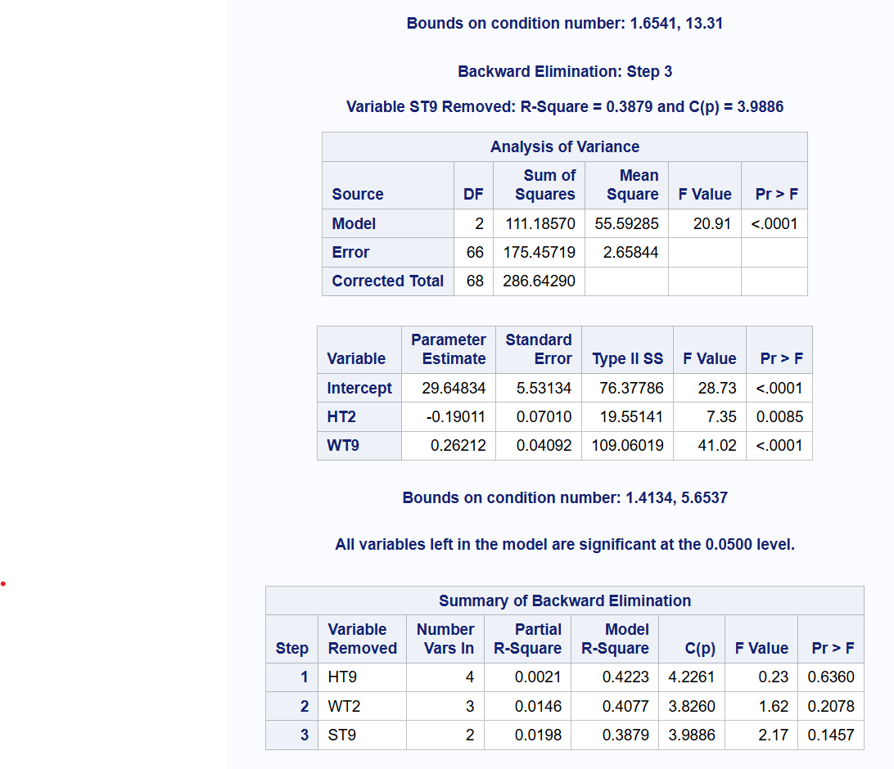
```

\newpage 

## (d) 

For the 69 observations (without the outlier that was detected from part (a)), check all possible models that could be constructed using at most the five variables WT2, HT2, WT9, HT9, ST9 and then give the best one that you recommend. Justify your choice.

```{r, eval = T, echo=FALSE, fig.cap="CocoMelon", out.width = '100%'}
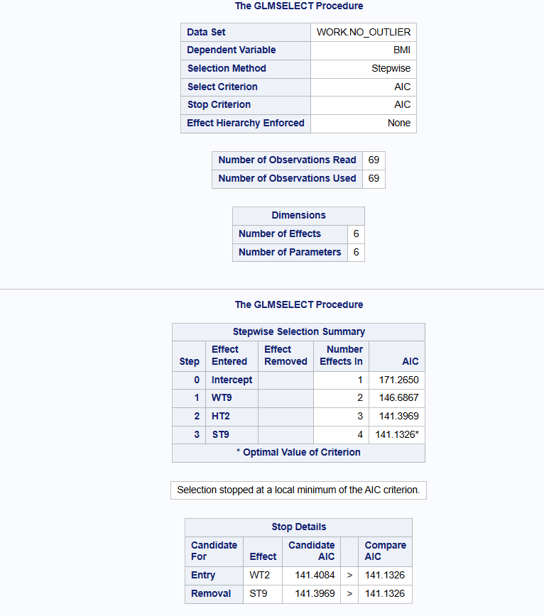
```

```{r, eval = T, echo=FALSE, fig.cap="CocoMelon", out.width = '100%'}
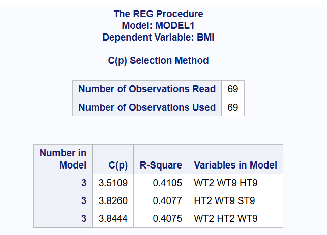
```

```{r, eval = T, echo=FALSE, fig.cap="CocoMelon", out.width = '100%'}
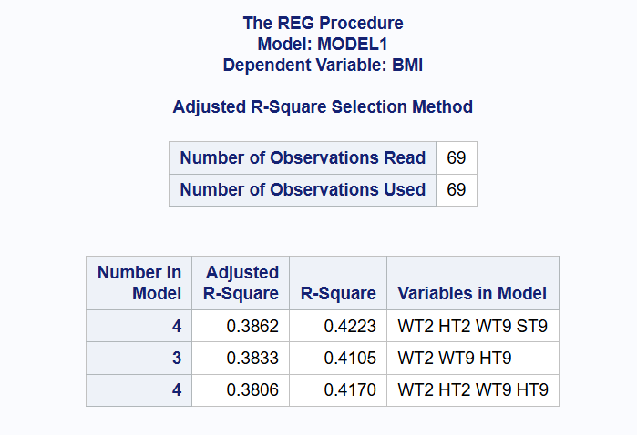
```

Choose: WT2, WT9, HT9 model 

\newpage 

## (e) 

Are there concerns about multicollinearity for the explanatory variables of the model you picked in part (d)?

```{r, eval = T, echo=FALSE, fig.cap="CocoMelon", out.width = '100%'}
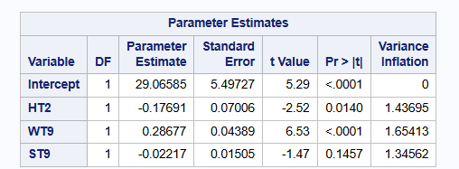
```

VIF values are not especially large (less than cutoff for "moderate" of 3/5), so minimal issue with multicollinearity. 

```{r, eval = T, echo=FALSE, fig.cap="CocoMelon", out.width = '100%'}
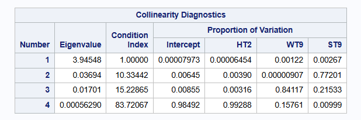
```

However, when looking at the Condition Index for the Eigenvalues, we do observe a rather high value (larger than 30), and the 93.13 corresponds to a significant proportion of variation for Interccept, WT9, and HT9, or potentially extreme multicollinearity between WT9 and HT9. 
```{r, eval = T, echo=FALSE, fig.cap="CocoMelon", out.width = '100%'}
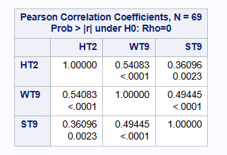
```

The above is further corroborated by the correlation coefficient between WT9 and HT9 being greater than 0.7 (0.73096). 

\newpage 

# 2

Ames Housing (+25)

A dataset (introduced in the previous homework assignment) was collected from home sales in Ames, Iowa between 2006 and 2010. The variables collected are:

  - Year Built: The year the house was built
  - Basement Area (in sq. ft): The amount of area in the house below ground level
  - Living Area (in sq. ft): The living area in the home (includes Basement Area)
  - Total Room: The number of rooms in the house
  - Garage Cars: The number of cars that can be placed in the garage
  - Year Sold: The year the home was sold
  - Sale Price: The sale price of the home (the response variable)
  - Garage Size: S = Small (Garage Cars = 0,1) or L = Large (Garage Cars = 2+)
  - Age (in yrs.): Age of house = Year Sold - Year Built

Use SAS to complete the following exercises:

The data from 999 sales can be found in the file housing train.csv and for the remaining 1,924 sales in the file housing eval.csv in our course’s shared folder in SAS Studio. You will determine a final multiple linear regression model for predicting sale price from the explanatory variables: Basement Area, Living Area, Total Room, Garage Size, and Age.

## (a) 

Fit the full model using all 5 explanatory variables listed above to the training data
(housing train.csv).

```{r, eval = T, echo=FALSE, fig.cap="CocoMelon", out.width = '100%'}
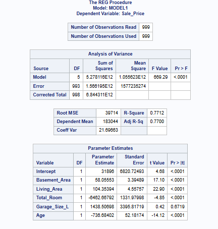
```

### i. 

Find and interpret the $R^2$ value for the full model.

78.31% of variability in Sales price can be explained using the multiple linear regression using Basement Area, Living Area, Total Room, Garage Size, and Age as explanatory variables (and including an intercept term). 

### ii. 

Interpret the value of the estimated regression coefficient corresponding to the Garage Size variable for the full model.

Increasing Garage Size by 1 car is associated with an increased Sales Price of $15,833, all else being equal. s

\newpage 

## (b) 

Use forward selection to fit a reduced model to the training data using some subset of the 5 explanatory variables listed above. Provide an equation for the estimated MLR model.

```{r, eval = T, echo=FALSE, fig.cap="CocoMelon", out.width = '100%'}
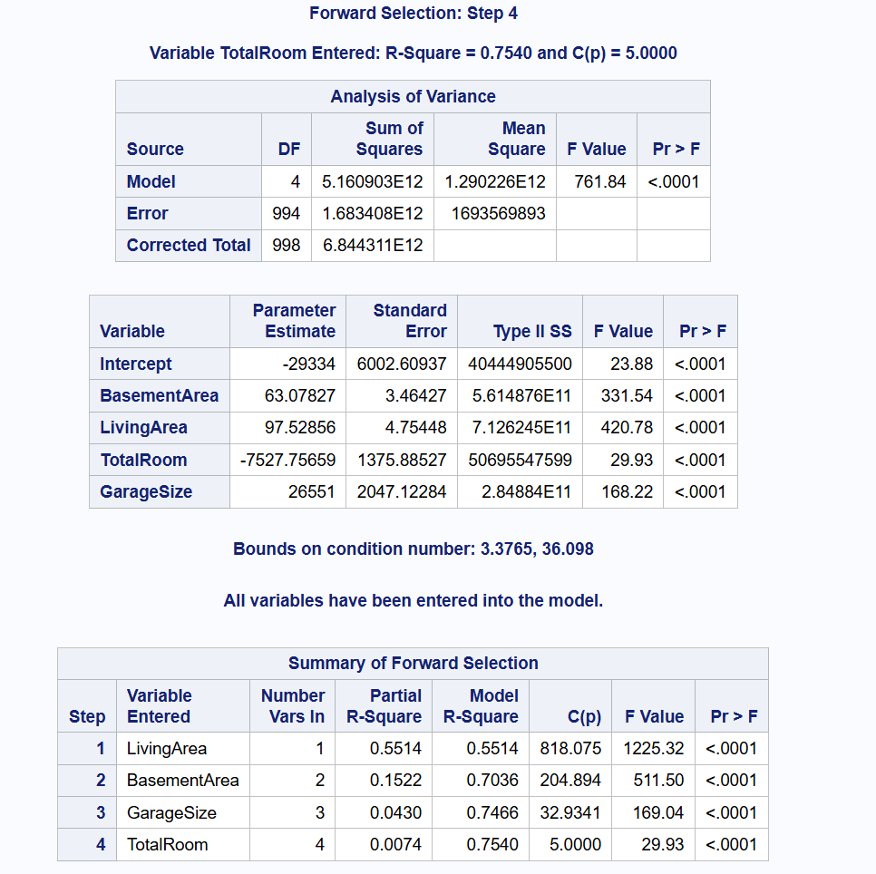
```

I used the model with "Age" removed, corresponding to the above output and the following equation: 

$$
\widehat{\text{Sale Price}} = -29334 + 63.08 \times \text{Basement Area} + 97.53 \times \text{Living Area} - 7527.76 \times \text{Total Room} + 26551 \times \text{Garage Size}
$$

\newpage 

## (c) 

How does the adjusted $R^2$ value for the reduced model compare to the full model?

```{r, eval = T, echo=FALSE, fig.cap="CocoMelon", out.width = '100%'}
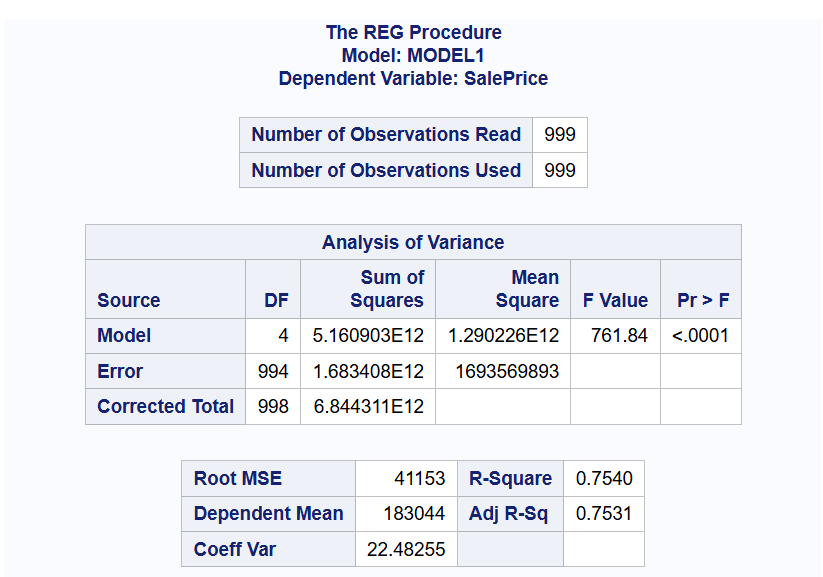
```

Full: 0.7820 
Reduced: 0.7531 
Difference: 0.0289

The difference of 0.0289 corresponds to a difference of 2.89% between the two models. 

\newpage 

## (d) 

Using the reduced model, check for:

### i. 

outliers 

```{r, eval = T, echo=FALSE, fig.cap="CocoMelon", out.width = '100%'}
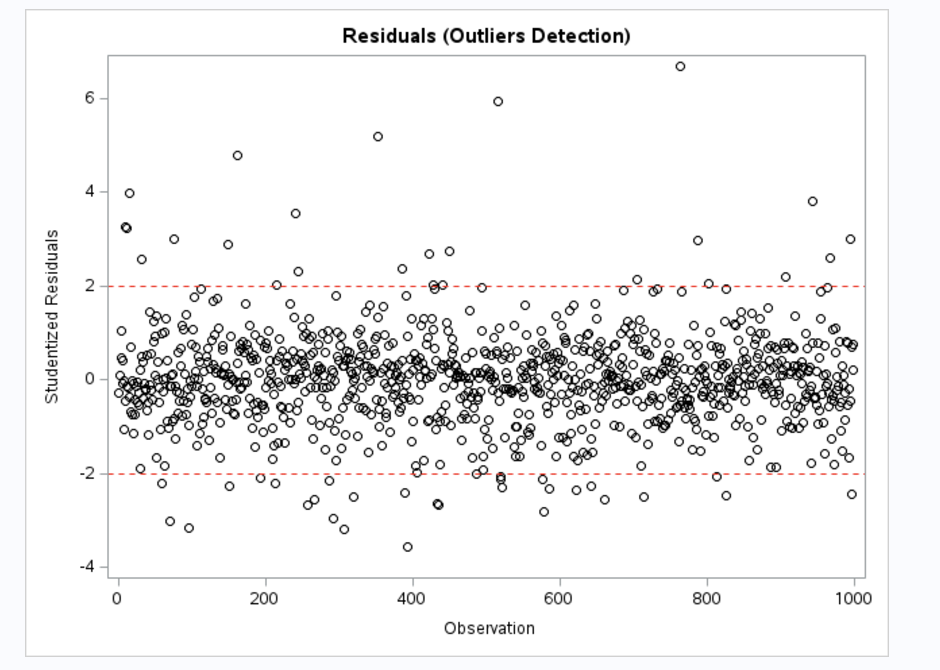
```

We do observe there being some potential outliers in the training data. 

### ii. 

high leverage points

```{r, eval = T, echo=FALSE, fig.cap="CocoMelon", out.width = '100%'}
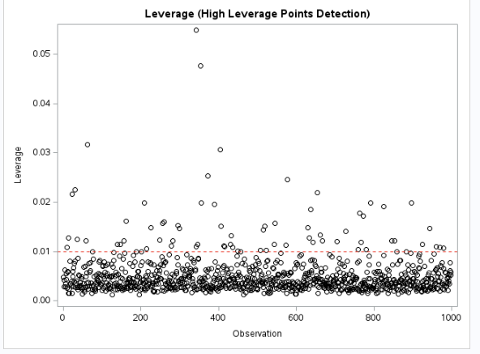
```

We do observe there being some leverage points in the training data. 

### iii. 

potential influence points

```{r, eval = T, echo=FALSE, fig.cap="CocoMelon", out.width = '100%'}
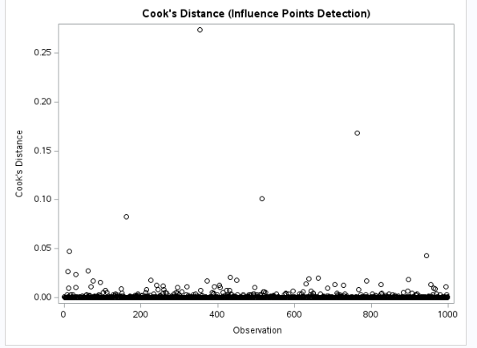
```

```{r, eval = T, echo=FALSE, fig.cap="CocoMelon", out.width = '100%'}
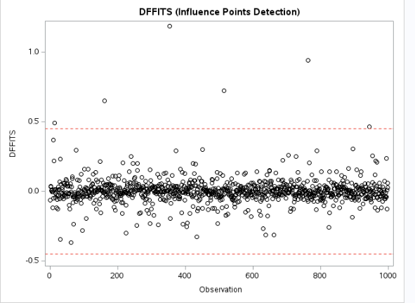
```

We do observe there being some potential influence points in the training data. 

\newpage 

## (e) 

Fit the reduced model from part (b) to the evaluation data (housing eval.csv). Compare the mean squared error from fitting the model to the testing data to the mean squared error from fitting the model to the evaluation data. What does this imply?

```{r, eval = T, echo=FALSE, fig.cap="CocoMelon", out.width = '100%'}
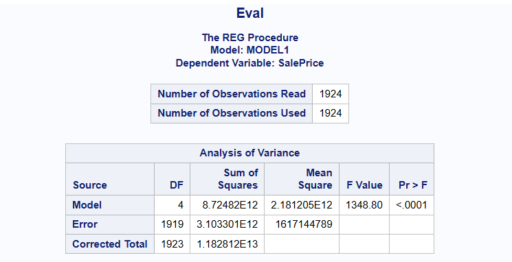
```

```{r, eval = T, echo=FALSE, fig.cap="CocoMelon", out.width = '100%'}
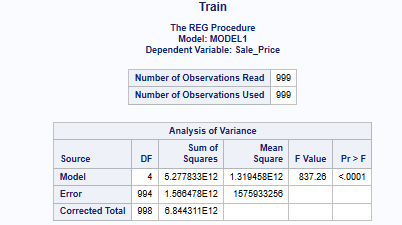
```


$$
\text{MSE}_{\text{train}} = 1.693569893 \times 10^8
$$

$$
\text{MSE}_{\text{eval}} = 1.617144789 \times 10^8 
$$


$$
\text{MSE}_{\text{eval}} < \text{MSE}_{\text{train}}
$$

The fact that the evaluation MSE is slightly lower than the training MSE suggests that the model generalizes well to unseen data. This also indicates there is no significant overfitting, as the model performs similarly on both the training and evaluation datasets.

The similar MSE values for training and evaluation datasets imply that the model performs consistently across different data splits and has a good balance of complexity and predictive power. The model is reliable for predicting housing sale prices in this context.

\newpage

# 3

The dataset for this exercise is called diamonds and it is available directly in the ggplot2 package in R. The data set contains prices (response variable – in US dollars) of over 50,000 diamonds, which we will try to explain using the quantitative size measurements: 

  - carat – weight, 
  - x – length in mm, 
  - y – width in mm, 
  - z – depth in mm, 
  - depth – total depth percentage = z / mean(x, y), 
  - table – width of top of diamond relative to widest point) 
  
And categorical quality (cut, color, and clarity) of the diamonds. The R code used to create the figures below is provided in the diamonds Hmwk 11.R file posted in Canvas.

## (a) 

Summarize your findings from examining the pairwise scatterplots (on the next page) and correlation matrix (shown below).

```{r, eval = T, echo=FALSE, fig.cap="CocoMelon", out.width = '100%'}
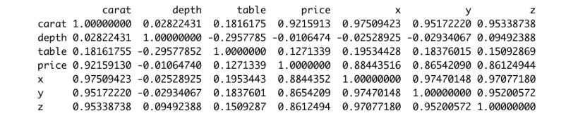
```

```{r, eval = T, echo=FALSE, fig.cap="CocoMelon", out.width = '100%'}
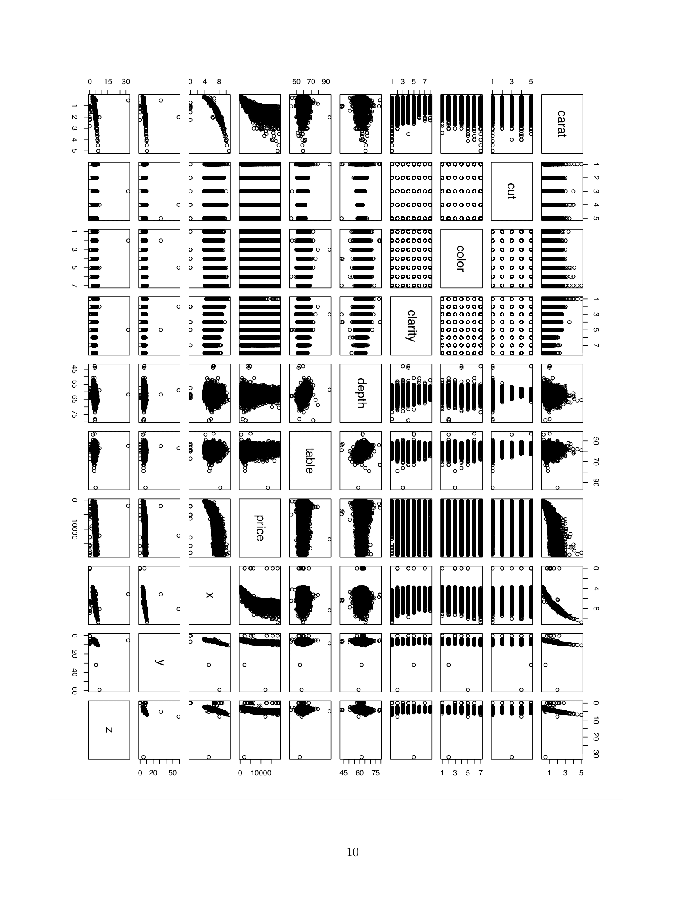
```

Many of the variables are highly correlated with each other; the variables with |r| > 0.7 are: Carat and price, carat and x, carat and y, carat and z, price and x, price and y, price and z, x and y, x and z, y and z all have |r| > 0.7. 

\newpage 

## (b) 

Discuss whether the VIFs, shown in the plot below, indicate any explanatory variables exhibiting moderate or extreme multicollinearity.

```{r, eval = T, echo=FALSE, fig.cap="CocoMelon", out.width = '100%'}
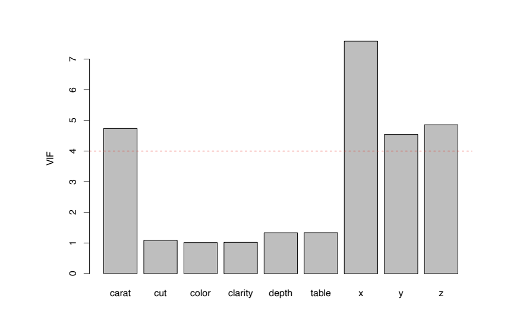
```

Carat, x, y, and z all have VIF > 4, indicating moderate multicollinearity. 

The output does not explicitly state if any are greater than 10, and values appear to be cut off at the 7 VIF value, so for "extreme" corresponding to a VIF greater than 10, we cannot determine explicitly if the "x" explanatory variable exhibits extreme multicollinearity.

\newpage 

## (c) 

Summarize the backward elimination method of model selection by providing:

```{r, eval = T, echo=FALSE, fig.cap="CocoMelon", out.width = '100%'}
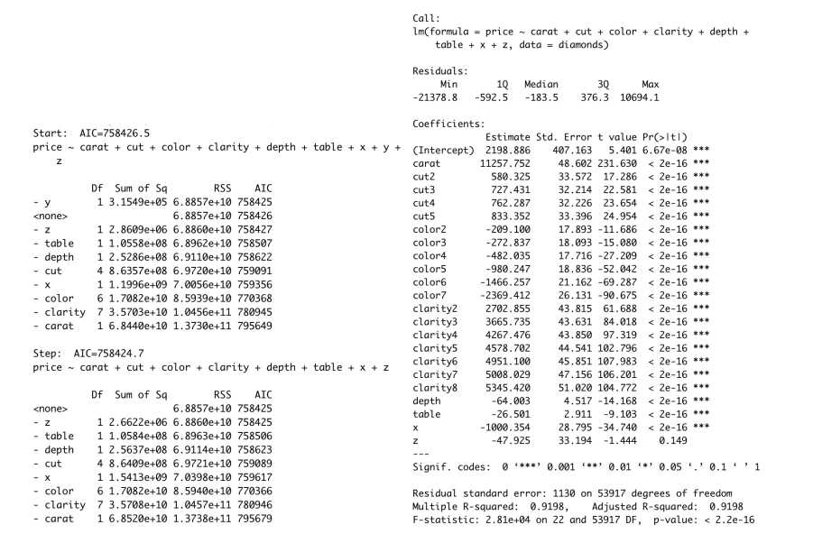
```

### i. 

an ordered list of which variable was removed from the model at each step;

Step 1: variable "y" was removed. There are no more explanatory variables eliminated. 

### ii. 

a list of which variables remained in the final model;

Explanatory variables that remained: Carat, cut, color, clarity, depth, and table. 

### iii. 

a summary of the partial regression coefficients effects tests for the final model.

\newpage 

## (d) 

Summarize the forward selection method of model selection by providing:

```{r, eval = T, echo=FALSE, fig.cap="CocoMelon", out.width = '100%'}
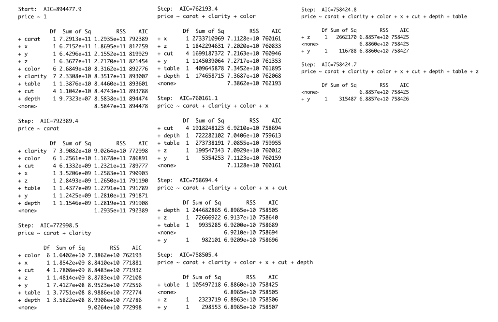
```

```{r, eval = T, echo=FALSE, fig.cap="CocoMelon", out.width = '100%'}
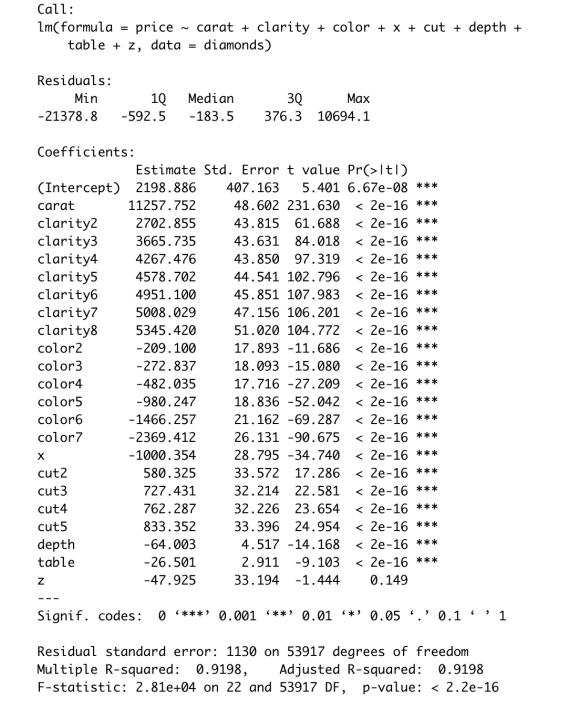
```

### i. 

an ordered list of which variable was added to the model at each step;

First Step: carat, 
Second Step: clarity, 
Third Step: color, 
Fourth Step: x, 
Fifth Step: cut, 
Sixth Step: depth, 
Seventh Step: table, 
Eighth Step: z

### ii. 

a list of which variables never entered the final model;

The explanatory variable "y" never entered the final model. 

### iii. 

a summary of the partial regression coefficients effects tests for the final model.

[Add Summary here] 

\newpage 

## (e) 

Summarize the all-possible-subsets method of model selection by providing:

```{r, eval = T, echo=FALSE, fig.cap="CocoMelon", out.width = '100%'}
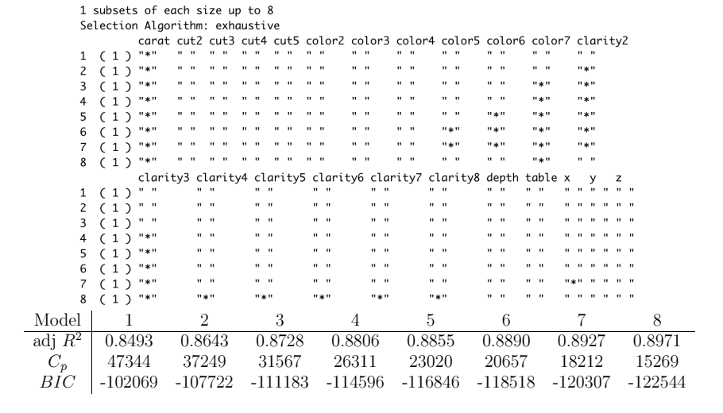
```

### i. 

Which model would you choose based on the adjusted R2 values?

Model 8, using the explanatory variables of carat, color, and clarity (possibly with an intercept term as well). 

### ii. 

Which model would you choose based on the Mallow’s Cp criteria?

Model 8, using the explanatory variables of carat, color, and clarity (possibly with an intercept term as well). 

### iii. 

Which model would you choose based on the BIC values?

Model 8, using the explanatory variables of carat, color, and clarity (possibly with an intercept term as well). 

\newpage 

## (f) 

Interpret the values of the estimated regression coefficients for the final model selected:

```{r, eval = T, echo=FALSE, fig.cap="CocoMelon", out.width = '100%'}
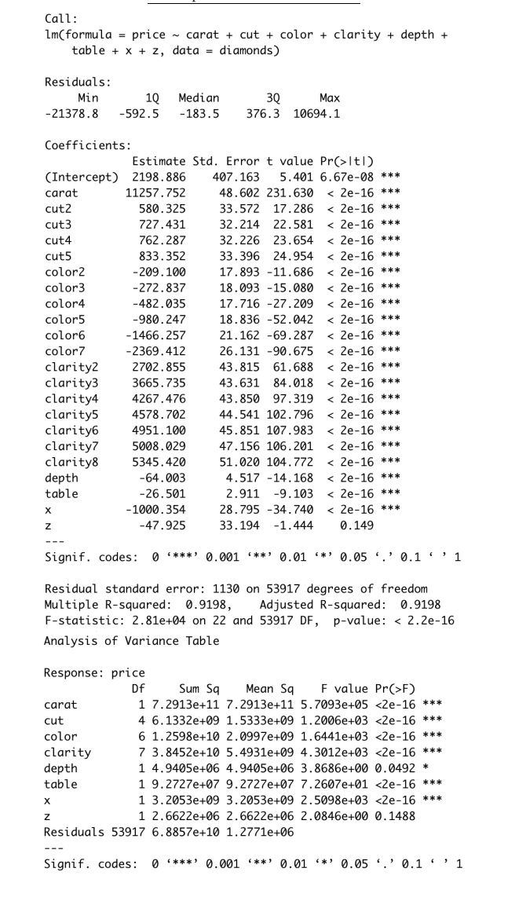
```

### i. 

one of the values corresponding to the categorical variable of your choice;

The conditional mean price of diamonds that are cut 2 are priced $580.325 more than diamonds that are cut 1, holding all other variables constant.

### ii. 

one of the values corresponding to the quantitative variable of your choice.

For a 1 carat increase in weight, the conditional mean price of diamonds will increase by $11257.752, holding all other variables constant.

\newpage 

## (g) 

Summarize your findings from examining all the residual plots used to diagnose the MLR model assumptions. Are there any assumptions that aren’t met for this analysis? Briefly justify your response.

```{r, eval = T, echo=FALSE, fig.cap="CocoMelon", out.width = '100%'}
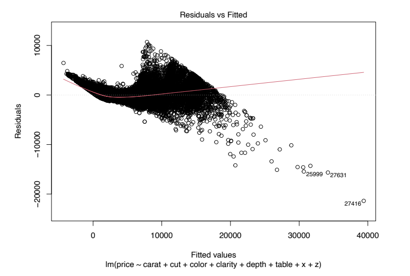
```

```{r, eval = T, echo=FALSE, fig.cap="CocoMelon", out.width = '100%'}
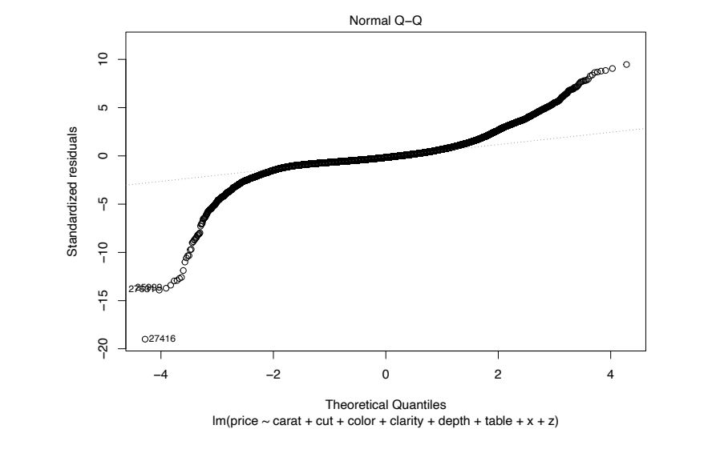
```

The residual plot has a clearly obvious non-random-scattering trend, suggesting the linearity and equal variance assumptions may be violated.

The QQ is roughly linear close the middle, but show strong deviations in the left tail and right of the middle, suggesting the normality assumption is violated.

Taken together, we have reason to be concerned that our key assumptions are being violated, with regards to the residuals. 

\newpage 

## (h) 

Summarize your findings from examining the case diagnostic values/plots. Are there any
outliers, leverage points, or influential observations?

```{r, eval = T, echo=FALSE, fig.cap="CocoMelon", out.width = '100%'}
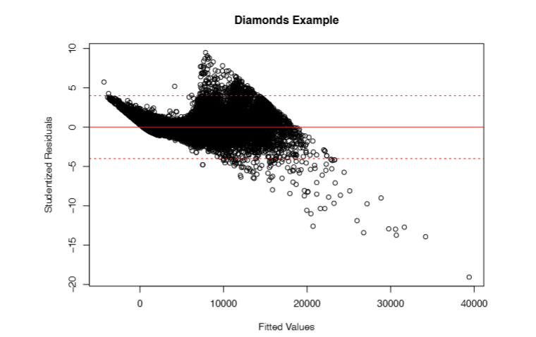
```

```{r, eval = T, echo=FALSE, fig.cap="CocoMelon", out.width = '100%'}
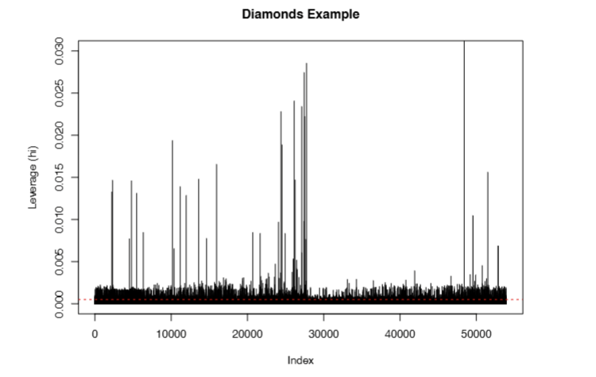
```

```{r, eval = T, echo=FALSE, fig.cap="CocoMelon", out.width = '100%'}
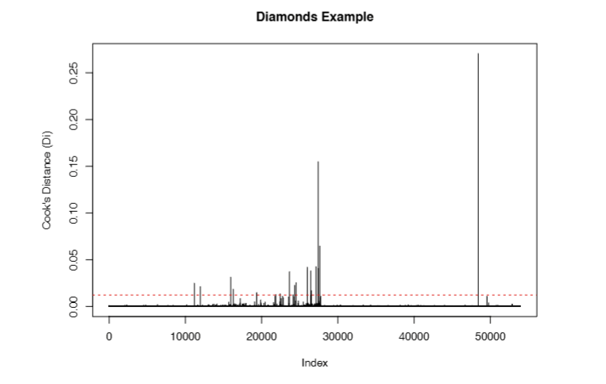
```

From the studentized residual plot, there appear to be many outliers (studentized residuals exceed 2). From the leverage plot, there appears to be many high leverage points (exceeding 2*(8+1)/50000 = 0.00036). From the cook’s D plot, there appear to be several high influence points (exceeding
2*sqrt(2/50000) = 0.01264911)
