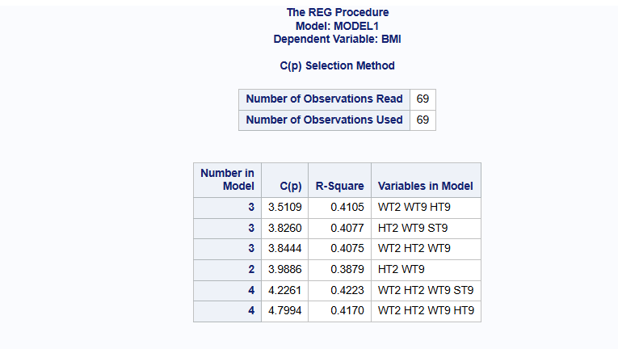
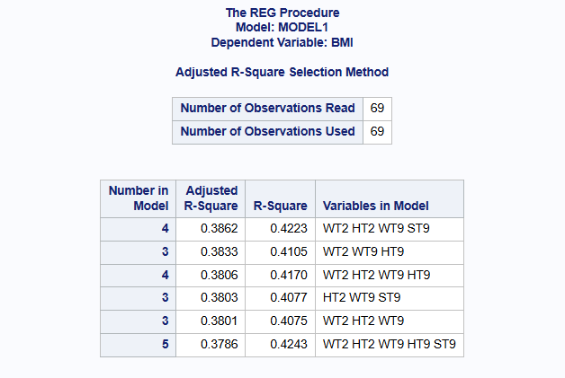
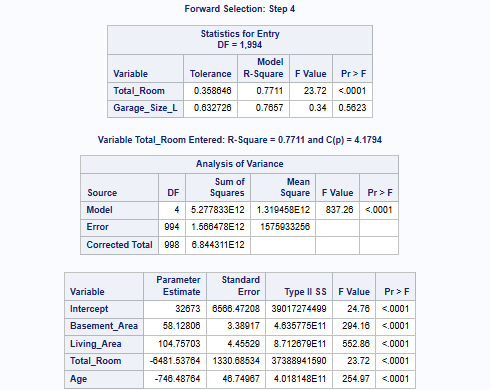
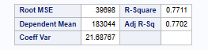
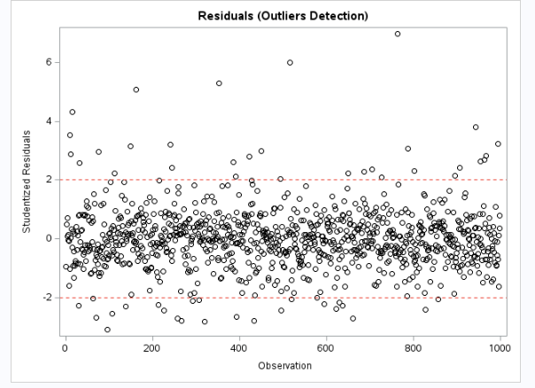
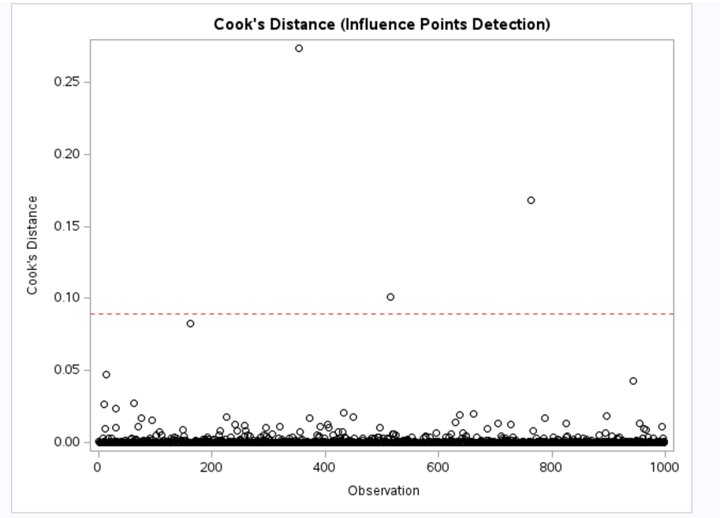
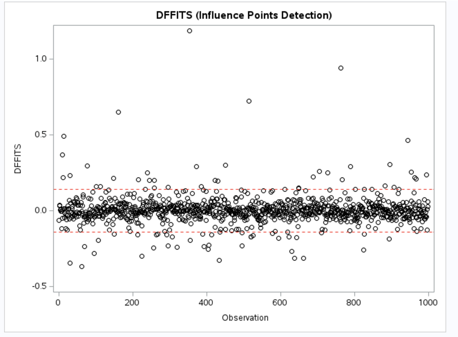
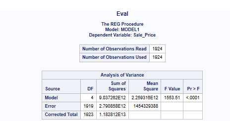

[Stat 5000]{.smallcaps}
[Homework #11]{.smallcaps}\
[Fall 2024]{.smallcaps} 
[due Fri, December 6th @ 11:59 pm]{.smallcaps}
[Name: Sam Olson]{.smallcaps} \
[Collaborators: Ethan, Ben, Craig, Sabrina, Kyu-Tae, **The Hatman**]{.smallcaps} \

```{r, eval = T, results = F, echo = F, warning = F, message = F}
library(knitr)
```

# 1

Berkeley Guidance Study 

The dataset is located in `BGSgirls2.txt`. It contains one line of data for each of 70 girls with the following variables:

- ID: Girl identification number
- WT2: Weight (kg) at 2 years
- HT2: Height (cm) at 2 years
- WT9: Weight (kg) at 9 years
- HT9: Height (cm) at 9 years
- LG9: Leg circumference (cm) at 9 years
- ST9: Strength (kg) at 9 years
- WT18: Weight (kg) at 18 years
- HT18: Height (cm) at 18 years
- LG18: Leg circumference (cm) at 18 years
- ST18: Strength (kg) at 18 years
- BMI: Body Mass Index at 18 years
- SOMA: Somatotype (SOMA), on a scale from 1 (very thin) to 7 (very obese)

USE SAS TO COMPLETE THE FOLLOWING EXERCISES: 

## (a) 

Fit a multiple regression model:

$$
BMI_i = \beta_0 + \beta_1 \text{WT2}_i + \beta_2 \text{HT2}_i + \beta_3 \text{WT9}_i + \beta_4 \text{HT9}_i + \beta_5 \text{ST9}_i + \epsilon_i
$$

for i=1, ..., 70. 

And use the following diagnostics to assess model assumptions. (Do not submit the output; just examine the results and briefly describe the insight provided by each).

### i. 

Normal Q-Q plot of residuals and the related Shapiro-Wilk test.

The QQ plot closely aligns with the reference line within the first theoretical quantile, but there are deviations past the first (positive/negative) quantile. Furthermore, the QQ plot appears to have a slight "S" shape/curve, further suggesting deviation from normality. 

The Shapiro-Wilk test provides a small p-value (<0.0001) such that we would have evidence to reject the null hypothesis that the residuals are normally distributed. 

Overall, we have reason to suspect our normality assumption is being violated. 

### ii. 

Plot of the residuals versus the estimates of the conditional means for BMI

We generally observe a random spread of residual values across fitted values. However, there are two negative residuals around predicted BMI 25+, such that we'd consider these points to either be candidates for removal (due to being outliers) or that we may in fact be violating our assumption of form of the model. 

This notwithstanding, we generally have reason to believe our form of the model and constant variance assumptions are not being violated. 

### iii. 

Individual plots of the residuals versus each of the five explanatory variables

Plots of residuals versus each of the five explanatory variables are generally consistent with the depictions present from the residual v. fitted values graph, insomuch as we may have a few problematic points to address but generally do not have reason to suspect our assumptions are being violated. 

## (b) 

Given that an outlier should be detected from part (a), refit the model and recheck the diagnostics listed in (a) to assess whether model assumptions are violated or not. (HINT: You can filter observations from the dataset using the where statement inside the reg procedure in SAS.)

The QQ plot looks better, insomuch as it more closely tracks with the reference line, and this is consistent with a larger Shapiro-Wilk test statistics, such that we would not have evidence to reject the null hypothesis that the residuals are normally distributed. As such we have reason not to suspect the normality assumption is being violated as it was in part (a). 

Furthermore, the residual plots consistently (across the x-axis of fitted values as well as individually across the explanatory variables) appear to be randomly spread, such that our constant variance and form of the model assumptions are likely not being violated either. 

However, it is worth noting that we still appear to have potential outliers in our diagnostic plots, including both the residual plot as well as the QQ plot. So we see improvements but still have reason to be concerned our assumptions are violated.  

\newpage 

## (c) 

For the 69 observations (without the outlier that was detected from part (a)), use a backward selection procedure to search for a model using $\alpha_{stay}$ = 0.05. For this question, just consider the five variables mentioned in part (a): WT2, HT2, WT9, HT9, ST9. For your final model, report the estimated coefficients and their standard errors.

```{r, eval = T, echo=FALSE, fig.cap="CocoMelon", out.width = '100%'}
knitr::include_graphics("q1c.png")
```

In the final model from the method described, we have: 

  Variable: Intercept
    Coefficient: 29.648
    Standard Error: 5.531
  
  Variable: HT2
    Coefficient: -0.190
    Standard Error: 0.070
  
  Variable: WT9
    Coefficient: 0.262
    Standard Error: 0.0409
  
\newpage 

## (d) 

For the 69 observations (without the outlier that was detected from part (a)), check all possible models that could be constructed using at most the five variables WT2, HT2, WT9, HT9, ST9 and then give the best one that you recommend. Justify your choice.

```{r, eval = T, echo=FALSE, fig.cap="CocoMelon", out.width = '100%'}

```

```{r, eval = T, echo=FALSE, fig.cap="CocoMelon", out.width = '100%'}

```

```{r, eval = T, echo=FALSE, fig.cap="CocoMelon", out.width = '100%'}

```

After much back and forth, I ultimately decided on recommending the following model, which includes an intercept term: HT2, WT9, ST9 explanatory variables/predictors 

Descriptively, we have some reason to believe that multicollinearity would be minimized compared to models with similar variables, i.e. that use WT2 and WT9 or HT2 and HT9. Furthermore, we want to avoid overfitting, such that we have a preference for a simpler model (Occam's), which means a preference for less explanatory variables. 

Bearing that in mind, there were 3 statistics used as criteria used for evaluating models: AIC, Adjusted R-Squared, and Mallow's $C_p$. 

The model I recommend has the best AIC value (minimized), and it also has a "pretty good" Adjusted R-Squared and Mallow's $C_p$. 

For Adjusted R-Squared, it has the second best for models with 3 explanatory variables, and 4th overall across all models. Marginally, the difference in Adjusted R-Squared is in the hundreths of decimal places. Also, when comparing values of Mallow (looking at k+1 closest to $C_p$ value), we see that the model recommended has the second best $C_p$ value, beaten only by WT2, HT2, and WT9. However, the difference between these two is less than 0.02, so the difference is marginal. And the model we recommend doesn't "reuse" the same variable WT, such that we potentially avoid multicollinearity. To that end...

\newpage 

## (e) 

Are there concerns about multicollinearity for the explanatory variables of the model you picked in part (d)?

```{r, eval = T, echo=FALSE, fig.cap="CocoMelon", out.width = '100%'}

```

VIF values are not especially large (less than cutoff for "moderate" of value of 3 or5), so minimal issue with multicollinearity based on VIF criteria. 

```{r, eval = T, echo=FALSE, fig.cap="CocoMelon", out.width = '100%'}

```

However, when looking at the Condition Index for the Eigenvalues, we do observe a rather high value (larger than 30), with the 83.72 corresponding to a significant proportion of variation for Interccept, HT2, and WT9, or an indication of potential extreme multicollinearity between HT2 and WT9. Given this, we look to the correlations to confirm.  

However, this is something that I don't think has been discussed in-depth at the moment, so I believe for all intents and purposes we are good to go (the above is for considering extra-dimensional multicollinearity, if I recall correctly). 

```{r, eval = T, echo=FALSE, fig.cap="CocoMelon", out.width = '100%'}

```

We additionally double check our observation of potential multicollinearity by looking at the correlation between our explanatory variables. To that end: The above is further corroborated by the correlation coefficient between HT2 and WT9 being greater than 0.5 (0.54083); however, the correlation is still less than our "typical significance threshold" of |r| > 0.7, so this is a good thing (and motivation for choosing this over another hypothetical model like, say, WT2, WT9, and HT9.)

So overall, yes we do have some concerns about multicollinearity for the model we chose in part (d), though not especially extreme.

\newpage 

# 2

Ames Housing (+25)

A dataset (introduced in the previous homework assignment) was collected from home sales in Ames, Iowa between 2006 and 2010. The variables collected are:

  - Year Built: The year the house was built
  - Basement Area (in sq. ft): The amount of area in the house below ground level
  - Living Area (in sq. ft): The living area in the home (includes Basement Area)
  - Total Room: The number of rooms in the house
  - Garage Cars: The number of cars that can be placed in the garage
  - Year Sold: The year the home was sold
  - Sale Price: The sale price of the home (the response variable)
  - Garage Size: S = Small (Garage Cars = 0,1) or L = Large (Garage Cars = 2+)
  - Age (in yrs.): Age of house = Year Sold - Year Built

Use SAS to complete the following exercises:

The data from 999 sales can be found in the file housing train.csv and for the remaining 1,924 sales in the file housing eval.csv in our course’s shared folder in SAS Studio. You will determine a final multiple linear regression model for predicting sale price from the explanatory variables: Basement Area, Living Area, Total Room, Garage Size, and Age.

## (a) 

Fit the full model using all 5 explanatory variables listed above to the training data
(housing train.csv).

```{r, eval = T, echo=FALSE, fig.cap="CocoMelon", out.width = '100%'}

```

And so it was fit. 

### i. 

Find and interpret the $R^2$ value for the full model.

77.12% of variability in Sales price can be explained using the multiple linear regression using Basement Area, Living Area, Total Room, Garage Size, and Age as explanatory variables (and including an intercept term). 

### ii. 

Interpret the value of the estimated regression coefficient corresponding to the Garage Size variable for the full model.

Increasing Garage Size to "Large" is associated with an increased Sales Price of $1,438.507 compared to a Garage Size of "Small", all else (all other explanatory variables) being equal.

\newpage 

## (b) 

Use forward selection to fit a reduced model to the training data using some subset of the 5 explanatory variables listed above. Provide an equation for the estimated MLR model.

```{r, eval = T, echo=FALSE, fig.cap="CocoMelon", out.width = '100%'}

```

For the preceding problems, I used the model with "Garage Size" removed, as it didn't get added for Step 5 of forward selection. The formula corresponding to the above output and the following equation: 

$$
\widehat{\text{Sale Price}} = 32,873 + 58.128 * \text{Basement Area} + 104.75703 * \text{Living Area} - 6,481.53784 * \text{Total Room} - 746.48764 * \text{Age}
$$

\newpage 

## (c) 

How does the adjusted $R^2$ value for the reduced model compare to the full model?

```{r, eval = T, echo=FALSE, fig.cap="CocoMelon", out.width = '100%'}

```

Full: 0.7700
Reduced: 0.7702
Difference: 0.0002 (2e-04)
Note: For Adjusted $R^2$

The difference of 0.0002 (2e-04) corresponds to a difference of 0.02% between the two models. So the reduced model has a very marginally larger adjusted $R^2$ value. 

\newpage 

## (d) 

Using the reduced model, check for:

For reference: 

Training Data observations: 

$$
n = 999 
$$

$$
k = 4
$$

### i. 

outliers 

```{r, eval = T, echo=FALSE, fig.cap="CocoMelon", out.width = '100%'}

```

We do observe there being some potential outliers in the training data, where an outlier is a studentized residual value greater in magnitude to 2, i.e. |r| > 2 where r is a residual. 

### ii. 

high leverage points

```{r, eval = T, echo=FALSE, fig.cap="CocoMelon", out.width = '100%'}

```

Leverage threshold: $2(k+1)/n = 2(4+1)/999 = 0.01001001$

We do observe there being some leverage points in the training data, where our leverage threshold value is calculated to be $\approx 0.01$. 

### iii. 

potential influence points

Influence threshold: Cook's D $D > 2\sqrt{(2/n)} = 2\sqrt{(2/999)} = 0.08948747$

DDFITS: $2\sqrt{(k+1/n)} = 2\sqrt{(4+1/999)} = 0.1414921$

```{r, eval = T, echo=FALSE, fig.cap="CocoMelon", out.width = '100%'}

```

```{r, eval = T, echo=FALSE, fig.cap="CocoMelon", out.width = '100%'}

```

We do observe there being some potential influence points in the training data, particularly when evaluating based on the Cook's Distance method and a threshold value $\approx 0.08949$, as illustrated above. (I also did DDFITS and gave a calculation of the threshold above, but results are consistent with there being some influential points.)

\newpage 

## (e) 

Fit the reduced model from part (b) to the evaluation data (housing eval.csv). Compare the mean squared error from fitting the model to the testing data to the mean squared error from fitting the model to the evaluation data. What does this imply?

```{r, eval = T, echo=FALSE, fig.cap="CocoMelon", out.width = '100%'}

```

```{r, eval = T, echo=FALSE, fig.cap="CocoMelon", out.width = '100%'}

```


$$
\text{MSE}_{\text{train}} = 1.5759 \times 10^{9}
$$

$$
\text{MSE}_{\text{eval}} = 1.454329 \times 10^{9}
$$

$$
\text{Difference in MSE} = \text{MSE}_{\text{train}} - \text{MSE}_{\text{eval}} \approx 1.21571 \times 10^{8}
$$

Importantly, we see that $\text{MSE}_{\text{eval}} < \text{MSE}_{\text{train}}$, though the difference is not especially large! This is when looking specifically at the relative difference in MSE, and not the absolute difference in MSE. The relative difference is: 

$$
\text{Relative Difference} = \frac{\text{Difference in MSE}}{\text{MSE}_{\text{eval}}} * 100 = \frac{1.21571 \times 10^{8}}{1.454329 \times 10^{9}} \times 100 \approx 8.359\%
$$

Or a roughly 8.48 percent decrease in MSE when going to the eval dataset. 

This tells us that: When the MSE (Train) is slightly smaller than the MSE (Eval), meaning the model we chose performs marginally better on the evaluation dataset than the training dataset, and corresponding to a decrease of 8.36%! Generally this marginal relative difference indicates that our model is not overfitting, and that it is generalizing well from the training to the evalution dataset. It is performing "ok"! (We want MSE to be lower for the eval compared to training, otherwise we'd suspect overfitting based on the training dataset).  

\newpage

# 3

The dataset for this exercise is called diamonds and it is available directly in the ggplot2 package in R. The data set contains prices (response variable – in US dollars) of over 50,000 diamonds, which we will try to explain using the quantitative size measurements: 

  - carat – weight, 
  - x – length in mm, 
  - y – width in mm, 
  - z – depth in mm, 
  - depth – total depth percentage = z / mean(x, y), 
  - table – width of top of diamond relative to widest point) 
  
And categorical quality (cut, color, and clarity) of the diamonds. The R code used to create the figures below is provided in the diamonds Hmwk 11.R file posted in Canvas.

## (a) 

Summarize your findings from examining the pairwise scatterplots (on the next page) and correlation matrix (shown below).

```{r, eval = T, echo=FALSE, fig.cap="CocoMelon", out.width = '100%'}

```

```{r, eval = T, echo=FALSE, fig.cap="CocoMelon", out.width = '100%'}
knitr::include_graphics("BIG.png")
```

Many of the variables are highly correlated with each other; this holds for combinations of variables with the response variable (price) as well as between explanatory variables. Using the "significance" threshold of |r| > 0.7, we have the following "signficant" correlations: Carat and price, carat and x, carat and y, carat and z, price and x, price and y, price and z, x and y, x and z, y and z. Of note is that all of the "significant" correlations are positive. 

Overall, we do corroborate these findings when looking at the pairwise scatter plots, insomuch as positive correlations generally show a positive linear relationship when looking at the respective graph. On the flip side, we see "small" correlations (|r| < 0.20, such as x and depth), exhibit a rather large "blob" of points, or for other pairs a general overall coverage of the plot area. This is understandable, as a small-in-magnitude correlation coefficient is evidence that there is not a significant linear relationship between the two variables. 

Generally, we see that our response variable is highly correlated with some of the explanatory variables ("significant" being correlation coefficients greater in magnitude than 0.7). However, we also observe some explanatory variables appear highly correlated with one another, which is problematic and an indication of possible multicollinearity (using the same magnitude threshold of 0.7 for correlation coefficient). 

\newpage 

## (b) 

Discuss whether the VIFs, shown in the plot below, indicate any explanatory variables exhibiting moderate or extreme multicollinearity.

```{r, eval = T, echo=FALSE, fig.cap="CocoMelon", out.width = '100%'}

```

Carat, x, y, and z all have VIF > 4, indicating moderate multicollinearity. 

The output does not explicitly state if any of the VIF values are greater than 10, as values are cut off at the 7. So for "extreme multicolinearity" corresponding to a VIF greater than 10, we cannot determine explicitly if the "x" explanatory variable exhibits extreme multicollinearity (which is the only explanatory variable that *may* meet that criteria).

\newpage 

## (c) 

Summarize the backward elimination method of model selection by providing:

```{r, eval = T, echo=FALSE, fig.cap="CocoMelon", out.width = '100%'}
knitr::include_graphics("q3c.png")
```

### i. 

an ordered list of which variable was removed from the model at each step;

Step 1: variable "y" was removed. 

There are no more explanatory variables eliminated. 

### ii. 

a list of which variables remained in the final model;

Explanatory variables that remained: Carat, cut, color, clarity, depth, and table. 

### iii. 

a summary of the partial regression coefficients effects tests for the final model.

Of note, all explanatory variables except for "z" meet the significance threshold of "overwhelming" or "strong" evidence (in favor of rejecting the null hypothesis). This appears to be the type of language used in the lab solutions. 

All the final model partial regression coefficients meet statistical significance to reject null hypothesis at the $\alpha = 0.05$ level except for "z". There is only one partial regression coefficients in the final model that does not meet statistical significance to reject null hypothesis at the $\alpha = 0.05$ level, "z". 

The statistical significance test is to determine whether there is evidence to reject the null hypothesis that the estimated beta coefficient is equal to zero (statistical significance referring to being statistically significant from zero). 

\newpage 

## (d) 

Summarize the forward selection method of model selection by providing:

```{r, eval = T, echo=FALSE, fig.cap="CocoMelon", out.width = '100%'}

```

```{r, eval = T, echo=FALSE, fig.cap="CocoMelon", out.width = '100%'}
knitr::include_graphics("q3f2.png")
```

### i. 

an ordered list of which variable was added to the model at each step;

First Step: carat, 
Second Step: clarity, 
Third Step: color, 
Fourth Step: x, 
Fifth Step: cut, 
Sixth Step: depth, 
Seventh Step: table, 
Eighth Step: z

### ii. 

a list of which variables never entered the final model;

The explanatory variable "y" never entered the final model. 

### iii. 

a summary of the partial regression coefficients effects tests for the final model.

Consistent with the prior model, 

Of note, all explanatory variables except for "z" meet the significance threshold of "overwhelming" or "strong" evidence (in favor of rejecting the null hypothesis). This appears to be the type of language used in the lab solutions. 

All the final model partial regression coefficients meet statistical significance to reject null hypothesis at the $\alpha = 0.05$ level except for "z". There is only one partial regression coefficients in the final model that does not meet statistical significance to reject null hypothesis at the $\alpha = 0.05$ level, "z". 

The statistical significance test is to determine whether there is evidence to reject the null hypothesis that the estimated beta coefficient is equal to zero (statistical significance referring to being statistically significant from zero). 

\newpage 

## (e) 

Summarize the all-possible-subsets method of model selection by providing:

```{r, eval = T, echo=FALSE, fig.cap="CocoMelon", out.width = '100%'}
knitr::include_graphics("q3e.png")
```

### i. 

Which model would you choose based on the adjusted R2 values?

Model 8, using the explanatory variables of carat, color 7, and clarity 3 through 8 (possibly with an intercept term as well). Generally we would say we include "carat", "color", and "clarity" explanatory variables, but we only see a subset of possible categorical variable values being significant in the above model.  

### ii. 

Which model would you choose based on the Mallow’s Cp criteria?

Model 8, using the explanatory variables of carat, color 7, and clarity 3 through 8 (possibly with an intercept term as well). Generally we would say we include "carat", "color", and "clarity" explanatory variables, but we only see a subset of possible categorical variable values being significant in the above model.  


### iii. 

Which model would you choose based on the BIC values?

Model 8, using the explanatory variables of carat, color, and clarity (possibly with an intercept term as well). Generally we would say we include "carat", "color", and "clarity" explanatory variables, but we only see a subset of possible categorical variable values being significant in the above model.  


\newpage 

## (f) 

Interpret the values of the estimated regression coefficients for the final model selected:

```{r, eval = T, echo=FALSE, fig.cap="CocoMelon", out.width = '100%'}
knitr::include_graphics("q3f.png")
```

### i. 

one of the values corresponding to the categorical variable of your choice;

The mean price of diamonds that are cut 2 are priced $580.325 more than diamonds that are cut 1, holding all other variables constant (given the other variables in the model).

### ii. 

one of the values corresponding to the quantitative variable of your choice.

For every 1 carat increase in weight, the mean price of diamonds will increase by $11,257.752 (associated with an increase of), holding all other variables constant (given all other variables in the model).

\newpage 

## (g) 

Summarize your findings from examining all the residual plots used to diagnose the MLR model assumptions. Are there any assumptions that aren’t met for this analysis? Briefly justify your response.

```{r, eval = T, echo=FALSE, fig.cap="CocoMelon", out.width = '100%'}
knitr::include_graphics("q3g1.png")
```

```{r, eval = T, echo=FALSE, fig.cap="CocoMelon", out.width = '100%'}
knitr::include_graphics("q3g2.png")
```

The key model assumptions we evaluate with the given plots and graphs are: Equal variance, linearity (form of the model), and normality. That being said: 

The residual plot has a clearly obvious non-random-scattering trend, suggesting the linearity and equal variance assumptions may be violated. (We observe a trend in the residual plot, particularly indicating a violation of linearity). 

Additionally, the QQ is roughly linear as it follows the reference line closely in the middle of the plot. However, there are deviations in the left tail and right of the middle, suggesting the normality assumption is violated.

Taken together, we have reason to be concerned that our key assumptions are being violated, with regards to the residuals. 

\newpage 

## (h) 

Summarize your findings from examining the case diagnostic values/plots. Are there any
outliers, leverage points, or influential observations?

```{r, eval = T, echo=FALSE, fig.cap="CocoMelon", out.width = '100%'}

```

```{r, eval = T, echo=FALSE, fig.cap="CocoMelon", out.width = '100%'}

```

```{r, eval = T, echo=FALSE, fig.cap="CocoMelon", out.width = '100%'}

```

Outliers: Looking at the studentized residual plot, there appear to be many outliers (looking for observations where the studentized residuals exceed 2, based on magnitude, i.e. |r| for r residuals, as indicated by the dashed red lines). 

Leverage: From the leverage plot, there appears to be many high leverage points (leverage values exceeding $2(8+1)/50000 \approx 0.00036$, as indicated by the red line).

From the cook’s D plot, there appear to be several high influence points (influence value exceeding $2\sqrt{2/50000} \approx 0.01264911$, as indicated by the red line). 

Overall, we have reason to believe there are outliers, leverage points, and influential points, such that we may recommend considering other models or undergoing a transformation of our data and reevaluating our assumptions again. As-is, we have reason to be suspect. 
