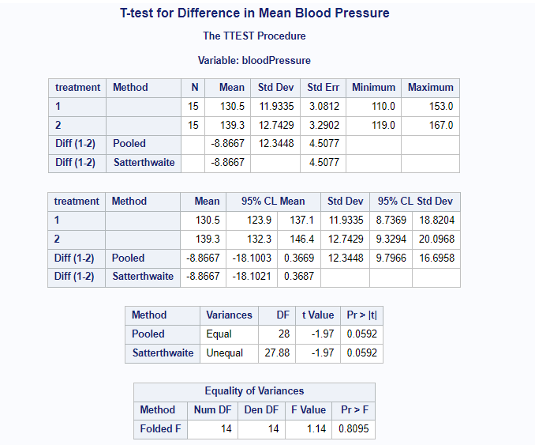
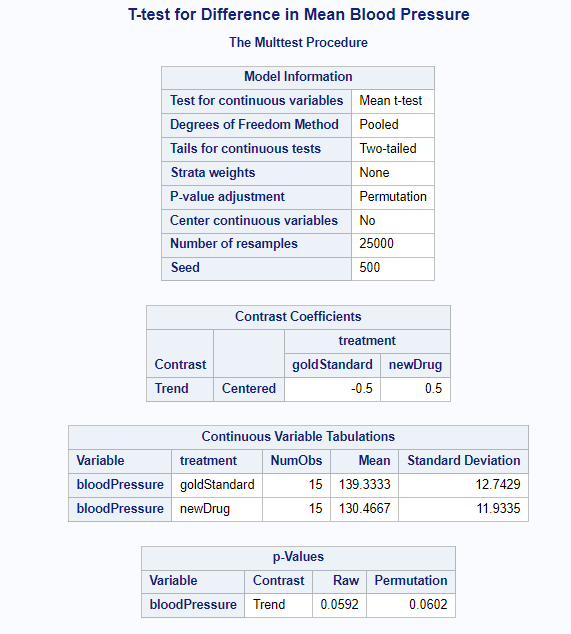
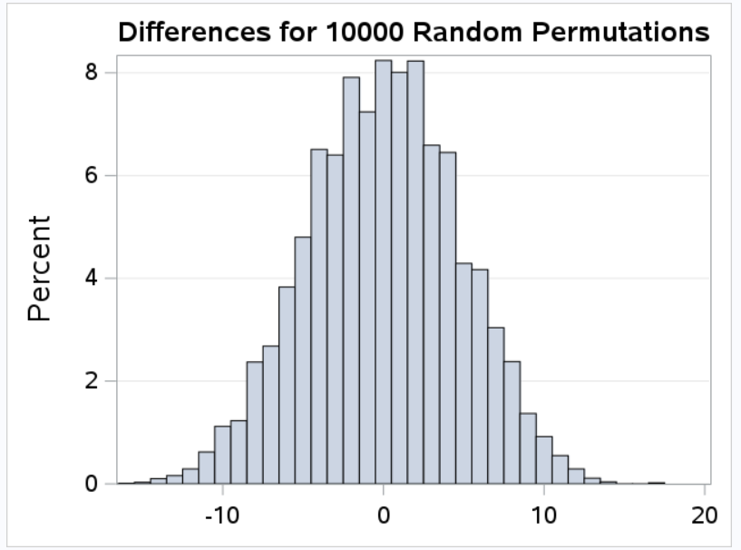

[Stat 5000]{.smallcaps}[Homework #2]{.smallcaps}\
[Fall 2024]{.smallcaps} [due Fri, Sep 13th @ 11:59 pm]{.smallcaps}
[Name: Sam Olson]{.smallcaps} \

**Directions:** Type or clearly handwrite your solutions to each of the following exercises. Partial credit cannot be given unless all work is shown. You may work in groups provided that each person takes responsibility for understanding and writing out the solutions. Additionally, you must give proper credit to your collaborators by providing their names on the line below (if you worked alone, write "No Collaborators"):\

[Collaborators: XXX]{.smallcaps} \

> 1. **[+10]:** For a study about a new treatment for pancreatic cancer, 100 pancreatic cancer patients are recruited. For ethical reasons every patient in the study is given the highest current standard of care which consists of surgery to remove cancerous tumors from the pancreas followed by a period of radiation therapy. After receiving the standard treatment, each patient is given the opportunity to have a second experimental treatment that consists of coating some of the cancerous cells removed from the patient during surgery with an antigen that the human body will reject and injecting the coated cells back into the pancreas of the same patient. The basic idea is that this second treatment will help prevent recurrence of cancer tumors because the patient's immune system will attack the coated cells and also attack other cancerous cells in the pancreas that the surgery and radiation treatments may have missed. The 57 patients who volunteer for the second treatment and the 43 patients who refuse the second treatment are followed for three years to determine how long each patient survives.

>> 1.  Is this study an experiment or observational study? Justify your answer.

This is an observational study, as the group status of subjects (whether patients received a second surgery/treatment) was not within the control of the researcher (patients voluntarily chose whether to receive the additional treatment). 

>> 2.  Identify the experimental or sampling units.

The experimental unit is a patient who received surgery for pancreatic cancer. 

<!-- There are two units: One for patients receiving surgery and radiation therapy, and a second group that received the prior treatment(s) followed by a second treatment (receive their treated cancer cells). -->

>> 3.  Identify the response variable.

The response variable is the survival time of the patients, specifically whether a patient died three years after receiving treatment.

>> 4.  Identify the treatments or study/population conditions.

The population of the study is patients with pancreatic cancer. All pancreatic cancer patients received at least one surgery procedure to remove cancer cells in addition to receiving radiation therapy post-surgery; this represents the "control" group. The "treatment" group then are patients who then went on to receive an additional procedure (receive coated/treated cancer cells from their initial surgery). 

>> 5.  Describe whether or not control of extraneous variation was used in this study.

There are no additional considerations made by the researcher during this study, meaning there was no control of extraneous variation. For example, there is no control over preexisting conditions nor for past treatment received by a patient.  

>> 6.  Describe whether or not randomization was used in this study.

There was not randomization, as all patients were given the choice of receiving the second treatment (receiving the cancer cells). Because the ability to receive this treatment was neither randomly assigned nor randomly offered to participants, there is no randomization. 

>> 7.  Describe whether or not replication was used in this study.

Because experimental units are at the patient level, we do have replication, insomuch as we apply the treatment independently to two or more experimental units. Though patients voluntary chose which group they were in for this study, each patient individually had the option to be in either group, meaning the choice for treatment was done independent of other patients. 

\newpage 

> 2. **[+10]:** The following study explores systolic blood pressure measurements for thirty subjects after receiving an assigned treatment for six weeks, either a new drug or the gold standard. The data are posted as `systolic.txt`. Each line contains the information for a subject: patient identification number, treatment group (coded 1 for new drug and 2 for gold standard), systolic blood pressure. The research interest is to answer the question: "Does the new drug produce lower mean systolic blood pressure level in hypertensive patients than the gold standard?\"

>> 1.  Using SAS, conduct an appropriate two-sample $t$-test, assuming homogeneous variances. Provide a screenshot of the relevant SAS output here.

```{r tTest, echo=FALSE, fig.cap="t-Test Output", out.width = '100%'}

```

>> 2.  What is the value of a two-sample $t$-statistic and its corresponding degrees of freedom?

$-1.97$ t-testistic

$28$ degreees of freedom

>> 3.  What is the $p$-value?

0.0592

>> 4.  Interpret the results of the $t$-test in the context of this study.

The t-test provides evidence that the event we observed the results we did given no difference between the two groups is unlikely (or low likelihood). This means we have evidence to support rejecting the null hypothesis that there is no difference between the two groups and contrapositively have some evidence to support there being a difference between the two. 

\newpage 

> 3. **[+5]:** Perform a randomization test in SAS of the research question given in problem 2 by computing the difference in the sample means for each of 25,000 data sets created from new random assignments of 30 patients to one of the two drugs.

```{r permTest, echo=FALSE, fig.cap="Permutation Test", out.width = '100%'}

```

>> 1.  Obtain an approximate $p$-value for the randomization test.

The p-value from the permutation test is 0.0597. 

>> 2.  Interpret the result of the randomization test in the context of this study. Is it consistent with your response to problem 2(d)?

Consistent with the results from the p-value obtained in the previous question, the p-value provides some evidence that it was unlikely we observed the results from the study under the null hypothesis of no difference between the two groups. This is furthermore, additional evidence to support the alternative hypothesis that there is a difference between the two groups. 

>> 3.  Which sampling distribution is the randomization histogram approximating?

```{r samplingDisto, echo=FALSE, fig.cap="Sampling Distribution", out.width = '100%'}

```

The above sampling distribution from the permutation test is approximating a normal distribution. 

**Total:** 25 points **\# correct:** **%:**
