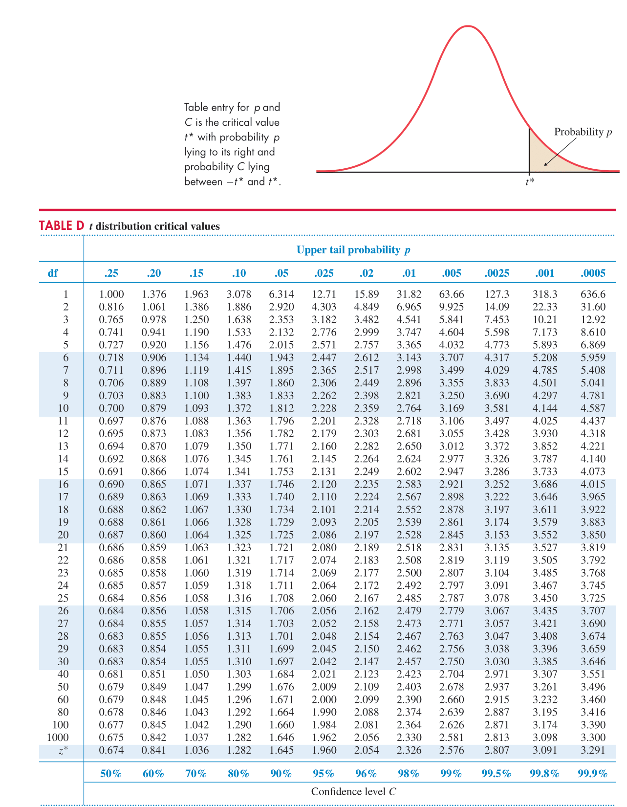

### Sample Size Calculations Using Hypothesis Tests

Formula 

$$n_0 = \frac{(z_{1 - \frac{\alpha}{2}} + z_{1-\beta})^2(2S_p^2)}{\delta^2}$$

$$n = \frac{(t_{2(n_0-1), 1-\frac{\alpha}{2}}+ t_{2(n_0-1), 1-\beta })^2(2S_p^2)}{\delta^2}$$
### Comparison of Methods

Methods (1) and (2) are thankfully (though perhaps unsurprisingly) consistent. However, the final $n$ obtained through Method (3) is significantly different between the other methods noted. 

Overall, I think it may help to note that the t statistic ("critical value") should be obtained through direct computation, and not through the use of a lookup table, though at most in this problem it caused a difference of $\approx 7$ in sample size. 

### Issue

In HW3, Problem 3 we have: 

> 3.  Given an approximate pooled sample standard deviation of $S_p = 0.16$ and an effect size of $\delta=0.03$, what sample size is needed in each of two equally-sized treatment groups in order for a level $\alpha=0.05$ two-sided test to have 80% power?

Where $\delta = 0.03$, $S_p = 0.16$, $\alpha = 0.05$, and $\beta = 0.2 \rightarrow 1-\beta = 0.8$

We three approaches to consider when calculating sample sizes: 
  1. Round the values of the z and t statistics we obtain
  2. Directly compute the z and t statistics within the calculation 
  3. Reference a z/t statistic table such as the below
  
```{r tTable, echo=FALSE, fig.cap="t Table Figure", out.width = '100%'}

```  

### Method 1

```{r}
z1 <- qnorm(p = 0.975)
z2 <- qnorm(p = 0.8)

round(z1, 3) 
round(z2, 3)
```

```{r}
numerator <- (round(z1, 3)  + round(z2, 3))^2 * (2 * 0.16^2) 
denom <- 0.03^2 
n0 <- numerator/denom
n0

t1 <- qt(p = .975, df = 446.6463)
t2 <- qt(p = .80, df = 446.6463)
t1
t2
```

```{r}
numerator <- (round(t1, 3) + round(t2,3))^2 * (2 * 0.16^2) 
denom <- 0.03^2 
n <- numerator/denom
n
```

### Method 2

```{r}
z1 <- qnorm(p = 0.975)
z2 <- qnorm(p = 0.8)

numerator <- (z1 + z2)^2 * (2 * 0.16^2) 
denom <- 0.03^2 
n0 <- numerator/denom
n0

t1 <- qt(p = .975, df = 447)
t2 <- qt(p = .80, df = 447)

t1
t2

numerator <- (t1 + t2)^2 * (2 * 0.16^2) 
denom <- 0.03^2 
n <- numerator/denom
n
```

### Method 3

```{r}
z1 <- 1.96
z2 <- qnorm(p = 0.8)

numerator <- (z1 + z2)^2 * (2 * 0.16^2) 
denom <- 0.03^2 
n0 <- numerator/denom
n0

t1 <- 1.984
t2 <- 0.845

numerator <- (t1 + t2)^2 * (2 * 0.16^2) 
denom <- 0.03^2 
n <- numerator/denom
n
```
