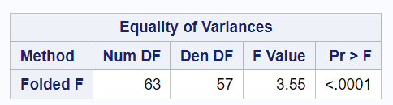

[Stat 5000]{.smallcaps}
[Homework #4]{.smallcaps}\
[Fall 2024]{.smallcaps} 
[due Fri, Sep 27th @ 11:59 pm]{.smallcaps}
[Name:]{.smallcaps} \
[Collaborators:]{.smallcaps} \

**Directions:** Type or clearly handwrite your solutions to each of the
following exercises. Partial credit cannot be given unless all work is
shown. You may work in groups provided that each person takes
responsibility for understanding and writing out the solutions.
Additionally, you must give proper credit to your collaborators by
providing their names on the line below (if you worked alone, write "No
Collaborators\"):\

# 1.

Consider the dataset from Homework #1 about survival times (in days) of guinea pigs that were randomly assigned either to a control group or to a treatment group that received a dose of tubercle bacilli (a bacterium that causes tuberculosis). These data are found in the `guinea_pigs.csv` file located in our course's shared folder on SAS Studio. Suppose the researchers want to test the hypothesis that the mean (or median/distribution of) survival times are the same for controls and the guinea pigs infected with tubercle bacilli against the **[one-sided]{.underline}** alternative that infection with tubercle Bacilli tends to decrease survival times.

```{r, echo=FALSE, fig.cap="Figure 1", out.width = '100%'}
knitr::include_graphics("SAS_Img1.png")
```

> 1.  Perform a two-sample $t$-test assuming two independent random samples from normal distributions with equal variances in SAS Studio. Report (i) the observed $t$-statistic and (ii) the $p$-value.

> 2.  Perform a two-sample Welch $t$-test assuming two independent random samples from normal distributions with unequal variances (using the Satterthwaite approximation) in SAS Studio. Report (i) the observed $t^*$-statistic and (ii) the $p$-value.

\newpage

```{r, echo=FALSE, fig.cap="Figure 1", out.width = '100%'}

```

```{r, echo=FALSE, fig.cap="Figure 1", out.width = '100%'}
knitr::include_graphics("SAS_Img2.png")
```

> 3.  Perform a randomization/permutation test using 20,000 new random assignments of guinea pigs to treatment groups in SAS Studio. Report (i) the observed difference in sample means and (ii) the $p$-value.

\newpage

> 4.  Perform the Wilcoxon rank-sum test in SAS Studio. Report (i) the sum of the ranks $w$, for the Bacilli treatment group and (ii) the $p$-value.

```{r, echo=FALSE, fig.cap="Figure 1", out.width = '100%'}
knitr::include_graphics("SAS_Img3.png")
```

> 5.  Compare the results from parts (a)--(d).

\newpage

# 2.

Revisit the guinea pig study from the previous exercise. Use SAS to create diagnostic information to assess the assumptions for the traditional $t$-based inference procedure.

> 1.  There is not enough information provided to assess independence of observations within each group. Which study design aspects would help you assess the assumption of independence between the groups.

> 2.  Assess the assumption of equal variances using:

>> 1.  the ratio of standard deviations;

```{r}
knitr::include_graphics("gross.png")
```

>> 2.  side-by-side boxplots;

```{r, echo=FALSE, fig.cap="Figure 1", out.width = '100%'}
knitr::include_graphics("SAS_Img7.png")
```

>> 3.  the F-test;

```{r, echo=FALSE, fig.cap="Figure 1", out.width = '100%'}

```

>> 4.  the Brown-Forsythe test.

```{r, echo=FALSE, fig.cap="Figure 1", out.width = '100%'}

```

> 3.  Assess the assumption of normality using the following methods:

>> 1.  side-by-side histograms;

```{r, echo=FALSE, fig.cap="Figure 1", out.width = '100%'}
knitr::include_graphics("SAS_Img7.png")
```

>> 2.  Q-Q plot(s);

```{r, echo=FALSE, fig.cap="Figure 1", out.width = '100%'}
knitr::include_graphics("SAS_Img5.png")
```

>> 3.  the Shapiro-Wilk test.

```{r, echo=FALSE, fig.cap="Figure 1", out.width = '100%'}
knitr::include_graphics("SAS_Img8.png")
```

> 4.  Based on what you learned in parts (a)--(c), complete the following exercises.

>> 1.  Summarize the assessment of all three assumptions.

>> 2.  Discuss which tests are the most appropriate among the 4
    used in the previous exercise.

>> 3.  Interpret the result, in the context of the study, for one
    of the tests you chose.

\newpage

# 3.

Researchers have data consisting of the annual adjusted gross incomes (`income`) for 100 randomly sampled individuals from two adjacent zip codes (`zip`). What type of statistical analysis should you use to compare the incomes in the two zip codes?

> 1.  The output below was created to diagnose the assumption of normality for this data.
        
```{r, echo=FALSE, fig.cap="Figure 1", out.width = '100%'}
knitr::include_graphics("HW4_Image1.png")
```

>> Describe three aspects (minimum) that indicate the normality assumption is violated.

> 2.  Using the information you gathered in part (a), which transformation should be explored to achieve normality? Choose one: logarithm, square-root, arcsine, or power/Box-Cox.

> 3.  One of these transformations has been applied and the resulting diagnostic output is provided below.

```{r, echo=FALSE, fig.cap="Figure 2", out.width = '100%'}
knitr::include_graphics("HW4_Image2.png")
```

> Did the transformation succeed in remediating the non-normality?

\newpage

# 4.  

Given the additional output (shown below) to diagnose the equal variance assumption, how should you proceed with the data analysis?

  -   Summary statistics: $s_0 = 0.4899$, $s_1 = 0.5067$, ratio $= 1.0342$

  -   $F$-test: statistic $= 1.0696$, $p$-value $= 0.3692$

  -   Brown-Forsythe test: statistic $= 0.0125$, $p$-value $= 0.9109$

**Total:** 50 points **\# correct:** **%:**
