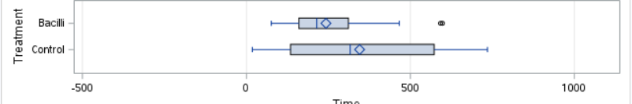

[Stat 5000]{.smallcaps}
[Homework #4]{.smallcaps}\
[Fall 2024]{.smallcaps} 
[due Fri, Sep 27th @ 11:59 pm]{.smallcaps}
[Name:]{.smallcaps} \
[Collaborators:]{.smallcaps} \

**Directions:** Type or clearly handwrite your solutions to each of the
following exercises. Partial credit cannot be given unless all work is
shown. You may work in groups provided that each person takes
responsibility for understanding and writing out the solutions.
Additionally, you must give proper credit to your collaborators by
providing their names on the line below (if you worked alone, write "No
Collaborators\"):\

# 1.

Consider the dataset from Homework #1 about survival times (in days) of guinea pigs that were randomly assigned either to a control group or to a treatment group that received a dose of tubercle bacilli (a bacterium that causes tuberculosis). These data are found in the `guinea_pigs.csv` file located in our course's shared folder on SAS Studio. Suppose the researchers want to test the hypothesis that the mean (or median/distribution of) survival times are the same for controls and the guinea pigs infected with tubercle bacilli against the **[one-sided]{.underline}** alternative that infection with tubercle Bacilli tends to decrease survival times.

```{r, echo=FALSE, fig.cap="Figure 1", out.width = '100%'}

```

> 1.  Perform a two-sample $t$-test assuming two independent random samples from normal distributions with equal variances in SAS Studio. Report (i) the observed $t$-statistic and (ii) the $p$-value.

(i): t Value; $=-3.14$ (Bacilli group 1, Control group 2)

(ii): p-value: $=0.0021/2 = 0.00105$ (one-sided)

> 2.  Perform a two-sample Welch $t$-test assuming two independent random samples from normal distributions with unequal variances (using the Satterthwaite approximation) in SAS Studio. Report (i) the observed $t^*$-statistic and (ii) the $p$-value.

(i): t Value; $=-3.23$ (Bacilli group 1, Control group 2)

(ii): p-value: $=0.0017/2 = 0.00085$ (one-sided)

\newpage

```{r, echo=FALSE, fig.cap="Figure 1", out.width = '100%'}
knitr::include_graphics("HW4_Image2_2.png")
```

```{r, echo=FALSE, fig.cap="Figure 1", out.width = '100%'}

```

> 3.  Perform a randomization/permutation test using 20,000 new random assignments of guinea pigs to treatment groups in SAS Studio. Report (i) the observed difference in sample means and (ii) the $p$-value.

(i): Observed Difference: $= 102.7$ difference in average survival times ($\mu_{\text{Bacilli}} - \mu_{\text{Control}}$)

(ii): p-value:$=0.0023$ (two-sided) $\rightarrow$ p-value:$=0.0023/2 = 0.00115$ (one-sided)  using 20,000 samples and set seed 500

Note: If I'm being graded on this, please grade me on the one-sided test, as I believe that's the ultimate aim of this study. 

\newpage

> 4.  Perform the Wilcoxon rank-sum test in SAS Studio. Report (i) the sum of the ranks $w$, for the Bacilli treatment group and (ii) the $p$-value.

```{r, echo=FALSE, fig.cap="Figure 1", out.width = '100%'}

```

(i): Sum of ranks for Bacilli $W = 3190.50$

(ii): p-value:$=0.0269$ (one-sided)

> 5.  Compare the results from parts (a)--(d).

(a): Assuming equal population variances different between Bacilli and Control groups, provides evidence to reject the null hypothesis that there is no difference in average survival times between groups of guinea pigs. 

(b): Assuming population variances different between Bacilli and Control groups, provides evidence to reject the null hypothesis that there is no difference in average survival times between groups of guinea pigs. 

(c): Evidence to reject the null hypothesis that the observed difference in average survival times is observed given no difference in mean survival times between groups (observed being lower average survival times for Bacilli guinea pigs compared to average Control survival times).  

(d): Evidence to reject the null hypothesis that the median survival times of the Bacilli and Control guinea pig groups are the same. 

Taking points (a) through (d), we find consistent evidence to support rejecting the null hypothesis of equal average and median survival times of guinea pigs between the Bacilli and Control groups. These four points provide further support of the finding that there is a difference in survival times (on average or taken as the median effect) for guinea pigs treated with Bacilli compared to control group (no Bacilli). Since the above were done using the one-sided p-value, we are rejecting the null hypothesis in favor of supporting an alternative hypothesis that the average/median survival times of the Bacilli guinea pigs is smaller/less than the average/median survival times of the Control group guinea pigs.  

\newpage

# 2.

Revisit the guinea pig study from the previous exercise. Use SAS to create diagnostic information to assess the assumptions for the traditional $t$-based inference procedure.

> 1.  There is not enough information provided to assess independence of observations within each group. Which study design aspects would help you assess the assumption of independence between the groups.

If guinea pigs were grouped together when determining which group they'd belong to, if there was some genetic relationship between guinea pigs, or even if the same guinea pigs were measured multiple times over the course of the study, then we should suspect our assumption of independence is violated. Contrapositively, if we can ensure these **did not occur** then we would be more certain of not having violated this assumption. 

> 2.  Assess the assumption of equal variances using:

>> 1.  the ratio of standard deviations;

```{r}

```
The ratio of standard deviations is given as $\frac{max\{S_1, S_2\}}{min\{S_1, S_@ \}}$, which from our data (shown in the above SAS output) gives us: 

$\text{Ratio} = \frac{269.1}{144.4} = 1.864$. 

Given the below table for guidance, we are bordering the line of "potential impact", but are still well within the boundary of believing this to be of "little impact" in violation of the assumption of equal variances. 

```{r}

```

>> 2.  side-by-side boxplots;

```{r, echo=FALSE, fig.cap="Figure 1", out.width = '100%'}

```

```{r, echo=FALSE, fig.cap="Figure 1", out.width = '100%'}

```

We also see a similar skewness between the two groups, insomuch as the range of values between the median and upper quartile is much wider (greater variability on the upper end of the data distribution) compared to the range of values from the lower quartile to the median. We also see the opposite of heavy tails in our data, leading to the possibility of negative kurtosis. 

Overall, it appears we may have some concerns of the equal variances assumptions being valid given the visual evidence of both groups having non-normal tendencies and differences in variability (the Control group has a significantly wider range of values than the Bacilli group, Bacilli values range from 76 to 598 whereas Control group values range from 18 to 735). 

>> 3.  the F-test;

```{r, echo=FALSE, fig.cap="Figure 1", out.width = '100%'}
knitr::include_graphics("SAS_Img9.png")
```

F-test:$=<0.0001$, provides evidence to support rejecting the null hypothesis of equal variances, alternatively may be described as evidence to support the alternative hypothesis of a non-zero difference between the population variances of the Bacilli and Control group. 

>> 4.  the Brown-Forsythe test.

```{r, echo=FALSE, fig.cap="Figure 1", out.width = '100%'}
knitr::include_graphics("SAS_Img4.png")
```

p-value:$=<0.0001$, similar to the interpretation of the F-test p-value given above, this provides evidence to support rejecting the null hypothesis of equal variances, alternatively may be described as evidence to support the alternative hypothesis of a non-zero difference between the population variances of the Bacilli and Control group.

> 3.  Assess the assumption of normality using the following methods:

>> 1.  side-by-side histograms;

```{r, echo=FALSE, fig.cap="Figure 1", out.width = '100%'}

```

We see that for both groups the mean value is slightly greater than the median value, indicating to us that the data may not be normally distributed. Interestingly, we also see a similar skewness between the two groups, insomuch as the range of values between the median and upper quartile is much wider (greater variability on the upper end of the data distribution) compared to the range of values from the lower quartile to the median. For normally distributed data, we would expect variance to be symmetrical about the mean, which we do not observe here. 

Overall, it appears we may have some concerns of the normal distribution assumptions being valid given the visual evidence of both groups having non-normal tendencies. 

>> 2.  Q-Q plot(s);

```{r, echo=FALSE, fig.cap="Figure 1", out.width = '100%'}

```

While both the distributions of Bacilli and Control groups appear similar to one another, they (both) do not appear normally distributed. Of particular note is that values of both appear to deviation around the 0-th empirical quantile, which is somewhat concerning as it is the area of the Quantile plot we'd most expect to match up to the plotted normal line. This provides evidence to possibly support the conclusion that we've violated the normally distributed observations assumption. 

>> 3.  the Shapiro-Wilk test.

```{r, echo=FALSE, fig.cap="Figure 1", out.width = '100%'}

```

The above tests for normalcy provide evidence to reject the null hypothesis that our data is normally distributed. Certainly not ideal, as this is further support of the conclusion that our observations/experimental data is not normally distributed. Major bummer. 

> 4.  Based on what you learned in parts (a)--(c), complete the following exercises.

>> 1.  Summarize the assessment of all three assumptions.

Independence: We have no reason to presume one way or the other about assessing this assumption, as the assessment of this would primarily be done through evaluating the experimental design. Nonetheless, we don't have anything immediately apparent that would be a cause for concern. 

Equal Variances: From both visual assessment and statistical tests, we have reason to suspect the equal variances assumption is violated and we have differences in population variance between the Bacilli and Control groups of guinea pigs. 

Normally Distributed Observations (between and within groups): From both visual assessment and use of statistical tests, we have reason to believe this assumption is violated and have evidence to support the belief that our data is not normally distributed. 

>> 2.  Discuss which tests are the most appropriate among the 4
    used in the previous exercise.
    
For equal variances assumption, the F-test and Brown-Forsythe test are especially helpful and appropriate. For assessing normality assumptions, the use of the Shapiro-Wilk test is appropriate, in part given the size of our samples (Dr. Ommen made a comment that Shapiro-Wilk actually isn't great for large N as it is "bound to find something wrong with the data"). Among the visual methods, I would also argue that the quantile plot is helpful for assessing normality assumptions, though not as helpful as the Shapiro-Wilk test. 

Generally speaking, the visual methods are more subjective, and lack rigor or specificity. They lead one to make assessments of the form, "it appears" or "looks like we observe", rather than evaluating some numerical value; though certainly, this may lead us to be a bit overconfident if we rely solely upon one particular numerical test. 

>> 3.  Interpret the result, in the context of the study, for one
    of the tests you chose.
    
Satterthwaite Approximation: Though we have reason to suspect our assumption of equal population variances is violated, by using the Satterthwaite Approximation we are able to assess the potential difference in average surival time between the Bacilli and Control groups. When utilizing this test, we have evidence to reject the null hypothesis of average survival times between the two groups being equal. Building upon the interpretations of both the work above and prior homework, we have further evidence to support there being some effect in treating guinea pigs with the Bacilli bacteria, particularly that this treatment impacts the average survival time of guinea pigs compared to the control group (guinea pigs not treated with Bacilli). 

\newpage

# 3.

Researchers have data consisting of the annual adjusted gross incomes (`income`) for 100 randomly sampled individuals from two adjacent zip codes (`zip`). What type of statistical analysis should you use to compare the incomes in the two zip codes?

(Unsure if this is a question): 

I would first test whether we can reasonably believe our base assumptions hold, and depending on assessing the validity of these assumptions proceed accordingly. If we have normality violated, then I'd recommend using a non-parametric inference technique such as Wilcoxon Rank-Sum Test. If we have normality but don't have equal variances, I'd use the Satterthwaite Approximation. And if everything assumption-wise seems appropriate I would proceed with the pooled standard deviation method with the two-sample t-test. 

> 1.  The output below was created to diagnose the assumption of normality for this data.
        
```{r, echo=FALSE, fig.cap="Figure 1", out.width = '100%'}

```

>> Describe three aspects (minimum) that indicate the normality assumption is violated.

(1): Histogram of Responses 

The histograms above visually describe two right-skewed datasets (concentration of observations on the left-side of the distributions). By contrast, normally distributed data is not skewed, and as such we have some semblence of (visual) evidence to suppose the underlying data used for the histograms is not normally distributed. 

(2): Quantile (QQ) Plot

The Quantile Plot above shows an "S"-shaped curve in the distributions of both groups (zip = 1 and zip = 0); important for our purposes: we don't observe many values to correspond to the "expected normal" dstribution shown by the red line. This is evidence that normality is being violated in the distribution of the observations for each group. 

(3): Shapiro-Wilk Test 

The Shapiro-Wilk Test was done on each of the groups in the study. Both resulted in low p-values and have similarity of interpretation. Namely: These tests provide evidence to support rejecting the null hypothesis that the data are normally distributed. 

> 2.  Using the information you gathered in part (a), which transformation should be explored to achieve normality? Choose one: logarithm, square-root, arcsine, or power/Box-Cox.

Of note: We observe the values of both groups are positive. Both groups take a similar range of values, and both appear to have a right-skew. The response variable are incomes. Taking all this information into account, I would recommend using the square-root to transform the data, as it will "stretch" small values and provide greater variance. Argument against the logarithm is that we have a similar range of values between groups, and the logarithm would be more appropriate if the two groups had significantly orders of magnitude differences in incomes. 

> 3.  One of these transformations has been applied and the resulting diagnostic output is provided below.

```{r, echo=FALSE, fig.cap="Figure 2", out.width = '100%'}

```

> Did the transformation succeed in remediating the non-normality?

The transformation appears to succeed in normalizing the data and remediating the non-normality shown in the first part of this problem. We see the **opposite** of what we noted in the first part: The quantile plots show observations closely plotted alongside the "expected normal" red line, the Shapiro-Wilk test has much higher p-values for each group (less evidence to support rejecting the null hypothesis of normality of the underlying distributions), as well as histograms that no longer have a right-skew (and generally appear more normal). 

\newpage

# 4.  

Given the additional output (shown below) to diagnose the equal variance assumption, how should you proceed with the data analysis?

  -   Summary statistics: $s_0 = 0.4899$, $s_1 = 0.5067$, ratio $= 1.0342$

This provides evidence that we have similar population variances between the two groups. 

  -   $F$-test: statistic $= 1.0696$, $p$-value $= 0.3692$

This further supports the belief of equal variances between populations, as this is a (relatively) large p-value and would provide support to not reject the null hypothesis that the two groups have equal variance. 

  -   Brown-Forsythe test: statistic $= 0.0125$, $p$-value $= 0.9109$

Similar to the interpretation of the F-test, this p-value provides support in favor of the null hypothesis, not to reject it, the null hypothesis being that the two groups have the same variance. 

Overall, the above would lend support to the equal variance assumption not being violated. If the variances of the populations are equal, then we can use the "regular", i.e. not adjusted for unequal variances, two-sample t-test to access whether their average differences are equal. 

**Total:** 50 points **\# correct:** **%:**
