[Stat 5000]{.smallcaps}
[Homework #4]{.smallcaps}\
[Fall 2024]{.smallcaps} 
[due Fri, October 18th @ 11:59 pm]{.smallcaps}
[Name:]{.smallcaps} \
[Collaborators: Ethan, **The Hatman**]{.smallcaps} \

# Q1 

Consider the nesting example from the previous homework assignment. The areas of entrances to nesting cavities were measured for 294 nesting sites for nine common species of birds and rodents in Oregon. Sample sizes, sample means and sample standard deviations are shown below with samples means and sample standard deviations computed from the natural logarithms of the observed areas of cavity entrances.

```{r, echo=FALSE, fig.cap="img 1", out.width = '100%'}
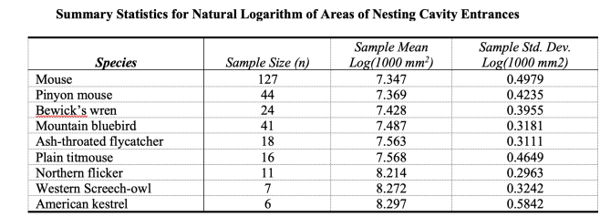
```

Previously, we computed the ANOVA table and found that at least one of the species had a different mean log-area of nesting cavity entrances.

Variation             DF                   SS               MS            F
--------------------- -------------------- ---------------- ------------- -------------
Model                 8                    17.420           2.178         11.350
Error                 85                   54.696           0.1919        $p_{val}$
Total                 293                  72.116                         $\approx$ 0
--------------------- -------------------- ---------------- ------------- -------------

After observing the data, the researchers decided to test the null hypothesis that the average of the logarithm of the area of cavity openings for the first six species (mouse, pinyon mouse, Bewick’s wren, mountain bluebird, ash-throated flycatcher and plain titmouse) is equal to the average of the logarithm of the cavity opening for the other three species (northern flicker, western screech owl, and American kestrel).

$$H_O: \gamma = \frac{\mu_1 + \mu_2 + \mu_3 + \mu_4 + \mu_5 + \mu_6}{6} - \frac{\mu_7 + \mu_8 + \mu_9}{3} = 0$$

There is no file with the actual data. You will need to answer the following questions using only the summary statistics shown in the tables. You may also use the following quantiles:

$$t_{{N-r},{1-\alpha/2}} = 1.973$$
$$t_{{N-r},{1-\alpha/(2m)}} = 3.246$$
$$F_{{r-1},{N-r},{1-\alpha}} = 1.989$$
$$F_{{1},{N-r},{1-\alpha/2}} = 5.107$$
\newpage

## (a) 

Because the researchers decided to perform this test after examining the summary statistics and selecting what appeared to be a large difference, they will need to use the Scheffe method. Report (i) the test statistic and (ii) the critical value. (iii) Interpret the result in the context of the study.

```{r}
y_i <- (7.347 + 7.369 + 7.428 + 7.487 + 7.563 + 7.568) / 6
y_j <- (8.214 + 8.272 + 8.297) / 3
testStat <- abs(y_i - y_j) 
n_i <- 127 + 44 + 24 + 41 + 18 + 16
n_j <- 11 + 7 + 6
frac <- (1/n_i) + (1/n_j)
seconTerm <- sqrt(0.1919 * frac)
firstTerm <- sqrt(8 * 1.989)
compStat <- firstTerm * seconTerm
testStat >= compStat
```

$$|\bar{Y}_i - \bar{Y}_j| \geq \sqrt{(r-1)F_{{r-1},{N-r},{1-\alpha}}} \sqrt{MS_{error}(\frac{1}{n_i} + \frac{1}{n_j})}$$

(i): Test Statistic: 0.80067

(ii): Critical value: 0.37221

(iii): Interpretation 

Test Statistics $\geq$ Critical Value $\rightarrow$ then significant! 

$$0.8006667 \geq 0.3722083$$

In the context of the study, we are saying that the average of the logarithm of the cavity opening of the first six species (mouse, pinyon mouse, Bewick’s wren, mountain bluebird, ash-throated flycatcher and plain titmouse) is statistically different from the average of the logarithm of the cavity opening for the other three species (northern flicker, western screech owl, and American kestrel).

I recognize the above isn't what we typically allow/say is a "test statistic" so I also calculated the F statistic directly in the below. 

# Alternative Method - Calculating F_stat 

$$SS_{\hat{\gamma}} = \frac{\hat{\gamma}^2}{\sum\limits_{i} c_i^2 / n_i}$$

$$F = \frac{SS_{\hat{\gamma}}}{MS_{error}}$$

```{r}
y_i <- (7.347 + 7.369 + 7.428 + 7.487 + 7.563 + 7.568) / 6
y_j <- (8.214 + 8.272 + 8.297) / 3
estimate <- y_i - y_j

plus <- ((1/6)^2)/127 + ((1/6)^2)/44 + ((1/6)^2)/24 + ((1/6)^2)/41 + ((1/6)^2)/18 + ((1/6)^2)/16
minus <- ((-1/3)^2)/11 + ((-1/3)^2)/7 + ((-1/3)^2)/6

fracPart <- plus + minus

ssGamma <- estimate ^ 2 / fracPart

fStat <- ssGamma / 0.1919
fStat
```

Compare to 

Test Statistic: $F_{stat} = 66.20773$

Critical Value: $F_{{1},{N-r},{1-\alpha/2}} = 5.107$

We observce the Test Statistic > Critical Value and conclude there is a significant difference between the two group means. 

Interpretation

Similar to the above method, in the context of the study, we are saying that the average of the logarithm of the cavity opening of the first six species (mouse, pinyon mouse, Bewick’s wren, mountain bluebird, ash-throated flycatcher and plain titmouse) is statistically different from the average of the logarithm of the cavity opening for the other three species (northern flicker, western screech owl, and American kestrel).

\newpage
## (b) 

Use the Scheffe method to construct a confidence interval for the contrast $\gamma$ such that the confidence level is at least 95 percent.

Typical procedure: 
$$\hat{\gamma} \pm t_{N-r, 1 - \alpha/2} S_{\hat{\gamma}}$$

Where: 
$$S_{\hat{\gamma}} = \sqrt{MS_{error} \sum\limits_{i}(c^2_i / n_i)}$$

$$t_{{N-r},{1-\alpha/2}} = 1.973$$

However, for Scheffe, we use 

$$\sqrt{(r-1)F_{{r-1},{N-r},{1-\alpha}}}$$

Instead of 
$$t_{{N-r},{1-\alpha/2}} = 1.973$$

Where: 
$$F_{{r-1},{N-r},{1-\alpha}} = 1.989$$

```{r}
# sum for all i c_i^2 / n_i
plus <- ((1/6)^2)/127 + ((1/6)^2)/44 + ((1/6)^2)/24 + ((1/6)^2)/41 + ((1/6)^2)/18 + ((1/6)^2)/16

minus <- ((-1/3)^2)/11 + ((-1/3)^2)/7 + ((-1/3)^2)/6

coef <- plus + minus
coef

plusminus <- sqrt((9-1) * 1.989) * sqrt(0.1919 * coef) 
plusminus 
```

```{r}
y_i <- (7.347 + 7.369 + 7.428 + 7.487 + 7.563 + 7.568) / 6
y_j <- (8.214 + 8.272 + 8.297) / 3
estimate <- y_i - y_j

estimate + plusminus 
estimate - plusminus
```
We are 95% confident that the true value of the contrast $\gamma$ is between -0.4081 and -1.1932 using the Scheffe method. 

\newpage
## (c) 

Construct a confidence interval for the contrast $\gamma$ using the formula based on an ordinary t-test without any multiple comparison adjustment. How does it compare to the result from the Scheffe method?

Estimate of the contrast, $\gamma$, remains the same, we just use a different adjustment in the plus/minus: 

```{r}
# sum for all i c_i^2 / n_i
plus <- ((1/6)^2)/127 + ((1/6)^2)/44 + ((1/6)^2)/24 + ((1/6)^2)/41 + ((1/6)^2)/18 + ((1/6)^2)/16

minus <- ((-1/3)^2)/11 + ((-1/3)^2)/7 + ((-1/3)^2)/6

coef <- plus + minus
coef

plusminus <- 1.973 * sqrt(0.1919 * coef) 
plusminus 
```

```{r}
y_i <- (7.347 + 7.369 + 7.428 + 7.487 + 7.563 + 7.568) / 6
y_j <- (8.214 + 8.272 + 8.297) / 3
estimate <- y_i - y_j

estimate + plusminus 
estimate - plusminus
```

We are 95% confident that the true value of the contrast $\gamma$ is between -0.6065224 to -0.9948109 using the ordinary t-test method. 

This confidence interval is slightly narrower (smaller) than the one calculated using Scheffe's Method. 

\newpage
## (d) 

One researcher tried to argue that using the confidence interval from (c) in situations such as this is okay because only one confidence interval was constructed. How would you respond to this assertion?

This is not ok. This is actually fairly problematic. We have already done a number of post-hoc transformations and calculations to get at where we started in this problem, from transforming the data to the log scale to normalize our data to even the construction/parametrization of the contrast in question. In a sense, we have already done "multiple comparisons", so it would be disingenuous for us to use the single confidence interval they are interested in. It would be more appropriate to use an adjusted one that accounts for multiple comparisons, a la Scheffe's Method; despite this method being more conservative in its estimate (wider interval than the ordinary t-test), it's worth noting that this difference isn't even especially large! 

\newpage
# Q2 

In 1879, A. A. Michelson made 100 determinations of the velocity of light in air. The data used in this analysis were reported by Stigler (1977, Annals of Statistics, 5:4, 1075). The currently accepted “true” velocity of light in a vacuum is 299,792.5 km/sec, but the velocity of light in air could be slower. The data for this exercise were modified by Stigler to correct for overall bias in Michelson’s measurement for the speed of light in air (i.e. the numbers are in km/sec, and have had 299,000 subtracted from them). 

The measurements are grouped into five trials with 20 determinations for each trial. Since each determination was an attempt to measure the same “true” value of the speed of light in air, one might expect that the population means of possible measurements should be the same for all five trials. However, adjustments to the equipment or method for measuring the speed of light in air may have been made between trials, and these may cause the mean values to differ across trials. (Note that although one can argue that the trails are random effects, for this problem, let’s treat trials as fixed effects.) The data is located in the file lightspeed.csv saved in our course’s shared folder in SAS Studio.

\newpage
## (a) 

Use the Tukey-HSD method in SAS to compare means for measurements of speed of light in air for each pair of trials

```{r, echo=FALSE, fig.cap="img", out.width = '100%'}
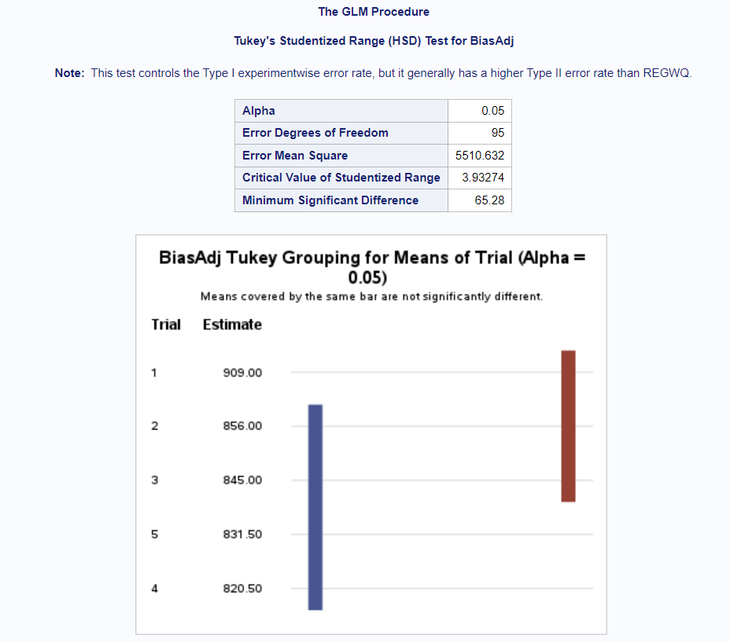
```

### i. 

What is the minimum distance between two sample means required to reject the hypothesis that two trials have the same means using an experiment-wise type I error level of $\alpha$ = 0.05?

65.28

\newpage
### ii. 

Indicate which means are significantly different at the 5% level.

Trial 1 is significantly different than Trial 4 and Trial 5 at the 5% level. Likewise, Trial 4 is different from Trial 1 and Trial 4 is different than Trial 5 at the 5% level. 

\newpage
## (b) 

If we are interested in using Bonferroni’s method to perform a hypothesis test for differences between all pairs of means, what is the type I error rate that we need to control for each comparison so that the experiment-wise type I error rate is 0.05?

```{r, echo=FALSE, fig.cap="img", out.width = '100%'}
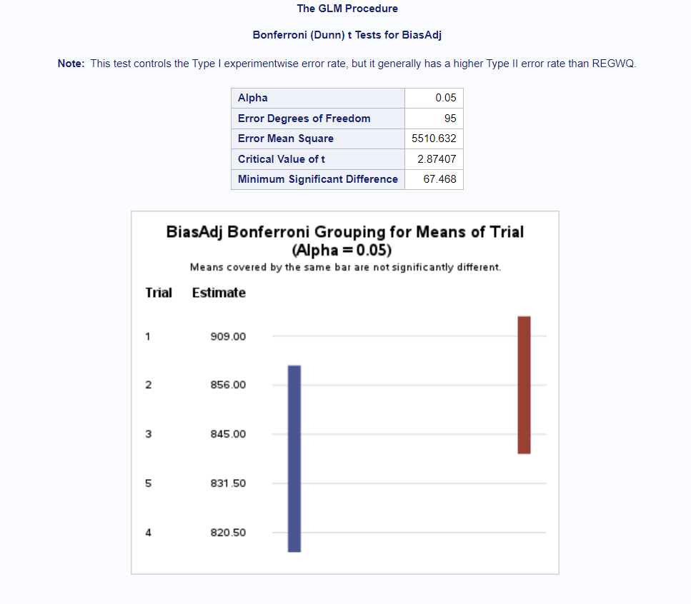
```

For m tests, we use $\alpha/m$ instead of $\alpha$. 
For $\alpha = 0.05$, $m = 10 \equiv {{5}\choose{2}}$, we have 

Type 1 Error Rate: 0.005 for individual comparisons.

\newpage
## (c) 

Consider the following set of orthogonal contrasts that examine potential chronological
changes in the population means across the five trials:

*Contrast 1:* (mean for the first trial) - (mean of the other four trials)
*Contrast 2:* (mean for the second trial) - (mean of the last three trials)
*Contrast 3:* (mean for the third trial) - (mean of the last two trials)
*Contrast 4:* (mean for the fourth trial) - (mean of the last trials)

### i. 

For each contrast, report the contrast coefficients, the sum of squares, corresponding F-statistic, and p-value

```{r, echo=FALSE, fig.cap="img", out.width = '100%'}
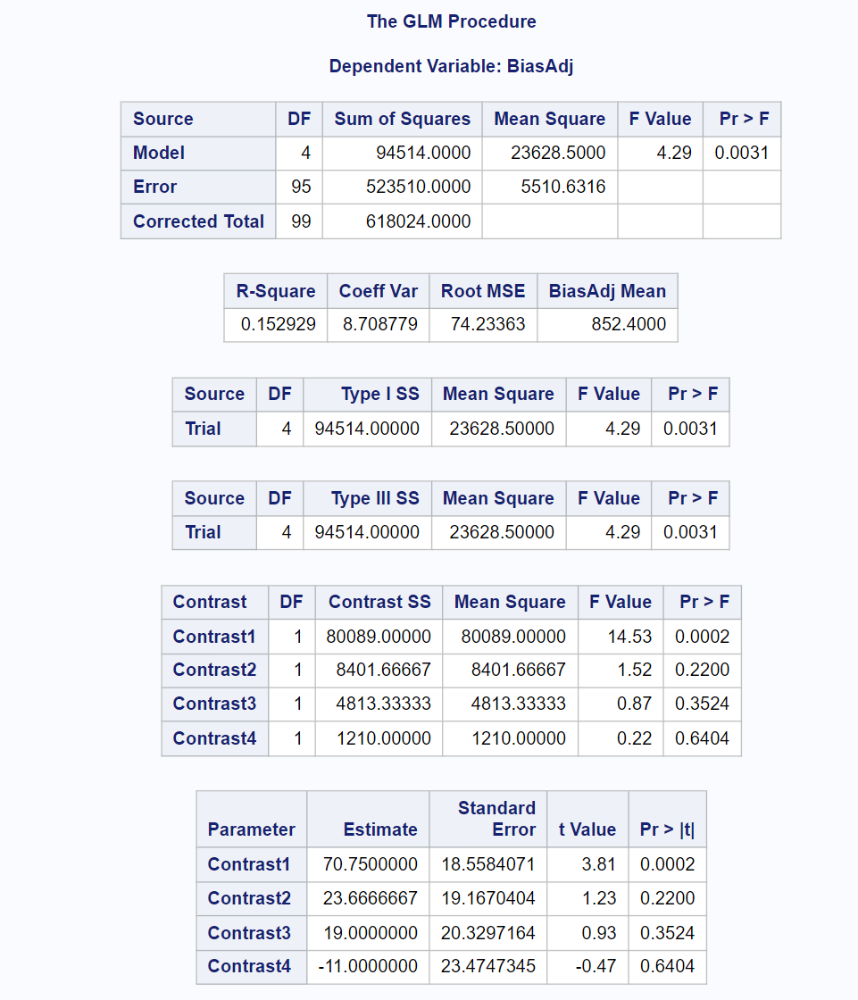
```


Contrast 1: 
  Contrast coefficients: $$\gamma_1 = \mu_1 - \frac{(\mu_2 + \mu_3 + \mu_4 + \mu_5)}{4} \rightarrow (1, -1/4, -1/4, -1/4, -1/4)$$
  Sum of squares: 80089
  F-statistic: 14.53
  p-value: 0.0002
  
Contrast 2: 
  Contrast coefficients: $$\gamma_2 = \mu_2 - \frac{(\mu_3 + \mu_4 + \mu_5)}{3} \rightarrow (0, 1, -1/3, -1/3, -1/3)$$
  Sum of squares: 8401.667
  F-statistic: 1.52
  p-value: 0.220
  
Contrast 3: 
  Contrast coefficients: $$\gamma_3 = \mu_3 - \frac{(\mu_4 + \mu_5)}{4} \rightarrow (0, 0, 1, -1/2, -1/2)$$
  Sum of squares: 4813.333
  F-statistic: 0.87
  p-value: 0.3524
  
Contrast 4: 
  Contrast coefficients: $$\gamma_4 = \mu_4 - \mu_5 \rightarrow (0, 0, 0, 1, -1)$$
  Sum of squares: 1210
  F-statistic: 0.22
  p-value: 0.6404

\newpage
### ii. 

Using a Type I error level of 0.05 for each test in part (i), summarize the test results. (State all interpretations in the context of the study.)

We have evidence to reject the null hypothesis at the $\alpha = 0.05$ level (Type I error level) that the first contrast is zero. This is to say we have evidence to support the alternative hypothesis that the first contrast is not zero, which is to say we have evidence that the mean for the first trial is different from the means of the other four trials. 

However, the statistical tests associated with the other 3 contrasts are the opposite; we do not have significant evidence to reject the null hypothesis of contrasts 2, 3, and 4, which is to say we do not have evidence to reject there being a difference in the mean of the second trial compared with the average of the other 3 trials, nor of there being a difference between the average of the third trial and the average of the last 2 trials, nor of there being a difference between the mean of the fourth trial and the average of the last trial. 

\newpage
### iii. 

Show that the sums of squares for the set of orthogonal contrasts sums to the between
trials sums of squares ($SS_{model}$).

From our overall model summary: 

$$SS_{model} = 94514$$

Taken with the information above, we have: 

$$SS_{\text{contrast 1}} + SS_{\text{contrast 2}} + SS_{\text{contrast 3}} + SS_{\text{contrast 4}} = 80089 + 8401.667 + 4813.333 + 1210 = 94514$$

Such that 

$$94514 = SS_{model} = SS_{\text{contrast 1}} + SS_{\text{contrast 2}} + SS_{\text{contrast 3}} + SS_{\text{contrast 4}}$$

\newpage
# Q3 

Ten patients who suffered from a sleep disorder were examined in a study of the effectiveness of a sleep-aid drug. First, each patient was given a placebo, a pill that did not contain any active ingredient. The average number of hours of sleep for three nights was recorded for each patient. Then, each patient was given a pill containing the drug for three consecutive nights and average hours of sleep was recorded for each patient. The data appear below (and can also be found in the sleep.csv file saved in our course’s shared folder on SAS Studio).

```{r, echo=FALSE, fig.cap="img 2", out.width = '100%'}
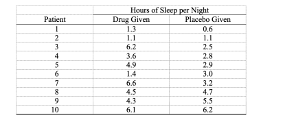
```

\newpage
## (a) 

Identify the blocks and treatments for this experiment.

The blocks in this experiment is an individual suffering from a sleep disorder, and we have 10 blocks (10 participants/individuals used in the study).

The treatments are receiving either a placebo or a sleep-aid drug, specifically receiving either pill over a 3 night period. 

\newpage
## (b) 

Explain why this is a matched pairs experiment.

Each block (an individual) effectively provides multiple measurements in our data, specifically for the two different variables of interest (Placebo and Drug). This is a reuse matched pairs experiment. 

\newpage
## (c) 

What is one aspect of the experimental design that could be improved? Explain how this would strengthen the results.

The key item I would focus on is what constitutes the sleeping environment for an individual involved in the study. Despite taking an average amount of sleep over a three day period, we'd want to ensure that the environment being slept in is consistent, across days, but more importantly consistent regardless of treatment being applied (sleep-aid drug or Placebo). This would allow us to more definitively say whether the differences observed are associated with (or mayhaps even caused?) by the drug being taken and not some external factors such as changing from an especially comfy cot to a stratchy, itchy, noisesome custom-made water bed. 

There is also the issue of potential bias. As we set that participants receive the sleep-aid drug first, we are not randomizing treatment, potentially introducing bias into our data (not having a mix of participants start with 3 nights of the Placebo followed by the sleep-aid drug). This also makes us less certain about any claims of causality, if we were to find statistically significant results. 

Additionally, more data would be helpful (low hanging fruit); so either having more participants, or having more nights under study could help. A third one I'll throw in for good measure: Having different dosages of the sleeping pill could also strengthen results, as it could affirm the impact of the sleep-aid drug while also possibly quantifying dosage effects. 

\newpage
## (d) 

Using SAS, compute the value of a t-statistic for testing the null hypothesis that mean hours of sleep are the same for the drug and the placebo, against a one-sided alternative that mean hours of sleep are greater when the drug is used. Report the (i) test statistic, (ii) degrees of freedom, (iii) p-value, and (iv) interpret the result in the context of the study.

```{r, echo=FALSE, fig.cap="img ", out.width = '100%'}
knitr::include_graphics("Onetail.png")
```

Test Statistic: 1.33 
degrees of freedom: 9 
p-value: 0.1088
Interpretation: 

We have evidence at the $\alpha = 0.20$ level to reject the null hypothesis that the average sleep times of users of the sleep-aid drug is less than or equal to the average sleep times of users of the placebo. Typically, for most $\alpha = 0.10, 0.05, 0.01, etc.$ levels we do not reject the null hypothesis stated previously. Overall, we would say that we do not reject the null hypothesis and support there being evidence that the average sleep times of users of the sleep-aid drug is less than or equal to the average sleep times of users of the placebo.  

\newpage
## (e) 

Check the assumptions for this test and provide supporting data from SAS.

Our assumptions are independence within groups, i.e. independence between blocks (not between because of matched pairs!), and normality of differences. Overall, these assumptions do not readily appear to be violated. 

As far as independence between blocks, I do not believe we have reason to suspect this is being violated. It would be violated if participants were sleeping with one another, or were sleeping in an environment where they could disturb another participant. But this does seem a bit farcical.  

The below provides a number of diagnostics run for normality. Overall, the statistical tests provide evidence not to reject the null hypothesis of normality, particularly Shapiro-Wilk failing to reject normality. Furthermore, the box plot and histograms tend to have a normal shape, though the box plot does show that variance (spread) is not symmetrical. Furthermore, skewness and (excess) kurtosis both have absolute differences less than 1, and while mean and median are not equal, they are relatively similar (difference of 0.4 for values having a range of 5.3). Additionally, the quantile (qq) plot shows values that closely track with the reference line, though there is some inexactness. 

```{r, echo=FALSE, fig.cap="img 2", out.width = '100%'}
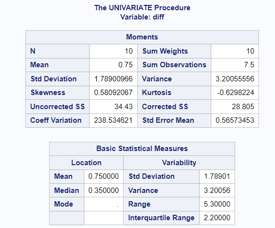
```

```{r, echo=FALSE, fig.cap="img 2", out.width = '100%'}
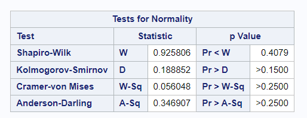
```

```{r, echo=FALSE, fig.cap="img 2", out.width = '100%'}
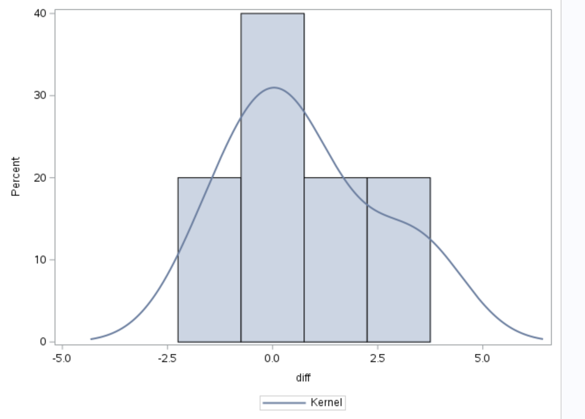
```

```{r, echo=FALSE, fig.cap="img 2", out.width = '100%'}
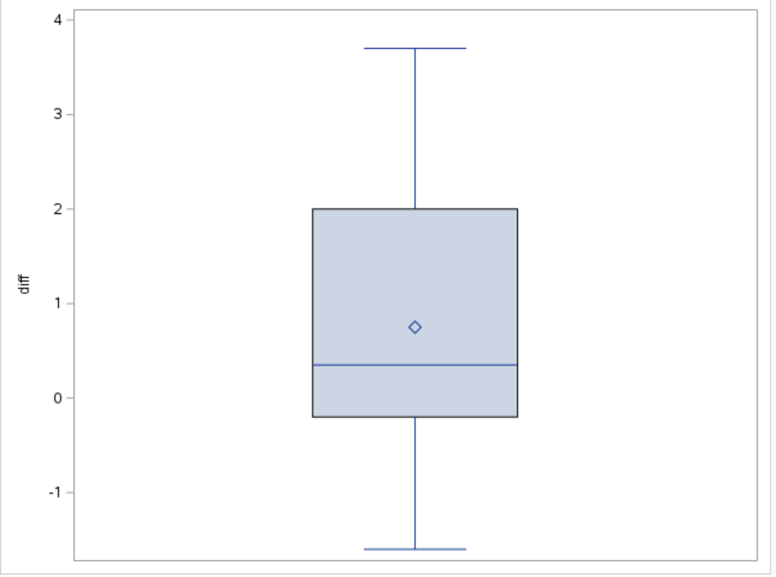
```

```{r, echo=FALSE, fig.cap="img 2", out.width = '100%'}
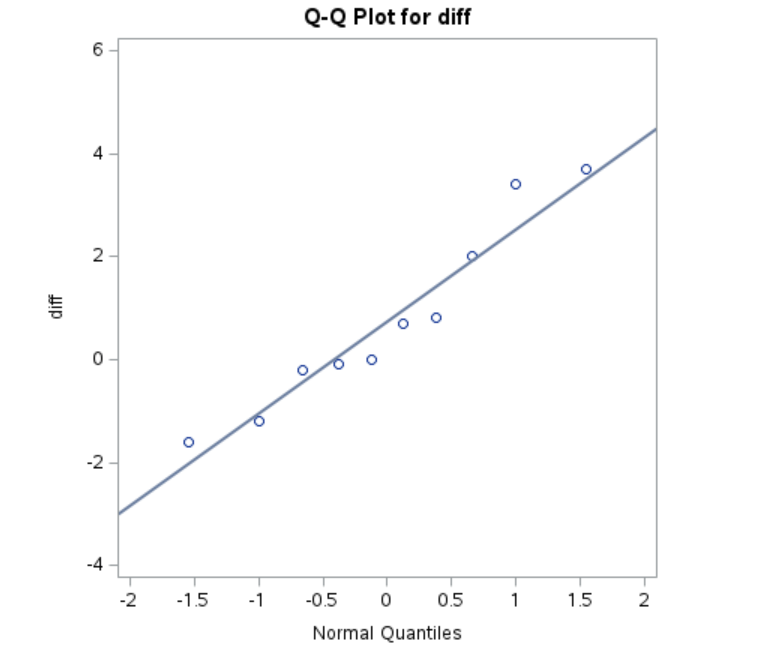
```

\newpage
## (f) 

Apply the Wilcoxon signed rank test to these data in SAS. Report the (i) test statistic (sum of ranks for positive differences), (ii) p-value, and (iii) interpret the result in the context of the study.

```{r, echo=FALSE, fig.cap="img 2", out.width = '100%'}
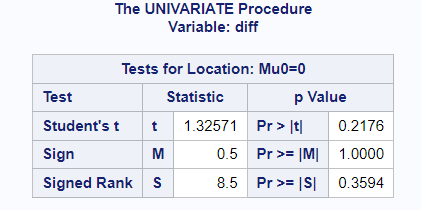
```

Test Statistic: 8.5 
p-value: 0.3594 
Interpretation: We do not have statistically significant evidence to reject the null hypothesis that the distribution of sleep times for Placebo is different from the distribution of sleep times for the sleep-aid drug. 

\newpage
## (g) 

Apply the sign test to these data in SAS. Report the (i) test statistic (number of positive differences), (ii) p-value, and (iii) interpret the result in the context of the study

```{r, echo=FALSE, fig.cap="img 2", out.width = '100%'}

```

Test Statistic: 0.5
p-value: 1.000
Interpretation: We do not have statistically significant evidence to reject the null hypothesis. We do not have evidence that there are consistent differences between the sleep times of the Placebo and the sleep times of the sleep-aid drug. We do not have evidence of a direction of change, or, explicitly, that taking the sleep-aid drug would tend to be associated with a positive or negative change in the number of hours slept compared to the Placebo.  

\newpage
## (h) 

Compute how large (the number of patients) a study of this type would need to be so that the width of a 95% confidence interval for the difference in the mean responses to the drug and the placebo would be about 0.75 hours.

```{r, echo=FALSE, fig.cap="img", out.width = '100%'}
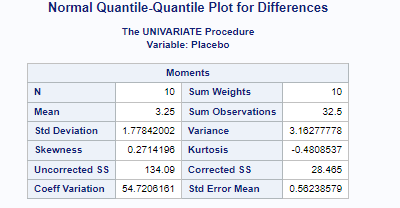
```

```{r, echo=FALSE, fig.cap="img", out.width = '100%'}
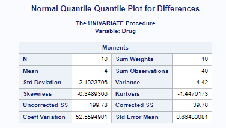
```

```{r}
# qnorm()
# qt()
# equal n means
# S_p^2 = S_1^2 + S_2^2 / 2 
sp1 <- 4.42 
sp2 <- 3.1627778
spSq <- (sp1 + sp2) / 2
sp <- sqrt(spSq)
```

```{r}
zval <- qnorm(p = 0.975, mean = 0, sd = 1)
n0 <- 8 * (((zval * sp)/0.75)^2)
# 207.139
# use 208
tval <- qt(p = 0.975, df = 414)
n <- 8 * (((tval * sp)/0.75)^2)
# qt(p = 0.975, )
n0
n
```
209 Participants are needed so that the width of a 95% confidence interval for the difference in the mean responses to the drug and the placebo would be about 0.75 hours.
