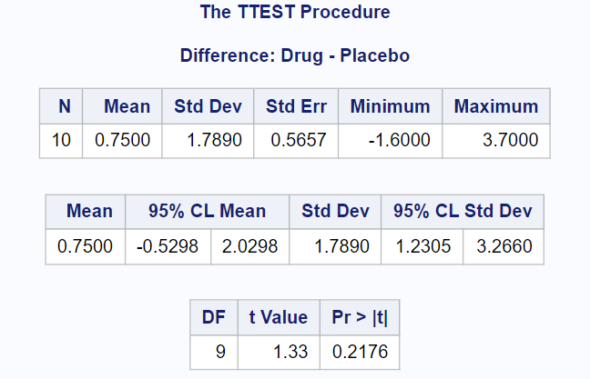

[Stat 5000]{.smallcaps}
[Homework #4]{.smallcaps}\
[Fall 2024]{.smallcaps} 
[due Fri, October 18th @ 11:59 pm]{.smallcaps}
[Name:]{.smallcaps} \
[Collaborators: **The Hatman**]{.smallcaps} \

# Q1 

Consider the nesting example from the previous homework assignment. The areas of entrances to nesting cavities were measured for 294 nesting sites for nine common species of birds and rodents in Oregon. Sample sizes, sample means and sample standard deviations are shown below with samples means and sample standard deviations computed from the natural logarithms of the observed areas of cavity entrances.

```{r, echo=FALSE, fig.cap="img 1", out.width = '100%'}
knitr::include_graphics("Summary1.png")
```

Previously, we computed the ANOVA table and found that at least one of the species had a different mean log-area of nesting cavity entrances.

Variation             DF                   SS               MS            F
--------------------- -------------------- ---------------- ------------- -------------
Model                 8                    17.420           2.178         11.350
Error                 85                   54.696           0.1919        $p_{val}$
Total                 293                  72.116                         $\approx$ 0
--------------------- -------------------- ---------------- ------------- -------------

After observing the data, the researchers decided to test the null hypothesis that the average of the logarithm of the area of cavity openings for the first six species (mouse, pinyon mouse, Bewick’s wren, mountain bluebird, ash-throated flycatcher and plain titmouse) is equal to the average of the logarithm of the cavity opening for the other three species (northern flicker, western screech owl, and American kestrel).

$$H_O: \gamma = \frac{\mu_1 + \mu_2 + \mu_3 + \mu_4 + \mu_5 + \mu_6}{6} - \frac{\mu_7 + \mu_8 + \mu_9}{3} = 0$$

There is no file with the actual data. You will need to answer the following questions using only the summary statistics shown in the tables. You may also use the following quantiles:

$$t_{{N-r},{1-\alpha/2}} = 1.973$$
$$t_{{N-r},{1-\alpha/(2m)}} = 3.246$$
$$F_{{r-1},{N-r},{1-\alpha}} = 1.989$$
$$F_{{1},{N-r},{1-\alpha/2}} = 5.107$$
\newpage
## (a) 

Because the researchers decided to perform this test after examining the summary statistics and selecting what appeared to be a large difference, they will need to use the Scheffe method. Report (i) the test statistic and (ii) the critical value. (iii) Interpret the result in the context of the study.

```{r}
y_i <- (7.347 + 7.369 + 7.428 + 7.487 + 7.563 + 7.568) / 6
y_j <- (8.214 + 8.272 ++ 8.297) / 3
testStat <- abs(y_i - y_j) 
n_i <- 127 + 44 + 24 + 41 + 18 + 16
n_j <- 11 + 7 + 6
frac <- (1/n_i) + (1/n_j)
seconTerm <- sqrt(0.1919 * frac)
firstTerm <- sqrt(8 * 1.989)
compStat <- firstTerm * seconTerm
testStat >= compStat
```

$$|\bar{Y}_i - \bar{Y}_j| \geq \sqrt{(r-1)F_{{r-1},{N-r},{1-\alpha}}} \sqrt{MS_{error}(\frac{1}{n_i} + \frac{1}{n_j})}$$
$r-1 = 8$

$\sqrt{(8 * 1.989)}$ $\sqrt{(0.1919 * (\frac{1}{n_i} + \frac{1}{n_j})}$

(i): Test Statistic: 0.80067

(ii): Critical value: 0.37221

(iii): Interpretation 

Test Statistics $\geq$ Critical Value $\rightarrow$ then significant! 

$$0.8006667 \geq 0.3722083$$


\newpage
## (b) 

Use the Scheffe method to construct a confidence interval for the contrast $\gamma$ such that the confidence level is at least 95 percent.

```{r}
# sum for all i c_i^2 / n_i

```

\newpage
## (c) 

Construct a confidence interval for the contrast $\gamma$ using the formula based on an ordinary t-test without any multiple comparison adjustment. How does it compare to the result from the Scheffe method?


\newpage
## (d) 

One researcher tried to argue that using the confidence interval from (c) in situations such as this is okay because only one confidence interval was constructed. How would you respond to this assertion?


\newpage
# Q2 

In 1879, A. A. Michelson made 100 determinations of the velocity of light in air. The data used in this analysis were reported by Stigler (1977, Annals of Statistics, 5:4, 1075). The currently accepted “true” velocity of light in a vacuum is 299,792.5 km/sec, but the velocity of light in air could be slower. The data for this exercise were modified by Stigler to correct for overall bias in Michelson’s measurement for the speed of light in air (i.e. the numbers are in km/sec, and have had 299,000 subtracted from them). 

The measurements are grouped into five trials with 20 determinations for each trial. Since each determination was an attempt to measure the same “true” value of the speed of light in air, one might expect that the population means of possible measurements should be the same for all five trials. However, adjustments to the equipment or method for measuring the speed of light in air may have been made between trials, and these may cause the mean values to differ across trials. (Note that although one can argue that the trails are random effects, for this problem, let’s treat trials as fixed effects.) The data is located in the file lightspeed.csv saved in our course’s shared folder in SAS Studio.

\newpage
## (a) 

Use the Tukey-HSD method in SAS to compare means for measurements of speed of light in air for each pair of trials

```{r, echo=FALSE, fig.cap="img", out.width = '100%'}
knitr::include_graphics("TukeyQ2.png")
```

### i. 

What is the minimum distance between two sample means required to reject the hypothesis that two trials have the same means using an experiment-wise type I error level of $\alpha$ = 0.05?

\newpage
### ii. 

Indicate which means are significantly different at the 5% level.

\newpage
## (b) 

If we are interested in using Bonferroni’s method to perform a hypothesis test for differences between all pairs of means, what is the type I error rate that we need to control for each comparison so that the experiment-wise type I error rate is 0.05?

```{r, echo=FALSE, fig.cap="img", out.width = '100%'}
knitr::include_graphics("BoneQ2.png")
```

\newpage
## (c) 

Consider the following set of orthogonal contrasts that examine potential chronological
changes in the population means across the five trials:

*Contrast 1:* (mean for the first trial) - (mean of the other four trials)
*Contrast 2:* (mean for the second trial) - (mean of the last three trials)
*Contrast 3:* (mean for the third trial) - (mean of the last two trials)
*Contrast 4:* (mean for the fourth trial) - (mean of the last trials)

### i. 

For each contrast, report the contrast coefficients, the sum of squares, corresponding F-statistic, and p-value

```{r, echo=FALSE, fig.cap="img", out.width = '100%'}
knitr::include_graphics("ContrastsQ2.png")
```

\newpage
### ii. 

Using a Type I error level of 0.05 for each test in part (i), summarize the test results. (State all interpretations in the context of the study.)

\newpage
### iii. 

Show that the sums of squares for the set of orthogonal contrasts sums to the between
trials sums of squares ($SS_{model}$).

\newpage
# Q3 

Ten patients who suffered from a sleep disorder were examined in a study of the effectiveness of a sleep-aid drug. First, each patient was given a placebo, a pill that did not contain any active ingredient. The average number of hours of sleep for three nights was recorded for each patient. Then, each patient was given a pill containing the drug for three consecutive nights and average hours of sleep was recorded for each patient. The data appear below (and can also be found in the sleep.csv file saved in our course’s shared folder on SAS Studio).

```{r, echo=FALSE, fig.cap="img 2", out.width = '100%'}
knitr::include_graphics("Summary2.png")
```

\newpage
## (a) 

Identify the blocks and treatments for this experiment.

Block is an individual suffering from a sleep disorder.

\newpage
## (b) 

Explain why this is a matched pairs experiment.

Each block (an individual) effectively provides multiple measurements in our data, specifically for the two different variables of interest (Placebo and Drug). This is a reuse matched pairs experiment. 

\newpage
## (c) 

What is one aspect of the experimental design that could be improved? Explain how this would strengthen the results.

Randomize which pill an individual receives on a given night. 

\newpage
## (d) 

Using SAS, compute the value of a t-statistic for testing the null hypothesis that mean hours of sleep are the same for the drug and the placebo, against a one-sided alternative that mean hours of sleep are greater when the drug is used. Report the (i) test statistic, (ii) degrees of freedom, (iii) p-value, and (iv) interpret the result in the context of the study.

```{r, echo=FALSE, fig.cap="img 2", out.width = '100%'}

```

\newpage
## (e) 

Check the assumptions for this test and provide supporting data from SAS.

Independence within groups, i.e. independence between blocks (not between because of matched pairs!)

Normality of differences:  

```{r, echo=FALSE, fig.cap="img 2", out.width = '100%'}
knitr::include_graphics("Q3Summary.png")
```

```{r, echo=FALSE, fig.cap="img 2", out.width = '100%'}
knitr::include_graphics("Q3StatTests.png")
```

```{r, echo=FALSE, fig.cap="img 2", out.width = '100%'}
knitr::include_graphics("Q3Hist.png")
```

```{r, echo=FALSE, fig.cap="img 2", out.width = '100%'}
knitr::include_graphics("BoxplotQ3.png")
```

```{r, echo=FALSE, fig.cap="img 2", out.width = '100%'}
knitr::include_graphics("Q3QQ.png")
```

\newpage
## (f) 

Apply the Wilcoxon signed rank test to these data in SAS. Report the (i) test statistic (sum of ranks for positive differences), (ii) p-value, and (iii) interpret the result in the context of the study.

```{r, echo=FALSE, fig.cap="img 2", out.width = '100%'}
knitr::include_graphics("Q3Proc.png")
```

\newpage
## (g) 

Apply the sign test to these data in SAS. Report the (i) test statistic (number of positive differences), (ii) p-value, and (iii) interpret the result in the context of the study

```{r, echo=FALSE, fig.cap="img 2", out.width = '100%'}
knitr::include_graphics("Q3Proc.png")
```

\newpage
## (h) 

Compute how large (the number of patients) a study of this type would need to be so that the width of a 95% confidence interval for the difference in the mean responses to the drug and the placebo would be about 0.75 hours.

```{r}
qnorm()
qt()
```