[Stat 5000]{.smallcaps}
[Homework #8]{.smallcaps}\
[Fall 2024]{.smallcaps} 
[due Fri, November 1st @ 11:59 pm]{.smallcaps}
[Name: Sam Olson]{.smallcaps} \
[Collaborators: Sarah, Sabrina, **The Hatman**]{.smallcaps} \

# Q1 

A completely randomized two-factor experiment consisted of burning fuel with levels of two additives in a laboratory setting and determining the carbon monoxide (CO) emissions released. Eighteen batches of a standard fuel were available for this study. Two of the batches were randomly assigned to each of nine combinations of two additives corresponding to three levels of added ethanol (0.1, 0.2, or 0.3) and three air/fuel ratio settings (14, 15, or 16). Units for the ethanol levels were not reported. CO emission concentrations (g/meter3) were determined by burning the same amount of fuel from each of the 18 batches. The data are shown below and are located in the file emissions.txt.

```{r, echo=FALSE, fig.cap="CocoMelon", out.width = '100%'}
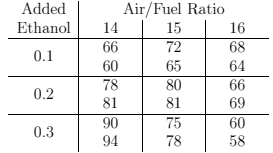
```

## (a) 

Construct the full ANOVA table. Which factors or interactions have significant effects on CO concentrations in emissions? Interpret the results in the context of the study.

```{r, echo=FALSE, fig.cap="CocoMelon", out.width = '100%'}
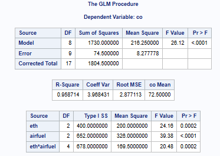
```

It appears that all treatment variables (ethanol levels and air/fuel ratios) in addition to their interaction effects are significant, meaning we have evidence to reject the null hypothesis that the mean CO emission concentrations (g/meter3) are equal for all treatment levels when averaged across all other factors/treatments, i.e. we have evidence to support the following alternative hypotheses: 1. At least one mean CO emission concentrations (g/meter3) for ethanol levels is different from the other mean CO emission concentrations (g/meter3) averaging across air/fuel ratio levels, 2. At least one mean CO emission concentrations (g/meter3) for air/fuel ratio is different from the other mean CO emission concentrations (g/meter3) for air/fuel ratios when averaging across ethanol levels, and 3. The mean CO emission concentrations (g/meter3) for the interaction between ethanol and air/fuel ratio is different from the mean CO emission concentrations (g/meter3) of some other combination of ethanol/air/fuel ratio.

\newpage

## (b) 

Partition the sum of squares for the ethanol effects, averaging across air/fuel ratio levels, into sums of squares for linear and quadratic components. The coefficients for these contrasts are (-1, 0, 1) and (-1, 2, -1). Is there a significant linear or quadratic effect in the model for the ethanol effects?

```{r, echo=FALSE, fig.cap="CocoMelon", out.width = '100%'}
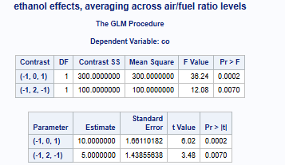
```

There are significant linear and quadratic effects in the model for ethanol effects, where significance is at the $\alpha = 0.05$ level. 

\newpage

## (c) 

Partition the sum of squares for the air/fuel ratio effects, averaging across levels of ethanol, into sums of squares for linear and quadratic components. The coefficients for these contrasts are (-1, 0, 1) and (-1, 2, -1). Is there a significant linear or quadratic effect in the model for the air/fuel ratio effects?

```{r, echo=FALSE, fig.cap="CocoMelon", out.width = '100%'}
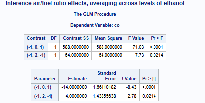
```

There are also significant linear and quadratic effects in the model for the air/fuel ratio effects, where significance is at the $\alpha = 0.05$ level. 

\newpage

## (d) 

Use Tukey’s HSD method to make pairwise comparisons of the marginal means for the three ethanol values. Summarize the results in the context of the study.

```{r, echo=FALSE, fig.cap="CocoMelon", out.width = '100%'}
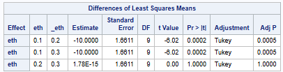
```

For ethanol levels, we have evidence to reject the null hypothesis that the mean CO emission concentrations (g/meter3) for ethanol level 0.1 is the same as the mean CO emission concentrations (g/meter3) for ethanol level 0.2, when averaging across all air/fuel ratio levels. Similarly we have evidence to reject the null hypothesis that the mean CO emission concentrations (g/meter3) for ethanol level 0.1 is the same as the mean CO emission concentrations (g/meter3) for ethanol level 0.3, when averaging across all air/fuel ratio levels. The interpretations are based on meeting the significance threshold at the $\alpha = 0.05$ level. 

\newpage

## (e) 

Use Tukey’s HSD method to make pairwise comparisons of the marginal means for the air/fuel ratio values. Summarize the results in the context of the study.

```{r, echo=FALSE, fig.cap="CocoMelon", out.width = '100%'}
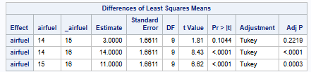
```

For air/fuel ratio values, we have evidence to reject the null hypothesis that the mean CO emission concentrations (g/meter3) for air/fuel ratio 14 are the same as the mean CO emission concentrations (g/meter3) for air/fuel ratio 16, when averaging across all ethanol levels. Similarly we have evidence to reject the null hypothesis that the mean CO emission concentrations (g/meter3) for air/fuel ratio15 are the same as the mean CO emission concentrations (g/meter3) for air/fuel ratio 16, when averaging across all ethanol levels. The interpretations are based on meeting the significance threshold at the $\alpha = 0.05$ level. 

\newpage

# Q2 

In a study of the effects of exposure to UV-B radiation on egg hatch rates for three species of frogs, eggs were collected from two different locations (Three Creek and Sparks Lake) and then subjected to UV-B radiation using three different kinds of filters. Thirty-six enclosures were constructed at each location. Within each location, four enclosures were randomly assigned to each of the 9 combination of the two factors: frog species (Hyla regilla, Rana cascade, and Bufo boreas) and type of radiation filters (none, UV-B transmitting, and UV-B blocking). One hundred and fifty eggs for the designated frog species were placed in each enclosure. The response is the percentage of eggs that failed to hatch in each enclosure. The data is posted in the frogeggs.txt file and displayed in the following tables:

```{r, echo=FALSE, fig.cap="CocoMelon", out.width = '100%'}
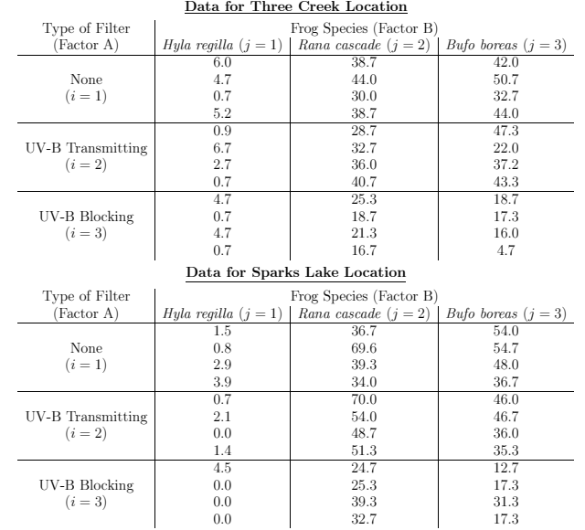
```

## (a) 

What is the treatment design and what is the experimental design in this study?

\newpage

## (b) 

Consider the model $Y_{ijkl} = \mu + \alpha_i + \tau_j + (\alpha \tau)_{ij} + \beta_k + \epsilon_{ijkl}$ where $\epsilon_{ijkl} \sim N(0, sigma^2)$ are random errors, $\beta_k \sim N(0, \sigma^2)$ are random block effects corresponding to locations, and any random error is independent of any random block effect. Imposing the baseline constraints $\alpha_3 = \tau_3 = (\alpha \tau )_{13} = (\alpha \tau )_{23} = (\alpha \tau )_{33} = (\alpha \tau )_{31} = (\alpha \tau )_{32} = 0$ then interpret the following
parameters in the context of the study:

### i. 

$\mu$

### ii. 

$\alpha_1$

### iii. 

$\tau_2$

### iv. 

$(\alpha \tau)_{12}$

### v. 

$\mu + \alpha_1 + \tau_2 + (\alpha \tau)_{12}$

### vi. 

$(\alpha \tau)_{12} - (\alpha \tau )_{32} - (\alpha \tau )_{13} + (\alpha \tau )_{33}$

\newpage

## (c) 

Examine the equal variance assumption. Summarize your findings and include supporting tables and/or figures.

\newpage

## (d) 

Examine the normality assumption. Summarize your findings and include supporting tables and/or figures

\newpage

## (e) 

Suppose that the diagnostics suggest the need for a transformation. Find which transformation of the responses is better, square root transformation, log transformation, or none? Summarize your findings and include supporting tables and/or figures.

\newpage

## (f) 

For the best model specified in part (e), find the full ANOVA table. Summarize which factors and interactions are significant. Is there any evidence that the types of filter have different effects on egg hatch success? Explain.

\newpage

## (g) 

For the best model specified in part (e): Examine a profile plot of the treatment means (do not hand it in), plotting the sample mean responses for the combinations of filters and frog species, averaging across locations. What does this plot suggest? Are your conclusions about interactions between types of filters and frog species supported by results in the ANOVA table?

\newpage

# Q3 

The data shown in the table below are results from a study of amylace activity of malted wheat flour (Geddes, et al. 1941, Cereal Chem 18, 42-60.). Five factors, each at two levels, were examined:

Factor s: type/species of wheat
  Amber durum (1)
  hard red spring (2)

Factor p: wheat protein content
  low (1)
  high (2)

Factor m: wheat moisture content
  40 percent (1)
  44 percent (2)

Factor g: germination time
  3 days (1)
  5 days (2)

Factor k: kiln temperature rising 
  100F to 130F (1)
  constant at 100F (2)

Response: Amylace is a protein that helps you break down carbohydrates and starches into sugar, releasing carbon dioxide (CO2) in the process. Amylase activity was measured by the amount of malt from each flour that was required to produce 204.7ml of CO2. Measured amylase activity is reported in the data table in units of Y = [0.6 + log(amount of malt)] × 103

```{r, echo=FALSE, fig.cap="CocoMelon", out.width = '100%'}
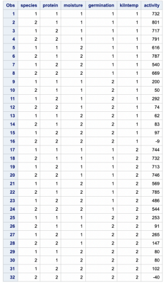
```

## (a) 

The normal probability plot and table of estimates on the next page shows the values of main effects and interaction contrasts, for which the estimate of every contrast has the same variance. This information is used to determine which effects should be included in the analysis and which should be used to estimate the variance. Which effects appear to be large?

```{r, echo=FALSE, fig.cap="CocoMelon", out.width = '100%'}
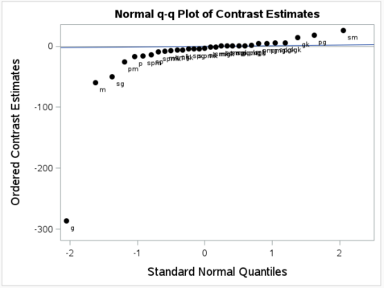
```

```{r, echo=FALSE, fig.cap="CocoMelon", out.width = '100%'}
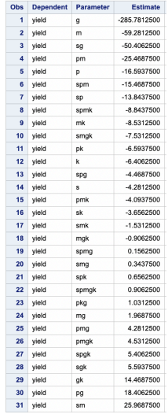
```

We are interested in the overall magnitude of the estimates of effects, specifically how far from zero they are. In the negative range, g, m, sg, pm, and p are all in magnitude greater than 15, while on the positive range only pg and sm have a magnitude greater than 15. If we were to include estimated effects greater in magnitude than 10, we'd also want to include spm, sp, and gk in addition to those listed previously. 

\newpage

## (b) 

Using least squares estimation to fit the model that includes all main effects and all interaction effects that were identified as “non-zero” by the analysis in part (a), (including all main effects in this model, regardless of whether the plot suggests they are significant or not, then the sum of sums of squares for the interaction contrasts that are not included in the model can be pooled to obtain a MSerror), the corresponding ANOVA table is provided below.

```{r, echo=FALSE, fig.cap="CocoMelon", out.width = '100%'}
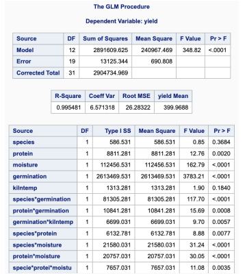
```

Examine the results of F-tests for terms kept in the model and summarize the results in the context of the study. 

Based on the ANOVA table provided, here is a summary of the F-tests for the terms retained in the model:

1. Species (Pr > F = 0.3684): The F-test for the effect of wheat species is not significant at common significance levels, suggesting that the type of wheat (Amber durum vs. hard red spring) does not have a statistically significant effect on yield in terms of amylase activity.

2. Protein (Pr > F = 0.0026): The F-test shows a significant effect of wheat protein content on yield. This implies that the protein content (low vs. high) has a notable impact on amylase activity.

3. Moisture (Pr > F < 0.0001): Moisture content is highly significant, indicating that the moisture level (40% vs. 44%) has a substantial effect on yield.

4. Germination (Pr > F < 0.0001): The germination time also has a highly significant effect on yield, suggesting that the length of germination (3 days vs. 5 days) plays an important role in amylase activity.

5. Kiln Temperature (Pr > F < 0.0001): The effect of kiln temperature is very significant, indicating that the method of kiln temperature control (rising vs. constant) strongly impacts the yield.

### Interaction Effects:
6. Species-Germination (Pr > F < 0.0001): The interaction between species and germination is significant, suggesting that the effect of germination time on yield depends on the wheat species.
  
7. Protein-Germination (Pr > F = 0.0002): This interaction is also significant, implying that the effect of germination time on yield changes with protein content.

8. Germination-Kiln Temperature (Pr > F < 0.0001): This interaction is significant, indicating that the effect of kiln temperature on yield varies with germination time.

9. Species-Protein (Pr > F = 0.0008): The interaction between species and protein content is significant, suggesting that protein content impacts yield differently based on the wheat species.

10. Protein-Moisture (Pr > F = 0.0003): This interaction is significant, meaning that the effect of moisture content on yield depends on protein content.

11. Species-Moisture (Pr > F = 0.0031): The interaction between species and moisture is significant, indicating that moisture affects yield differently depending on the wheat species.

12. Species-Protein-Moisture (Pr > F = 0.0035): The three-way interaction among species, protein, and moisture is significant, suggesting a complex interplay between these factors in influencing yield.

### Summary:

In this study, multiple main effects and interactions significantly impact amylase activity as measured by the yield. Key factors include protein, moisture, germination time, and kiln temperature, along with notable interactions among these factors. This suggests that amylase activity in wheat flour is influenced by a combination of these factors, highlighting the complexity of optimizing conditions for yield. Factors that are not significant (e.g., species alone) might not need emphasis in further analysis but could still be relevant in interaction with other factors.

\newpage

## (c) 

Choose any significant two-way interaction for the model in part (b) and interpret it in the context of the study. Also interpret the significant three-way interaction for the model in part (b).

6. Species-Germination (Pr > F < 0.0001): The interaction between species and germination is significant, suggesting that the effect of germination time on yield depends on the wheat species.
  
7. Protein-Germination (Pr > F = 0.0002): This interaction is also significant, implying that the effect of germination time on yield changes with protein content.

8. Germination-Kiln Temperature (Pr > F < 0.0001): This interaction is significant, indicating that the effect of kiln temperature on yield varies with germination time.

9. Species-Protein (Pr > F = 0.0008): The interaction between species and protein content is significant, suggesting that protein content impacts yield differently based on the wheat species.

10. Protein-Moisture (Pr > F = 0.0003): This interaction is significant, meaning that the effect of moisture content on yield depends on protein content.

11. Species-Moisture (Pr > F = 0.0031): The interaction between species and moisture is significant, indicating that moisture affects yield differently depending on the wheat species.

12. Species-Protein-Moisture (Pr > F = 0.0035): The three-way interaction among species, protein, and moisture is significant, suggesting a complex interplay between these factors in influencing yield.

\newpage

## (d) 

Comment on the normal probability plot of the residuals for the model in part (b), shown below.

```{r, echo=FALSE, fig.cap="CocoMelon", out.width = '100%'}
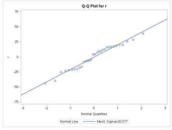
```

The above normal probability plot (QQ Plot) of the residuals for the model in part (b) has residual points which appear to closely follow the diagonal line, suggesting that the residuals are approximately normally distributed and that our assumption of normally distributed residuals is likely not being violated.

We do not observe especially extreme deviations from the reference line, though we do observe a number of points not exactly aligned with the reference line. Therefore, we can conclude that the residuals meet the normality assumption, which supports the validity of the F-tests used in the model and for the interpretations from prior parts of this problem. 

\newpage

## (e) 

Comment on the plot of the residuals versus the estimated mean yields for the model in part (b), shown below.

```{r, echo=FALSE, fig.cap="CocoMelon", out.width = '100%'}
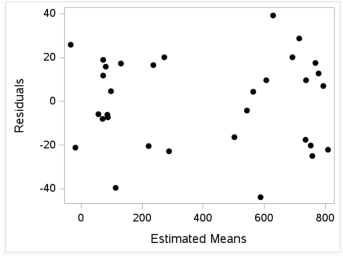
```

The above residual plot against the estimated means (fitted values, I believe) appear randomly spread, i.e. we do not readily identify a particular trend in this data. This is good news, as this is what we would expect if our assumption of additivity holds and is evidence in favor of this particular assumption not being violated. 

\newpage

## (f) 

Interpret the value of each of the estimated effects of the five factors on amylase activity, shown below. Keep in mind that low values of the response variable correspond to combinations of factors that produce 204.7 ml of CO2 with the least amount of malt.

```{r, echo=FALSE, fig.cap="CocoMelon", out.width = '100%'}
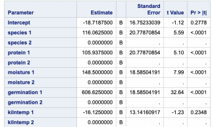
```

Based on the table of estimated effects, here is an interpretation of each factor’s effect on amylase activity, keeping in mind that lower values of the response variable (amylase activity) indicate a more efficient process (requiring less malt to produce 204.7 ml of CO2):

1. Species 1 (116.0625): Switching from species 2 (hard red spring) to species 1 (Amber durum) increases amylase activity by 116.06 units. This positive and highly significant effect (Pr < 0.0001) implies that Amber durum requires more malt to produce the same amount of CO2, making it less efficient in terms of amylase activity.

2. Protein 1 (105.9375): Moving from high protein content (protein 2) to low protein content (protein 1) raises amylase activity by 105.94 units. This significant effect (Pr < 0.0001) indicates that low protein content increases the malt requirement, meaning it’s less efficient for CO2 production.

3. Moisture 1 (148.0000): Lowering moisture content from 44% (moisture 2) to 40% (moisture 1) results in an increase in amylase activity by 148 units. This highly significant effect (Pr < 0.0001) suggests that lower moisture levels are less efficient, requiring more malt for the same CO2 output.

4. Germination 1 (606.6250): Reducing germination time from 5 days (germination 2) to 3 days (germination 1) significantly increases amylase activity by 606.63 units, the largest effect among the factors (Pr < 0.0001). This indicates that shorter germination periods are much less efficient in terms of malt usage for CO2 production.

5. Kiln Temperature 1 (-16.1250): Changing from a constant kiln temperature of 100°F (kiln temp 2) to a rising temperature from 100°F to 130°F (kiln temp 1) results in a decrease of 16.13 units in amylase activity. Although this effect is negative, indicating a more efficient process, it is not statistically significant (Pr > |t| = 0.2348), suggesting that kiln temperature may not have a meaningful impact on amylase activity in this experiment.

### Summary:
In summary, the factors that significantly affect amylase activity (in order of impact) are germination time, moisture content, wheat species, and protein content. Lower germination time, lower moisture, and low protein content result in higher amylase activity, requiring more malt for the same CO2 output, which implies reduced efficiency in these conditions. Kiln temperature, however, does not appear to have a significant effect on amylase activity.