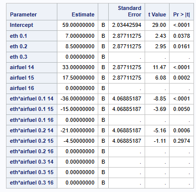
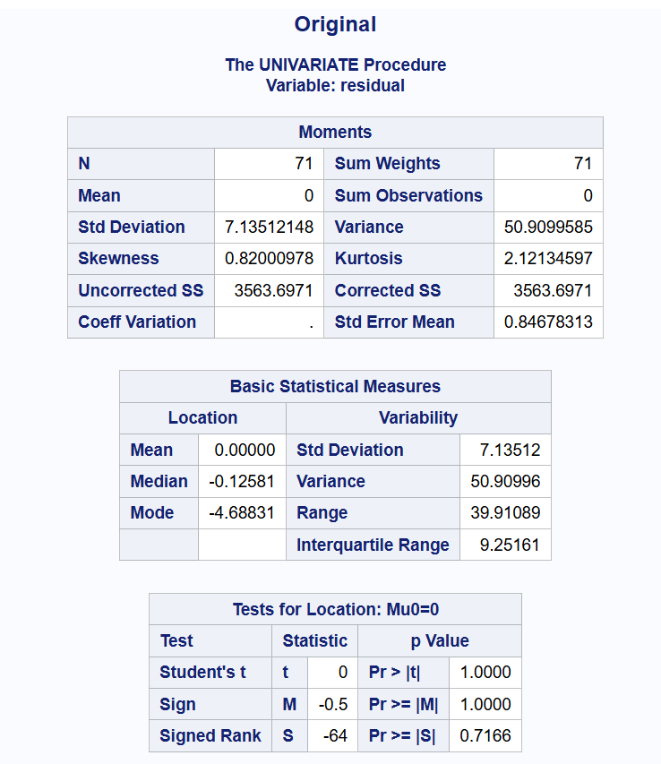
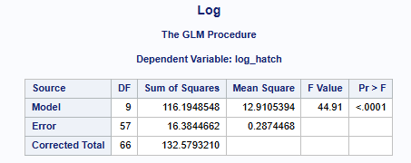
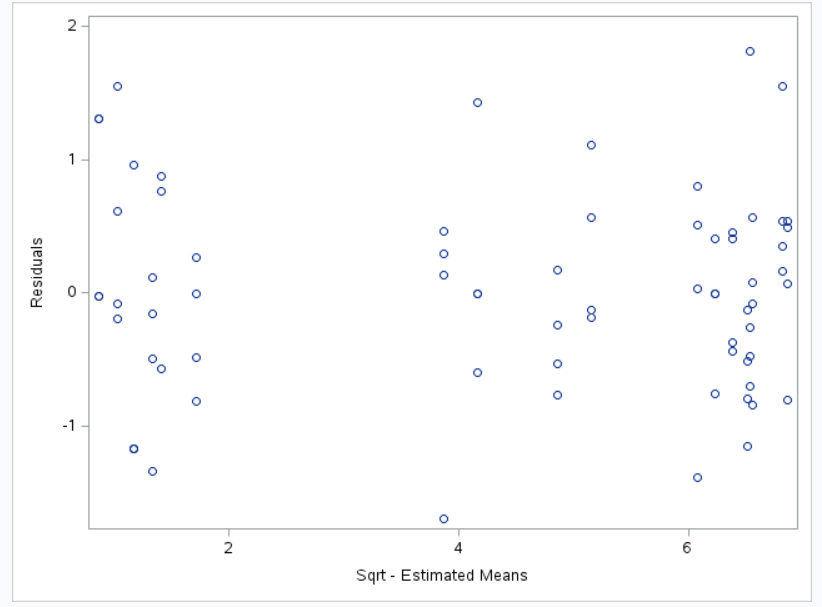
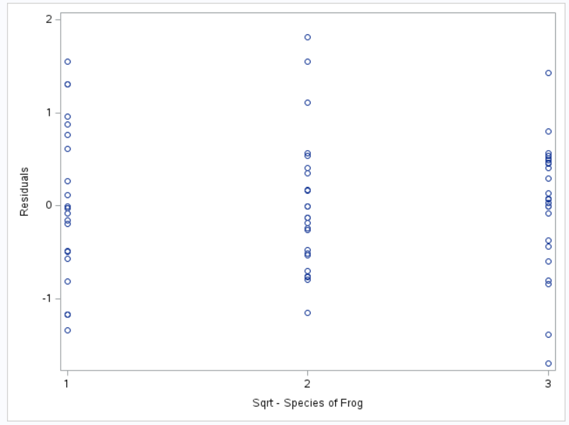
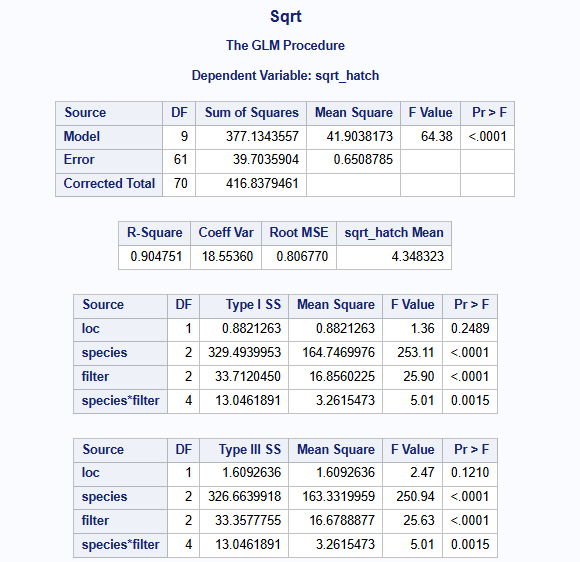

[Stat 5000]{.smallcaps}
[Homework #8]{.smallcaps}\
[Fall 2024]{.smallcaps} 
[due Fri, November 1st @ 11:59 pm]{.smallcaps}
[Name: Sam Olson]{.smallcaps} \
[Collaborators: Sarah, Sabrina, Ben, Andrew, **The Hatman**]{.smallcaps} \

# Q1 

A completely randomized two-factor experiment consisted of burning fuel with levels of two additives in a laboratory setting and determining the carbon monoxide (CO) emissions released. Eighteen batches of a standard fuel were available for this study. Two of the batches were randomly assigned to each of nine combinations of two additives corresponding to three levels of added ethanol (0.1, 0.2, or 0.3) and three air/fuel ratio settings (14, 15, or 16). Units for the ethanol levels were not reported. CO emission concentrations (g/meter3) were determined by burning the same amount of fuel from each of the 18 batches. The data are shown below and are located in the file emissions.txt.

```{r, echo=FALSE, fig.cap="CocoMelon", out.width = '100%'}

```

## (a) 

Construct the full ANOVA table. Which factors or interactions have significant effects on CO concentrations in emissions? Interpret the results in the context of the study.

```{r, echo=FALSE, fig.cap="CocoMelon", out.width = '100%'}
knitr::include_graphics("q1a.png")
```

```{r, echo=FALSE, fig.cap="CocoMelon", out.width = '100%'}

```

### Main effects Interpretation and Overall Model: 

For all factors and the associated interaction effects, we have evidence at the $\alpha = 0.05$ level to reject the null hypothesis, which is to say the Ethanol and Air/Fuel Ratio factors have significant effects on the mean CO emission concentrations (g/meter3), in addition to their interactions. The null hypotheses we have evidence to reject are: 

Ethanol: p-value of < 0.0001 we have evidence to reject $H_0$: The mean CO emission concentrations (g/meter3) of an Ethanol level is the same for all Ethanol levels, averaging across levels of Air/Fuel Ratios. 

Air/Fuel Ratio: p-value of 0.0002 we have evidence to reject $H_0$: The mean CO emission concentrations (g/meter3) of an Air/Fuel Ratio is the same for all Air/Fuel Ratio levels, averaging across levels of Ethanol. 

Interaction of Ethanol and Air/Fuel Ratio: p-value of 0.0002 we have evidence to reject $H_0$: The mean CO emission concentrations (g/meter3) of the interaction between a particular combination of levels of Ethanol and Air/Fuel Ratio are the same for all combination of levels of Ethanol and Air/Fuel Ratios.  

### Factor-Level Specific Interpretation: 

It appears that all treatment variables (ethanol levels and air/fuel ratios) in addition to their interaction effects are significant, meaning we have evidence to reject the null hypothesis that the mean CO emission concentrations (g/meter3) are equal for all treatment levels when averaged across all other factors/treatments, i.e. we have evidence to support the following alternative hypotheses: 1. At least one mean CO emission concentrations (g/meter3) for ethanol levels is different from the other mean CO emission concentrations (g/meter3) averaging across air/fuel ratio levels, 2. At least one mean CO emission concentrations (g/meter3) for air/fuel ratio is different from the other mean CO emission concentrations (g/meter3) for air/fuel ratios when averaging across ethanol levels, and 3. The mean CO emission concentrations (g/meter3) for the interaction between ethanol and air/fuel ratio is different from the mean CO emission concentrations (g/meter3) of some other combination of ethanol/air/fuel ratio.

When we then turn to individual comparisons, we have evidence to reject the null hypothesis at the $\alpha = 0.05$ level for:
  eth 0.1: $H_0$: the mean CO emission concentrations (g/meter3) for the ethanol 0.1 level is equal to the the mean CO emission concentrations (g/meter3) for the ethanol 0.3 level when averaging across levels of air/fuel ratio
  eth 0.2: $H_0$: the mean CO emission concentrations (g/meter3) for the ethanol 0.2 level is equal to the the mean CO emission concentrations (g/meter3) for the ethanol 0.3 level when averaging across levels of air/fuel ratio
  airfuel 14: $H_0$: the mean CO emission concentrations (g/meter3) for air/fuel ratio 14 is equal to the the mean CO emission concentrations (g/meter3) for the air/fuel ratio 16 when averaging across levels of ethanol ratio
  airfuel 15: $H_0$: the mean CO emission concentrations (g/meter3) for air/fuel ratio 15 is equal to the the mean CO emission concentrations (g/meter3) for the air/fuel ratio 16 when averaging across levels of ethanol ratio
  eth 0.1 * airfuel 14: $H_0$: the mean CO emission concentrations (g/meter3) for the interaction between ethanol level 0.1 and air/fueld ratio 14 is the same as the mean CO emission concentrations (g/meter3) for the other interactions (combinations of) the factors ethanol level and air/fuel ratio
  eth 0.1 * airfuel 15: $H_0$: the mean CO emission concentrations (g/meter3) for the interaction between ethanol level 0.1 and air/fueld ratio 15 is the same as the mean CO emission concentrations (g/meter3) for the other interactions (combinations of) the factors ethanol level and air/fuel ratio
  eth 0.2 * airfuel 14: $H_0$: the mean CO emission concentrations (g/meter3) for the interaction between ethanol level 0.2 and air/fueld ratio 14 is the same as the mean CO emission concentrations (g/meter3) for the other interactions (combinations of) the factors ethanol level and air/fuel ratio

So, in the context of the study we have evidence to support there being main effects of mean CO emission concentrations (g/meter3) for ethanol levels 0.1 and 0.2 different from ethanol level 0.3 when averaging across levels of air/fuel ratios, as well as evidence to support there being main effects of air/fuel ratio of mean CO emission concentrations (g/meter3) for air/fuel ratio 14 and 15 different from air/fuel ratio 16 when averaging across levels of ethanol. We also have evidence that some of the interactions involving the mean CO emission concentrations (g/meter3) for these factors and levels, specifically ethanol level 0.1, air/fueld ratio 14/15, and ethanol level 0.2 with air/fuel ratio 14, being different from the mean CO emission concentrations (g/meter3) for the other interactions of these two factors. 

\newpage

## (b) 

Partition the sum of squares for the ethanol effects, averaging across air/fuel ratio levels, into sums of squares for linear and quadratic components. The coefficients for these contrasts are (-1, 0, 1) and (-1, 2, -1). Is there a significant linear or quadratic effect in the model for the ethanol effects?

```{r, echo=FALSE, fig.cap="CocoMelon", out.width = '100%'}
knitr::include_graphics("q1b.png")
```

There are significant linear and quadratic effects in the model for ethanol effects, where significance is at the $\alpha = 0.05$ level and respective p-values of 0.0002 and 0.0070. 

The above interpretation: We have evidence to reject the null hypothesis at the $\alpha = 0.05$ level that: 
  Contrast 1: $H_0:$: The mean CO emission concentrations (g/meter3) for ethanol level 0.1 is the same as the mean CO emission concentrations (g/meter3) for ethanol level 0.3, averaging across levels of air/fuel ratio. 
  Contrast 1: $H_0:$: The mean CO emission concentrations (g/meter3) for ethanol level 0.2 is the same as the mean CO emission concentrations (g/meter3) of the mean of ethanol levels 0.1 and 0.3, averaging across levels of air/fuel ratio. 

\newpage

## (c) 

Partition the sum of squares for the air/fuel ratio effects, averaging across levels of ethanol, into sums of squares for linear and quadratic components. The coefficients for these contrasts are (-1, 0, 1) and (-1, 2, -1). Is there a significant linear or quadratic effect in the model for the air/fuel ratio effects?

```{r, echo=FALSE, fig.cap="CocoMelon", out.width = '100%'}
knitr::include_graphics("q1c.png")
```

There are also significant linear and quadratic effects in the model for the air/fuel ratio effects, where significance is at the $\alpha = 0.05$ level and respective p-values of <0.0001 and 0.0214.

The above interpretation: We have evidence to reject the null hypothesis at the $\alpha = 0.05$ level that: 
  Contrast 1: $H_0:$: The mean CO emission concentrations (g/meter3) for air/fuel ratio 14 is the same as the mean CO emission concentrations (g/meter3) for air/fuel ratio 16, averaging across levels of ethanol. 
  Contrast 1: $H_0:$: The mean CO emission concentrations (g/meter3) for air/fuel ratio 15 is the same as the mean CO emission concentrations (g/meter3) of the mean of air/fuel ratios 14 and 16, averaging across levels of ethanol. 

\newpage

## (d) 

Use Tukey’s HSD method to make pairwise comparisons of the marginal means for the three ethanol values. Summarize the results in the context of the study.

```{r, echo=FALSE, fig.cap="CocoMelon", out.width = '100%'}

```

For ethanol levels, we have evidence to reject the null hypothesis that the mean CO emission concentrations (g/meter3) for ethanol level 0.1 is the same as the mean CO emission concentrations (g/meter3) for ethanol level 0.2, when averaging across all air/fuel ratio levels. Similarly we have evidence to reject the null hypothesis that the mean CO emission concentrations (g/meter3) for ethanol level 0.1 is the same as the mean CO emission concentrations (g/meter3) for ethanol level 0.3, when averaging across all air/fuel ratio levels. The interpretations are based on meeting the significance threshold at the $\alpha = 0.05$ level. 

\newpage

## (e) 

Use Tukey’s HSD method to make pairwise comparisons of the marginal means for the air/fuel ratio values. Summarize the results in the context of the study.

```{r, echo=FALSE, fig.cap="CocoMelon", out.width = '100%'}
knitr::include_graphics("q1d2.png")
```

For air/fuel ratio values, we have evidence to reject the null hypothesis that the mean CO emission concentrations (g/meter3) for air/fuel ratio 14 are the same as the mean CO emission concentrations (g/meter3) for air/fuel ratio 16, when averaging across all ethanol levels. Similarly we have evidence to reject the null hypothesis that the mean CO emission concentrations (g/meter3) for air/fuel ratio15 are the same as the mean CO emission concentrations (g/meter3) for air/fuel ratio 16, when averaging across all ethanol levels. The interpretations are based on meeting the significance threshold at the $\alpha = 0.05$ level. 

\newpage

# Q2 

In a study of the effects of exposure to UV-B radiation on egg hatch rates for three species of frogs, eggs were collected from two different locations (Three Creek and Sparks Lake) and then subjected to UV-B radiation using three different kinds of filters. Thirty-six enclosures were constructed at each location. Within each location, four enclosures were randomly assigned to each of the 9 combination of the two factors: frog species (Hyla regilla, Rana cascade, and Bufo boreas) and type of radiation filters (none, UV-B transmitting, and UV-B blocking). One hundred and fifty eggs for the designated frog species were placed in each enclosure. The response is the percentage of eggs that failed to hatch in each enclosure. The data is posted in the frogeggs.txt file and displayed in the following tables:

```{r, echo=FALSE, fig.cap="CocoMelon", out.width = '100%'}
knitr::include_graphics("q2.png")
```

## (a) 

What is the treatment design and what is the experimental design in this study?

Treatment Design: We have 2 factors each with 3 levels, so it's a 3×3 factorial arrangement (3 distinct Species by 3 distinct Filter Types)

Experimental Design: Randomized Complete Block Design (RCBD) with location blocks taking two values (two locations, one Three Creek and the other Sparks Lake).

\newpage

## (b) 

Consider the model $Y_{ijkl} = \mu + \alpha_i + \tau_j + (\alpha \tau)_{ij} + \beta_k + \epsilon_{ijkl}$ where $\epsilon_{ijkl} \sim N(0, sigma^2)$ are random errors, $\beta_k \sim N(0, \sigma^2)$ are random block effects corresponding to locations, and any random error is independent of any random block effect. Imposing the baseline constraints $\alpha_3 = \tau_3 = (\alpha \tau )_{13} = (\alpha \tau )_{23} = (\alpha \tau )_{33} = (\alpha \tau )_{31} = (\alpha \tau )_{32} = 0$ then interpret the following
parameters in the context of the study:

Using the baseline constraints. 

### i. 

$\mu$

This is the average percentage of eggs that failed to hatch for frog species Bufo boreas (level 3) and UV-B blocking type filter averaged across all locations.

### ii. 

$\alpha_1$

This is the effect of the first level of factor 1 (frog species), representing the difference in the average percentage of failed hatches for Hyla regilla species relative to the baseline species, Bufo boreas with both groups having the UV-B blocking filter; this is said to be how much the average percentage of failed hatches for Hyla regilla changes from average percentage of failed hatches for the Bufo boreas species when averaging across locations (with both having the baseline level of the other factor, UV-B blocking filter type). 

### iii. 

$\tau_2$

This is the effect of the second level of factor 2 (type of UV-B filter), the UV-B transmitting filter. Specifically, this is how much the average percentage of failed hatches changes for enclosures with UV-B filter type compared to the average percentage of failed hatches for the baseline filter type (UV-B blocking filter) for the baseline frog species Bufo boreas, averaging across locations (and using the baseline level of the other factor, filter type).

### iv. 

$(\alpha \tau)_{12}$

This parameter represents the interaction effect between the frog species Hyla regilla and the UV-B transmitting filter. Specifically this denotes how the average percentage of failed hatches changes when we have the combination of Hyla regilla and the UV-B transmitting filter, i.e. the added effect on average percentage of failed hatches from the interaction between the frog species Hyla regilla and the UV-B transmitting filter, the interaction effect separate from the main effect of the two levels of the factor, and averaged across locations. 

### v. 

$\mu + \alpha_1 + \tau_2 + (\alpha \tau)_{12}$

The estimated average percentage of failed hatches for Hyla regilla frog species and (level 1 of factor 1) and the UV-B transmitting filter (level 2 of factor 2), including their interaction effect, when averaging over location. This would correspond to the cell mean (average percentage of failed hatches) for the treatment combination of Hyla regilla (level 1 of factor 1) and the UV-B transmitting filter (level 2 of factor 2), averaging across locations. 

### vi. 

$(\alpha \tau)_{12} - (\alpha \tau )_{32} - (\alpha \tau )_{13} + (\alpha \tau )_{33}$

$(\alpha \tau)_{12}$: The interaction effect of the first filter type (None) with the second frog species (Rana cascade).
$(\alpha \tau )_{32}$: The interaction effect of the third filter type (UV-B Blocking) with the second frog species (Rana cascade).
$(\alpha \tau )_{13}$: The interaction effect of the first filter type (None) with the third frog species (Bufo boreas).
$(\alpha \tau )_{33}$: The interaction effect of the third filter type (UV-B Blocking) with the third frog species (Bufo boreas).

The above is the the difference in interaction effects on the response variable, average percentage of failed hatches. Specifically: 

How much the average percentage of failed hatches for Hyla regilla with the UV-B transmitting filter plus the average percentage of failed hatches for the interaction effect of the third filter type (UV-B Blocking) with the third frog species (Bufo boreas) differs from the average percentage of failed hatches for the interaction effect of the third filter type (UV-B Blocking) with the second frog species (Rana cascade) with the average percentage of failed hatches for the interaction effect of the first filter type (None) with the third frog species (Bufo boreas), all of which are being averaged across locations.

This may also be interpreted as a particular contrast, for the specific interactions noted above. For the additivity assumption (no interactions that are different on average from one another), we assume this is equal to 0. 

\newpage

## (c) 

Examine the equal variance assumption. Summarize your findings and include supporting tables and/or figures.

```{r, echo=FALSE, fig.cap="CocoMelon", out.width = '100%'}


```

For this assumption we review three residual plots: By fitted values (estimated means), by levels of Factor 1 (Type of Filter), and by levels of Factor 2 (Frog Species). We are generally looking for a trend in these plots as evidence that our equal variances assumption is being violated. There is some evidence that our equal variances assumption may be violated in this experiment, as there is a somewhat noticeable increase in the spread of residuals as the fitted values grow larger. Though it is worth noting that this visual trend is slight, such that I am not overwhelmingly concerned about our key assumptions related to the residual plot (mean zero constant variance) being violated. Furthermore, the other two residual plots (residuals by factor frog species or by factor filter type) do not exhibit such a problematic trend, and appear to be both randomly spread across their values as well as having constant variance (similar spread) across the values. 

Additionally, across all of the three residual plots, the points appear to be randomly spread, such that we have some visual evidence to support the notion that our additivity assumption is not being violated. 

\newpage

## (d) 

Examine the normality assumption. Summarize your findings and include supporting tables and/or figures

```{r, echo=FALSE, fig.cap="CocoMelon", out.width = '100%'}




```

To assess this assumption we look at: 
  Residual Summary statistics: Unfortunately, we see that Mean of Residuals $\neq$ Median of Residuals, which leads up to start believing there's evidence the normality assumption is violated. 
  Shapiro Wilk statistical test: small p-value (0.0120) such that we have evidence to reject the null hypothesis of normally distributed residuals at the $\alpha = 0.05$ level
  Histogram of residuals: We observe residuals do exhibit a slight bell-shaped distribution but there is visually some evidence of non-normality in skewnewss
  Residual boxplot: Similar to the Histogram noted, the boxplot looks roughly normal, though there is not a symmetrical spread of residuals about the center in addition to mean residuals neq median residuals
  QQ Plot: The residuals roughly align with the reference line, though there are deviations, particularly about the center (0 Normal Quartile), as well as some deviations near the tails

Overall, we have some visual and statistical test-based evidence to believe our residuals are not normally distributed, particularly with the histogram and QQ plot and having evidence to reject the null hypothesis of the Shapiro-Wilk test. We may certainly improve the normality of our residuals, which we will do in the later parts of the problem.  

\newpage

## (e) 

Suppose that the diagnostics suggest the need for a transformation. Find which transformation of the responses is better, square root transformation, log transformation, or none? Summarize your findings and include supporting tables and/or figures.

For assessing the equal variances assumption, and to more broadly compare/contrast the two additional transformations being considered, the following are used: 

```{r, echo=FALSE, fig.cap="CocoMelon", out.width = '100%'}



```

When comparing F statistics, an assessment of the overall model, we appear to maximize the observed F statistic when we utilize the square root transformation. What's more: 

```{r, echo=FALSE, fig.cap="CocoMelon", out.width = '100%'}







```

From the assorted graphs/plots above, we observe the pattern of residuals for the different transformations when plotted against the 1. Fitted Values, 2. Different Levels of Factor 1 - Filter Types, and 3. Different Levels of Factor 2 - Frog Species. From the above, the transformation that most consistently creates a random spread of residuals is the Square Root transformation. Such that the above plots provide evidence in support of utilizing the square root transformation, as it most closely aligns with data that does not violate our assumnption of both equal variance (constant variance with mean 0 for the residuals), as well as for the assumption of additivity used in our model. We then turn to normality of residuals. 

Primarily compare the different transformations for the assumption of normality, the broad categories of "Visual" and "Statistical" Assessments are used. Graphs and plots are given below for these two categories. 

### Visual Assessment

```{r, echo=FALSE, fig.cap="CocoMelon", out.width = '100%'}


```

Visually, the log transformation of residuals produces the most relatively normal looking histogram, in which we're looking for a histogram with symmetry near the center (lack of skewness). By comparison, the original and sqrt transformed residuals still have some skewness in the histogram, whereas the log transformed residuals appear to minimize this spread.  

### Statistical Tests

```{r, echo=FALSE, fig.cap="CocoMelon", out.width = '100%'}


```

```{r, echo=FALSE, fig.cap="CocoMelon", out.width = '100%'}


```

Via statistical tests, particularly the Shapiro-Wilk test, we are testing whether the residuals (original, sqrt, or log transformed) are not normally distributed; we reject the null hypothesis at the $\alpha = 0.05$ level for the original and log-transformed residuals, but we do not reject the null hypothesis at the same level for the sqrt-transformed residuals. This is evidence in favor of the original and log transformed residuals not being normally distributed, and evidence in favor of the sqrt-transformed residuals being normally distributed. 

So, despite visual inspections of the barplots and QQ plots being relatively consistent, the statistical tests provide more varied interpretations, insomuch as to provide evidence that the sqrt-transformation specifically appears to best normalize the residuals.

Taken together, we overall decide to move forward with the square root transformation, as it provides the most solid evidence that none of our key assumptions for our model are being violated, from the equal variances assumption, to the additivity assumption, as well as our normality assumption. 

\newpage

## (f) 

For the best model specified in part (e), find the full ANOVA table. Summarize which factors and interactions are significant. Is there any evidence that the types of filter have different effects on egg hatch success? Explain.

```{r, echo=FALSE, fig.cap="CocoMelon", out.width = '100%'}

```

```{r, echo=FALSE, fig.cap="CocoMelon", out.width = '100%'}

```

Response Variable: the average percentage of failed hatches

### Main Effects Interpretation: 

For all factors and the associated interaction effects, we have evidence at the $\alpha = 0.05$ level to reject the null hypothesis, which is to say the factors Filter Type and Frog Species have significant effects on average sqrt percentage of failed hatches, in addition to their interactions. The null hypotheses we have evidence to reject are: 

Filter Type: p-value of < 0.0001 we have evidence to reject $H_0$: The average sqrt percentage of failed hatches are the same for all Filter Types, averaging across levels of frog species and locations. 

Frog Species: p-value of < 0.0001 we have evidence to reject $H_0$: The average sqrt percentage of failed hatches are the same for all Frog Species, averaging across levels of filter types and locations. 

Interaction of Frog Species and Filter Type: p-value of 0.0015 we have evidence to reject $H_0$: The average sqrt percentage of failed hatches of the interaction between a particular combination of Frog Species and Filter Type are the same for all combinations of levels of Frog Species and Filter Type, averaged across locations.  

### Factor-Level Specific Interpretation: 

Despite having a small p-value for location blocks, corresponding to rejecting the null hypothesis at the $\alpha = 0.05$ level for the average sqrt percentage of failed hatches for location 1 being the same as the the average sqrt  percentage of failed hatches for location 2, because this is a block, when averaging across both filter and species factors, we will not draw any further conclusions for this particular parameter in the model. That being said: 

The following parameters are all statistically significant at the $\alpha = 0.05$ level such that we reject their respective null hypotheses: 

  species 1: $H_{0}$: the average sqrt  percentage of failed hatches for frog species 1 is the same as the average sqrt  percentage of failed hatches for frog species 3, when averaged across locations and filter types
  species 2: $H_{0}$: the average sqrt  percentage of failed hatches for frog species 2 is the same as the average sqrt  percentage of failed hatches for frog species 3, when averaged across locations and filter types
  filter 1: $H_{0}$: the average sqrt  percentage of failed hatches for filter type 1 is the same as the average sqrt  percentage of failed hatches for filter type 3, when averaged across locations and frog species
  filter 2: $H_{0}$: the average sqrt  percentage of failed hatches for filter type 1 is the same as the average sqrt  percentage of failed hatches for filter type 2, when averaged across locations and frog species
  species 1, filter 1: $H_{0}$: the average sqrt  percentage of failed hatches for the interaction between frog species 1 and filter type 1 is the same as the average sqrt  percentage of failed hatches for the interaction between other combinations of frog species and filter types
  species 1, filter 2: $H_{0}$: the average sqrt  percentage of failed hatches for the interaction between frog species 1 and filter type 2 is the same as the average sqrt  percentage of failed hatches for the interaction between other combinations of frog species and filter types
  species 2, filter 1: $H_{0}$: the average sqrt  percentage of failed hatches for the interaction between frog species 2 and filter type 1 is the same as the average sqrt  percentage of failed hatches for the interaction between other combinations of frog species and filter types
  
Given the above significant factors, for the question, "Is there any evidence that the types of filter have different effects on egg hatch success?", we have evidence to suggest that types of filter do have different effects on egg hatch success, specifically with regards to the average sqrt  percentage of failed hatches for filter type 1 being different from the the average sqrt  percentage of failed hatches for filter type 3 as well as for comparing the the average sqrt  percentage of failed hatches for filter type 2 when compared to the the average sqrt  percentage of failed hatches of filter type 3, when averaging across location and frog species. This specifically is comparing filter types None vs. UV-B Blocking as well as UB-B Transmitting vs. UB-V Blocking. So while the above does not directly compare None vs. UV-B Transmitting, we do have evidence for the pairwise comparisons noted previously being statistically different from one another with regards to the average sqrt  percentage of failed hatches (when accounting for levels of the blocks, location, and other factor levels, frog species). 

In addition, we observe filter has both main effects, like those specified above, as well as interaction effects, as noted in the interaction effects interpretations above found to be statistically significant. 

\newpage

## (g) 

For the best model specified in part (e): Examine a profile plot of the treatment means (do not hand it in), plotting the sample mean responses for the combinations of filters and frog species, averaging across locations. 

What does this plot suggest? Are your conclusions about interactions between types of filters and frog species supported by results in the ANOVA table?

From the profile plot of treatment means, we can interpret the effects of different filter types on the average sqrt percentage of hatch failure across frog species.

Species 1 consistently shows very low levels of hatch failure across all filter types, which suggests that Species 1 on average sqrt is relatively unaffected by changes in filter type and has overall lower average sqrt hatch failure rate. Species 2 shows a moderate level of average sqrt hatch failure rate with Filter 1 but has a sharp decrease in hatch failure as the filter types change (from 1 to 2 to 3). This may suggest that Species 2 is sensitive to the type of filter, and since filter "1" is "None", it may be more sensitive (benefit from) using some type of filter, particularly where more UV-B is blocked. Species 3 starts with a high average sqrt hatch failure rate under Filter 1, similar to Species 2, in addition to having average sqrt hatch failure rates decrease significantly as the filter moves from type 1 to type 3, indicating that this species also benefits from increased UV-B protection and filter effects.

For interactions: The interactions are also consistent and clear with those detailed previously, in that Species 1 is largely unaffected by filter type (rather flag line), while Species 2 and Species 3 have more variability, improving for successive filter types (None to using some type of filter). 

Taken together, the above interpretations given in this problem are consistent with the interpretations given in part (f), where we observe interactions between species and filter types (particularly for combinations of Species 1 and 2 with Filters 1 and 2), as well as relevant individual effects for Species 1 and 2 and Filters 1 and 2 were significant.

\newpage

# Q3 

The data shown in the table below are results from a study of amylace activity of malted wheat flour (Geddes, et al. 1941, Cereal Chem 18, 42-60.). Five factors, each at two levels, were examined:

Factor s: type/species of wheat
  Amber durum (1)
  hard red spring (2)

Factor p: wheat protein content
  low (1)
  high (2)

Factor m: wheat moisture content
  40 percent (1)
  44 percent (2)

Factor g: germination time
  3 days (1)
  5 days (2)

Factor k: kiln temperature rising 
  100F to 130F (1)
  constant at 100F (2)

Response: Amylace is a protein that helps you break down carbohydrates and starches into sugar, releasing carbon dioxide (CO2) in the process. Amylase activity was measured by the amount of malt from each flour that was required to produce 204.7ml of CO2. Measured amylase activity is reported in the data table in units of Y = [0.6 + log(amount of malt)] × 103

```{r, echo=FALSE, fig.cap="CocoMelon", out.width = '100%'}
knitr::include_graphics("q3.png")
```

## (a) 

The normal probability plot and table of estimates on the next page shows the values of main effects and interaction contrasts, for which the estimate of every contrast has the same variance. This information is used to determine which effects should be included in the analysis and which should be used to estimate the variance. Which effects appear to be large?

```{r, echo=FALSE, fig.cap="CocoMelon", out.width = '100%'}
knitr::include_graphics("q3a1.png")
```

```{r, echo=FALSE, fig.cap="CocoMelon", out.width = '100%'}
knitr::include_graphics("q3a2.png")
```

We are interested in the overall magnitude of the estimates of effects, specifically how far from zero they are. In the negative range, g, m, sg, pm, and p are all in magnitude greater than 15, while on the positive range only pg and sm have a magnitude greater than 15. If we were to include estimated effects greater in magnitude than 10, we'd also want to include spm, sp, and gk in addition to those listed previously. 

\newpage

## (b) 

Using least squares estimation to fit the model that includes all main effects and all interaction effects that were identified as “non-zero” by the analysis in part (a), (including all main effects in this model, regardless of whether the plot suggests they are significant or not, then the sum of sums of squares for the interaction contrasts that are not included in the model can be pooled to obtain a MSerror), the corresponding ANOVA table is provided below.

```{r, echo=FALSE, fig.cap="CocoMelon", out.width = '100%'}

```

Examine the results of F-tests for terms kept in the model and summarize the results in the context of the study. 

By Parameter: 
average amylase activity

1. Species (p-value = 0.3684): We do not have evidence to reject the null hypothesis at the $\alpha = 0.05$ level that average amylase activity for wheat species are the same, when all other factors are held constant. 

2. Protein (p-value = 0.0026): We have evidence to reject the null hypothesis at the $\alpha = 0.05$ level that average amylase activity for wheat protein content are the same, when all other factors are held constant, such that we have evidence in support of the alternative hypothesis that average amylase activity for wheat protein content are different, when all other factors are held constant. 

3. Moisture (p-value < 0.0001): We have evidence to reject the null hypothesis at the $\alpha = 0.05$ level that average amylase activity for wheat moisture content are the same, when all other factors are held constant, such that we have evidence in support of the alternative hypothesis that average amylase activity for wheat moisture content are different, when all other factors are held constant. 

4. Germination (p-value < 0.0001): We have evidence to reject the null hypothesis at the $\alpha = 0.05$ level that average amylase activity for germination time are the same, when all other factors are held constant, such that we have evidence in support of the alternative hypothesis that average amylase activity for germination time are different, when all other factors are held constant. 

5. Kiln Temperature (p-value < 0.0001): We have evidence to reject the null hypothesis at the $\alpha = 0.05$ level that average amylase activity for kiln temperature rising are the same, when all other factors are held constant, such that we have evidence in support of the alternative hypothesis that average amylase activity for kiln temperature rising are different, when all other factors are held constant. 

### Interactions

6. Species-Germination (p-value < 0.0001): We have evidence to reject the null hypothesis at the $\alpha = 0.05$ level that average amylase activity for the interactions between species and germination are the same, when all other factors are held constant, such that we have evidence in support of the alternative hypothesis that average amylase activity for the interactions between species and germination are different, when all other factors are held constant. 
  
7. Protein-Germination (p-value = 0.0002): We have evidence to reject the null hypothesis at the $\alpha = 0.05$ level that average amylase activity for the interactions between protein and germination are the same, when all other factors are held constant, such that we have evidence in support of the alternative hypothesis that average amylase activity for the interactions between protein and germination are different, when all other factors are held constant. 

8. Germination-Kiln Temperature (p-value < 0.0001): We have evidence to reject the null hypothesis at the $\alpha = 0.05$ level that average amylase activity for the interactions between kiln temperature and germination are the same, when all other factors are held constant, such that we have evidence in support of the alternative hypothesis that average amylase activity for the interactions between kiln temperature and germination are different, when all other factors are held constant. 

9. Species-Protein (p-value = 0.0008): We have evidence to reject the null hypothesis at the $\alpha = 0.05$ level that average amylase activity for the interactions between species and protein content are the same, when all other factors are held constant, such that we have evidence in support of the alternative hypothesis that average amylase activity for the interactions between species and protein content are different, when all other factors are held constant.

10. Protein-Moisture (p-value = 0.0003): We have evidence to reject the null hypothesis at the $\alpha = 0.05$ level that average amylase activity for the interactions between protein content and moisture are the same, when all other factors are held constant, such that we have evidence in support of the alternative hypothesis that average amylase activity for the interactions between protein content and moisture are different, when all other factors are held constant.

11. Species-Moisture (p-value = 0.0031): We have evidence to reject the null hypothesis at the $\alpha = 0.05$ level that average amylase activity for the interactions between species and moisture are the same, when all other factors are held constant, such that we have evidence in support of the alternative hypothesis that average amylase activity for the interactions between species and moisture are different, when all other factors are held constant.

12. Species-Protein-Moisture (p-value = 0.0035): We have evidence to reject the null hypothesis at the $\alpha = 0.05$ level that average amylase activity for the interactions between species, protein content, and moisture are the same, when all other factors are held constant, such that we have evidence in support of the alternative hypothesis that average amylase activity for the interactions between species, protein content, and moisture are different, when all other factors are held constant.

Overall, there are a number of statistically significant effects we observe in the above model, including individual effects as well 

\newpage

## (c) 

Choose any significant two-way interaction for the model in part (b) and interpret it in the context of the study. Also interpret the significant three-way interaction for the model in part (b).

1. Species-Germination (p-value < 0.0001): We have evidence to reject the null hypothesis at the $\alpha = 0.05$ level that average amylase activity for the interactions between species and germination are the same, when all other factors are held constant, such that we have evidence in support of the alternative hypothesis that average amylase activity for the interactions between species and germination are different, when all other factors are held constant. 

2. Species-Protein-Moisture (p-value = 0.0035): We have evidence to reject the null hypothesis at the $\alpha = 0.05$ level that average amylase activity for the interactions between species, protein content, and moisture are the same, when all other factors are held constant, such that we have evidence in support of the alternative hypothesis that average amylase activity for the interactions between species, protein content, and moisture are different, when all other factors are held constant.

\newpage

## (d) 

Comment on the normal probability plot of the residuals for the model in part (b), shown below.

```{r, echo=FALSE, fig.cap="CocoMelon", out.width = '100%'}
knitr::include_graphics("q3d.png")
```

The above normal probability plot (QQ Plot) of the residuals for the model in part (b) has residual points which appear to closely follow the reference line, such that we have reason to believe the residuals are normally distributed and that our assumption of normally distributed residuals is likely not being violated.

We do not observe especially extreme deviations from the reference line, although we do observe a number of slight deviations from the reference line. As we have reason to believe the normality assumption of residuals is not being violated, then we have further support for the the validity of the F-tests used in the model and for the interpretations from prior parts of this problem. 

\newpage

## (e) 

Comment on the plot of the residuals versus the estimated mean yields for the model in part (b), shown below.

```{r, echo=FALSE, fig.cap="CocoMelon", out.width = '100%'}
knitr::include_graphics("q3e.png")
```

The above residual plot against the estimated means (fitted values, I believe) appear randomly spread, i.e. we do not readily identify a particular trend in this data. This is good news, as this is what we would expect if our assumption of additivity holds and is evidence in favor of this particular assumption not being violated. 

\newpage

## (f) 

Interpret the value of each of the estimated effects of the five factors on amylase activity, shown below. Keep in mind that low values of the response variable correspond to combinations of factors that produce 204.7 ml of CO2 with the least amount of malt.

```{r, echo=FALSE, fig.cap="CocoMelon", out.width = '100%'}
knitr::include_graphics("q3f.png")
```

Based on the table of estimated effects, here is an interpretation of each factor’s effect on amylase activity, keeping in mind that lower values of the response variable (amylase activity) indicate a more efficient process (requiring less malt to produce 204.7 ml of CO2):

average amylase activity
lower is more efficient process

Given the announcement in Canvas, the number of parameters being interpreted is culled down to two--one positive and one negative parameter. 

1. Species 1 (p-value < 0.0001): We have evidence at the $\alpha = 0.05$ level to reject the null hypothesis that average amylase activity for hard red spring species compared to average amylase activity for Amber durum species is the same, which is to say we have evidence in support of the alternative hypothesis that average amylase activity for hard red spring species compared to average amylase activity for Amber durum species is different. Based on the estimate provided above, we have evidence to support the claim that average amylase activity from a hard red spring species is greater than average amylase activity from a Amber durum species, holding all other factors constant. This is to say we have evidence that changing from a hard red spring species to a Amber durum species will contribute to the process being less efficient in terms of malt usage for CO2 production (estimated average amylase activity would increase by 116.06 units units).

The above interpretation holds when all factors aside from Species are held constant, i.e. we only change the species. 

2. Kiln Temperature 1 (p-value = 0.2348): We do not have evidence at the $\alpha = 0.05$ level to reject the null hypothesis that average amylase activity for kiln temperature of 100F compared to average amylase activity for kiln temperature of 100F to 130F is the same, despite the estimated effect of the 100F kiln temperature (temperature of kiln staying constant at 100F) improving the efficiency of the malt usage for C02 production (estimated a not statistically significant 16.13 units decrease). 

Despite being not a statistically significant finding, i.e. we do not reject the null hypothesis that the estimated effect of kiln temperature at 100F constant on average amylase activity is the same as average amylase activity when changing kiln temperature to to 130F, it is nonetheless an estimated effect of decreasing the response variable which corresponds to an increased efficiency for the desired CO2 level (when all other factors are held constant).
