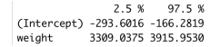

[Stat 5000]{.smallcaps}
[Homework #9]{.smallcaps}\
[Fall 2024]{.smallcaps} 
[due Fri, November 15th @ 11:59 pm]{.smallcaps}
[Name: Sam Olson]{.smallcaps} \
[Collaborators: **The Hatman**]{.smallcaps} \

# Q1 

Suppose that six observations of the yield (Y ) of a chemical process were taken at each of four temperature levels (X) for running the process, but you are only given information on the sample means and standard deviations for the observed yields at each temperature. The summary data are

| Temperature (°C) | Sample Mean | Sample Variance | Sample Size |
|------------------|-------------|-----------------|-------------|
| 150              | 66          | 1.15            | 6           |
| 200              | 81          | 1.00            | 6           |
| 250              | 89          | 1.35            | 6           |
| 300              | 92          | 0.90            | 6           |

## (a) 

Use this information to compute the least squares estimates of \( \beta_0 \) and \( \beta_1 \) for the simple linear regression model:

$$
Y_{ij} = \beta_0 + \beta_1 x_i + \epsilon_{ij}
$$

Report values for the estimated coefficients (\( b_0 \) and \( b_1 \)) and their standard errors (\( S_{b_0} \) and \( S_{b_1} \)).

## (b) 

Complete the following ANOVA table:

| Source of Variation | Degrees of Freedom | Sum of Squares | Mean Square |
|---------------------|--------------------|----------------|-------------|
| Regression on X     |                    |                |             |
| Residuals           |                    |                |             |
| - Lack-of-fit       |                    |                |             |
| - Pure error        |                    |                |             |
| Total               |                    |                |             |

## (c) 

Compute the F-statistic for the lack-of-fit test and report the corresponding degrees freedom. Suppose the p-value is 0.0001, then interpret this result in the context of the study

\newpage

# Q2 

The Berkeley Guidance Study enrolled children born in Berkeley, California, between
January 1928 and June 1929, and then measure each child periodically until age 18. The data
for all of the girls in the study who were measured at age 18 are posted in the file BGSgirls.dat
in our course’s shared folder on SAS Studio. There is one line for each girl in this data file,
with the subject identification number, weight (in kilograms), and height (in centimeters), in
that order from left to right

## 

(a) Compute least square estimates of the intercept (\( \beta_0 \)) and slope (\( \beta_1 \)) of a simple linear regression model for predicting weight (\( Y \)) from height (\( x \)). Report the parameter estimates and their standard errors. Is height a significant predictor of weight (yes or no)? Briefly justify your choice.

## (b) 

Plot weight versus height and insert the estimated regression line on the plot, and include the plot in your submission. What does this plot suggest?

## (c) 

Construct a plot of the studentized residuals versus \( \hat{Y}_i \), where \( \hat{Y}_i = b_0 + b_1 x_i \), and include the plot in your submission. What does this plot indicate?

## (d) 

The diagnostic plots should indicate that there is one 18 year-old girl who is extremely heavy given her height. This observation may involve a value for either height or weight that was not properly recorded, or it may just correspond to an unusually heavy girl. You can delete this observation by replacing the value of the weight with a period. Because this is the only girl with weight exceeding 90 kg, you can delete this case in a data step by inserting the code:

`if(weight > 90) then weight=. ;`

Or you can use only the subset of data by

`where weight le 90;`

Re-fit the simple linear regression model. Do the diagnostic plots now appear to show that the data conform to the assumptions of the proposed regression model? If not, what problems remain? Include all relevant plots in your submission.

## (e) 

Plot the estimated regression lines with the extreme observation included and the extreme observation removed on the same plot. Include the plot in your submission. Did deleting the observation in part (d) have a large effect on any of the parameter estimates? Briefly justify your response.

\newpage

# Q3 

One factor that may explain the price of a diamond is the weight of the diamond.
Data were collected for a sample of 48 diamonds, including the weight in grams (g) and the
price (in Singapore dollars) of each diamond. These data are located in the file diamonds.csv
posted in Canvas. The R code that generated the output below is included in Canvas in the
diamonds Hmwk9.R file for your reference.

## (a) 

Write the simple linear regression model for this problem (including assumptions). Give the definition of the parameter values \( \beta_0 \), \( \beta_1 \), and \( \sigma^2 \) in the context of the response and explanatory variables.

## (b) 

Write the simple linear regression model for this problem in vector-matrix notation. Give the first 4 rows of the design matrix \( \mathbf{X} \).

## (c) 

Describe the scatterplot, shown below, of the weight and price of the 48 diamonds in this sample. What do you notice about the relationship between these two values?

```{r, echo=FALSE, fig.cap="CocoMelon", out.width = '100%'}

```

## (d) 

The output below includes the sample correlation coefficient between the weight and price of the diamonds. How does the value of the correlation reinforce your description from part (c).

```{r, echo=FALSE, fig.cap="CocoMelon", out.width = '100%'}

```

## (e) 

Using the output shown below, give the equation for the least squares regression line to predict the price of a diamond from its weight.

```{r, echo=FALSE, fig.cap="CocoMelon", out.width = '100%'}
knitr::include_graphics("3e.png")
```

## (f) 

Use the ANOVA Table shown below to conduct a test of significance for the linear regression model

```{r, echo=FALSE, fig.cap="CocoMelon", out.width = '100%'}
knitr::include_graphics("3f.png")
```

## (g) 

A 95% confidence interval for the slope parameter in the simple linear regression model is shown below. Give an interpretation of this interval.

```{r, echo=FALSE, fig.cap="CocoMelon", out.width = '100%'}

```

## (h) 

A 95% confidence interval for the conditional mean price of all diamonds in the population with a weight of 0.2 grams is shown below. Give the interpretation of this interval.

```{r, echo=FALSE, fig.cap="CocoMelon", out.width = '100%'}
knitr::include_graphics("3h.png")
```

## (i) 

A 95% prediction interval for the price of a diamond in the population with a weight of 0.3 grams is shown below. Give the interpretation of this interval.

```{r, echo=FALSE, fig.cap="CocoMelon", out.width = '100%'}

```

## (j)  

Examine the residual plots shown below. Is there any reason to suspect the model assumptions do not hold or that there are influence points?

```{r, echo=FALSE, fig.cap="CocoMelon", out.width = '100%'}
knitr::include_graphics("3j.png")
```