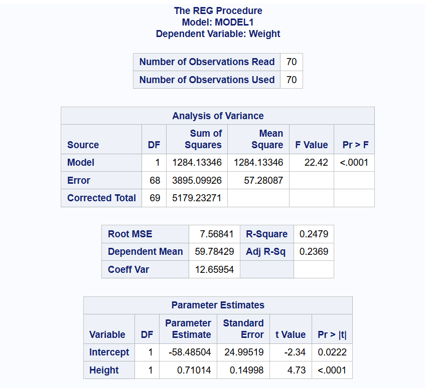
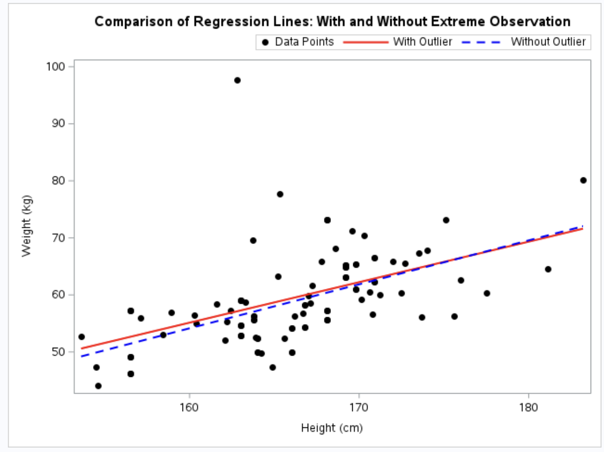

[Stat 5000]{.smallcaps}
[Homework #9]{.smallcaps}\
[Fall 2024]{.smallcaps} 
[due Fri, November 15th @ 11:59 pm]{.smallcaps}
[Name: Sam Olson]{.smallcaps} \
[Collaborators: Craig, **The Hatman**]{.smallcaps} \

# Q1 

Suppose that six observations of the yield (Y ) of a chemical process were taken at each of four temperature levels (X) for running the process, but you are only given information on the sample means and standard deviations for the observed yields at each temperature. The summary data are

| Temperature (°C) | Sample Mean | Sample Variance | Sample Size |
|------------------|-------------|-----------------|-------------|
| 150              | 66          | 1.15            | 6           |
| 200              | 81          | 1.00            | 6           |
| 250              | 89          | 1.35            | 6           |
| 300              | 92          | 0.90            | 6           |

## (a) 

Use this information to compute the least squares estimates of \( \beta_0 \) and \( \beta_1 \) for the simple linear regression model:

$$
Y_{i} = \beta_0 + \beta_1 x_i + \epsilon_{i}
$$

Report values for the estimated coefficients (\( b_0 \) and \( b_1 \)) and their standard errors (\( S_{b_0} \) and \( S_{b_1} \)).

```{r}
temperature <- c(150, 200, 250, 300)
sample_mean <- c(66, 81, 89, 92)
sample_variance <- c(1.15, 1.00, 1.35, 0.90)
sample_size <- c(6, 6, 6, 6)

weights <- sample_size / sample_variance

# Weighted means
weighted_mean_x <- sum(weights * temperature) / sum(weights)
weighted_mean_y <- sum(weights * sample_mean) / sum(weights)

# Weighted SS
SS_xy <- sum(weights * (temperature - weighted_mean_x) * (sample_mean - weighted_mean_y))
SS_xx <- sum(weights * (temperature - weighted_mean_x)^2)

b1 <- SS_xy / SS_xx
b0 <- weighted_mean_y - b1 * weighted_mean_x

# SE
s_squared <- sum(weights * (sample_mean - b0 - b1 * temperature)^2) / (sum(weights) - 2)
Sb1 <- sqrt(s_squared / SS_xx)
Sb0 <- sqrt(s_squared * (1 / sum(weights) + weighted_mean_x^2 / SS_xx))

list(
  "Estimated b0" = b0,
  "Estimated b1" = b1,
  "SE b0" = Sb0,
  "SE b1" = Sb1
)
```

## (b) 

Complete the following ANOVA table:

| Source of Variation | Degrees of Freedom | Sum of Squares | Mean Square |
|---------------------|--------------------|----------------|-------------|
| Regression on X     | 1                  | 2022.0969      | 2022.096857 |
| Residuals           | 22                 | 200.9148       | 9.132492    |
| - Lack-of-fit       | 2                  | 178.9148       | 89.457413   |
| - Pure error        | 20                 | 22.0000        | 1.100000    |
| Total               | 23                 | 2223.0117      | NA          |


```{r}
sample_size <- c(6, 6, 6, 6)
sample_mean <- c(66, 81, 89, 92)
sample_variance <- c(1.15, 1.00, 1.35, 0.90)
N <- sum(sample_size)
r <- length(sample_size)

# Weighted mean 
weights <- sample_size / sample_variance
overall_weighted_mean <- sum(weights * sample_mean) / sum(weights)

# SS
SST <- sum(weights * (sample_mean - overall_weighted_mean)^2)

SSR <- b1 * SS_xy
SSE <- SST - SSR
SSPE <- sum((sample_size - 1) * sample_variance)
SSLF <- SSE - SSPE

# DF
df_total <- N - 1
df_regression <- 1
df_residual <- N - 2
df_lack_of_fit <- r - 2
df_pure_error <- N - r

# MSEs
MSR <- SSR / df_regression
MSE <- SSE / df_residual
MSLF <- SSLF / df_lack_of_fit
MSPE <- SSPE / df_pure_error

# Table
anova_table <- data.frame(
  "Source of Variation" = c("Regression on X", "Residuals", "  - Lack-of-fit", "  - Pure error", "Total"),
  "Degrees of Freedom" = c(df_regression, df_residual, df_lack_of_fit, df_pure_error, df_total),
  "Sum of Squares" = c(SSR, SSE, SSLF, SSPE, SST),
  "Mean Square" = c(MSR, MSE, MSLF, MSPE, NA)
)

anova_table
```

## (c) 

Compute the F-statistic for the lack-of-fit test and report the corresponding degrees freedom. Suppose the p-value is 0.0001, then interpret this result in the context of the study

Our General Approach: 

$$
F = \frac{{MS_{\text{Lack of Fit}}}}{MS_{\text{Pure Error}}} = \frac{89.457413}{1.100000} \approx 81.32
$$
For comparison with the F Statistic, we have: 
Lack of Fit Df = 2
Pure Error Df = 20

So, the computed F-statistic for the lack-of-fit test is 81.32 with degrees of freedom (2, 20). Given the provided p-value of of 0.0001 is very small (much less the typical $\alpha = 0.05$), we have overwhelming evidence to reject the null hypothesis that the simple linear regression model is adequate (fits the relationship well) for the data provided. 

\newpage

# Q2 

The Berkeley Guidance Study enrolled children born in Berkeley, California, between January 1928 and June 1929, and then measure each child periodically until age 18. The data for all of the girls in the study who were measured at age 18 are posted in the file BGSgirls.dat in our course’s shared folder on SAS Studio. There is one line for each girl in this data file, with the subject identification number, weight (in kilograms), and height (in centimeters), in that order from left to right

## (a) 

Compute least square estimates of the intercept (\( \beta_0 \)) and slope (\( \beta_1 \)) of a simple linear regression model for predicting weight (\( Y \)) from height (\( x \)). Report the parameter estimates and their standard errors. Is height a significant predictor of weight (yes or no)? Briefly justify your choice.

```{r, echo=FALSE, fig.cap="CocoMelon", out.width = '100%'}

```

b0: -69.21339
b0 SE: 19.0509
b1: 0.771
b1 SE: 0.11428

Is height a significant predictor of weight? Despite being a somewhat small estimate of the slope for b1, we do find overwhelming evidence to reject the null hypothesis that Height has 0 predictive power in estimating mean weight. 

## (b) 

Plot weight versus height and insert the estimated regression line on the plot, and include the plot in your submission. What does this plot suggest?

```{r, echo=FALSE, fig.cap="CocoMelon", out.width = '100%'}
knitr::include_graphics("2b2.png")
```

The plot suggests that generally height and weight are postiively and linearly correlated. However, given the spread of values from the best fit line there is some evidence that there may be other factors or relationships to consider between height and weight. 

## (c) 

Construct a plot of the studentized residuals versus \( \hat{Y}_i \), where \( \hat{Y}_i = b_0 + b_1 x_i \), and include the plot in your submission. What does this plot indicate?

```{r, echo=FALSE, fig.cap="CocoMelon", out.width = '100%'}

```

This plot indicates that we generally see a random spread of (studentized) residuals across predicted values. However, we also observe a somewhat larger (wider) spread of residual values around predictions of 60kg, suggesting that there may be outliers to consider. 

## (d) 

The diagnostic plots should indicate that there is one 18 year-old girl who is extremely heavy given her height. This observation may involve a value for either height or weight that was not properly recorded, or it may just correspond to an unusually heavy girl. You can delete this observation by replacing the value of the weight with a period. Because this is the only girl with weight exceeding 90 kg, you can delete this case in a data step by inserting the code:

`if(weight > 90) then weight=. ;`

Or you can use only the subset of data by

`where weight le 90;`

Re-fit the simple linear regression model. Do the diagnostic plots now appear to show that the data conform to the assumptions of the proposed regression model? If not, what problems remain? Include all relevant plots in your submission.

```{r, echo=FALSE, fig.cap="CocoMelon", out.width = '100%'}

```

The above is a snippet from the diagnostic plots provided by SAS, specifically the QQ (Quantile) plot to test whether the residuals of our model are normally distributed. We do generally observe the residuals fall in-line with the reference line, suggesting that normality is likely not violated. 

```{r, echo=FALSE, fig.cap="CocoMelon", out.width = '100%'}

```

```{r, echo=FALSE, fig.cap="CocoMelon", out.width = '100%'}
knitr::include_graphics("2d2.png")
```

```{r, echo=FALSE, fig.cap="CocoMelon", out.width = '100%'}
knitr::include_graphics("2b2.png")
```

To analyze whether Linearity or Equal Variance assumptions are being violated, we then turn to the residual plot by fitted values. We observe, similar to the interpretation given previously, that we tend to see a random spread of residuals across values. However, we do observe some outlying points near the middle. Overall, we have evidence to believe that both Linearity and Equal variance assumptions are not being violated. Furthermore, when reviewing the scatterplot of height and weight we do generally observe a positive linear relationship between the two variables, such that we have further reason to believe this assumption (linearity) is not being violated. 

## (e) 

Plot the estimated regression lines with the extreme observation included and the extreme observation removed on the same plot. Include the plot in your submission. Did deleting the observation in part (d) have a large effect on any of the parameter estimates? Briefly justify your response.

```{r, echo=FALSE, fig.cap="CocoMelon", out.width = '100%'}

```

We observe the two fit lines to be remarkably close to one another, with a slight divergence for heights less than 170cm. This suggests that despite removing an obvious outlying point, the overall impact that point had on our predicted best fit line was negligible, or doesn't dramatically change the magnitude nor signage of the estimated regression line. 

\newpage

# Q3 

One factor that may explain the price of a diamond is the weight of the diamond. Data were collected for a sample of 48 diamonds, including the weight in grams (g) and the price (in Singapore dollars) of each diamond. These data are located in the file diamonds.csv posted in Canvas. The R code that generated the output below is included in Canvas in the diamonds Hmwk9.R file for your reference.

## (a) 

Write the simple linear regression model for this problem (including assumptions). Give the definition of the parameter values \( \beta_0 \), \( \beta_1 \), and \( \sigma^2 \) in the context of the response and explanatory variables.

Assumptions: We have the independence and fixed-values-for-x assumptions, as well as linearity, constant variance, and normality. 

$$
Y = \beta_0 + \beta_1 X_i + \epsilon_i
$$

Where

$$
\epsilon \sim N(0, \sigma^2)
$$

## (b) 

Write the simple linear regression model for this problem in vector-matrix notation. Give the first 4 rows of the design matrix \( \mathbf{X} \).

The overall simple linear regression model is:

$$
\mathbf{Y} = \mathbf{X} \boldsymbol{\beta} + \boldsymbol{\epsilon}
$$
Where 

$$
\boldsymbol{\epsilon} \sim N(\mathbf{0}, \sigma^2 \mathbf{I})
$$

Or: 

$$
\begin{bmatrix}
Y_1 \\
Y_2 \\
Y_3 \\
Y_4 \\
\vdots \\
Y_n \\
\end{bmatrix}
=
\begin{bmatrix}
1 & X_1 \\
1 & X_2 \\
1 & X_3 \\
1 & X_4 \\
\vdots & \vdots \\
1 & X_n \\
\end{bmatrix}
\begin{bmatrix}
b_0 \\
b_1 \\
\end{bmatrix}
+
\begin{bmatrix}
\epsilon_1 \\
\epsilon_2 \\
\epsilon_3 \\
\epsilon_4 \\
\vdots \\
\epsilon_n \\
\end{bmatrix}
$$

$$
\begin{bmatrix}
355 \\
328 \\
350 \\
325 \\
\vdots \\
316 \\
\end{bmatrix}
=
\begin{bmatrix}
1 & 0.17 \\
1 & 0.16 \\
1 & 0.17 \\
1 & 0.18 \\
\vdots & \vdots \\
1 & 0.15 \\
\end{bmatrix}
\begin{bmatrix}
-229.94 \\
3612.5 \\
\end{bmatrix}
+
\begin{bmatrix}
\epsilon_1 \\
\epsilon_2 \\
\epsilon_3 \\
\epsilon_4 \\
\vdots \\
\epsilon_{48} \\
\end{bmatrix}
$$


The first 4 rows of the design matrix $\mathbf{X}$ are:

$$
\mathbf{X} = \begin{bmatrix} 1 & X_1 \\ 1 & X_2 \\ 1 & X_3 \\ 1 & X_4 \end{bmatrix} = \begin{bmatrix} 1 & 0.17 \\ 1 & 0.16 \\ 1 & 0.17 \\ 1 & 0.18 \end{bmatrix}
$$

## (c) 

Describe the scatterplot, shown below, of the weight and price of the 48 diamonds in this sample. What do you notice about the relationship between these two values?

```{r, echo=FALSE, fig.cap="CocoMelon", out.width = '100%'}
knitr::include_graphics("3c.png")
```

We see that generally weight and price have a positive linear relationship with one another. 

## (d) 

The output below includes the sample correlation coefficient between the weight and price of the diamonds. How does the value of the correlation reinforce your description from part (c).

```{r, echo=FALSE, fig.cap="CocoMelon", out.width = '100%'}
knitr::include_graphics("3d.png")
```

The above correlation reinforces both the direction of the relationship (positive) as well as the strength of their linear fit (strong). 

## (e) 

Using the output shown below, give the equation for the least squares regression line to predict the price of a diamond from its weight.

```{r, echo=FALSE, fig.cap="CocoMelon", out.width = '100%'}

```

$$
\hat{Y_i} = b_0 + b_1 x_i = -229.94 + 3612.50x_i
$$

## (f) 

Use the ANOVA Table shown below to conduct a test of significance for the linear regression model

```{r, echo=FALSE, fig.cap="CocoMelon", out.width = '100%'}

```

$H_0: \beta_1 = 0$
$H_a: \beta_1 \neq 0$

With an F statistic of 574.2 and a p-value of <2e-16, we have overwhelming evidence to reject the null hypothesis in favor of the alternative hypothesis that $\beta_1 \neq 0$. 

## (g) 

A 95% confidence interval for the slope parameter in the simple linear regression model is shown below. Give an interpretation of this interval.

```{r, echo=FALSE, fig.cap="CocoMelon", out.width = '100%'}
knitr::include_graphics("3g.png")
```

We are 95% confident, that the true expected value of b1 is between 3309.0375 to 3915.953. 

Also, we are 95% confident that the true expected increase (or change) in mean price when diamond weight increases by 1g (estimated change in conditional mean of the response when weight increases by 1g) is between \$3309.04 to \$3915.95. 

## (h) 

A 95% confidence interval for the conditional mean price of all diamonds in the population with a weight of 0.2 grams is shown below. Give the interpretation of this interval.

```{r, echo=FALSE, fig.cap="CocoMelon", out.width = '100%'}
knitr::include_graphics("3h.png")
```

We are 95% confident, that the true mean price for diamonds weighting 0.2g is between \$475.46 to \$509.66. 

## (i) 

A 95% prediction interval for the price of a diamond in the population with a weight of 0.3 grams is shown below. Give the interpretation of this interval.

```{r, echo=FALSE, fig.cap="CocoMelon", out.width = '100%'}
knitr::include_graphics("3i.png")
```

We are 95% confident, that the true mean price for diamonds weighting 0.3g is between \$730.56 to \$977.05. 

## (j)  

Examine the residual plots shown below. Is there any reason to suspect the model assumptions do not hold or that there are influence points?

```{r, echo=FALSE, fig.cap="CocoMelon", out.width = '100%'}

```

Linearity: We would anticipate the spread of residuals to appear rather random across the range of fitted values, however, we tend to see clusters of either positive or negative residual values (in addition to one particular outlying value). Because of this, I have some concerns that our linearity assumption is being violated. 

Equal Variance: We generally observe the spread of residuals to be consistent across the range of fitted values, such that we would have reason to believe that our equal variance assumption is not being violated. 

Normality: Given the above QQ (Quantile) Plot, we observe the residuals track rather nicely against the reference line, with some deviations from the reference line for higher/larger values of the tail. Generally, this is good and would indicate that normality is likely not being violated in our model.