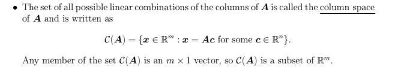
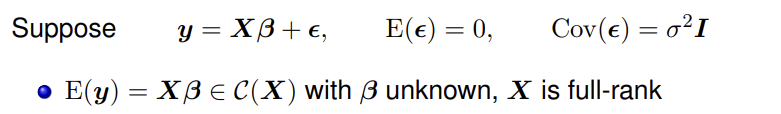
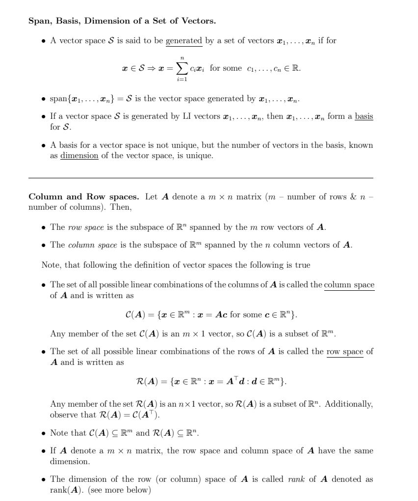
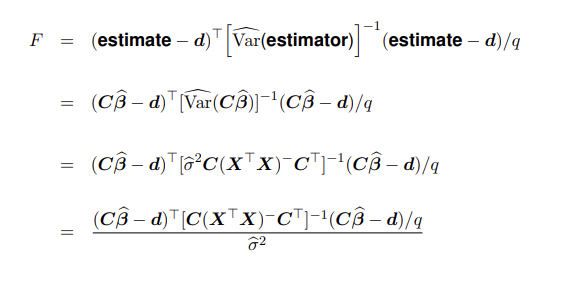
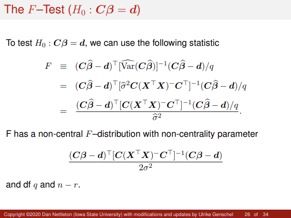
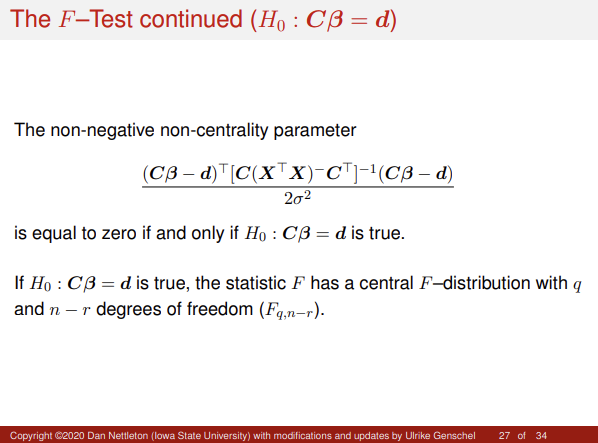
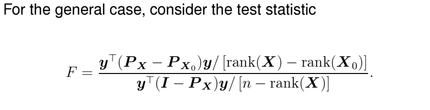
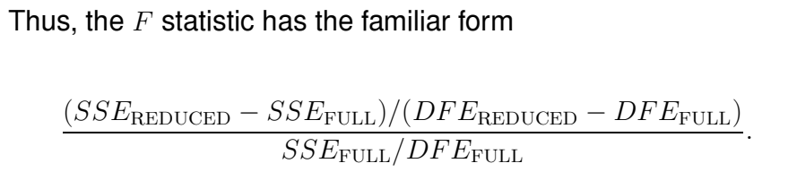
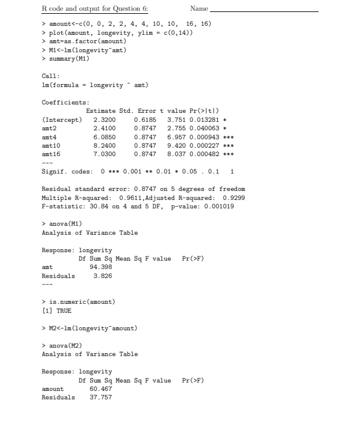

---
output:
  pdf_document: default
  html_document: default
---

```{r, eval = T, results = F, echo = F, warning = F, message = F}
library(knitr)
```
  
# 4. 

Consider a one-way ANOVA model with two levels and two observations at each level,

$$
E(y_{ij}) = \mu + \alpha_i, \quad i, j = 1, 2
$$

Using the given information, we may represent it in matrix form to aid in solving the following questions: 

$$
\mathbf{y} =
\begin{bmatrix}
y_{11} \\
y_{12} \\
y_{21} \\
y_{22}
\end{bmatrix},
\quad
\boldsymbol{\beta} =
\begin{bmatrix}
\mu \\
\alpha_1 \\
\alpha_2
\end{bmatrix},
\quad
\mathbf{X} =
\begin{bmatrix}
1 & 1 & 0 \\
1 & 1 & 0 \\
1 & 0 & 1 \\
1 & 0 & 1
\end{bmatrix}
$$

**(a)** Is $\alpha_1$ estimable? Show work to justify why it is or is not estimable.

By definition, a parameter $c^T \boldsymbol{\beta}$ is estimable if $c^T \in \text{row space}(\mathbf{X})$, i.e., if there exists a vector $\mathbf{a}^T$ such that:

$$
c^T = \mathbf{a}^T \mathbf{X}
$$

Then, to determine whether $\alpha_1$ is estimable, consider:

$$
c^T = \begin{bmatrix} 0 & 1 & 0 \end{bmatrix}
$$

The matrix $\mathbf{X}$ has only two linearly independent rows (has rank 2), so its row space is spanned by:

$$
\text{span} \left\{ (1, 1, 0), \; (1, 0, 1) \right\}
$$

To test whether $c^T = (0, 1, 0)$ lies in this row space, we ask whether there exist scalars $a, b$ such that:

$$
(0, 1, 0) = a(1, 1, 0) + b(1, 0, 1)
$$

This gives the system of linear equations:

$$
\begin{aligned}
0 &= a + b \\
1 &= a \\
0 &= b
\end{aligned}
\quad \Rightarrow \quad a = 1, \; b = 0 \quad \Rightarrow \quad a + b = 1 \neq 0
$$

As we have arrived at a contradiction, there are no such real-valued $a, b$ that exist to solve the system of equations. Therefore, $c^T \notin \text{row space}(\mathbf{X})$, and $\alpha_1$ is not estimable.

---

**(b)** Provide a quantity that is estimable. 

Both $\alpha_1 - \alpha_2$ and $\mu + \alpha_1$ are estimable quantities.

By definition, a linear combination $c^T \boldsymbol{\beta}$ is estimable if and only if $c^T \in \text{row space}(\mathbf{X})$, i.e., if there exists a vector $\mathbf{a}^T$ such that:

$$
c^T = \mathbf{a}^T \mathbf{X}
$$

(1): For $\alpha_1 - \alpha_2$

This corresponds to:

$$
c^T = \begin{bmatrix} 0 & 1 & -1 \end{bmatrix}
$$

We want to find $c^T$ as a linear combination of two independent rows of $\mathbf{X}$:

Row 1: $\mathbf{x}_1^T = (1, 1, 0)$

Row 3: $\mathbf{x}_3^T = (1, 0, 1)$

Then:

$$
\begin{aligned}
c^T &= (0, 1, -1) \\
&= 1 \cdot (1, 1, 0) + (-1) \cdot (1, 0, 1) \\
&= (1, 1, 0) - (1, 0, 1) = (0, 1, -1)
\end{aligned}
$$

So there exists a linear combination to satisfy the expression. 

Then, the corresponding $\mathbf{a}^T$ satisfying $c^T = \mathbf{a}^T \mathbf{X}$ is:

$$
\mathbf{a}^T = \begin{bmatrix} 1 & 0 & -1 & 0 \end{bmatrix}
$$

And we conclude that $\alpha_1 - \alpha_2$ is an estimable quantity.

(2) For $\mu + \alpha_1$

This corresponds to:

$$
c^T = \begin{bmatrix} 1 & 1 & 0 \end{bmatrix}
$$

This is exactly the same as the first row of $\mathbf{X}$, so:

$$
c^T = \mathbf{e}_1^T \mathbf{X}, \quad \text{where } \mathbf{e}_1^T = \begin{bmatrix} 1 & 0 & 0 & 0 \end{bmatrix}
$$

So the corresponding $\mathbf{a}^T$ is:

$$
\mathbf{a}^T = \begin{bmatrix} 1 & 0 & 0 & 0 \end{bmatrix}
$$

And we also have the quantity $\mu + \alpha_1$ is also estimable.

\newpage 

The remaining questions refer to any general linear model as discussed in class. Thus, provide answers for a general $\mathbf{X}$ instead of referring to the particular $\mathbf{X}$ defined above.

Additional Note: The following are related to the "Prerequisite Knowledge" Slides and an extension of the OLS Slides (Chapters 2 and 3) from lectures. Of note: 

```{r, eval = T, echo=FALSE, fig.cap="Linear Algebra Overview", out.width="100%"}

```

```{r, eval = T, echo=FALSE, fig.cap="Column Rank", out.width="100%"}

```

\newpage

**(c)** **True or False** Circle the appropriate choice. The expected value of any observation is only estimable when $\mathbf{X}$ has full column rank.

False. 

The expected value of any observation is estimable as long as it is a linear combination of the columns of $\mathbf{X}$. Having full column rank just ensures that every element of the parameter vector, $\beta$, is estimable. There are examples of observations able to be estimated without having full column rank, such as the second estimable quantity in the above part b).

**(d)** The set of vectors $\mathbf{c}$ for which $\mathbf{c}^T \boldsymbol{\beta}$ is estimable forms a vector space. Specify the vector space.

Answer: **The column space of $\mathbf{X}$**. 

The above answer is based on the Linear Algebra overview, as well as review of "Alternative Parametrization" Lecture Slides, where we discuss how/what estimates are able to be produced when working with a design matrix that is not full rank, e.g. for the Additive Model. 

```{r, eval = T, echo=FALSE, fig.cap="Vector Space", out.width="100%"}

```

\newpage

**(e)** **Fill in the blank.**

The column rank of a model matrix $\mathbf{X}$ is always **equal to** the number of linearly independent vectors that span the vector space in part (d).

The above answer is directly tied back to the definition of estimability, in addition to the Linear Algebra definition of span. 

**(f)** What is the relationship/connection between the column rank of $\mathbf{X}$ and the estimability of $\boldsymbol{\beta}$? Answer using a short sentence.

The column rank of $\mathbf{X}$ determines the number of estimable parameters, i.e., the higher/larger/greater the column rank (Integer) of $\mathbf{X}$, the more parameters in $\boldsymbol{\beta}$ that are estimable.

\newpage 

# 5.

Consider the following linear model with $n = 5$ observations:

$$
\mathbf{y} =
\begin{pmatrix}
y_1 \\
y_2 \\
y_3 \\
y_4 \\
y_5
\end{pmatrix} =
\begin{pmatrix}
1 & 0 & 0 \\
1 & -1 & -1 \\
1 & 1 & -1 \\
1 & -1 & 1 \\
1 & 1 & 1
\end{pmatrix}
\begin{pmatrix}
\beta_1 \\
\beta_2 \\
\beta_3
\end{pmatrix} +
\begin{pmatrix}
\varepsilon_1 \\
\varepsilon_2 \\
\varepsilon_3 \\
\varepsilon_4 \\
\varepsilon_5
\end{pmatrix}
$$

Note that the columns of $\mathbf{X}$ are perpendicular so that $\mathbf{X}^T \mathbf{X}$ is diagonal.

**(a)** In a Gauss-Markov version of this model, which of the parameters, $\beta_1, \beta_2, \beta_3$, can be estimated with greatest precision? Explain carefully.

In a Gauss-Markov version of this model, $\beta_1$ can be estimated with the greatest precision. 

$\beta_1$ corresponds to the first column of the design matrix, $\mathbf{X}$, which has the largest diagonal entry in $\mathbf{X}^T \mathbf{X}$, corresponding to the 5 rows we can use in estimating $\beta_1$. This means we have more information to estimate $\beta_1$ which in turn corresponds to a smaller variance in estimation. 

Another way to think about this: When multiplying the matrices $\mathbf{X} \mathbf{\beta}$, all five rows of the original design matrix contain "information" on $\beta_1$, and the first row of the design matrix contains no "information" on $\beta_2$ and $\beta_3$, hence why the diagonal matrix below has only "4" in the diagonal entries [2,2] and [3,3]. So, by contrast, the other two parameter vectors, $\beta_2$ and $\beta_3$ can only be estimated using 4 of the rows, so they use comparatively less information and would have greater variance, less precision. 

Calculating explicitly: 

$$
\mathbf{X}^T \mathbf{X} =
\begin{pmatrix}
5 & 0 & 0 \\
0 & 4 & 0 \\
0 & 0 & 4
\end{pmatrix}
$$

**(b)** Suppose $\mathbf{y}$ is such that $\text{SSE} = 3$ and $\hat{\boldsymbol{\beta}} = (5 \; 6 \; 2)^T$. Consider an analysis under the Gauss-Markov model with Normal errors and the following two null hypotheses:

$$
H_{0,1}: E(y_1) = E(y_2) \quad \text{and} \quad H_{0,2}: E(y_1) = E(y_5)
$$

i. Write $H_{0,1}$ and $H_{0,2}$ in testable form $H_0 : \mathbf{C} \boldsymbol{\beta} = 0$ by identifying an appropriate matrix $\mathbf{C}$. (**Hint:** Start out by expressing each expected value as a function of $\boldsymbol{\beta}$ given $\mathbf{X}$ and $\boldsymbol{\beta}$ as defined above.)

From the model, the expected value for each observation is given by:

$$
E[y_i] = \mathbf{x}_i^\top \boldsymbol{\beta}
$$

Row 1: $y_1$, $\mathbf{x}_1^\top = (1, 0, 0)$

Giving: $E[y_1] = \beta_1$

Row 2: $y_2$, $\mathbf{x}_2^\top = (1, -1, -1)$ 

Giving: $E[y_2] = \beta_1 - \beta_2 - \beta_3$

Row 5: $y_5$, $\mathbf{x}_5^\top = (1, 1, 1)$ 

Giving: $E[y_5] = \beta_1 + \beta_2 + \beta_3$

Using the above expectations, we now turn to the hypotheses:

Base Formula: 

$$
\mathbf{C} \mathbf{\beta} = \mathbf{0}
$$

And then solving for the matrix $\mathbf{C}$, we go row-by-row: 

(1): For $H_{0,1}: E[y_1] = E[y_2]$:

$$
\beta_1 = \beta_1 - \beta_2 - \beta_3 \rightarrow 
0 = -\beta_2 - \beta_3 \rightarrow 
[0 \;\; -1 \;\; -1] \boldsymbol{\beta} = 0
$$

(2): For $H_{0,2}: E[y_1] = E[y_5]$:

$$
\beta_1 = \beta_1 + \beta_2 + \beta_3 \rightarrow 
0 = \beta_2 + \beta_3 \rightarrow 
[0 \;\; 1 \;\; 1] \boldsymbol{\beta} = 0
$$

Combining both of the hypotheses together, we have:

$$
\mathbf{C} = 
\begin{pmatrix}
0 & -1 & -1 \\
0 & 1 & 1
\end{pmatrix}
$$

Notably, in the above, the two rows are linearly dependent. 

ii. Based on $\mathbf{C}$ compute an $F$ statistic for testing $H_0$ (you need not do the arithmetic, but plug correct numbers into a correct formula).

```{r, eval = T, echo=FALSE, fig.cap="F-Statistic Definition", out.width="100%"}

```

Where $\mathbf{d} = \mathbf{0}$ for the purposes of this problem. 

To test the hypothesis $H_0: \mathbf{C} \boldsymbol{\beta} = 0$, we the F-statistic defined by:

$$
F = \frac{(\mathbf{C}\hat{\boldsymbol{\beta}})^T \left[ \mathbf{C} (\mathbf{X}^T \mathbf{X})^{-1} \mathbf{C}^T \right]^{-1} (\mathbf{C}\hat{\boldsymbol{\beta}}) / q}{\text{MSE}}
$$

With the following known values already calculated:

  - $\mathbf{C} = \begin{pmatrix} 0 & -1 & -1 \end{pmatrix}$ from part i), and using the constraint $E[y_1] = E[y_2]$
  - $\hat{\boldsymbol{\beta}} = \begin{pmatrix} 5 \\ 6 \\ 2 \end{pmatrix}$ as given in the beginning of the problem
  - $\mathbf{X}^T \mathbf{X} = \begin{pmatrix} 5 & 0 & 0 \\ 0 & 4 & 0 \\ 0 & 0 & 4 \end{pmatrix}$ as calculated in part a)
  - $q = 1$ (the number of linearly independent constraints, determined from the rank of $\mathbf{C}$)
  - $\text{MSE} = \text{SSE} / (n - p) = 3 / (5 - 3) = 3 / 2 = 1.5$, where SSE was given and the denominator calculated using known information.

Computing this value directly, and noting the method for finding the inverse of a diagonal matrix, we have:

$$
\mathbf{C} \hat{\boldsymbol{\beta}} = 0 \cdot 5 + (-1) \cdot 6 + (-1) \cdot 2 = -8
$$

$$
\mathbf{C} (\mathbf{X}^T \mathbf{X})^{-1} \mathbf{C}^T = 
\begin{pmatrix} 0 & -1 & -1 \end{pmatrix}
\begin{pmatrix} 
1/5 & 0 & 0 \\
0 & 1/4 & 0 \\
0 & 0 & 1/4
\end{pmatrix}
\begin{pmatrix} 0 \\ -1 \\ -1 \end{pmatrix}
= 1/4 + 1/4 = 1/2
$$

Combining the computations, the F-statistic is then given by:

$$
F = \frac{(-8)^2 / 1}{(1/2) \cdot 1.5} = \frac{64}{0.75} = 85.33
$$


\newpage

iii. Specify the reference distribution of $F$ under the null hypothesis.

```{r, eval = T, echo=FALSE, fig.cap="F-Statistic - Central", out.width="100%"}

```

```{r, eval = T, echo=FALSE, fig.cap="F-Statistic - Non-Central", out.width="100%"}

```

\newpage

Under the null hypothesis $H_0: \mathbf{C} \boldsymbol{\beta} = 0$, the F-statistic:

$$
F = \frac{(\mathbf{C}\hat{\boldsymbol{\beta}})^T \left[ \mathbf{C} (\mathbf{X}^T \mathbf{X})^{-1} \mathbf{C}^T \right]^{-1} (\mathbf{C}\hat{\boldsymbol{\beta}}) / q}{\text{MSE}}
$$

follows a central F-distribution with Numerator degrees of freedom: $q = 1$ and Denominator degrees of freedom: $n - p = 5 - 3 = 2$ (central meaning a non-central parameter of 0), i.e.:

$$
H_0: F \sim F_{1, 2}(0)
$$

Under the Alternative Hypothesis, the F-statistic follows a non-central F-distribution with the same numerator and denominator degrees of freedom, i.e.:

$$
H_{a}: F \sim F_{1, 2}(\lambda)
$$

Where the non-centrality parameter $\lambda$ is defined as:

$$
\lambda = \frac{(\mathbf{C} \boldsymbol{\beta})^T \left[ \mathbf{C} (\mathbf{X}^T \mathbf{X})^{-1} \mathbf{C}^T \right]^{-1} (\mathbf{C} \boldsymbol{\beta})}{\sigma^2}
$$

\newpage

# 6. 

Consider a completely randomized experiment in which a total of 10 freshly cut Gerber daisies were placed into 10 vases (one daisy per vase). The Gerber daisies were randomly assigned to five treatment groups with two Gerber daisies in each treatment group. The treatment corresponds to the amount of a chemical compound added to the water in each vase. Of interest is the longevity of the Gerber daisies measured in days.

| Treatment            | 1 | 2 | 3 | 4  | 5  |
|---------------------|---|---|---|----|----|
| Amount of compound (g) | 0 | 2 | 4 | 10 | 16 |

Suppose for $i = 1, \\dots, 5$ and $j = 1, 2$, $y_{ij}$ denotes the longevity in days of the study of the $j^{th}$ Gerber daisy from treatment group $i$. Furthermore, suppose

$$
y_{ij} = \mu_i + \varepsilon_{ij},
$$

where the $\mu_i$ are unknown parameters and the $\varepsilon_{ij}$ terms are $\mathcal{N}(0, \sigma^2)$ for some unknown $\sigma^2 > 0$.

Use the R code and partial output provided with this exam to answer the following questions.

**(a)** For the first model fit in R, called M1, specify the model matrix $\mathbf{X}$ used by R.

The model matrix $\mathbf{X}$ used by R is a design matrix with an intercept and indicator columns for each level of `amt`. By default R produces a design matrix of full rank using the baseline constraint where the first level of the factor `amt` is used as the baseline. This corresponds to: 

$$
\mathbf{X} =
\begin{bmatrix}
1 & 0 & 0 & 0 & 0 \\
1 & 0 & 0 & 0 & 0 \\
1 & 1 & 0 & 0 & 0 \\
1 & 1 & 0 & 0 & 0 \\
1 & 0 & 1 & 0 & 0 \\
1 & 0 & 1 & 0 & 0 \\
1 & 0 & 0 & 1 & 0 \\
1 & 0 & 0 & 1 & 0 \\
1 & 0 & 0 & 0 & 1 \\
1 & 0 & 0 & 0 & 1 \\
\end{bmatrix}
$$

**(b)** Consider the following information from the output associated with model M1:

```
F-statistic: 30.84 on 4 and 5 DF,   p-value: 0.001019
```

Specify the null and alternative hypothesis associated with this test:

$H_0$: All treatment means (average response per level of `amt`) are equal ($\mu_1 = \mu_2 = \mu_3 = \mu_4 = \mu_5$).

$H_a$: At least one treatment mean differs from the treatment mean of the other groups (levels of the factor `amt`).

**(c)** Provide the BLUE of $\mu_2$:

By default the estimate of $\beta_2 = \mu_2 - \mu_1$ due to the R baseline constraint, as noted more in part a). Additionally, R by default and as specified provides the OLS estimated effects, which are BLUE as they correspond to the normal equations under GMM. That is all to say: 

The BLUE of $\mu_2$ is the estimated expression using "intercept + coefficient", which corresponds to $\hat{\mu}_2$ = 2.32 + 2.41 = 4.73.

**(d)** What is the standard error of the BLUE of $\mu_2$?

The standard error of the BLUE of $\mu_2$ is 0.8747, as given in the R output.

**(e)** Provide the BLUE of $\mu_1 - \mu_2$:

Under R’s default treatment contrast coding, the model fitted with `lm(y ~ factor(amt))` uses the first level of the factor as the baseline, which is for `amt == 0`. 

The model is of the form:

$$
y_{ij} = \beta_0 + \beta_2 \cdot \mathbb{1}_{\text{amt}=2} + \beta_3 \cdot \mathbb{1}_{\text{amt}=4} + \dots + \varepsilon_{ij},
$$

Mean of treatment one is given by $\beta_0 = \mu_1$

However, mean of treatment two is not $\beta_2$, as $\beta_2 = \mu_2 - \mu_1$.

So we must consider a linear combination of rows in the $\beta$ vector to get at $\mu_1 - \mu_2$. To that end: 

$$
\mu_1 - \mu_2 = \mu_1 - (\mu_1 + \beta_2) = -\beta_2
$$

So, the BLUE of $\mu_1 - \mu_2$ is:

$$
-\hat{\beta}_2 = -2.41
$$

Using the above output

**(f)** What is the standard error of the BLUE of $\mu_1 - \mu_2$?

Since $\mu_1 - \mu_2 = -\beta_2$, this is a direct transformation of a single coefficient estimate. 

Thus, the standard error of the BLUE is also, similar to the prior SE question, given from a single standard error estimate, i.e.:

$$
\operatorname{SE}(\mu_1 - \mu_2) = \operatorname{SE}(-\hat{\beta}_2) = \operatorname{SE}(\hat{\beta}_2) = 0.8747
$$

**(g)** What is the value of $\mathbf{y}^T (\mathbf{I} - \mathbf{P_1}) \mathbf{y}$, where $\mathbf{y}$ denotes the vector containing the values of longevity?

The quantity $\mathbf{y}^T (\mathbf{I} - \mathbf{P}_1) \mathbf{y}$ is the residual Sums of Squares from the fitted model, M1. 

From the provided R output, the residual sum of squares is:

$$
\mathbf{y}^T (\mathbf{I} - \mathbf{P}_1) \mathbf{y} = \text{RSS} = 3.826
$$

**(h)** Provide the value of the F-statistic, numerator and denominator df, and the p-value associated with the following ANOVA table:

The F-Statistic is of the form: 

$$
F = \frac{\frac{SS_{amt}}{df_{amt}}}{\frac{SS_{Res}}{df_{Res}}} = \frac{94.398/4}{3.826/5} \approx 30.841
$$

With p-value: 

$$
P(F_{4,5} > 30.84)
$$

Taken together, we have: 

F-statistic: 30.84  
amt Df (Numerator Df): Number of Groups – 1 = 5 – 1 = 4
Residual Df (Denominator Df): Total Observations – Number of Groups = 10 – 5 = 5 
p-value: 0.001019

In R, the p-value can be directly calculated. However, on the exam, I believe keeping it closed form would have been the only viable solution since the p-value was not explicitly provided in the output and could not have been backward-inducted using known values. 

```{r}
pf(30.84, df1 = 4, df2 = 5, lower.tail = FALSE)
```

```
OLD
> anova(M1)
Analysis of Variance Table

Response: longevity
           Df   Sum Sq  Mean Sq  F value  Pr(>F)
amt         ---  94.398   ---     ---     ---
Residuals   ---   3.826
```

```
NEW
> anova(M1)
Analysis of Variance Table

Response: longevity
           Df   Sum Sq  Mean Sq   F value   Pr(>F)
amt         4    94.398   23.5995   30.84     0.001019
Residuals   5     3.826    0.7652
```

\newpage

```{r, eval = T, echo=FALSE, fig.cap="Matrix Notation: Form of Partial F-Test", out.width="100%"}

```

```{r, eval = T, echo=FALSE, fig.cap="Familiar Form of Partial F-Test", out.width="100%"}

```

**(i)** Look at the output associated with Model 2, M2.

i. Fill in the missing entries in the ANOVA table produced by the R command `anova(M2, M1)`.

```
OLD
> anova(M2, M1)
Analysis of Variance Table

Model 1: longevity ~ amount
Model 2: longevity ~ amt

  Res.Df   RSS    Df    Sum of Sq   F      Pr(>F)
1    ---    ---  
2    ---    ---   ---   ---(*)      ---    0.006412 **
```

```
NEW
> anova(M2, M1)
Analysis of Variance Table

Model 1: longevity ~ amount
Model 2: longevity ~ amt

  Res.Df   RSS    Df    Sum of Sq   F      Pr(>F)
1    9     37.757  
2    5      3.826   4    33.931     2.02   0.006412 **
```

The above values were found using the known relation between Sums of Squares and RSS, and the corresponding F-statistic, similar to the calculations done previously, but with the p-value provided explicitly. The other key feature of this problem is recognizing the Residual Df. of 9 for the simplified model (only taking one degree of freedom when allowing `amt` to be treated as a continuous variable instead of multiple group, cell, means).

ii. Provide an interpretation of Sum of Squares in part (i). This is the value denoted by (*).

The value (*) = 33.931 represents the additional variability, the sum of squared errors, explained by using a more complex model that treats `amt` as a factor, compared to a simpler model that treats amount as a continuous numeric variable.

This sum of squares quantifies the improvement in model fit when we allow each treatment level to have its own group (cell) mean, rather than assuming a single linear relationship across all levels of the compound amount.

iii. Provide a conclusion in the context of the data about the null hypothesis that is tested in part (i).

The small p-value (0.006412) from the partial F-test comparing `M2` to `M1` provides strong evidence against the null hypothesis.

The null hypothesis for this test is that the simpler model (with a linear relationship between compound amount and longevity) is sufficient, i.e., there is no significant improvement in model fit by allowing separate means for each treatment level.

In the context of this experiment, we say there is evidence that the relationship between the amount of chemical compound added to the water and the longevity of Gerber daisies is not well explained by a simple linear trend, and instead (contra-positively) have evidence that treatment effects vary non-linearly across dose levels, and the more flexible model—where each treatment level has its own mean (i.e. the cell means model) better captures the pattern in the data and explains more of the observed variability in flower longevity.

\newpage 

```{r, eval = T, echo=FALSE, fig.cap="R Output, Last Page", out.width="100%"}

```

