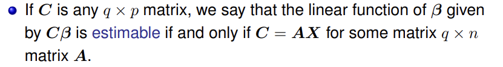

```{r, eval = T, results = F, echo = F, warning = F, message = F}
library(knitr)
```

# Outline 
  - 4: d), e), f) for additional edits 
  - 5: b) onwards 
  - 6: all but b) 

# 4. 

Consider a one-way ANOVA model with two levels and two observations at each level,

$$
E(y_{ij}) = \mu + \alpha_i, \quad i, j = 1, 2
$$

Using the given information, we may represent it in matrix form to aid in soliving the following questions: 

$$
\mathbf{y} =
\begin{bmatrix}
y_{11} \\
y_{12} \\
y_{21} \\
y_{22}
\end{bmatrix},
\quad
\boldsymbol{\beta} =
\begin{bmatrix}
\mu \\
\alpha_1 \\
\alpha_2
\end{bmatrix},
\quad
\mathbf{X} =
\begin{bmatrix}
1 & 1 & 0 \\
1 & 1 & 0 \\
1 & 0 & 1 \\
1 & 0 & 1
\end{bmatrix}
$$

**(a)** Is $\alpha_1$ estimable? Show work to justify why it is or is not estimable.

```{r, eval = T, echo=FALSE, fig.cap="Ch. 2: Some Key Linear Models Results"}

```

The definition of estimability is given above as first defined in Chapter 2 of lecture ntoes. 

For $\alpha_1$: Can we find a matrix $A$ to satisfy the above? 

We have: 

$$
c^T = \begin{bmatrix} 0 & 1 & 0 \end{bmatrix}
$$

There in fact does not exist a matrix A such that:

$$
C = A \mathbf{X}
$$

This means that $\alpha_1$ is not estimable (this is also descriptively found by noting that the matrix C is not in row space of $\mathbf{X}$). 

Generally, parameters (elements of the $\beta$ vector) are only estimable if they can be expressed as a linear combination of the rows of the design matrix, $\mathbf{X}$. For our purposes, the model matrix does not have full rank, so we know there are elements of the parameter vector that are not estimable, though we still have linear combinations that are (more on that in the following).  

**(b)** Provide a quantity that is estimable. $\alpha_1 - \alpha_2$ or $\mu + \alpha_1$.

We again utilize the above definition to determine estimability. We find there are more than one quantity (linear combination of parameters) that are estimable, despite our design matrix not being full rank. Two examples: 

For $\alpha_1 - \alpha_2$, an estimable quantity:

$$
c^T = \begin{bmatrix} 0 & 1 & -1 \end{bmatrix} = 1 \cdot \begin{bmatrix}1 & 1 & 0\end{bmatrix} + (-1) \cdot \begin{bmatrix}1 & 0 & 1\end{bmatrix}
$$

The corresponding matrix $A$ (a row vector) satisfying $C = A \mathbf{X}$ is:

$$
A =
\begin{bmatrix}
1 & 0 & -1 & 0
\end{bmatrix}
$$

Another estimable quantity, $\mu + \alpha_1$ has C matrix:

$$
c^T = \begin{bmatrix} 1 & 1 & 0 \end{bmatrix}
$$

But this is just the first row of $\mathbf{X}$! So the corresponding A matrix is:

$$
A =
\begin{bmatrix}
1 & 0 & 0 & 0
\end{bmatrix}
$$

\newpage 

The remaining questions refer to any general linear model as discussed in class. Thus, provide answers for a general $\mathbf{X}$ instead of referring to the particular $\mathbf{X}$ defined above.

Additional Note: The following are related to the "Prerequisite Knowledge" Slides and an extension of the OLS Slides (Chapters 2 and 3) from lectures. Of note: 

```{r, eval = T, echo=FALSE, fig.cap="Linear Algebra Overview"}

```

```{r, eval = T, echo=FALSE, fig.cap="Column Rank"}
knitr::include_graphics("4dOLS.png")
```

\newpage

**(c)** **True or False** Circle the appropriate choice. The expected value of any observation is only estimable when $\mathbf{X}$ has full column rank.

False. 

The expected value of any observation is estimable as long as it is a linear combination of the columns of $\mathbf{X}$. Having full column rank just ensures that every element of the parameter vector, $\beta$, is estimable. There are examples of observations able to be estimated without having full column rank, such as the second estimable quantity in the above part b).

**(d)** The set of vectors $\mathbf{c}$ for which $\mathbf{c}^T \boldsymbol{\beta}$ is estimable forms a vector space. Specify the vector space.

Answer: **The column space of $\mathbf{X}$**.

## Note: Add image specifically for vector spaces here from Linear Algebra Overview

**(e)** **Fill in the blank.**

The column rank of a model matrix $\mathbf{X}$ is always **equal to** the number of linearly independent vectors that span the vector space in part (d).

## Note: Add connection of linearly independent vectors to estimability 

**(f)** What is the relationship/connection between the column rank of $\mathbf{X}$ and the estimability of $\boldsymbol{\beta}$? Answer using a short sentence.

The higher the column rank of $\mathbf{X}$, the more parameters in $\boldsymbol{\beta}$ that are estimable. The column rank of $\mathbf{X}$ determines the number of estimable parameters, specifically. 

\newpage 

# 5.

Consider the following linear model with $n = 5$ observations:

$$
\mathbf{y} =
\begin{pmatrix}
y_1 \\
y_2 \\
y_3 \\
y_4 \\
y_5
\end{pmatrix} =
\begin{pmatrix}
1 & 0 & 0 \\
1 & -1 & -1 \\
1 & 1 & -1 \\
1 & -1 & 1 \\
1 & 1 & 1
\end{pmatrix}
\begin{pmatrix}
\beta_1 \\
\beta_2 \\
\beta_3
\end{pmatrix} +
\begin{pmatrix}
\varepsilon_1 \\
\varepsilon_2 \\
\varepsilon_3 \\
\varepsilon_4 \\
\varepsilon_5
\end{pmatrix}
$$

Note that the columns of $\mathbf{X}$ are perpendicular so that $\mathbf{X}^T \mathbf{X}$ is diagonal.

**(a)** In a Gauss-Markov version of this model, which of the parameters, $\beta_1, \beta_2, \beta_3$, can be estimated with greatest precision? Explain carefully.

In a Gauss-Markov version of this model, $\beta_1$ can be estimated with the greatest precision. 

$\beta_1$ corresponds to the first column of the design matrix, $\mathbf{X}$, which has the largest diagonal entry in $\mathbf{X}^T \mathbf{X}$, corresponding to the 5 rows we can use in estimating $\beta_1$. This means we have more information to estimate $\beta_1$ which in turn corresponds to a smaller variance in estimation. 

Calculating explicitly: 

$$
\mathbf{X}^T \mathbf{X} =
\begin{pmatrix}
5 & 0 & 0 \\
0 & 4 & 0 \\
0 & 0 & 4
\end{pmatrix}
$$

By contrast, the other two parameter vectors, $\beta_2$ and $\beta_3$ can only be estimated using 4 of the rows, so they use comparatively less information and would have greater variance, less precision. 

**(b)** Suppose $\mathbf{y}$ is such that $\text{SSE} = 3$ and $\hat{\boldsymbol{\beta}} = (5 \; 6 \; 2)^T$. Consider an analysis under the Gauss-Markov model with Normal errors and the following two null hypotheses:

$$
H_{0,1}: E(y_1) = E(y_2) \quad \text{and} \quad H_{0,2}: E(y_1) = E(y_5)
$$

i. Write $H_{0,1}$ and $H_{0,2}$ in testable form $H_0 : \mathbf{C} \boldsymbol{\beta} = 0$ by identifying an appropriate matrix $\mathbf{C}$. (**Hint:** Start out by expressing each expected value as a function of $\boldsymbol{\beta}$ given $\mathbf{X}$ and $\boldsymbol{\beta}$ as defined above.)

$$
\mathbf{C} = \begin{pmatrix}
1 & 1 & 1 \\
0 & -1 & -1
\end{pmatrix}
$$

### Note: Add More Here

ii. Based on $\mathbf{C}$ compute an $F$ statistic for testing $H_0$ (you need not do the arithmetic, but plug correct numbers into a correct formula).

The formula we use for this problem is given by: 

$$
F = \frac{(\mathbf{C}\hat{\boldsymbol{\beta}})^T \left[ \mathbf{C} (\mathbf{X}^T \mathbf{X})^{-1} \mathbf{C}^T \right]^{-1} (\mathbf{C}\hat{\boldsymbol{\beta}}) / q}{\text{MSE}}
$$

where $q$ is the number of linear constraints.

### Note: Add More Here

iii. Specify the reference distribution of $F$ under the null hypothesis.

The reference distribution of $F$ under the null hypothesis is an $F$-distribution with $q$ and $n - p$ degrees of freedom, where $p$ is the number of parameters.

### Note: Add More Here, Particularly Non-Centrality Parameter

\newpage

# 6. 

Consider a completely randomized experiment in which a total of 10 freshly cut Gerber daisies were placed into 10 vases (one daisy per vase). The Gerber daisies were randomly assigned to five treatment groups with two Gerber daisies in each treatment group. The treatment corresponds to the amount of a chemical compound added to the water in each vase. Of interest is the longevity of the Gerber daisies measured in days.

| Treatment            | 1 | 2 | 3 | 4  | 5  |
|---------------------|---|---|---|----|----|
| Amount of compound (g) | 0 | 2 | 4 | 10 | 16 |

Suppose for $i = 1, \\dots, 5$ and $j = 1, 2$, $y_{ij}$ denotes the longevity in days of the study of the $j^{th}$ Gerber daisy from treatment group $i$. Furthermore, suppose

$$
y_{ij} = \mu_i + \varepsilon_{ij},
$$

where the $\mu_i$ are unknown parameters and the $\varepsilon_{ij}$ terms are $\mathcal{N}(0, \sigma^2)$ for some unknown $\sigma^2 > 0$.

Use the R code and partial output provided with this exam to answer the following questions.

**(a)** For the first model fit in R, called M1, specify the model matrix $\mathbf{X}$ used by R.

For the first model fit in R, called M1, the model matrix $\mathbf{X}$ used by R is a design matrix with an intercept and indicator columns for each level of `amt`.

### Note: Add More Here, Whether R uses first or last for baseline

**(b)** Consider the following information from the output associated with model M1:

```
F-statistic: 30.84 on 4 and 5 DF,   p-value: 0.001019
```

Specify the null and alternative hypothesis associated with this test:

$H_0$: All treatment means are equal ($\mu_1 = \mu_2 = \mu_3 = \mu_4 = \mu_5$).

$H_a$: At least one treatment mean differs.

### Note: Add More below on what BLUE is and how we know how to use it

**(c)** Provide the BLUE of $\mu_2$:

The BLUE of $\mu_2$ is the intercept + coefficient for `amt2` = 2.32 + 2.41 = 4.73.

**(d)** What is the standard error of the BLUE of $\mu_2$?

The standard error of the BLUE of $\mu_2$ is 0.8747.

**(e)** Provide the BLUE of $\mu_1 - \mu_2$:

The BLUE of $\mu_1 - \mu_2$ is $2.32 - 4.73 = -2.41$.

**(f)** What is the standard error of the BLUE of $\mu_1 - \mu_2$?

The standard error of the BLUE of $\mu_1 - \mu_2$ is $\sqrt{0.8747^2 + 0.8747^2} = 1.237$ (calculated as the square root of the sum of variances).

**(g)** What is the value of $\mathbf{y}^T (\mathbf{I} - \mathbf{P_1}) \mathbf{y}$, where $\mathbf{y}$ denotes the vector containing the values of longevity?

The value of $\mathbf{y}^T (\mathbf{I} - \mathbf{P_1}) \mathbf{y}$ is 3.826 (the residual sum of squares).

**(h)** Provide the value of the F-statistic, numerator and denominator df, and the p-value associated with the following ANOVA table:

The F-statistic is 30.84 with numerator df = 4, denominator df = 5, and p-value = 0.001019.

p-value: probability that a random variable with distribution $F_{q, n-r}$ matches or exceeds the observed value of the test statistic F=30.84. 

```
OLD
> anova(M1)
Analysis of Variance Table

Response: longevity
           Df   Sum Sq  Mean Sq  F value  Pr(>F)
amt         ---  94.398   ---     ---     ---
Residuals   ---   3.826
```

```
NEW
> anova(M1)
Analysis of Variance Table

Response: longevity
           Df   Sum Sq  Mean Sq   F value   Pr(>F)
amt         4    94.398   23.5995   30.84     0.001019
Residuals   5     3.826    0.7652
```

\newpage

```{r, eval = T, echo=FALSE, fig.cap="Matrix Notation: Form of Partial F-Test"}
knitr::include_graphics("Partial.png")
```

```{r, eval = T, echo=FALSE, fig.cap="Familiar Form of Partial F-Test"}
knitr::include_graphics("Partial2.png")
```

**(i)** Look at the output associated with Model 2, M2.

i. Fill in the missing entries in the ANOVA table produced by the R command `anova(M2, M1)`.

```
OLD
> anova(M2, M1)
Analysis of Variance Table

Model 1: longevity ~ amount
Model 2: longevity ~ amt

  Res.Df   RSS    Df    Sum of Sq   F      Pr(>F)
1    ---    ---  
2    ---    ---   ---   ---(*)      ---    0.006412 **
```

```
NEW
> anova(M2, M1)
Analysis of Variance Table

Model 1: longevity ~ amount
Model 2: longevity ~ amt

  Res.Df   RSS    Df    Sum of Sq   F      Pr(>F)
1    9     37.757  
2    5      3.826   4    33.931     2.02   0.006412 **
```

ii. Provide an interpretation of Sum of Squares in part (i). This is the value denoted by (*).

The sum of squares (*) represents the additional variability explained by adding the `amount` factor to the model.

iii. Provide a conclusion in the context of the data about the null hypothesis that is tested in part (i).

Conclusion: The small p-value (0.006412) suggests we reject the null hypothesis, concluding that the amount of compound has a statistically significant effect on longevity.

\newpage 

```{r, eval = T, echo=FALSE, fig.cap="CocoMelon"}
knitr::include_graphics("Output.png")
```