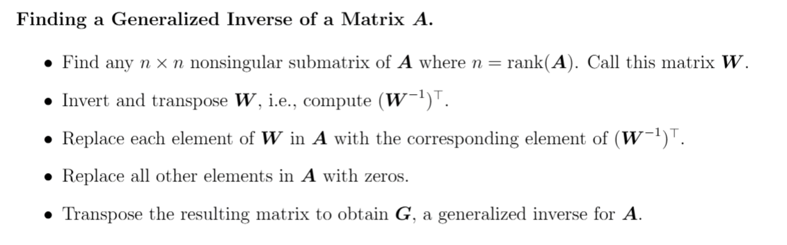
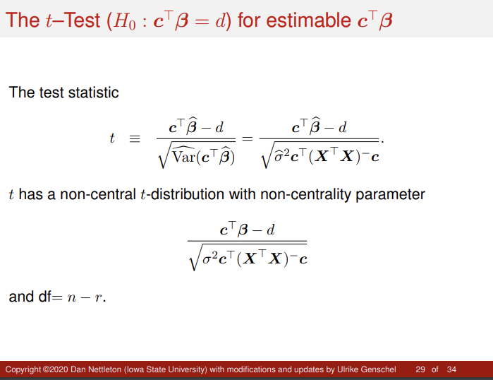

```{r, eval = T, results = F, echo = F, warning = F, message = F}
library(knitr)
```

# Outline 

  - Q1: G2G 
  - Q2: G2G 
  - Q3: G2G
  - Q4: Edited
  - Q5: Edited
  - Q6: G2G
  
# Problem 1

Suppose $\mathbf{y} \sim \mathcal{N}(\boldsymbol{\mu}, \mathbf{\Sigma})$, where $\boldsymbol{\mu}^T = [1 \quad 2 \quad 3]$

$$
\boldsymbol{\mu}^T = [1 \quad 2 \quad 3] \quad \text{and} \quad \mathbf{\Sigma} = 
\begin{bmatrix}
2 & 1 & -1 \\
1 & 2 & 1 \\
-1 & 1 & 3
\end{bmatrix}
$$

Further, define a $3 \times 3$ matrix $A$ and a $2 \times 3$ matrix $B$ as follows

$$
\mathbf{A} = 
\begin{bmatrix}
2 & 2 & 1 \\
1 & 0 & -1 \\
0 & 1 & -1
\end{bmatrix} \quad \text{and} \quad \mathbf{B} = 
\begin{bmatrix}
1 & 1 & 1 \\
-1 & 1 & 0
\end{bmatrix}
$$

## a) 

Determine the distribution of $u = \mathbf{1}_3^T \mathbf{y}$.

Mean of $u$:

$$
E[u] = \mathbf{1}_3^T \boldsymbol{\mu} = [1, 1, 1] \begin{bmatrix} 1 \\ 2 \\ 3 \end{bmatrix} = 1 + 2 + 3 = 6
$$

Variance of $u$:

$$
\text{Var}(u) = \mathbf{1}_3^T \mathbf{\Sigma} \mathbf{1}_3 = [1, 1, 1] \begin{bmatrix} 2 & 1 & -1 \\ 1 & 2 & 1 \\ -1 & 1 & 3 \end{bmatrix} \begin{bmatrix} 1 \\ 1 \\ 1 \end{bmatrix} = [1, 1, 1] \begin{bmatrix} 2 \\ 4 \\ 3 \end{bmatrix} = 2 + 4 + 3 = 9
$$

Since $u$ is a linear combination of normally distributed variables, it follows a normal distribution with mean $6$ and variance $9$, i.e. the distribution of $u$ as defined is:

$$
u \sim \mathcal{N}(6, 9)
$$

## b) 

Determine the distribution of $\mathbf{v} = \mathbf{Ay}$.

As defined, we start by substituting the givens, specifically using $\mathbf{v} = \mathbf{Ay}$:

$$
\mathbf{v} \sim \mathcal{N}\left(
\begin{bmatrix} 9 \\ -2 \\ -1 \end{bmatrix},
\begin{bmatrix}
13 & 3 & -1 \\
3 & 5 & -2 \\
-1 & -2 & 6
\end{bmatrix}
\right)
$$

Mean of $\mathbf{v}$:

$$
E[\mathbf{v}] = \mathbf{A} \boldsymbol{\mu} = 
\begin{bmatrix}
2 & 2 & 1 \\
1 & 0 & -1 \\
0 & 1 & -1
\end{bmatrix}
\begin{bmatrix} 1 \\ 2 \\ 3 \end{bmatrix}
= 
\begin{bmatrix} 9 \\ -2 \\ -1 \end{bmatrix}
$$

Covariance of $\mathbf{v}$:

$$
\text{Cov}(\mathbf{v}) = \mathbf{A} \mathbf{\Sigma} \mathbf{A}^T
$$

Taking the first part of this expression and evaluating $\mathbf{A} \mathbf{\Sigma}$:

$$
\mathbf{A} \mathbf{\Sigma} = 
\begin{bmatrix}
2 & 2 & 1 \\
1 & 0 & -1 \\
0 & 1 & -1
\end{bmatrix}
\begin{bmatrix}
2 & 1 & -1 \\
1 & 2 & 1 \\
-1 & 1 & 3
\end{bmatrix} = 
\begin{bmatrix}
5 & 7 & 3 \\
3 & 0 & -4 \\
-2 & 1 & -2
\end{bmatrix}
$$

Then, we take that matrix to get $\mathbf{A} \mathbf{\Sigma} \mathbf{A}^T$:

$$
\mathbf{A} \mathbf{\Sigma} \mathbf{A}^T = 
\begin{bmatrix}
5 & 7 & 3 \\
3 & 0 & -4 \\
-2 & 1 & -2
\end{bmatrix}
\begin{bmatrix}
2 & 1 & 0 \\
2 & 0 & 1 \\
1 & -1 & -1
\end{bmatrix} = 
\begin{bmatrix}
27 & 2 & 4 \\
2 & 7 & 4 \\
4 & 4 & 3
\end{bmatrix}
$$

Since $\mathbf{v}$ is a linear transformation of $\mathbf{y}$, it follows a multivariate normal distribution with the above mean and covariance, i.e. we may describe the distribution of $\mathbf{V}$ as: 

$$
\mathbf{v} \sim \mathcal{N}(\mathbf{A} \boldsymbol{\mu}, \mathbf{A} \mathbf{\Sigma} \mathbf{A}^T)
$$


## c) 

Determine the distribution of $\mathbf{w}$, where $\mathbf{w}^T = [\mathbf{Ay} \quad \mathbf{By}]$.

We start by using the given information, specifically:

$$
\mathbf{w} \sim \mathcal{N}\left(
\begin{bmatrix} \mathbf{A} \boldsymbol{\mu} \\ \mathbf{B} \boldsymbol{\mu} \end{bmatrix},
\begin{bmatrix}
\mathbf{A} \mathbf{\Sigma} \mathbf{A}^T & \mathbf{A} \mathbf{\Sigma} \mathbf{B}^T \\
\mathbf{B} \mathbf{\Sigma} \mathbf{A}^T & \mathbf{B} \mathbf{\Sigma} \mathbf{B}^T
\end{bmatrix}
\right)
$$

We just need to calculate some unknown quantities, the mean and covariance matrices of $\mathbf{w}$. To that end, we note: 

The mean of $\mathbf{w}$ can be taken from part (b), $\mathbb{E}[\mathbf{Ay}] = \begin{bmatrix} 9 \\ -2 \\ -1 \end{bmatrix}$.

We then compute $\mathbb{E}[\mathbf{By}] = \mathbf{B} \boldsymbol{\mu}$:

$$
\mathbf{B} \boldsymbol{\mu} = 
\begin{bmatrix}
1 & 1 & 1 \\
-1 & 1 & 0
\end{bmatrix}
\begin{bmatrix} 1 \\ 2 \\ 3 \end{bmatrix} 
= 
\begin{bmatrix} 6 \\ 1 \end{bmatrix}
$$

Taken together this gives us:

$$
E[\mathbf{w}] = \begin{bmatrix} \mathbf{A} \boldsymbol{\mu} \\ \mathbf{B} \boldsymbol{\mu} \end{bmatrix} = \begin{bmatrix} 9 \\ -2 \\ -1 \\ 6 \\ 1 \end{bmatrix}
$$

We then calculate the covariance of $\mathbf{w}$:

Again, taking information from part (b), we already know $\text{Cov}(\mathbf{Ay}) = \mathbf{A} \mathbf{\Sigma} \mathbf{A}^T = \begin{bmatrix} 27 & 2 & 4 \\ 2 & 7 & 4 \\ 4 & 4 & 3 \end{bmatrix}$.

Compute $\text{Cov}(\mathbf{By}) = \mathbf{B} \mathbf{\Sigma} \mathbf{B}^T$:

$$
\mathbf{B} \mathbf{\Sigma} = 
\begin{bmatrix}
1 & 1 & 1 \\
-1 & 1 & 0
\end{bmatrix}
\begin{bmatrix}
2 & 1 & -1 \\
1 & 2 & 1 \\
-1 & 1 & 3
\end{bmatrix} = 
\begin{bmatrix}
2 & 4 & 3 \\
-1 & 1 & 0
\end{bmatrix}
$$

Using this, we then have:

$$
\mathbf{B} \mathbf{\Sigma} \mathbf{B}^T = 
\begin{bmatrix}
2 & 4 & 3 \\
-1 & 1 & 0
\end{bmatrix}
\begin{bmatrix}
1 & -1 \\
1 & 1 \\
1 & 0
\end{bmatrix} = 
\begin{bmatrix}
9 & 2 \\
2 & 2
\end{bmatrix}
$$

We then compute $\text{Cov}(\mathbf{Ay}, \mathbf{By}) = \mathbf{A} \mathbf{\Sigma} \mathbf{B}^T$:

$$
\mathbf{A} \mathbf{\Sigma} \mathbf{B}^T = 
\begin{bmatrix}
5 & 7 & 3 \\
3 & 0 & -4 \\
2 & 1 & -2
\end{bmatrix}
\begin{bmatrix}
1 & -1 \\
1 & 1 \\
1 & 0
\end{bmatrix} = 
\begin{bmatrix}
15 & 2 \\
-1 & -3 \\
-3 & -1
\end{bmatrix}
$$

The full covariance matrix is then given by:

$$
\text{Cov}(\mathbf{w}) = 
\begin{bmatrix}
\mathbf{A} \mathbf{\Sigma} \mathbf{A}^T & \mathbf{A} \mathbf{\Sigma} \mathbf{B}^T \\
\mathbf{B} \mathbf{\Sigma} \mathbf{A}^T & \mathbf{B} \mathbf{\Sigma} \mathbf{B}^T
\end{bmatrix} = 
\begin{bmatrix}
27 & 2 & 4 & 15 & 2 \\
2 & 7 & 4 & -1 & -3 \\
4 & 4 & 3 & -3 & -1 \\
15 & -1 & -3 & 9 & 2 \\
2 & -3 & -1 & 2 & 2
\end{bmatrix}
$$

Since $\mathbf{w}$ is a joint linear transformation of $\mathbf{y}$, it follows a multivariate normal distribution with the derived mean and covariance.

Overall, this gives us the distribution of $\mathbf{w}$:

$$
\mathbf{w} \sim \mathcal{N}\left(
\begin{bmatrix} 9 \\ -2 \\ -1 \\ 6 \\ 1 \end{bmatrix},
\begin{bmatrix}
27 & 2 & 4 & 15 & 2 \\
2 & 7 & 4 & -1 & -3 \\
4 & 4 & 3 & -3 & -1 \\
15 & -1 & -3 & 9 & 2 \\
2 & -3 & -1 & 2 & 2
\end{bmatrix}
\right)
$$

## d) 

Which of the distributions obtained in (a)–(c) are singular distributions? Recall that a distribution is singular if $\mathbf{\Sigma}$ is not positive definite. Note that there are many algebraic properties of $\mathbf{\Sigma}$ that can be used to show that $\mathbf{\Sigma}$ is singular/nonsingular.

By definition, a distribution is singular if its covariance matrix $\mathbf{\Sigma}$ is not positive definite (i.e., $\mathbf{\Sigma}$ is singular, meaning its determinant is zero or it is not full rank). As we calculated the covariance matrices from part a) through c), the general approach will be to just calculate the determinants. To that end:  

Distribution in a):

$u \sim \mathcal{N}(6, 9)$.

The covariance matrix is $\text{Var}(u) = 9$, which is a scalar. Since $9 \neq 0$, the distribution is nonsingular.

Distribution in b):

$$
\mathbf{v} \sim \mathcal{N}\left(
\begin{bmatrix} 9 \\ -2 \\ -1 \end{bmatrix},
\begin{bmatrix}
13 & 3 & -1 \\
3 & 5 & -2 \\
-1 & -2 & 6
\end{bmatrix}
\right)
$$

To determine if the covariance matrix $\mathbf{A} \mathbf{\Sigma} \mathbf{A}^T$ is positive definite, the determinant of $\mathbf{A} \mathbf{\Sigma} \mathbf{A}^T$ is:

$$
\det\left(
\begin{bmatrix}
13 & 3 & -1 \\
3 & 5 & -2 \\
-1 & -2 & 6
\end{bmatrix}
\right) = 291 \neq 0
$$

Since the determinant is nonzero, the covariance matrix is nonsingular.

Given the distribution in c):

$$
\mathbf{w} \sim \mathcal{N}\left(
\begin{bmatrix} 9 \\ -2 \\ -1 \\ 6 \\ 1 \end{bmatrix},
\begin{bmatrix}
27 & 2 & 4 & 15 & 2 \\
2 & 7 & 4 & -1 & -3 \\
4 & 4 & 3 & -3 & -1 \\
15 & -1 & -3 & 9 & 2 \\
2 & -3 & -1 & 2 & 2
\end{bmatrix}
\right)
$$

We could again check the determinant of the covariance matrix. However, given how absolutely painful that calculation would be, instead I will compute the rank to check for singularity (as it is also an appropriate method). If the rank of the matrix is smaller than its dimension, then it is singular, i.e. if rank of the covariance matrix from c) is less than 5, then we conclude it is singular. 

To calculate rank, we have the row echelon form to aid in rank caluclation: 

$$
\begin{bmatrix}
27 & 2 & 4 & 15 & 2 \\
2 & 7 & 4 & -1 & -3 \\
4 & 4 & 3 & -3 & -1 \\
15 & -1 & -3 & 9 & 2 \\
2 & -3 & -1 & 2 & 2
\end{bmatrix}
\rightarrow
\begin{bmatrix}
27 & 2 & 4 & 15 & 2 \\
0 & \frac{185}{27} & \frac{100}{27} & -\frac{59}{27} & -\frac{85}{27} \\
0 & 0 & \frac{65}{185} & -\frac{77}{185} & -\frac{55}{185} \\
0 & 0 & 0 & \frac{144}{65} & \frac{16}{65} \\
0 & 0 & 0 & 0 & \frac{434}{585}
\end{bmatrix}
\rightarrow 
\text{rank}\left(
\begin{bmatrix}
27 & 2 & 4 & 15 & 2 \\
2 & 7 & 4 & -1 & -3 \\
4 & 4 & 3 & -3 & -1 \\
15 & -1 & -3 & 9 & 2 \\
2 & -3 & -1 & 2 & 2
\end{bmatrix}
\right) = 5
$$


As the rank of the matrix is 5, we then conclude the matrix is nonsingular. 

### Second Approach

I also threw this into a determinant calculator and got: 

$$
\det\left(
\begin{bmatrix}
27 & 2 & 4 & 15 & 2 \\
2 & 7 & 4 & -1 & -3 \\
4 & 4 & 3 & -3 & -1 \\
15 & -1 & -3 & 9 & 2 \\
2 & -3 & -1 & 2 & 2
\end{bmatrix}
\right) = -1200 \neq 0
$$

Both methods give the same conclusion though, namely that this matrix is nonsingular.

### Summary:

All the distributions a), b), and c) are nonsingular! 

\newpage 

# Problem 2

Suppose $\mathbf{X}$ and $\mathbf{W}$ are any two matrices with $n$ rows for which $\mathcal{C}(\mathbf{X}) = \mathcal{C}(\mathbf{W})$. Show that $\mathbf{P_X} = \mathbf{P_W}$.

I'm unsure which of these is preferred, and generally apprehensive about how solid the first approach is, so I have both a Linear Algebra proof and also a more analytic algebraic proof. To that end: 

## Approach 1 

The projection matrix $\mathbf{P_X}$ projects any vector onto the column space $\mathcal{C}(\mathbf{X})$.

Similarly, $\mathbf{P_W}$ projects any vector onto the column space $\mathcal{C}(\mathbf{W})$.

$\mathcal{C}(\mathbf{X}) = \mathcal{C}(\mathbf{W})$, meaning the column spaces of $\mathbf{X}$ and $\mathbf{W}$ are identical.

Since $\mathcal{C}(\mathbf{X}) = \mathcal{C}(\mathbf{W})$, the projection matrices $\mathbf{P_X}$ and $\mathbf{P_W}$ must project onto the same subspace.

By the uniqueness property of projection matrices, $\mathbf{P_X} = \mathbf{P_W}$.

## Approach 2 (The "better" way?)

The projection matrix $\mathbf{P_X}$ is given by:

$$
\mathbf{P_X} = \mathbf{X}(\mathbf{X}^T \mathbf{X})^{-1} \mathbf{X}^T
$$

Similarly, $\mathbf{P_W}$ is:

$$
\mathbf{P_W} = \mathbf{W}(\mathbf{W}^T \mathbf{W})^{-1} \mathbf{W}^T
$$

Since $\mathcal{C}(\mathbf{X}) = \mathcal{C}(\mathbf{W})$, there exists a nonsingular matrix $\mathbf{C}$ such that $\mathbf{W} = \mathbf{X} \mathbf{C}$.

So, given this, we may substitute $\mathbf{W} = \mathbf{X} \mathbf{C}$ into $\mathbf{P_W}$:

$$
\mathbf{P_W} = \mathbf{X} \mathbf{C} \left( (\mathbf{X} \mathbf{C})^T (\mathbf{X} \mathbf{C}) \right)^{-1} (\mathbf{X} \mathbf{C})^T
$$

Simpifying gives us:

$$
\mathbf{P_W} = \mathbf{X} \mathbf{C} \left( \mathbf{C}^T \mathbf{X}^T \mathbf{X} \mathbf{C} \right)^{-1} \mathbf{C}^T \mathbf{X}^T
$$

Using the property of inverses, $(\mathbf{A} \mathbf{B} \mathbf{C})^{-1} = \mathbf{C}^{-1} \mathbf{B}^{-1} \mathbf{A}^{-1}$ when $\mathbf{A}, \mathbf{B}, \mathbf{C}$ are invertible (which we assume under the premise), we then have:

$$
\mathbf{P_W} = \mathbf{X} \mathbf{C} \mathbf{C}^{-1} (\mathbf{X}^T \mathbf{X})^{-1} (\mathbf{C}^T)^{-1} \mathbf{C}^T \mathbf{X}^T
$$

Since $\mathbf{C} \mathbf{C}^{-1} = \mathbf{I}$ and $\mathbf{C}^T (\mathbf{C}^T)^{-1} = \mathbf{I}$, this further simplifies:

$$
\mathbf{P_W} = \mathbf{X} (\mathbf{X}^T \mathbf{X})^{-1} \mathbf{X}^T = \mathbf{P_X}
$$

Regardless of approach, suffice to say $\mathcal{C}(\mathbf{X}) = \mathcal{C}(\mathbf{W})$, then $\mathbf{P_X} = \mathbf{P_W}$.

\newpage 

# Problem 3

Consider a competition among 5 table tennis players labeled 1 through 5. For $1 \leq i < j \leq 5$, define $y_{ij}$ to be the score for player $i$ minus the score for player $j$ when player $i$ plays a game against player $j$. Suppose for $1 \leq i < j \leq 5$,

$$
y_{ij} = \beta_i - \beta_j + \epsilon_{ij},
$$

where $\beta_1, \ldots, \beta_5$ are unknown parameters and the $\epsilon_{ij}$ terms are random errors with mean 0. Suppose four games will be played that will allow us to observe $y_{12}, y_{34}, y_{25},$ and $y_{15}$. Let

$$
\mathbf{y} =
\begin{bmatrix}
y_{12} \\
y_{34} \\
y_{25} \\
y_{15}
\end{bmatrix},
\quad \boldsymbol{\beta} =
\begin{bmatrix}
\beta_1 \\
\beta_2 \\
\beta_3 \\
\beta_4 \\
\beta_5
\end{bmatrix},
\quad \text{and} \quad \boldsymbol{\epsilon} =
\begin{bmatrix}
\epsilon_{12} \\
\epsilon_{34} \\
\epsilon_{25} \\
\epsilon_{15}
\end{bmatrix}
$$

## a) 

Define a model matrix $\mathbf{X}$ so that model (1) may be written as $\mathbf{y} = \mathbf{X} \boldsymbol{\beta} + \boldsymbol{\epsilon}$.

For our the observed games $y_{12}, y_{34}, y_{25},$ and $y_{15}$, we model for each game with the form:

$$
y_{ij} = \beta_i - \beta_j + \epsilon_{ij}
$$

Each game is denoted $y_{ij}$, the corresponding row of $\mathbf{X}$ will have a $1$ in the $i$-th column (for $\beta_i$), a $-1$ in the $j$-th column (for $\beta_j$), and $0$ otherwise. 

The model matrix $\mathbf{X}$ will have 4 rows (one for each game) and 5 columns (one for each player's parameter $\beta_1, \beta_2, \beta_3, \beta_4, \beta_5$). The rows of $\mathbf{X}$ are constructed as:

Observation 1, for $y_{12}$:

$\beta_1$ has a coefficient of $1$, $\beta_2$ has a coefficient of $-1$, $\beta_3, \beta_4, \beta_5$ have coefficients of $0$.

The row in the matrix $\mathbf{X}$ is $[1, -1, 0, 0, 0]$.

Observation 2, for $y_{34}$:

$\beta_3$ has a coefficient of $1$, $\beta_4$ has a coefficient of $-1$, $\beta_1, \beta_2, \beta_5$ have coefficients of $0$.

The row in the matrix $\mathbf{X}$ is $[0, 0, 1, -1, 0]$.

Observation 3, for $y_{25}$:

$\beta_2$ has a coefficient of $1$, $\beta_5$ has a coefficient of $-1$, $\beta_1, \beta_3, \beta_4$ have coefficients of $0$.

The row in the matrix $\mathbf{X}$ is $[0, 1, 0, 0, -1]$.

Observation 4, for $y_{15}$:

$\beta_1$ has a coefficient of $1$, $\beta_5$ has a coefficient of $-1$, $\beta_2, \beta_3, \beta_4$ have coefficients of $0$.

The row in the matrix $\mathbf{X}$ is $[1, 0, 0, 0, -1]$.

Assembling the rows defined above, we have our overall model matrix $\mathbf{X}$ as:

$$
\mathbf{X} =
\begin{bmatrix}
1 & -1 & 0 & 0 & 0 \\
0 & 0 & 1 & -1 & 0 \\
0 & 1 & 0 & 0 & -1 \\
1 & 0 & 0 & 0 & -1
\end{bmatrix}
$$

The model can now be written as:

$$
\mathbf{y} = \mathbf{X} \boldsymbol{\beta} + \boldsymbol{\epsilon}
$$

where:

$$
\mathbf{y} =
\begin{bmatrix}
y_{12} \\
y_{34} \\
y_{25} \\
y_{15}
\end{bmatrix},
\quad
\boldsymbol{\beta} =
\begin{bmatrix}
\beta_1 \\
\beta_2 \\
\beta_3 \\
\beta_4 \\
\beta_5
\end{bmatrix},
\quad
\boldsymbol{\epsilon} =
\begin{bmatrix}
\epsilon_{12} \\
\epsilon_{34} \\
\epsilon_{25} \\
\epsilon_{15}
\end{bmatrix}
$$

And the model matrix $\mathbf{X}$ is:

$$
\mathbf{X} =
\begin{bmatrix}
1 & -1 & 0 & 0 & 0 \\
0 & 0 & 1 & -1 & 0 \\
0 & 1 & 0 & 0 & -1 \\
1 & 0 & 0 & 0 & -1
\end{bmatrix}
$$

## b) 

Is $\beta_1 - \beta_2$ estimable? Prove that your answer is correct.

To determine whether $\beta_1 - \beta_2$ is estimable, we need to check if the vector $\mathbf{c} = [1, -1, 0, 0, 0]^\top$ lies in the row space of the model matrix $\mathbf{X}$. A linear function $\mathbf{c}^\top \boldsymbol{\beta}$ is estimable if and only if $\mathbf{c}$ can be expressed as a linear combination of the rows of $\mathbf{X}$.

From part a), the model matrix $\mathbf{X}$ is:

$$
\mathbf{X} =
\begin{bmatrix}
1 & -1 & 0 & 0 & 0 \\
0 & 0 & 1 & -1 & 0 \\
0 & 1 & 0 & 0 & -1 \\
1 & 0 & 0 & 0 & -1
\end{bmatrix}
$$

The vector $\mathbf{c}$ corresponding to $\beta_1 - \beta_2$ is:

$$
\mathbf{c} = [1, -1, 0, 0, 0]^\top
$$

We need to determine if $\mathbf{c}$ can be written as a linear combination of the rows of $\mathbf{X}$. That is, we need to find scalars $a_1, a_2, a_3, a_4$ such that:

$$
a_1 [1, -1, 0, 0, 0] + a_2 [0, 0, 1, -1, 0] + a_3 [0, 1, 0, 0, -1] + a_4 [1, 0, 0, 0, -1] = [1, -1, 0, 0, 0]
$$

This gives the system of equations:

1. $a_1 + a_4 = 1$ (for $\beta_1$),
2. $-a_1 + a_3 = -1$ (for $\beta_2$),
3. $a_2 = 0$ (for $\beta_3$),
4. $-a_2 = 0$ (for $\beta_4$),
5. $-a_3 - a_4 = 0$ (for $\beta_5$).

From equation 1: $a_1 + a_4 = 1$.
From equation 2: $-a_1 + a_3 = -1$.
From equation 3: $a_2 = 0$.
From equation 4: $-a_2 = 0$, which is consistent with $a_2 = 0$.
From equation 5: $-a_3 - a_4 = 0$, which implies $a_3 = -a_4$.

Taken together, we may substitute $a_3 = -a_4$ into equation 2, giving:

$$
-a_1 + (-a_4) = -1 \implies -a_1 - a_4 = -1 \implies a_1 + a_4 = 1
$$

This is consistent with equation 1. Thus, the system has infinitely many solutions. For example:

Let $a_4 = 0$. Then $a_1 = 1$ and $a_3 = 0$.
Let $a_4 = 1$. Then $a_1 = 0$ and $a_3 = -1$.

In either case, $\mathbf{c}$ can be expressed as a linear combination of the rows of $\mathbf{X}$.

Since $\mathbf{c}$ lies in the row space of $\mathbf{X}$, and the linear function $\beta_1 - \beta_2$ is estimable.

## c) 

Is $\beta_1 - \beta_3$ estimable? Prove that your answer is correct.

To determine whether $\beta_1 - \beta_3$ is estimable, we need to check if there exists a linear combination of the observed data $y_{12}, y_{34}, y_{25}, y_{15}$ that can express $\beta_1 - \beta_3$. 

The model is given as it has previously, i.e., by:

$$
\mathbf{y} = \mathbf{X}\boldsymbol{\beta} + \boldsymbol{\epsilon}
$$

And with the design matrix $\mathbf{X}$:

$$
\mathbf{X} =
\begin{bmatrix}
1 & -1 & 0 & 0 & 0 \\
0 & 0 & 1 & -1 & 0 \\
0 & 1 & 0 & 0 & -1 \\
1 & 0 & 0 & 0 & -1
\end{bmatrix}
$$

By definition, a linear combination $\mathbf{c}^T \boldsymbol{\beta}$ is estimable if there exists a vector $\mathbf{a}$ such that:

$$
\mathbf{c}^T = \mathbf{a}^T \mathbf{X}
$$

For $\beta_1 - \beta_3$, the vector $\mathbf{c}$ is:

$$
\mathbf{c} =
\begin{bmatrix}
1 \\
0 \\
-1 \\
0 \\
0
\end{bmatrix}
$$

Such that we must identify/find a vector $\mathbf{a}$ such that:

$$
\mathbf{c}^T = \mathbf{a}^T \mathbf{X}
$$

To that end, we end up solving the system of equations given by:

$$
\begin{bmatrix}
1 & 0 & -1 & 0 & 0
\end{bmatrix}
=
\begin{bmatrix}
a_1 & a_2 & a_3 & a_4
\end{bmatrix}
\begin{bmatrix}
1 & -1 & 0 & 0 & 0 \\
0 & 0 & 1 & -1 & 0 \\
0 & 1 & 0 & 0 & -1 \\
1 & 0 & 0 & 0 & -1
\end{bmatrix}
$$

This gives us the following equations:

1. $a_1 + a_4 = 1$ (for $\beta_1$),
2. $-a_1 + a_3 = 0$ (for $\beta_2$),
3. $a_2 = -1$ (for $\beta_3$),
4. $-a_2 = 0$ (for $\beta_4$),
5. $-a_3 - a_4 = 0$ (for $\beta_5$).

From equation 3, $a_2 = -1$. From equation 4, $-a_2 = 0$, which implies $a_2 = 0$. This is a contradiction, meaning there is no solution for $\mathbf{a}$ that satisfies all the equations, meaning that the linear combination $\beta_1 - \beta_3$ is not estimable based on the observed data $y_{12}, y_{34}, y_{25}, y_{15}$.

## d) 

Find a generalized inverse of $\mathbf{X}^\top \mathbf{X}$.

Start by noting again the design matrix $\mathbf{X}$ defined previously:

$$
\mathbf{X} =
\begin{bmatrix}
1 & -1 & 0 & 0 & 0 \\
0 & 0 & 1 & -1 & 0 \\
0 & 1 & 0 & 0 & -1 \\
1 & 0 & 0 & 0 & -1
\end{bmatrix}
$$

Note, the transpose of $\mathbf{X}$ is:

$$
\mathbf{X}^\top =
\begin{bmatrix}
1 & 0 & 0 & 1 \\
-1 & 0 & 1 & 0 \\
0 & 1 & 0 & 0 \\
0 & -1 & 0 & 0 \\
0 & 0 & -1 & -1
\end{bmatrix}
$$

Computing $\mathbf{X}^\top \mathbf{X}$, we have:

$$
\mathbf{X}^\top \mathbf{X} =
\begin{bmatrix}
1 & 0 & 0 & 1 \\
-1 & 0 & 1 & 0 \\
0 & 1 & 0 & 0 \\
0 & -1 & 0 & 0 \\
0 & 0 & -1 & -1
\end{bmatrix}
\begin{bmatrix}
1 & -1 & 0 & 0 & 0 \\
0 & 0 & 1 & -1 & 0 \\
0 & 1 & 0 & 0 & -1 \\
1 & 0 & 0 & 0 & -1
\end{bmatrix}
=
\begin{bmatrix}
2 & -1 & 0 & 0 & -1 \\
-1 & 2 & -1 & 0 & 0 \\
0 & -1 & 1 & -1 & 1 \\
0 & 0 & -1 & 1 & 0 \\
-1 & 0 & 1 & 0 & 2
\end{bmatrix}
$$

Using the above, then note, by definition, a generalized inverse $\mathbf{G}$ satisfies the relation:

$$
\mathbf{X}^\top \mathbf{X} \mathbf{G} \mathbf{X}^\top \mathbf{X} = \mathbf{X}^\top \mathbf{X}
$$

Note the method used in the previous problemset for calculating a generalized inverse (might be above, maybe below, knitr can be weird): 

```{r, eval = T, echo=FALSE, fig.cap="CocoMelon", out.width = '100%'}

```

Using the above method gives us: 

```{r}
XTX <- matrix(c(
  2, -1,  0,  0, -1,
 -1,  2, -1,  0,  0,
  0, -1,  1, -1,  1,
  0,  0, -1,  1,  0,
 -1,  0,  1,  0,  2
), nrow = 5, byrow = TRUE)

# Did a whole roundabout calculation, but this proved easiest
G <- solve(XTX) 
round(G, digits = 2)
```

```{r}
# Verify generalized inverse property
XTX 
mult <- XTX %*% G %*% XTX
round(mult, digits = 2)
all.equal(mult, XTX)
```

As a result of the above, one (of many) possible generalized inverse(s) of $\mathbf{X}^\top \mathbf{X}$ is:

$$
\mathbf{G} =
\begin{bmatrix}
1.0 & 0.5 & 0.0 & 0.0 & 0.5 \\
0.5 & 0.5 & -0.5 & -0.5 & 0.5 \\
0.0 & -0.5 & -1.0 & -1.0 & 0.5 \\
0.0 & -0.5 & -1.0 & 0.0 & 0.5 \\
0.5 & 0.5 & 0.5 & 0.5 & 0.5
\end{bmatrix}
$$

## e) 

Find a solution to the normal equations in this particular problem involving table tennis players.

The normal equations are:

$$
\mathbf{X}^\top \mathbf{X} \boldsymbol{\beta} = \mathbf{X}^\top \mathbf{y}
$$

From part d), we have:

$$
\mathbf{X}^\top \mathbf{X} =
\begin{bmatrix}
2 & -1 & 0 & 0 & -1 \\
-1 & 2 & -1 & 0 & 0 \\
0 & -1 & 1 & -1 & 1 \\
0 & 0 & -1 & 1 & 0 \\
-1 & 0 & 1 & 0 & 2
\end{bmatrix}
$$

Now, we compute:

$$
\mathbf{X}^\top \mathbf{y} =
\begin{bmatrix}
1 & 0 & 0 & 1 \\
-1 & 0 & 1 & 0 \\
0 & 1 & 0 & 0 \\
0 & -1 & 0 & 0 \\
0 & 0 & -1 & -1
\end{bmatrix}
\begin{bmatrix}
y_{12} \\
y_{34} \\
y_{25} \\
y_{15}
\end{bmatrix}
=
\begin{bmatrix}
y_{12} + y_{15} \\
-y_{12} + y_{25} \\
y_{34} \\
-y_{34} \\
-y_{25} - y_{15}
\end{bmatrix}
$$

Using the generalized inverse from part d):

$$
\mathbf{G} =
\begin{bmatrix}
1.0 & 0.5 & 0.0 & 0.0 & 0.5 \\
0.5 & 0.5 & -0.5 & -0.5 & 0.5 \\
0.0 & -0.5 & -1.0 & -1.0 & 0.5 \\
0.0 & -0.5 & -1.0 & 0.0 & 0.5 \\
0.5 & 0.5 & 0.5 & 0.5 & 0.5
\end{bmatrix}
$$

For our expression:

$$
\boldsymbol{\beta} = \mathbf{G} \mathbf{X}^\top \mathbf{y}
$$

We thus have:

$$
\boldsymbol{\beta} =
\begin{bmatrix}
1.0 (y_{12} + y_{15}) + 0.5 (-y_{12} + y_{25}) + 0.0 y_{34} + 0.0 (-y_{34}) + 0.5 (-y_{25} - y_{15}) \\
0.5 (y_{12} + y_{15}) + 0.5 (-y_{12} + y_{25}) + (-0.5) y_{34} + (-0.5) (-y_{34}) + 0.5 (-y_{25} - y_{15}) \\
0.0 (y_{12} + y_{15}) + (-0.5) (-y_{12} + y_{25}) + (-1.0) y_{34} + (-1.0) (-y_{34}) + 0.5 (-y_{25} - y_{15}) \\
0.0 (y_{12} + y_{15}) + (-0.5) (-y_{12} + y_{25}) + (-1.0) y_{34} + 0.0 (-y_{34}) + 0.5 (-y_{25} - y_{15}) \\
0.5 (y_{12} + y_{15}) + 0.5 (-y_{12} + y_{25}) + 0.5 y_{34} + 0.5 (-y_{34}) + 0.5 (-y_{25} - y_{15})
\end{bmatrix}
= 
\begin{bmatrix}
\frac{1}{2} y_{12} + \frac{1}{2} y_{15} \\
0 \\
\frac{1}{2} y_{12} - y_{25} - \frac{1}{2} y_{15} \\
\frac{1}{2} y_{12} - y_{25} - y_{34} - \frac{1}{2} y_{15} \\
0
\end{bmatrix}
$$

Thus, the solution to the normal equations is:

$$
\boldsymbol{\beta} = \mathbf{G} \mathbf{X}^\top \mathbf{y}
$$

With $\boldsymbol{\beta}$ as defined. 

## f) 

Find the Ordinary Least Squares (OLS) estimator of $\beta_1 - \beta_5$.

From the results of part e), we note: 

$$
\beta_1 = \frac{1}{2} y_{12} + \frac{1}{2} y_{15}, \quad \beta_5 = 0
$$

Such that we have the OLS estimator:

$$
\beta_1 - \beta_5 = \frac{1}{2} y_{12} + \frac{1}{2} y_{15}
$$

## g) 

Give a linear unbiased estimator of $\beta_1 - \beta_5$ that is not the OLS estimator.

To construct a linear unbiased estimator different from OLS, we solve:

$$
\hat{\theta} = a y_{12} + b y_{34} + c y_{25} + d y_{15}
$$

such that:

$$
E[\hat{\theta}] = \beta_1 - \beta_5
$$

Choose $a = 0, b = 0, c = 0, d = 1$, giving:

$$
\hat{\theta} = y_{15}
$$

Giving an alternative unbiased estimator of $\beta_1 - \beta_5$ as:

$$
\hat{\theta} = y_{15}
$$
## A Quick Proof of Unbiasedness

Given:

$$
y_{15} = \beta_1 - \beta_5 + \epsilon_{15},
$$

and assuming $E[\epsilon_{15}] = 0$, 

to calculate bias, note expectation:

$$
E[y_{15}] = E[\beta_1 - \beta_5 + \epsilon_{15}] = E[\beta_1] - E[\beta_5] + E[\epsilon_{15}] = \beta_1 - \beta_5 = \hat{\theta}
$$

Thus, $\hat{\theta} = y_{15}$ is an unbiased estimator of $\beta_1 - \beta_5$.

\newpage 

# Problem 4

Consider a linear model for which

$$
\mathbf{y} =
\begin{bmatrix}
y_1 \\
y_2 \\
y_3 \\
y_4 \\
y_5 \\
y_6 \\
y_7 \\
y_8
\end{bmatrix},
\quad \boldsymbol{\beta} =
\begin{bmatrix}
\beta_1 \\
\beta_2 \\
\beta_3 \\
\beta_4
\end{bmatrix},
\quad \text{and} \quad \mathbf{X} =
\begin{bmatrix}
1 & 1 & 1 & -1 \\
1 & 1 & 1 & -1 \\
1 & 1 & -1 & 1 \\
1 & 1 & -1 & 1 \\
1 & -1 & 1 & 1 \\
1 & -1 & 1 & 1 \\
-1 & 1 & 1 & 1 \\
-1 & 1 & 1 & 1
\end{bmatrix}
$$

## a) 

Obtain the normal equations for this model and solve them.

To solve the linear model $\mathbf{y} = \mathbf{X}\boldsymbol{\beta} + \boldsymbol{\epsilon}$, we need to find the least squares estimate of $\boldsymbol{\beta}$. This involves solving the normal equations:

$$
\mathbf{X}^T \mathbf{X} \boldsymbol{\beta} = \mathbf{X}^T \mathbf{y}.
$$

The design matrix $\mathbf{X}$ is:

$$
\mathbf{X} =
\begin{bmatrix}
1 & 1 & 1 & -1 \\
1 & 1 & 1 & -1 \\
1 & 1 & -1 & 1 \\
1 & 1 & -1 & 1 \\
1 & -1 & 1 & 1 \\
1 & -1 & 1 & 1 \\
-1 & 1 & 1 & 1 \\
-1 & 1 & 1 & 1
\end{bmatrix}
$$

The transpose of $\mathbf{X}$ is:

$$
\mathbf{X}^T =
\begin{bmatrix}
1 & 1 & 1 & 1 & 1 & 1 & -1 & -1 \\
1 & 1 & 1 & 1 & -1 & -1 & 1 & 1 \\
1 & 1 & -1 & -1 & 1 & 1 & 1 & 1 \\
-1 & -1 & 1 & 1 & 1 & 1 & 1 & 1
\end{bmatrix}
$$

Now compute $\mathbf{X}^T \mathbf{X}$:

$$
\mathbf{X}^T \mathbf{X} =
\begin{bmatrix}
8 & 0 & 0 & 0 \\
0 & 8 & 0 & 0 \\
0 & 0 & 8 & 0 \\
0 & 0 & 0 & 8
\end{bmatrix}
$$

This is a diagonal matrix with all diagonal entries equal to 8.

The response vector $\mathbf{y}$ is:

$$
\mathbf{y} =
\begin{bmatrix}
y_1 \\
y_2 \\
y_3 \\
y_4 \\
y_5 \\
y_6 \\
y_7 \\
y_8
\end{bmatrix}
$$

Compute $\mathbf{X}^T \mathbf{y}$:

$$
\mathbf{X}^T \mathbf{y} =
\begin{bmatrix}
1 & 1 & 1 & 1 & 1 & 1 & -1 & -1 \\
1 & 1 & 1 & 1 & -1 & -1 & 1 & 1 \\
1 & 1 & -1 & -1 & 1 & 1 & 1 & 1 \\
-1 & -1 & 1 & 1 & 1 & 1 & 1 & 1
\end{bmatrix}
\begin{bmatrix}
y_1 \\
y_2 \\
y_3 \\
y_4 \\
y_5 \\
y_6 \\
y_7 \\
y_8
\end{bmatrix}
$$

This results in:

$$
\mathbf{X}^T \mathbf{y} =
\begin{bmatrix}
y_1 + y_2 + y_3 + y_4 + y_5 + y_6 - y_7 - y_8 \\
y_1 + y_2 + y_3 + y_4 - y_5 - y_6 + y_7 + y_8 \\
y_1 + y_2 - y_3 - y_4 + y_5 + y_6 + y_7 + y_8 \\
-y_1 - y_2 + y_3 + y_4 + y_5 + y_6 + y_7 + y_8
\end{bmatrix}
$$

The normal equations are:

$$
\mathbf{X}^T \mathbf{X} \boldsymbol{\beta} = \mathbf{X}^T \mathbf{y}.
$$

Substitute $\mathbf{X}^T \mathbf{X}$ and $\mathbf{X}^T \mathbf{y}$:

$$
\begin{bmatrix}
8 & 0 & 0 & 0 \\
0 & 8 & 0 & 0 \\
0 & 0 & 8 & 0 \\
0 & 0 & 0 & 8
\end{bmatrix}
\begin{bmatrix}
\beta_1 \\
\beta_2 \\
\beta_3 \\
\beta_4
\end{bmatrix}
=
\begin{bmatrix}
y_1 + y_2 + y_3 + y_4 + y_5 + y_6 - y_7 - y_8 \\
y_1 + y_2 + y_3 + y_4 - y_5 - y_6 + y_7 + y_8 \\
y_1 + y_2 - y_3 - y_4 + y_5 + y_6 + y_7 + y_8 \\
-y_1 - y_2 + y_3 + y_4 + y_5 + y_6 + y_7 + y_8
\end{bmatrix}
$$

Since $\mathbf{X}^T \mathbf{X}$ is diagonal, the solution is straightforward:

$$
\beta_1 = \frac{y_1 + y_2 + y_3 + y_4 + y_5 + y_6 - y_7 - y_8}{8},
$$

$$
\beta_2 = \frac{y_1 + y_2 + y_3 + y_4 - y_5 - y_6 + y_7 + y_8}{8},
$$

$$
\beta_3 = \frac{y_1 + y_2 - y_3 - y_4 + y_5 + y_6 + y_7 + y_8}{8},
$$

$$
\beta_4 = \frac{-y_1 - y_2 + y_3 + y_4 + y_5 + y_6 + y_7 + y_8}{8}.
$$

The least squares estimates of $\boldsymbol{\beta}$ are:

$$
\boldsymbol{\beta} =
\begin{bmatrix}
\frac{y_1 + y_2 + y_3 + y_4 + y_5 + y_6 - y_7 - y_8}{8} \\
\frac{y_1 + y_2 + y_3 + y_4 - y_5 - y_6 + y_7 + y_8}{8} \\
\frac{y_1 + y_2 - y_3 - y_4 + y_5 + y_6 + y_7 + y_8}{8} \\
\frac{-y_1 - y_2 + y_3 + y_4 + y_5 + y_6 + y_7 + y_8}{8}
\end{bmatrix}
$$

## b) 

Are all functions $\mathbf{c}^\top \boldsymbol{\beta}$ estimable? Justify your answer.

To determine whether all linear functions $\mathbf{c}^\top \boldsymbol{\beta}$ are estimable in the given linear model, we need to analyze the estimability of such functions. A linear function $\mathbf{c}^\top \boldsymbol{\beta}$ is estimable if and only if $\mathbf{c}$ lies in the row space of the design matrix $\mathbf{X}$. This is equivalent to saying that $\mathbf{c}$ can be expressed as a linear combination of the rows of $\mathbf{X}$.

The design matrix $\mathbf{X}$ is:

$$
\mathbf{X} =
\begin{bmatrix}
1 & 1 & 1 & -1 \\
1 & 1 & 1 & -1 \\
1 & 1 & -1 & 1 \\
1 & 1 & -1 & 1 \\
1 & -1 & 1 & 1 \\
1 & -1 & 1 & 1 \\
-1 & 1 & 1 & 1 \\
-1 & 1 & 1 & 1
\end{bmatrix}
$$

The rank of $\mathbf{X}$ is the number of linearly independent rows (or columns). By inspection, we can see that the rows of $\mathbf{X}$ are not all linearly independent. For example:

- Rows 1 and 2 are identical.
- Rows 3 and 4 are identical.
- Rows 5 and 6 are identical.
- Rows 7 and 8 are identical.

Thus, the rank of $\mathbf{X}$ is 4, which is equal to the number of columns in $\mathbf{X}$. This means that $\mathbf{X}$ has full column rank.

When $\mathbf{X}$ has full column rank, the following hold:

1. The normal equations $\mathbf{X}^T \mathbf{X} \boldsymbol{\beta} = \mathbf{X}^T \mathbf{y}$ have a unique solution for $\boldsymbol{\beta}$.
2. The row space of $\mathbf{X}$ spans the entire $\mathbb{R}^4$ space (since $\mathbf{X}$ has 4 linearly independent columns).
3. Any vector $\mathbf{c} \in \mathbb{R}^4$ can be expressed as a linear combination of the rows of $\mathbf{X}$.

Since $\mathbf{X}$ has full column rank, the row space of $\mathbf{X}$ spans $\mathbb{R}^4$. This means that any vector $\mathbf{c} \in \mathbb{R}^4$ can be expressed as a linear combination of the rows of $\mathbf{X}$. Therefore, all linear functions $\mathbf{c}^\top \boldsymbol{\beta}$ are estimable.

So yes, all linear functions $\mathbf{c}^\top \boldsymbol{\beta}$ are estimable. This is because the design matrix $\mathbf{X}$ has full column rank, and its row space spans $\mathbb{R}^4$. As a result, any vector $\mathbf{c} \in \mathbb{R}^4$ can be expressed as a linear combination of the rows of $\mathbf{X}$, ensuring estimability.

## c) 

Obtain the least squares estimator of $\beta_1 + \beta_2 + \beta_3 + \beta_4$.

To obtain the least squares estimator of $\beta_1 + \beta_2 + \beta_3 + \beta_4$, we can use the results from part (a), where we solved the normal equations and found the least squares estimates of $\boldsymbol{\beta}$. The least squares estimator of a linear combination of the parameters, such as $\beta_1 + \beta_2 + \beta_3 + \beta_4$, is simply the same linear combination of the least squares estimates of the individual parameters.

Step 1: Recall the least squares estimates of $\boldsymbol{\beta}$

From part (a), the least squares estimates of $\boldsymbol{\beta}$ are:

$$
\beta_1 = \frac{y_1 + y_2 + y_3 + y_4 + y_5 + y_6 - y_7 - y_8}{8},
$$

$$
\beta_2 = \frac{y_1 + y_2 + y_3 + y_4 - y_5 - y_6 + y_7 + y_8}{8},
$$

$$
\beta_3 = \frac{y_1 + y_2 - y_3 - y_4 + y_5 + y_6 + y_7 + y_8}{8},
$$

$$
\beta_4 = \frac{-y_1 - y_2 + y_3 + y_4 + y_5 + y_6 + y_7 + y_8}{8}.
$$

Add the four estimates together:

$$
\beta_1 + \beta_2 + \beta_3 + \beta_4 = \frac{y_1 + y_2 + y_3 + y_4 + y_5 + y_6 - y_7 - y_8}{8} + \frac{y_1 + y_2 + y_3 + y_4 - y_5 - y_6 + y_7 + y_8}{8} + \frac{y_1 + y_2 - y_3 - y_4 + y_5 + y_6 + y_7 + y_8}{8} + \frac{-y_1 - y_2 + y_3 + y_4 + y_5 + y_6 + y_7 + y_8}{8}.
$$

Combine the terms:

$$
\beta_1 + \beta_2 + \beta_3 + \beta_4 = \frac{(y_1 + y_2 + y_3 + y_4 + y_5 + y_6 - y_7 - y_8) + (y_1 + y_2 + y_3 + y_4 - y_5 - y_6 + y_7 + y_8) + (y_1 + y_2 - y_3 - y_4 + y_5 + y_6 + y_7 + y_8) + (-y_1 - y_2 + y_3 + y_4 + y_5 + y_6 + y_7 + y_8)}{8}.
$$

Simplify the numerator:

- $y_1$ terms: $y_1 + y_1 + y_1 - y_1 = 2y_1$
- $y_2$ terms: $y_2 + y_2 + y_2 - y_2 = 2y_2$
- $y_3$ terms: $y_3 + y_3 - y_3 + y_3 = 2y_3$
- $y_4$ terms: $y_4 + y_4 - y_4 + y_4 = 2y_4$
- $y_5$ terms: $y_5 - y_5 + y_5 + y_5 = 2y_5$
- $y_6$ terms: $y_6 - y_6 + y_6 + y_6 = 2y_6$
- $y_7$ terms: $-y_7 + y_7 + y_7 + y_7 = 2y_7$
- $y_8$ terms: $-y_8 + y_8 + y_8 + y_8 = 2y_8$

Thus, the numerator simplifies to:

$$
2y_1 + 2y_2 + 2y_3 + 2y_4 + 2y_5 + 2y_6 + 2y_7 + 2y_8.
$$

$$
\beta_1 + \beta_2 + \beta_3 + \beta_4 = \frac{2(y_1 + y_2 + y_3 + y_4 + y_5 + y_6 + y_7 + y_8)}{8} = \frac{y_1 + y_2 + y_3 + y_4 + y_5 + y_6 + y_7 + y_8}{4}.
$$

The least squares estimator of $\beta_1 + \beta_2 + \beta_3 + \beta_4$ is:

$$
\widehat{\beta_1 + \beta_2 + \beta_3 + \beta_4} = \frac{y_1 + y_2 + y_3 + y_4 + y_5 + y_6 + y_7 + y_8}{4}.
$$

The least squares estimator of $\beta_1 + \beta_2 + \beta_3 + \beta_4$ is:

$$
\widehat{\beta_1 + \beta_2 + \beta_3 + \beta_4} = \frac{y_1 + y_2 + y_3 + y_4 + y_5 + y_6 + y_7 + y_8}{4}.
$$

\newpage 

# Problem 5

Suppose the Gauss-Markov model with normal errors (GMMNE) holds.

```{r, eval = T, echo=FALSE, fig.cap="CocoMelon", out.width = '100%'}

```

## a) 

Suppose $\mathbf{C} \boldsymbol{\beta}$ is estimable. Derive the distribution of $\mathbf{C}\boldsymbol{\hat{\beta}}$, the OLSE of $\mathbf{C\beta}$.

Given the Gauss-Markov model with normal errors (GMMNE) holds:

$$
\mathbf{y} = \mathbf{X} \boldsymbol{\beta} + \boldsymbol{\epsilon}, \quad \boldsymbol{\epsilon} \sim \mathcal{N}(\mathbf{0}, \sigma^2 \mathbf{I}).
$$

$\mathbf{C} \boldsymbol{\beta}$ is estimable, meaning $\mathbf{C} = \mathbf{A} \mathbf{X}$ for some matrix $\mathbf{A}$.

The OLSE of $\boldsymbol{\beta}$ is $\boldsymbol{\hat{\beta}} = (\mathbf{X}^\top \mathbf{X})^- \mathbf{X}^\top \mathbf{y}$, where $(\mathbf{X}^\top \mathbf{X})^-$ is a generalized inverse.

Since $\boldsymbol{\hat{\beta}}$ is a linear transformation of $\mathbf{y}$, and $\mathbf{y} \sim \mathcal{N}(\mathbf{X} \boldsymbol{\beta}, \sigma^2 \mathbf{I})$, it follows that:

$$
\boldsymbol{\hat{\beta}} \sim \mathcal{N}\left( \boldsymbol{\beta}, \sigma^2 (\mathbf{X}^\top \mathbf{X})^- \right).
$$

Because $\mathbf{C} \boldsymbol{\beta}$ is estimable, $\mathbf{C} \boldsymbol{\hat{\beta}}$ is also a linear transformation of $\boldsymbol{\hat{\beta}}$. Thus:

$$
\mathbf{C} \boldsymbol{\hat{\beta}} \sim \mathcal{N}\left( \mathbf{C} \boldsymbol{\beta}, \sigma^2 \mathbf{C} (\mathbf{X}^\top \mathbf{X})^- \mathbf{C}^\top \right).
$$

The variance term $\mathbf{C} (\mathbf{X}^\top \mathbf{X})^- \mathbf{C}^\top$ is invariant to the choice of generalized inverse $(\mathbf{X}^\top \mathbf{X})^-$.

$$
\mathbf{C} \boldsymbol{\hat{\beta}} \sim \mathcal{N}\left( \mathbf{C} \boldsymbol{\beta}, \sigma^2 \mathbf{C} (\mathbf{X}^\top \mathbf{X})^- \mathbf{C}^\top \right).
$$

## b) 

Now suppose $\mathbf{C} \boldsymbol{\beta}$ is NOT estimable. Provide a fully simplified expression for $\text{Var}\left(\mathbf{C(X^\top X)^\top X^\top y} \right)$.

To determine the variance of $\mathbf{C} (\mathbf{X}^\top \mathbf{X})^{-1} \mathbf{X}^\top \mathbf{y}$, we use the given Gauss-Markov model:

$$
\mathbf{y} = \mathbf{X} \boldsymbol{\beta} + \boldsymbol{\epsilon}, \quad \boldsymbol{\epsilon} \sim \mathcal{N}(\mathbf{0}, \sigma^2 \mathbf{I}).
$$

Since $\mathbf{C} \boldsymbol{\beta}$ is not estimable, there does not exist a matrix $\mathbf{A}$ such that $\mathbf{C} = \mathbf{A} \mathbf{X}$. However, the variance of the given linear transformation is still well-defined.

For any linear transformation $\mathbf{A} \mathbf{y}$, we have:

$$
\text{Var}(\mathbf{A} \mathbf{y}) = \mathbf{A} \cdot \text{Var}(\mathbf{y}) \cdot \mathbf{A}^\top.
$$

Here, let:

$$
\mathbf{A} = \mathbf{C} (\mathbf{X}^\top \mathbf{X})^{-1} \mathbf{X}^\top.
$$

Since $\text{Var}(\mathbf{y}) = \sigma^2 \mathbf{I}$, it follows that:

$$
\text{Var}\left(\mathbf{C} (\mathbf{X}^\top \mathbf{X})^{-1} \mathbf{X}^\top \mathbf{y} \right) = \mathbf{C} (\mathbf{X}^\top \mathbf{X})^{-1} \mathbf{X}^\top \cdot \sigma^2 \mathbf{I} \cdot \mathbf{X} (\mathbf{X}^\top \mathbf{X})^{-1} \mathbf{C}^\top.
$$

Since multiplying by the identity matrix has no effect:

$$
\text{Var}\left(\mathbf{C} (\mathbf{X}^\top \mathbf{X})^{-1} \mathbf{X}^\top \mathbf{y} \right) = \sigma^2 \mathbf{C} (\mathbf{X}^\top \mathbf{X})^{-1} \mathbf{C}^\top.
$$

$$
\text{Var}\left(\mathbf{C} (\mathbf{X}^\top \mathbf{X})^{-1} \mathbf{X}^\top \mathbf{y} \right) = \sigma^2 \mathbf{C} (\mathbf{X}^\top \mathbf{X})^{-1} \mathbf{C}^\top.
$$

## c) 

Now suppose $H_0: \mathbf{C} \boldsymbol{\beta} = \mathbf{d}$ is testable and that $\mathbf{C}$ has only one row and $\mathbf{d}$ has only one element so that they may be written as $\mathbf{c}^\top$ and $\mathbf{d}$, respectively. Prove the result on slide 29 of slide set 2 of Key Linear Model Results.

Problem 5c: Test Statistic for $H_0: \mathbf{c}^\top \boldsymbol{\beta} = d$

Given the hypothesis $H_0: \mathbf{c}^\top \boldsymbol{\beta} = d$ is testable, meaning $\mathbf{c}^\top \boldsymbol{\beta}$ is estimable.

$\mathbf{c}$ is a $p \times 1$ vector, and $d$ is a scalar.

The Gauss-Markov model with normal errors (GMMNE) holds:

$$
\mathbf{y} = \mathbf{X} \boldsymbol{\beta} + \boldsymbol{\epsilon}, \quad \boldsymbol{\epsilon} \sim \mathcal{N}(\mathbf{0}, \sigma^2 \mathbf{I}).
$$

The test statistic for testing $H_0: \mathbf{c}^\top \boldsymbol{\beta} = d$ is:

$$
t = \frac{\mathbf{c}^\top \boldsymbol{\hat{\beta}} - d}{\sqrt{\widehat{\text{Var}}(\mathbf{c}^\top \boldsymbol{\hat{\beta}})}}.
$$

From part a), we know:

$$
\mathbf{c}^\top \boldsymbol{\hat{\beta}} \sim \mathcal{N}\left( \mathbf{c}^\top \boldsymbol{\beta}, \sigma^2 \mathbf{c}^\top (\mathbf{X}^\top \mathbf{X})^- \mathbf{c} \right).
$$

The estimated variance is:

$$
\widehat{\text{Var}}(\mathbf{c}^\top \boldsymbol{\hat{\beta}}) = \hat{\sigma}^2 \mathbf{c}^\top (\mathbf{X}^\top \mathbf{X})^- \mathbf{c},
$$

where $\hat{\sigma}^2$ is the unbiased estimator of $\sigma^2$.

Under $H_0: \mathbf{c}^\top \boldsymbol{\beta} = d$, the test statistic $t$ follows a $t$-distribution with $n - r$ degrees of freedom, where $r$ is the rank of $\mathbf{X}$.

The non-centrality parameter of the $t$-distribution is:

$$
\frac{\mathbf{c}^\top \boldsymbol{\beta} - d}{\sqrt{\sigma^2 \mathbf{c}^\top (\mathbf{X}^\top \mathbf{X})^- \mathbf{c}}}.
$$

Under $H_0$, the non-centrality parameter is zero, and the test statistic simplifies to:

$$
t = \frac{\mathbf{c}^\top \boldsymbol{\hat{\beta}} - d}{\sqrt{\hat{\sigma}^2 \mathbf{c}^\top (\mathbf{X}^\top \mathbf{X})^- \mathbf{c}}}.
$$

## Connection to Slide 29:

The result on Slide 29 states that the test statistic $t$ has a non-central $t$-distribution with non-centrality parameter:

$$
\frac{\mathbf{c}^\top \boldsymbol{\beta} - d}{\sqrt{\sigma^2 \mathbf{c}^\top (\mathbf{X}^\top \mathbf{X})^- \mathbf{c}}}
$$

and degrees of freedom $n - r$.

This follows directly from the properties of the $t$-distribution and the distribution of $\mathbf{c}^\top \boldsymbol{\hat{\beta}}$ under the Gauss-Markov model with normal errors.

The test statistic $t$ for testing $H_0: \mathbf{c}^\top \boldsymbol{\beta} = d$ is:

$$
t = \frac{\mathbf{c}^\top \boldsymbol{\hat{\beta}} - d}{\sqrt{\hat{\sigma}^2 \mathbf{c}^\top (\mathbf{X}^\top \mathbf{X})^- \mathbf{c}}}.
$$

Under $H_0$, $t$ follows a $t$-distribution with $n - r$ degrees of freedom and a non-centrality parameter:

$$
\frac{\mathbf{c}^\top \boldsymbol{\beta} - d}{\sqrt{\sigma^2 \mathbf{c}^\top (\mathbf{X}^\top \mathbf{X})^- \mathbf{c}}}.
$$

The result in Problem 5c is consistent with the $t$-test for estimable $\mathbf{c}^\top \boldsymbol{\beta}$ described in Slide 29. Specifically:

The test statistic $t$ is derived from the distribution of $\mathbf{c}^\top \boldsymbol{\hat{\beta}}$.

Under $H_0$, $t$ follows a $t$-distribution with $n - r$ degrees of freedom, where $r = \text{rank}(\mathbf{X})$.

\newpage 

# Problem 6

Provide an example that shows that a generalized inverse of a symmetric matrix need not be symmetric. 
(Comment: For this reason, we cannot assume that $(\mathbf{X}^\top \mathbf{X})^- = [(\mathbf{X}^\top \mathbf{X})^-]^\top$.)

A generalized inverse $\mathbf{A}^-$ of a matrix $\mathbf{A}$ satisfies the condition:

$$
\mathbf{A} \mathbf{A}^- \mathbf{A} = \mathbf{A}
$$

However, $\mathbf{A}^-$ need not be symmetric even if $\mathbf{A}$ is symmetric.

We start with a Symmetric Matrix $\mathbf{A}$:

$$
\mathbf{A} =
\begin{bmatrix}
1 & 0 \\
0 & 0
\end{bmatrix}
$$

Then, we have a Generalized Inverse $\mathbf{A}^-$ (that is not $\mathbf{A}$!). We need to ensure the generalized inverse property holds, $\mathbf{A} \mathbf{A}^- \mathbf{A} = \mathbf{A}$. 

One possible generalized inverse we may have is:

$$
\mathbf{A}^- =
\begin{bmatrix}
1 & 1 \\
0 & 0
\end{bmatrix}
$$

First, we check that the necessary property of a generalized inverse holds:

$$
\mathbf{A} \mathbf{A}^- =
\begin{bmatrix}
1 & 0 \\
0 & 0
\end{bmatrix}
\begin{bmatrix}
1 & 1 \\
0 & 0
\end{bmatrix}
=
\begin{bmatrix}
1 & 1 \\
0 & 0
\end{bmatrix}
$$

Followed by $\mathbf{A} \mathbf{A}^- \mathbf{A}$:

$$
\mathbf{A} \mathbf{A}^- \mathbf{A} =
\begin{bmatrix}
1 & 0 \\
0 & 0
\end{bmatrix}
\begin{bmatrix}
1 & 1 \\
0 & 0
\end{bmatrix}
=
\begin{bmatrix}
1 & 0 \\
0 & 0
\end{bmatrix} = \mathbf{A}
$$

So our chosen $\mathbf{A}^-$ satisfies the generalized inverse condition.

Let us then consider whether $\mathbf{A}^-$ is symmetric

The transpose of $\mathbf{A}^-$ is:

$$
(\mathbf{A}^-)^\top =
\begin{bmatrix}
1 & 0 \\
1 & 0
\end{bmatrix}
$$

Notably, 

$$
\mathbf{A}^- =
\begin{bmatrix}
1 & 1 \\
0 & 0
\end{bmatrix}
\neq
\begin{bmatrix}
1 & 0 \\
1 & 0
\end{bmatrix} = (\mathbf{A}^-)^\top
$$

So $\mathbf{A}^-$ is not symmetric, even though $\mathbf{A}$ is symmetric!

This counterexample shows that a generalized inverse of a symmetric matrix need not be symmetric. Ding dang! 
