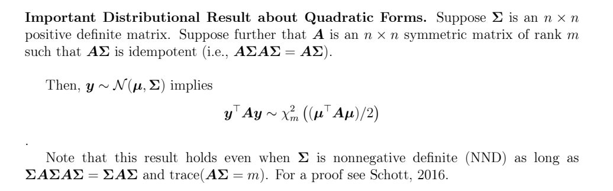

```{r, eval = T, results = F, echo = F, warning = F, message = F}
library(knitr)
```

```{r, eval = F, echo=FALSE, fig.cap="CocoMelon"}
knitr::include_graphics("Algorithm.png")
```

# Outline 

  - Q1: g2g
  - Q2: g2g
  - Q3: g2g
  - Q4: g2g

# Problem 1

Suppose $\boldsymbol{y} = \boldsymbol{X\beta} + \boldsymbol{\varepsilon}$, where $\boldsymbol{\varepsilon} \sim \mathcal{N}(\boldsymbol{0},\sigma^2 \boldsymbol{I})$ for some unknown $\sigma^2 > 0$. Let $\boldsymbol{\hat{y}} = \boldsymbol{P_X y}$.

## a) 

Determine the distribution of 

$$
\begin{bmatrix}
\boldsymbol{\hat{y}} \\ 
\boldsymbol{y - \hat{y}} \\ 
\end{bmatrix}
$$

### Useful Property: 

Linear transformation of a normal random variable is itself normal (distribution remains normal with known/calculable parameters):

$$
\boldsymbol{x} \sim \mathcal{N}(\boldsymbol{\mu}, \boldsymbol{\Sigma}) \rightarrow \boldsymbol{Ax} + \boldsymbol{b} \sim \mathcal{N}(\boldsymbol{A \mu} + \boldsymbol{b}, \boldsymbol{A \Sigma A ^{\top}})
$$

To begin, note the [Useful Property] provides us reason to assert that the following follows an MVN distribution: 

$$
\begin{bmatrix}
\boldsymbol{\hat{y}} \\ 
\boldsymbol{y - \hat{y}} \\ 
\end{bmatrix}
\sim \mathcal{N}(?, ??)
$$

Such that we need to identify the mean and covariance matrix of the above. 

To that end, note that by definition: 

$$
\begin{bmatrix}
\boldsymbol{\hat{y}} \\ 
\boldsymbol{y - \hat{y}} \\ 
\end{bmatrix}
= 
\begin{bmatrix}
\boldsymbol{P_{X}y} \\ 
\boldsymbol{y} - \boldsymbol{P_{X}y} \\ 
\end{bmatrix}
= 
\begin{bmatrix}
\boldsymbol{P_{X}} \\ 
\boldsymbol{I} - \boldsymbol{P_{X}} \\ 
\end{bmatrix} \boldsymbol{y}
$$

To calculate the mean, noting linearity of expectation: 

$$
E \left( \begin{bmatrix} \boldsymbol{P_X} \\ \boldsymbol{I} - \boldsymbol{P_X} \end{bmatrix} y \right)
= \begin{bmatrix} \boldsymbol{P_X} \\ \boldsymbol{I} - \boldsymbol{P_X} \end{bmatrix} E(y)
= \begin{bmatrix} \boldsymbol{P_X} \\ \boldsymbol{I} - \boldsymbol{P_X} \end{bmatrix} \boldsymbol{X} \boldsymbol{\beta}
= \begin{bmatrix} \boldsymbol{X} \boldsymbol{\beta} \\ \boldsymbol{X} \boldsymbol{\beta} - \boldsymbol{X} \boldsymbol{\beta} \end{bmatrix}
= \begin{bmatrix} \boldsymbol{X} \boldsymbol{\beta} \\ \boldsymbol{0} \end{bmatrix}
$$

To calculate the covariance, noting properties of the Projection Matrix (symmetric and idempotent): 

$$
\text{Var} \left( 
\begin{bmatrix} 
\boldsymbol{P_X} \\ \boldsymbol{I} - \boldsymbol{P_X} 
\end{bmatrix} 
y \right)
= 
\begin{bmatrix} 
\boldsymbol{P_X} \\ \boldsymbol{I} - \boldsymbol{P_X} 
\end{bmatrix} 
\text{Var}(y) 
\begin{bmatrix} 
\boldsymbol{P_X} \\ \boldsymbol{I} - \boldsymbol{P_X} 
\end{bmatrix}^{\top}
= 
\begin{bmatrix} 
\boldsymbol{P_X} \\ \boldsymbol{I} - \boldsymbol{P_X} 
\end{bmatrix} 
\sigma^2 \boldsymbol{I} 
\begin{bmatrix} 
\boldsymbol{P_X}, (\boldsymbol{I} - \boldsymbol{P_X})^{\top} 
\end{bmatrix}
$$

$$
\text{Var} \left( 
\begin{bmatrix} 
\boldsymbol{P_X} \\ \boldsymbol{I} - \boldsymbol{P_X} 
\end{bmatrix} 
y \right)
= \sigma^2 
\begin{bmatrix} 
\boldsymbol{P_X} \boldsymbol{P_X}^{\top} & \boldsymbol{P_X} (\boldsymbol{I} - \boldsymbol{P_X})^{\top} \\ 
(\boldsymbol{I} - \boldsymbol{P_X}) \boldsymbol{P_X}^{\top} & (\boldsymbol{I} - \boldsymbol{P_X}) (\boldsymbol{I} - \boldsymbol{P_X})^{\top} \end{bmatrix}
= \sigma^2 
\begin{bmatrix} \boldsymbol{P_X} & \boldsymbol{P_X} - \boldsymbol{P_X} \\ 
\boldsymbol{P_X} - \boldsymbol{P_X} & \boldsymbol{I} - \boldsymbol{P_X} - \boldsymbol{P_X} + \boldsymbol{P_X} 
\end{bmatrix}
$$

$$
\text{Var} \left( 
\begin{bmatrix} 
\boldsymbol{P_X} \\ \boldsymbol{I} - \boldsymbol{P_X} 
\end{bmatrix} 
y \right) 
= \sigma^2 
\begin{bmatrix} 
\boldsymbol{P_X} & \boldsymbol{0} \\ \boldsymbol{0} & \boldsymbol{I} - \boldsymbol{P_X} 
\end{bmatrix}
$$

Taken together, and again with note of the [Useful Property], we know: 

$$
\begin{bmatrix}
\boldsymbol{\hat{y}} \\ 
\boldsymbol{y - \hat{y}} \\ 
\end{bmatrix}
\sim
\mathcal{N} \left( 
\begin{bmatrix} \boldsymbol{X} \boldsymbol{\beta} \\ \boldsymbol{0} \end{bmatrix}, 
\sigma^2 
\begin{bmatrix} 
\boldsymbol{P_X} & \boldsymbol{0} \\ \boldsymbol{0} & \boldsymbol{I} - \boldsymbol{P_X} 
\end{bmatrix}
\right)
$$

\newpage

## b) 

Determine the distribution of 

$$
\hat{y}^{\top} \hat{y}
$$

Noting again the properties of the Projection Matrix (symmetric and idempotent):

$$
\hat{y}^{\top} \hat{y} = [\boldsymbol{P_X} y]^{\top} \boldsymbol{P_X} y = y^{\top} \boldsymbol{P_X}^{\top} \boldsymbol{P_X} y = y^{\top} \boldsymbol{P_X} \boldsymbol{P_X} y
= y^{\top} \boldsymbol{P_X} y
$$

where $y \sim \mathcal{N}(\boldsymbol{X} \boldsymbol{\beta}, \sigma^2 \boldsymbol{I})$. 

\

```{r, eval = T, echo=FALSE, fig.cap="CocoMelon", fig.width = 5, fig.height= 6, out.width="100%"}

```

\

Note the above "Distributional Result About Quadratic Forms". This will be our guide here. 

We want to find a matrix $\boldsymbol{A}$ such that $\boldsymbol{A} \boldsymbol{\Sigma}$ is idempotent for $\boldsymbol{\Sigma} \equiv \text{Var}(y)$.

One candidate we consider: $\boldsymbol{A} = \frac{\boldsymbol{P_X}}{\sigma^2}$

We first know that this matrix will need to be symmetric. To that end note: 

$$
\boldsymbol{A}^{\top} = \left( \frac{\boldsymbol{P_X}}{\sigma^2} \right) ^ {\top} = \frac{1}{\sigma^2} \left(\boldsymbol{P_X} \right)^{\top} = \frac{1}{\sigma^2} \boldsymbol{P_X} = \boldsymbol{A}
$$

So this matrix is symmetric (because we utilize the Projection Matrix and multiply it by $\frac{1}{\sigma^2}$, which preserves symmetry). 

Then consider, using the symmetry property shown: 

$$
\boldsymbol{A} \boldsymbol{\Sigma} = \boldsymbol{A} \text{Var}(y) = \frac{\boldsymbol{P_X}}{\sigma^2} \sigma^2 \boldsymbol{I} = \boldsymbol{P_X}
$$

So, we then know that $\boldsymbol{A}\boldsymbol{\Sigma}  = \boldsymbol{P_X}$ is idempotent, as the Projection Matrix is idempotent by definition.

We then note: $\boldsymbol{\Sigma} = \sigma^2 \boldsymbol{I}$ is positive definite since $\sigma^2 > 0$. 

We use this property to determine the rank of $\boldsymbol{A}$, with the goal of determining if it is full rank:

Using the expressions given above: 

$$
\text{rank}(\boldsymbol{A}) = \text{rank}(\frac{\boldsymbol{P_X}}{\sigma^2}) = \text{rank}(\boldsymbol{P_X}) = \text{rank}(\boldsymbol{X})
$$

Noting that scalar multiplication (non-zero) does not affect rank calculations of a matrix. 

Then, noting that both $\hat{y}^{\top}$ and $\hat{y}$ are normally distributed, we then know that the quadratic form $\hat{y}^{\top} \hat{y}$ is $\chi^2$ distributed, and that $\frac{1}{\sigma^2} \hat{y}^{\top} \hat{y}$ is a scaled $\chi^2$ distributed. The degrees of freedom parameter to this distribution is given by the rank, shown above, and we again make use of "Distributional Result About Quadratic Forms" regarding the centrality parameter. 

Taken together, this gives us the expression: 

$$
\frac{1}{\sigma^2} \hat{y}^{\top} \hat{y} = y^{\top} \frac{\boldsymbol{P_X}}{\sigma^2} y \sim \chi^2_{\text{rank}(\boldsymbol{X})} \left( \frac{\boldsymbol{X}^{\top} \boldsymbol{A} \boldsymbol{X} \boldsymbol{\beta}}{2} \right)
= \chi^2_{\text{rank}(\boldsymbol{X})} \left( \frac{\boldsymbol{X}^{\top} \frac{\boldsymbol{P_X}}{\sigma^2} \boldsymbol{X} \boldsymbol{\beta}}{2} \right)
= 
\chi^2_{\text{rank}(\boldsymbol{X})} \left( \frac{\boldsymbol{X}^{\top} \boldsymbol{P_X} \boldsymbol{X} \boldsymbol{\beta}}{2 \sigma^2} \right)
$$

Noting the results of the quadratic form: 

$$
\mathbf{y} \sim \mathcal{N}(\boldsymbol{\mu}, \boldsymbol{\Sigma})
\rightarrow
\mathbf{y}^{\top} \boldsymbol{A} \mathbf{y} \sim \chi^2_m \left( \frac{\boldsymbol{\mu}^{\top} \boldsymbol{A} \boldsymbol{\mu}}{2} \right)
$$

The remaining point to detail then is the non-centrality parameter. Knowing the underlying distributions of $\hat{y}^{\top}$ and $\hat{y}$, we then know: 

$$
\frac{\boldsymbol{X}^{\top} \boldsymbol{A} \boldsymbol{X} \boldsymbol{\beta}}{2} = \frac{1}{2}\boldsymbol{X}^{\top} \frac{\boldsymbol{P_X}}{\sigma^2} \boldsymbol{X} \boldsymbol{\beta}
= \frac{1}{2 \sigma^2} \boldsymbol{\beta}^{\top} \boldsymbol{X}^{\top} \boldsymbol{P_X} \boldsymbol{X} \boldsymbol{\beta}
= \frac{1}{2 \sigma^2} \boldsymbol{\beta}^{\top} \boldsymbol{X}^{\top} \boldsymbol{X} \boldsymbol{\beta}
$$

Taken together, we then conclude with: 

$$
\hat{y}^{\top} \hat{y} \sim \sigma^2 \chi^2_{\text{rank}(\boldsymbol{X})} \left( \frac{\boldsymbol{\beta}^{\top} \boldsymbol{X}^{\top} \boldsymbol{X} \boldsymbol{\beta}}{2\sigma^2} \right)
$$

\newpage

# Problem 2

An experiment was conducted to study the durability of coated fabric subjected to abrasive tests.
Three factors were considered: **Filler type** with two levels (F1 and F2), **Surface treatment** with two levels (S1 and S2), **Proportion of filler** with three levels (25%, 50%, and 75%).

Using a completely randomized design with two fabric samples per treatment, the amount of fabric lost (in mg) for each fabric sample was recorded. Data are available in a tab-delimited text file at:  
[FabricLoss.txt](http://dnett.github.io/S510/FabricLoss.txt).

```{r}
FabricLoss<- read.table(file = "FabricLoss.txt", 
                     header = TRUE, 
                     sep = "\t")
```

```{r}
FabricLoss$surface <- factor(FabricLoss$surface)  
FabricLoss$filler <- factor(FabricLoss$filler)
FabricLoss$p <- factor(FabricLoss$p)
FabricLoss <- FabricLoss[order(FabricLoss$surface, FabricLoss$filler, FabricLoss$p),]  

model <- lm(y ~ 0 + surface:filler:p, data = FabricLoss)
coef(model)
```

```{r}
estimate <- function(lmout, C, a=0.05){
  b=coef(lmout)
  V=vcov(lmout)
  df=lmout$df
  Cb=C%*%b
  se=sqrt(diag(C%*%V%*%t(C)))
  tval=qt(1-a/2,df)
  low=Cb-tval*se
  up=Cb+tval*se
  m=cbind(C,Cb,se,low,up)
  dimnames(m)[[2]]=c(paste("c",1:ncol(C),sep=""),
             "estimate","se",
             paste(100*(1-a),"% Conf.",sep=""),
             "limits")
  return(m)
}
```

Cell Means Model $\beta$ Matrix: 

$$
\boldsymbol{\beta} 
= 
\begin{bmatrix}
\beta_{surface1:filler1:p25} \\ 
\beta_{surface2:filler1:p25} \\
\beta_{surface1:filler2:p25} \\
\beta_{surface2:filler2:p25} \\
\beta_{surface1:filler1:p50} \\
\beta_{surface2:filler1:p50} \\
\beta_{surface1:filler2:p50} \\
\beta_{surface2:filler2:p50} \\
\beta_{surface1:filler1:p75} \\
\beta_{surface2:filler1:p75} \\
\beta_{surface1:filler2:p75} \\
\beta_{surface2:filler2:p75} \\
\end{bmatrix}
$$

## a) 

Consider a cell means model for these data. Estimate the mean and standard error for the treatment corresponding to F2, S1, and 50% filler.

```{r}
# surface1:filler2:p50
C = matrix(c(0, 0, 0, 0, 0, 0, 
             1, 0, 0, 0, 0, 0),nrow =1)

estimate(lmout = model, C = C)
```

Estimate: 233.5
SE: 11.59

\newpage

## b) 

The concept of LSMEANS has been explained carefully in lecture and course notes for the special case of a two-factor study. The concept generalizes easily to multi-factor studies. For example, in a three- factor study, the LSMEAN for level $i$ of the first factor is the OLS estimator of $\bar{\mu}_{i \cdot \cdot}$, the average of the cell means for all treatments that involve level $i$ of the first factor. Find LSMEANS for the levels of the factor filler type.

For filler1: 

$$
C_{\text{filler1}} = \frac{1}{6}
\left[
\begin{array}{cccccccccccc}
1 & 1 & 0 & 0 & 1 & 1 & 0 & 0 & 1 & 1 & 0 & 0 \\ 
\end{array}
\right]
$$

For filler2:

$$
C_{\text{filler2}} = \frac{1}{6}
\left[
\begin{array}{cccccccccccc}
0 & 0 & 1 & 1 & 0 & 0 & 1 & 1 & 0 & 0 & 1 & 1 \\ 
\end{array}
\right]
$$

Taken together: 

```{r}
C_filler = matrix(c(
  1/6, 1/6, 0, 0, 1/6, 1/6, 0, 0, 1/6, 1/6, 0, 0,  
  0, 0, 1/6, 1/6, 0, 0, 1/6, 1/6, 0, 0, 1/6, 1/6), nrow=2, byrow=TRUE)

estimate(lmout = model, C = C_filler)
```

Filler 1 LSMEANS estimate: 214.7500
Filler 2 LSMEANS estimate: 181.0833

\newpage

## c) 

We can also compute LSMEANS for estimable marginal means like $\bar{\mu}_{\cdot jk }$, the average of the cell means for all treatments involving level $j$ of the second factor and level $k$ of the third factor. Find the LSMEAN for surface treatment S2 and 25% filler.

LSMEAN for surface treatment S2 and 25% filler is a contrast/average of surface treatment S2 and 25% across filler type:

$$
C_{\text{surface2, p25}} 
= 
\frac{1}{2} 
\left[
\begin{array}{cccccccccccc}
0 & 1 & 0 & 1 & 0 & 0 & 0 & 0 & 0 & 0 & 0 & 0
\end{array}
\right]
$$

```{r}
C_surface2_p25 = matrix(c(
  0, 1/2, 0, 1/2, 0, 0, 0, 0, 0, 0, 0, 0), nrow=1, byrow=TRUE)

estimate(lmout = model, C = C_surface2_p25)
```

Estimate: 156.25

## d) 

Provide a standard error for the estimate computed in part (c).

SE, via the prior output and setup: 8.197

\newpage

## e) 

In a three-factor study we would say there are no main effects for the first factor if $\bar{\mu}_{i} = \bar{\mu}_{i^{'}}$ for all levels $i \neq i^{'}$. Conduct a test for filler type main effects. Provide an F-statistic, a p-value, and a conclusion.

```{r}
test <- function(lmout, C, d=0){
  b=coef(lmout)
  V=vcov(lmout)
  dfn=nrow(C)
  dfd=lmout$df
  Cb.d=C%*%b-d
  Fstat=drop(t(Cb.d)%*%solve(C%*%V%*%t(C))%*%Cb.d/dfn)
  pvalue=1-pf(Fstat,dfn,dfd)
  list(Fstat=Fstat,pvalue=pvalue, dfN = dfn, dfD = dfd)
}
```

```{r}
C_fillerType = matrix(c(
  1/6, 1/6, -1/6, -1/6, 1/6, 1/6, -1/6, -1/6, 1/6, 1/6, -1/6, -1/6), nrow = 1, byrow = T)   

estimate(lmout = model, C = C_fillerType)
test(lmout = model, C = C_fillerType)
```

F-statistic, $F_{1,12}$: 25.305
p-value: 0.000294
Interpretation: We have exceptionally strong evidence for a main filler type main effect and it appears that filler type is associated with fabric lost (in mg). Because the details given, i.e. "an experiment was conducted to study the durability of coated fabric subjected to abrasive tests", we cannot pursue cause-and-effect given the study design and analysis, and overall lack of understanding between the relationship between factors. 

\newpage

## f) 

In a three-factor study in which the third factor has $K$ levels, we would say there are no three-way interactions if, for all $i \neq i^{'}$ and $j \neq j^{'}$,

$$
\mu_{ij1} - \mu_{ij^{'}1} - \mu_{i^{'}j1} + \mu_{i^{'}j^{'}1} = \mu_{ij2} - \mu_{ij^{'}2} - \mu_{i^{'}j2} + \mu_{i^{'}j^{'}2} = \dots = \mu_{ijK} - \mu_{ij^{'}K} - \mu_{i^{'}jK} + \mu_{i^{'}j^{'}K}.
$$

Note that each linear combination above can be viewed as a two-way interaction effect involving the first two factors while holding the level of the third factor fixed. If these interaction effects are all the same regardless of which level of the third factor is selected, we say there are no three way interactions. Put another equivalent way, there are no three-factor interactions if

$$
\mu_{ijk} - \mu_{ij^{'}k} - \mu_{i^{'}jk} + \mu_{i^{'}j^{'}k} - \mu_{ijk^{'}} + \mu_{ij^{'}k^{'}} + \mu_{i^{'}jk^{'}} - \mu_{i^{'}j^{'}k^{'}} = 0
$$

for all $i \neq i^{'}$, $j \neq j^{'}$, and $k \neq k^{'}$. Conduct a test for three-way interactions among the factors filler type, surface treatment, and filler proportion. Provide an F-statistic, a p-value, and a conclusion.

Two-way interaction test: 

$$
\beta_{1,1,k} - \beta_{1,2,k} - \beta_{2,1,k} + \beta_{2,2,k} = 0
$$

Three way interaction test, iterate the two-way test across the filter types (or proportion, or the surface):

One row, testing interactions between 25% and 50%: 

$$
(\beta_{1,1,25} - \beta_{1,2,25} - \beta_{2,1,25} + \beta_{2,2,25}) - 
(\beta_{1,1,50} - \beta_{1,2,50} - \beta_{2,1,50} + \beta_{2,2,50}) = 0
$$
One row, testing interactions between 50% and 75%: 

$$
(\beta_{1,1,50} - \beta_{1,2,50} - \beta_{2,1,50} + \beta_{2,2,50}) - 
(\beta_{1,1,75} - \beta_{1,2,75} - \beta_{2,1,75} + \beta_{2,2,75}) = 0
$$

```{r}
C_threeway = matrix(c(
  1, -1, -1,  1, -1,  1,  1, -1,  0,  0,  0,  0,  
  0,  0,  0,  0,  1, -1, -1,  1, -1,  1,  1, -1   
), nrow=2, byrow=TRUE)  

estimate(lmout = model, C = C_threeway)
test(lmout = model, C = C_threeway)
```

F-statistic, $F_{2, 12}$: 0.890
p-value: 0.436
Interpretation: We lack sufficient evidence to conclude a three-way interaction between surface, filler type, and proportion exists. 

\newpage

## g) 

In a three-factor study, we would say there are no two-way interactions between the first and third
factors if

$$
\bar{\mu}_{i \cdot k} - \bar{\mu}_{i \cdot k^{'}} - \bar{\mu}_{i^{'} \cdot k} + \bar{\mu}_{i^{'} \cdot k^{'}} = 0
$$

for all $i \neq i^{'}$ and $k \neq k^{'}$. Conduct a test for two-way interactions between the factors filler type and
filler proportion. Provide an F-statistic, a p-value, and a conclusion.

Effectively, we're comparing marginal means across filler type and proportion to get at the two-way interaction effect. The hypotheses we're testing are then:

$$
(\beta_{\cdot, 1, 25} - \beta_{\cdot, 1, 50} - \beta_{\cdot, 2, 25} + \beta_{\cdot, 2, 50}) = 0
$$

And 

$$
(\beta_{\cdot, 1, 50} - \beta_{\cdot, 1, 75} - \beta_{\cdot, 2, 50} + \beta_{\cdot, 2, 75}) = 0
$$

This then corresponds to: 

The difference between p25 and p50:

$$
(\beta_{1,1,25} - \beta_{1,2,25}) - (\beta_{1,1,50} - \beta_{1,2,50}) - (\beta_{2,1,25} - \beta_{2,2,25}) + (\beta_{2,1,50} - \beta_{2,2,50}) = 0
$$

The difference between p50 and p75:

$$
(\beta_{1,1,50} - \beta_{1,2,50}) - (\beta_{1,1,75} - \beta_{1,2,75}) - (\beta_{2,1,50} - \beta_{2,2,50}) + (\beta_{2,1,75} - \beta_{2,2,75}) = 0
$$

```{r}
C_filler_fillerProp = matrix(c(
  1,  1, -1, -1, -1, -1,  1,  1,  0,  0,  0,  0,  # p25 vs p50
  0,  0,  0,  0,  1,  1, -1, -1, -1, -1,  1,  1   # p50 vs p75
), nrow=2, byrow=TRUE)  

estimate(lmout = model, C = C_filler_fillerProp)
test(lmout = model, C = C_filler_fillerProp)
```

F-statistic, $F_{2, 12}$: 6.565736
p-value: 0.0119
Interpretation: We have substantial/strong evidence that an interaction between filler type and filler proportion exists. The evidence that an interaction between these two factors exists implies that the association between filler type and amount of fabric lost does not appear to be the same for each filler proportion. 

\newpage

# Problem 3

When $\boldsymbol{X}$ does not have full rank, let’s see why $\boldsymbol{P_X = X(X^\top X)^{-}X^\top}$ is invariant to the choice of generalized inverse. Let $\boldsymbol{G}$ and $\boldsymbol{H}$ be two generalized inverses of $\boldsymbol{X^\top X}$. For an arbitrary $\boldsymbol{v} \in \mathbb{R}^n$, let $\boldsymbol{v = v_1 + v_2}$ with $\boldsymbol{v_1 = Xb \in C(X)}$ for some $\boldsymbol{b}$.

## a) 

Show that

$$
\boldsymbol{v^\top X G X^\top X = v^\top X}
$$

so that $\boldsymbol{X G X^\top X = X}$ for any generalized inverse.

### Answer 

As given, we may write: 

$$
\boldsymbol{v} = \boldsymbol{v}_1 + \boldsymbol{v}_2
$$

Then: 

$$
\boldsymbol{v_1} \perp \boldsymbol{v_2}
$$

And since: 

$$
\boldsymbol{v}_1 = \boldsymbol{X} \boldsymbol{b} \in C(\boldsymbol{X}) \rightarrow \boldsymbol{v}_2 \in (C(X))^{\perp}
$$ 

So may then write: 

$$
\boldsymbol{v}^{\top} \boldsymbol{X} \boldsymbol{G} \boldsymbol{X}^{\top} \boldsymbol{X} 
= (\boldsymbol{v}_1 + \boldsymbol{v}_2)^{\top} \boldsymbol{X} \boldsymbol{G} \boldsymbol{X}^{\top} \boldsymbol{X} = \boldsymbol{v}_1^{\top} \boldsymbol{X} \boldsymbol{G} \boldsymbol{X}^{\top} \boldsymbol{X} 
+ \boldsymbol{v}_2^{\top} \boldsymbol{X} \boldsymbol{G} \boldsymbol{X}^{\top} \boldsymbol{X}
$$

Each of these terms may be further evaluated. To (hopefully) make the proof more legible then, consider: 

(1):

As $\boldsymbol{v}_1 = \boldsymbol{X} \boldsymbol{b}$, we may write:

$$
\boldsymbol{v}_1^{\top} \boldsymbol{X} \boldsymbol{G} \boldsymbol{X}^{\top} \boldsymbol{X} 
= (\boldsymbol{X} \boldsymbol{b})^{\top} \boldsymbol{X} \boldsymbol{G} \boldsymbol{X}^{\top} \boldsymbol{X}
= \boldsymbol{b}^{\top} \boldsymbol{X}^{\top} \boldsymbol{X} \boldsymbol{G} \boldsymbol{X}^{\top} \boldsymbol{X}
= \boldsymbol{b}^{\top} \boldsymbol{X}^{\top} \boldsymbol{X} = \boldsymbol{b}^{\top} \boldsymbol{X}^{\top} \boldsymbol{X}
$$

Noting G is a generalized inverse. 

However, as $\boldsymbol{X} \boldsymbol{b} = \boldsymbol{v}_1$, we may simplify:

$$
\boldsymbol{v}_1^{\top} \boldsymbol{X} \boldsymbol{G} \boldsymbol{X}^{\top} \boldsymbol{X} 
 = \boldsymbol{v}_1^{\top} \boldsymbol{X}
$$


(2): 

As indicated, $\boldsymbol{v}_2$ is orthogonal to $C(\boldsymbol{X})$, such that we may write:

$$
\boldsymbol{v}_2^{\top} \boldsymbol{X} = 0 \rightarrow \boldsymbol{v}_2^{\top} \boldsymbol{X} \boldsymbol{G} \boldsymbol{X}^{\top} \boldsymbol{X} = 0
$$

Taking (1) and (2) together: 

$$
\boldsymbol{v}^{\top} \boldsymbol{X} \boldsymbol{G} \boldsymbol{X}^{\top} \boldsymbol{X} 
= \boldsymbol{v}_1^{\top} \boldsymbol{X} + 0 = \boldsymbol{v}^{\top} \boldsymbol{X}
$$

Concluding: 

$$
\boldsymbol{v^\top X G X^\top X = v^\top X}
$$

So that $\boldsymbol{X G X^\top X = X}$ for any generalized inverse.

\newpage

## b) 

Show that

$$
\boldsymbol{X G X^\top v = X H X^\top v}
$$

and thus $\boldsymbol{X G X^\top}$ is invariant to the choice of generalized inverse.

### Answer 

As given: $\boldsymbol{G}$ and $\boldsymbol{H}$ are generalized inverses of $\boldsymbol{X}^{\top} \boldsymbol{X}$, so by definition the following holds:

$$
(\boldsymbol{X}^{\top} \boldsymbol{X}) \boldsymbol{G} (\boldsymbol{X}^{\top} \boldsymbol{X}) = \boldsymbol{X}^{\top} \boldsymbol{X}
$$

And 

$$
(\boldsymbol{X}^{\top} \boldsymbol{X}) \boldsymbol{H} (\boldsymbol{X}^{\top} \boldsymbol{X}) = \boldsymbol{X}^{\top} \boldsymbol{X}
$$

For some vector $\boldsymbol{v} \in \mathbb{R}^n$, we may decompose $\boldsymbol{v}$ like in part a), i.e.:

$$
\boldsymbol{v} = \boldsymbol{v}_1 + \boldsymbol{v}_2
$$

where $\boldsymbol{v}_1 \in C(\boldsymbol{X})$ and $\boldsymbol{v}_2 \in C(\boldsymbol{X})^{\perp}$:

(Hey, quick Q, Google wasn't helpful: $\boldsymbol{v}_2 \in C(\boldsymbol{X})^{\perp} \equiv \boldsymbol{v}_2 \perp C(\boldsymbol{X})$?)

At any rate: 

$$
\boldsymbol{v}_1 = \boldsymbol{X} \boldsymbol{b}
$$

For some real-valued vector $\boldsymbol{b}$.

We may then write: 

$$
\boldsymbol{X G X^\top v} = \boldsymbol{X G X^\top} (\boldsymbol{v}_1 + \boldsymbol{v}_2) = \boldsymbol{X G X^\top v_1} + \boldsymbol{X G X^\top v_2}
$$

As defined, $\boldsymbol{v}_1 = \boldsymbol{X} \boldsymbol{b}$, so we may simplify:

$$
\boldsymbol{X G X^\top v} = \boldsymbol{X G X^\top X b} + \boldsymbol{X G X^\top v_2} = \boldsymbol{X b} + \boldsymbol{X G X^\top v_2}
$$

As G is a generalized inverse. 

Also, as defined $\boldsymbol{v}_2$ is orthogonal to $C(\boldsymbol{X})$, so the second term simplifies as well, again, similar to part a):

$$
\boldsymbol{X G X^\top v} = \boldsymbol{X b} + \boldsymbol{X G X^\top v_2} = \boldsymbol{X b} + 0 = \boldsymbol{X b}
$$

Note: The choice of starting with $\boldsymbol{G}$ was arbitrary. The same steps and derivations would follow for the generalized inverse $\boldsymbol{H}$, such that we'd also say: 

$$
\boldsymbol{X H X^\top v} = \boldsymbol{X b}
$$

$\forall \boldsymbol{v}$. 

This then shows: 

$$
\boldsymbol{X G X^\top} = \boldsymbol{X H X^\top}
$$

And that $\boldsymbol{X G X^\top}$ is invariant to the choice of the generalized inverse. 

\newpage

# Problem 4

An experiment was conducted to study the effect of two diets (1 and 2) and two drugs (1 and 2) on blood pressure in rats. A total of 40 rats were randomly assigned to the 4 combinations of diet and drug, with 10 rats per combination. Let $y_{ijk}$ be the decrease in blood pressure from the beginning to the end of the study for diet $i$, drug $j$, and rat $k$ ($i = 1, 2; j = 1, 2; k = 1, \dots, 10$). Suppose:

$$
y_{ijk} = \mu_{ij} + \varepsilon_{ijk}, \quad \varepsilon_{ijk} \sim \mathcal{N}(0, \sigma^2).
$$

A researcher suspects that the mean reduction in blood pressure will be the same for all combinations of diet and drug except for the combination of diet 1 with drug 1. This leads to consideration of the null hypothesis:

$$
H_0: \mu_{12} = \mu_{21} = \mu_{22}.
$$

Assuming model (1) holds, determine the distribution of the F-statistic you would use to test this null hypothesis: State the degrees of freedom of the statistic. Provide a fully simplified expression for the noncentrality parameter in terms of model (1) parameters.

## Answer 

Note: We have 40 observations, 4 parameters in the full model, and 2 parameters in the reduced model. Taken together: 

$$
df_{\text{full}} = 40 - 4 = 36
$$ 

And

$$
df_{\text{reduced}} = 40 - 2 = 38
$$ 

The difference between reduced and full is: 

$$
df_{\text{reduced}} - df_{\text{full}} = 2
$$ 

Thus, the F-distribution we would use is 

$$
F_{\text{diff}, \text{full}} = F_{2,36}
$$

By definition, the noncentrality parameter is given by the expression:

$$
\delta = \frac{(\boldsymbol{C} \boldsymbol{\beta} - \boldsymbol{d})^{\top} [\boldsymbol{C} (\boldsymbol{X}^{\top} \boldsymbol{X})^{-1} \boldsymbol{C}^{\top}]^{-1} (\boldsymbol{C} \boldsymbol{\beta} - \boldsymbol{d})}{2 \sigma^2}
$$

And for this given problem, our base matrices are: 

$$
\boldsymbol{\beta} =
\begin{pmatrix}
\mu_{11} \\
\mu_{12} \\
\mu_{21} \\
\mu_{22}
\end{pmatrix},
\quad
\boldsymbol{C} =
\begin{bmatrix}
0 & 1 & -1 & 0 \\
0 & 1 & 0 & -1
\end{bmatrix},
\quad
\boldsymbol{d} =
\begin{pmatrix}
0 \\
0
\end{pmatrix}, 
\quad \text{and }
\boldsymbol{X} =
\begin{bmatrix}
1 & 0 & 0 & 0 \\
1 & 0 & 0 & 0 \\
\vdots & \vdots & \vdots & \vdots \\
1 & 0 & 0 & 0 \\
0 & 1 & 0 & 0 \\
0 & 1 & 0 & 0 \\
\vdots & \vdots & \vdots & \vdots \\
0 & 1 & 0 & 0 \\
0 & 0 & 1 & 0 \\
0 & 0 & 1 & 0 \\
\vdots & \vdots & \vdots & \vdots \\
0 & 0 & 1 & 0 \\
0 & 0 & 0 & 1 \\
0 & 0 & 0 & 1 \\
\vdots & \vdots & \vdots & \vdots \\
0 & 0 & 0 & 1
\end{bmatrix}
$$

Where $\boldsymbol{X}$ is a 4 $\times$ 40 matrix. 

Using the above expressions, we then have: 

$$
\boldsymbol{C} \boldsymbol{\beta} - \boldsymbol{d} =
\begin{pmatrix}
\mu_{12} - \mu_{21} \\
\mu_{12} - \mu_{22}
\end{pmatrix}
$$

And:

```{r}
require(MASS) 
X <- matrix(c(rep(c(1, 0, 0, 0), times = 10), 
              rep(c(0, 1, 0, 0), times = 10), 
              rep(c(0, 0, 1, 0), times = 10), 
              rep(c(0, 0, 0, 1), times = 10)), nrow = 40, byrow = TRUE)
  
C <- matrix(c(0, 1, -1, 0, 
              0, 1, 0, -1), nrow = 2, byrow = TRUE)

solve(C %*% ginv(t(X) %*% X) %*% t(C)) / (10/3)
```

$$
[\boldsymbol{C} (\boldsymbol{X}^{\top} \boldsymbol{X})^{-1} \boldsymbol{C}^{\top}]^{-1} =
\frac{10}{3}
\begin{bmatrix}
2 & -1 \\
-1 & 2
\end{bmatrix}
$$

Returning back to the non-centrality expression, we can then calculate: 

$$
\delta 
=
\frac{
\begin{pmatrix}
\mu_{12} - \mu_{21} \\
\mu_{12} - \mu_{22}
\end{pmatrix}^{\top}
\left(\frac{10}{3}\right)
\begin{bmatrix}
2 & -1 \\
-1 & 2
\end{bmatrix}
\begin{pmatrix}
\mu_{12} - \mu_{21} \\
\mu_{12} - \mu_{22}
\end{pmatrix}
}{2 \sigma^2}
$$

$$
\delta 
=
\frac{
\left(\frac{10}{3}\right)
\begin{pmatrix}
\mu_{12} - \mu_{21} \\
\mu_{12} - \mu_{22}
\end{pmatrix}^{\top}
\begin{pmatrix}
\mu_{12} - 2\mu_{21} + \mu_{22} \\
\mu_{12} + \mu_{21} - 2\mu_{22}
\end{pmatrix}
}
{{2 \sigma^2}}
= 
\frac{5}{3 \sigma^2} \left[ (\mu_{12} - \mu_{21})^2 + (\mu_{12} - \mu_{22})^2 - (\mu_{12} - \mu_{21})(\mu_{12} - \mu_{22}) \right]
$$

Giving us the non-centrality parameter to this F statistic: 

$$
\delta 
= 
\frac{5}{3 \sigma^2} \left[ (\mu_{12} - \mu_{21})^2 + (\mu_{12} - \mu_{22})^2 - (\mu_{12} - \mu_{21})(\mu_{12} - \mu_{22}) \right]
= 
\frac{5}{3 \sigma^2} \left(
\mu_{12}^2 + \mu_{21}^2 + \mu_{22}^2 - \mu_{12} \mu_{21} - \mu_{12} \mu_{22} - \mu_{21} \mu_{22}
\right)
$$