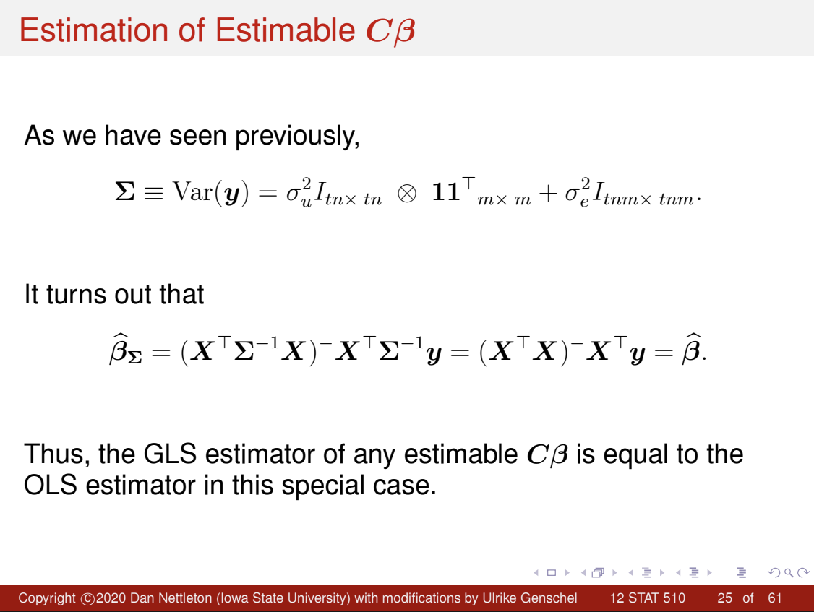

```{r, eval = T, results = F, echo = F, warning = F, message = F}
library(knitr)
```

# Q1

An experiment was conducted to compare the effectiveness of two sports drinks (denoted 1 and 2). The subjects included 60 males between the ages of 18 and 31. Each subject rode a stationary bicycle until his muscles were depleted of energy, rested for two hours, and biked again until exhaustion. During the rest period, each subject drank one of the two sports drinks as assigned by the researchers. Each subject’s performance on the second round of biking following the rest period was assigned a score between 0 and 100 based on the energy expended prior to exhaustion. Higher scores were indicative of better performance.

20 of the 60 subjects repeated the bike-rest-bike trial on a second occasion separated from the first by approximately three weeks. These subjects drank one sports drink during the first trial and the other during the second trial. The drink order was randomized for each subject by the researchers, even though previous research suggested no performance difference in repeated trials when three weeks passed between trials. The other 40 subjects performed the trial only a single time, drinking a randomly assigned sports drink during the rest period. 20 of these subjects received sports drink 1, and the other 20 received sports drink 2. A portion of the entire data set is provided in the following table.

```
Subject  Drink 1  Drink 2
1        45       52
2        69       73
...      ...      ...
20       29       46
21       35       -
22       81       -
...      ...      ...
40       55       -
41       -        17
42       -        54
...      ...      ...
60       -        61
```

Subjects 1 through 20 in the table above represent the 20 subjects who performed the trial separately for each of the sports drinks. Note that the data set contains no information about which drink was received in the first trial and which drink was received in the second trial. Throughout the remainder of this problem, please assume that this information is not important. In other words, you may assume that the subjects would have scored the same for drinks 1 and 2 regardless of the order the trials were performed.

Suppose the following model is appropriate for the data.

$$
y_{ij} = \mu_i + u_j + e_{ij}, \tag{1}
$$

where $y_{ij}$ is the score for drink $i$ and subject $j$, $\mu_i$ is the unknown mean score for drink $i$, $u_j$ is a random effect corresponding to subject $j$, and $e_{ij}$ is a random error corresponding to the score for drink $i$ and subject $j$ ($i = 1, 2$ and $j = 1, \ldots, 60$). Here $u_1, \ldots, u_{60}$ are assumed to be independent and identically distributed as $\mathcal{N}(0, \sigma^2_u)$ and independent of the $e_{ij}$'s, which are assumed to be independent and identically distributed as $\mathcal{N}(0, \sigma^2_e)$.

## a)

For each of the subjects who received both drinks, the difference between the scores (drink 1 score $-$ drink 2 score) was computed. This yielded 20 score differences denoted $d_1, \ldots, d_{20}$. Describe the distribution of these differences considering the assumptions about the distribution of the original scores in model (1).

### Answer

Given $e_{ij} \overset{iid}{\sim} N(0, \sigma_e^2)$, for each subject (experimental unit)

$$
d_j = y_{1j} - y_{2j} 
= \mu_1 + u_j + e_{1j} - (\mu_2 + u_j + e_{2j}) 
= (\mu_1 - \mu_2) + e_{1j} - e_{2j}
$$

Taking expectation: 

$$
E(d_j) = E(y_{1j} - y_{2j}) = E(\mu_1 - \mu_2 + e_{1j}  - e_{2j}) = \mu_1 - \mu_2 + 0 - 0 = \mu_1 - \mu_2
$$

And Variance:

$$
\text{Var}(d_j) = \text{Var}(y_{1j} - y_{2j}) = \text{Var}(\mu_1 - \mu_2 + e_{1j}  - e_{2j}) = \text{Var}(e_{1j}) + \text{Var}(e_{2j}) = 2\sigma_e^2
$$

There is a Covariance to account for as well, however: 

$$
\text{Cov}(d_j, d_{j'}) = \text{Cov}(e_{1j} - e_{2j}, e_{1j'} - e_{2j'}) = 0 \quad \text{for } j \ne j'
$$

as our errors are all uncorrlated for $j=1, ..., 20$. So we may use our typical GMM, and say:

$d_j \overset{iid}{\sim} N(\mu_1 - \mu_2, 2\sigma_e^2)$

Where: 

$$
\boldsymbol{d} = \mathbf{1_{20 \times 1}}[\mu_1 - \mu_2] + \boldsymbol{\epsilon}, \quad \boldsymbol{\epsilon} \sim N(0, 2\sigma_e^2 \mathbf{I}_{20 \times 20})
$$

## b)

Suppose you were given only the differences $d_1, \ldots, d_{20}$ from part a). Provide a formula for a test statistic (as a function of $d_1, \ldots, d_{20}$) that could be used to test $H_0: \mu_1 = \mu_2$.

### Answer

From part a), we have a GMM where: 

$d_j \overset{iid}{\sim} N(\mu_1 - \mu_2, 2\sigma_e^2)$

Where: 

$$
\boldsymbol{d} = \mathbf{1_{20 \times 1}}[\mu_1 - \mu_2] + \boldsymbol{\epsilon}, \quad \boldsymbol{\epsilon} \sim N(0, 2\sigma_e^2 \mathbf{I}_{20 \times 20})
$$

Taking this as given, we then can extend this via: 

$\bar{d} = \frac{1}{20} \sum_{j=1}^{20} d_j$. 

With known distribution (properties of normal distributions): 

$\bar{d} \sim N(\mu_d, \frac{\sigma_d^2}{20})$, 

Where $\mu_d = \mu_1 - \mu_2$, $\sigma_d^2 = 2\sigma_e^2$.

Using the above, we can then turn to hypothesis testing, where $H_0: \mu_d = 0$, the test statistic is given by:

$$
t = \frac{\bar{d}}{\sqrt{\text{Var}(\bar{d})}} = \frac{\bar{d}}{\sqrt{\frac{\hat{\sigma}_d^2}{20}}} = \frac{\bar{d}}{\sqrt{\frac{1}{20} \cdot \frac{1}{19} \sum_{j=1}^{20} (d_j - \bar{d})^2}}
$$

With the corresponding F-statistic given by: 

$$
F = t^2 = \frac{380 \cdot \bar{d}^2}{\sum_{j=1}^{20} (d_j - \bar{d})^2}
$$

\newpage 

## c)

Fully state the exact distribution of the test statistic provided in part b).

### Answer

$$
t \sim t_{19} \left( \frac{\mu_d}{\sqrt{\sigma_d^2/20}} \right)
$$

And: 

$$
F \sim F_{1,19} \left( \frac{10(\mu_1 - \mu_2)^2}{\sigma_d^2} \right)
$$

## d)

Let $a_1, \ldots, a_{20}$ be the scores of the subjects who received only drink 1. Let $b_1, \ldots, b_{20}$ be the scores of the subjects who received only drink 2. Suppose you were given only these 40 scores. Provide a formula for a 95\% confidence interval for $\mu_1 - \mu_2$ (as a function of $a_1, \ldots, a_{20}$ and $b_1, \ldots, b_{20}$).

### Answer

The model for all scores can be modeled via the typical linear model of the form: 

$$
[a_1, ..., a_{20}, b_1, ..., b_{20} ]^{\top} = \mathbf{y} = \left[ \mathbf{I}_{2\times2} \otimes \mathbf{1}_{20\times1} \right] 
\begin{bmatrix}
\mu_1 \\
\mu_2
\end{bmatrix}
+ \boldsymbol{\epsilon}
$$

Where:

  - $\boldsymbol{\epsilon} \sim \mathcal{N}(0, (\sigma_u^2 + \sigma_e^2)\mathbf{I}_{40 \times 40})$
  - rank(X) = 2
  - $a_j$ and $b_j$ are scores from groups 1 and 2 resp., totaling 40 observations  
  - $\bar{a} = \frac{1}{20} \sum a_j$, and $\bar{b} = \frac{1}{20} \sum b_j$
  - BLUE is given by $\bar{a} - \bar{b}$

Then:

$$
\text{Var}(\bar{a} - \bar{b}) = \text{Var}(\bar{a}) + \text{Var}(\bar{b}) = \frac{1}{10} (\sigma_u^2 + \sigma_e^2)
$$

And our Margin of Error for the Confidence Interval is given by The MSE of the Markov Model, i.e.:

$$
\hat{\text{MSE}} = \frac{1}{10}\frac{1}{40-2} \left( \sum_{j=1}^{20}(a_j - \bar{a})^2 + \sum_{j=1}^{20}(b_j - \bar{b})^2 \right) = \frac{1}{380} \left( \sum_{j=1}^{20}(a_j - \bar{a})^2 + \sum_{j=1}^{20}(b_j - \bar{b})^2 \right)
$$

Giving the Confidence interval: 

$$
\text{CI}_{95\%} = (\bar{a} - \bar{b}) \pm t_{38, 0.975} \cdot \sqrt{ \frac{1}{380} \left( \sum_{j=1}^{20}(a_j - \bar{a})^2 + \sum_{j=1}^{20}(b_j - \bar{b})^2 \right)}
$$

\newpage

## e)

Suppose you were given $d_1, \ldots, d_{20}$ from part a) and $a_1, \ldots, a_{20}$ and $b_1, \ldots, b_{20}$ from part d). Provide formulas for unbiased estimators of $\sigma^2_u$ and $\sigma^2_e$ as a function of these observations.

### Answer

From part b), we know:

$$
\operatorname{Var}(d_j) = 2\sigma_e^2= 
\hat{\sigma}_d^2 = \frac{1}{19} \sum_{j=1}^{20}(d_j - \bar{d})^2
$$

To isolate $\sigma_e^2$, we then have the expression:

$$
\hat{\sigma}_e^2 = \frac{1}{2} \cdot \frac{1}{19} \sum_{j=1}^{20}(d_j - \bar{d})^2 = \frac{1}{38} \sum_{j=1}^{20}(d_j - \bar{d})^2
$$

From part d), we have:

$$
\widehat{\sigma_u^2 + \sigma_e^2} = \frac{1}{38} \left( \sum_{j=1}^{20}(a_j - \bar{a})^2 + \sum_{j=1}^{20}(b_j - \bar{b})^2 \right)
$$

Solving for $\hat{\sigma}_u^2$ gives:

Notationally, I think there is a minor note of assuming additivity, linearity of expectations such that $\widehat{\sigma_u^2 + \sigma_e^2} = \hat{\sigma}_u^2 + \hat{\sigma}_e^2$. 

At any rate, we have a system of linear equations to solve for $\hat{\sigma}_u^2$ via: 

$$
\hat{\sigma}_u^2 = \hat{\sigma}_{\text{pooled}}^2 - \hat{\sigma}_e^2
= \frac{1}{38} \left( \sum_{j=1}^{20}(a_j - \bar{a})^2 + \sum_{j=1}^{20}(b_j - \bar{b})^2 \right)
- \frac{1}{38} \sum_{j=1}^{20}(d_j - \bar{d})^2
$$

## f)

Suppose you were given $\bar{d}_\cdot = \sum_{i=1}^{20} d_i / 20$, $\bar{a}_\cdot = \sum_{i=1}^{20} a_i / 20$, and $\bar{b}_\cdot = \sum_{i=1}^{20} b_i / 20$; where $d_1, \ldots, d_{20}$ are from part (a) and $a_1, \ldots, a_{20}$ and $b_1, \ldots, b_{20}$ are from part (d). Furthermore, suppose $\sigma^2_e$ and $\sigma^2_u$ are known. Provide a simplified expression for the estimator of $\mu_1 - \mu_2$ that you would use. Your answer should be a function of $\bar{d}_\cdot, \bar{a}_\cdot, \bar{b}_\cdot, \sigma^2_u, \sigma^2_e$.

### Answer

Both $\bar{d}$ and $\bar{a} - \bar{b}$ are independent unbiased estimators of $\mu_1 - \mu_2$. 

So the BLUE of $\mu_1 - \mu_2$ is a weighted average (a linear combination) of the terms $\bar{a}, \bar{b}, \text{ and } \bar{d}$ (no bar c, v sad). 

We then need only identify an appropriate weighting scheme. To that end, we consider using inverse-variance weights, which are guaranteed to be positive and are motivated by the Gauss–Markov theorem: among all linear unbiased estimators, the one that minimizes variance assigns weights proportional to the inverse of each estimator's variance (to be honest this came to me via Survey Stats, I am less sure how explicitly this is covered in 5100).

$$
\widehat{\mu_1 - \mu_2} = \frac{\text{Var}^{-1}(\bar{d})}{\text{Var}^{-1}(\bar{d}) + \text{Var}^{-1}(\bar{a} - \bar{b})} \cdot \bar{d} + \frac{\text{Var}^{-1}(\bar{a} - \bar{b})}{\text{Var}^{-1}(\bar{d}) + \text{Var}^{-1}(\bar{a} - \bar{b})} \cdot (\bar{a} - \bar{b})
= \frac{\sigma_u^2 + \sigma_e^2}{\sigma_u^2 + 2\sigma_e^2} \cdot \bar{d} + \frac{\sigma_e^2}{\sigma_u^2 + 2\sigma_e^2} \cdot (\bar{a} - \bar{b})
$$

\newpage

# Q2

Suppose the responses were sorted first by subject and then by drink into a response vector $y$; i.e.,

$$
y = [45, 52, 69, 73, \ldots, 29, 46, 35, 81, \ldots, 55, 17, 54, \ldots, 61]^\top.
$$

Provide $X$ and $Z$ matrices so that the model in equation (1) may be written as $y = X\beta + Z u + e$, where $\beta = [\mu_1, \mu_2]^\top$ and $u = [u_1, u_2, \ldots, u_{60}]^\top$. If possible, use Kronecker product notation to simplify your answer.

## Answer

Overall, we have 60 subjects, giving our experimental units. We also have 80 responses in total (rows in both our $\mathbf{X}$ and $\mathbf{Z}$ matrices), corresponding to an imbalanced design due to partial replication.  

Supposing the responses were sorted first by subject and then by drink into a response vector, and modeled by: 

$$
y_{ij} = \mu_i + u_j + e_{ij}, \quad i = 1, 2,\quad j = 1, \dots, 60,
$$

Each row of $\mathbf{X}$, fixed treatment effects, corresponds to receiving one of the two sports drinks, 1 in the first column if the observation (not experimental unit) received sports drink 1 and 0 otherwise, and mutually exclusive between columns. 

And each row of $\mathbf{Z}$, random effects, corresponds to one observation and contains a 1 in the column corresponding to the experimental unit, and 0 elsewhere, and mutually exclusive between columns.

And it is given that: 

$$
\mathbf{\beta} = [ \mu_1, \mu_2] ^{\top} 
$$

$$
\mathbf{u} = [ u_1, u_2, ... u_{60}]^{\top} 
$$

The Kronecker product notation for $\mathbf{X}$ and $\mathbf{Z}$ are then given by: 

The top block ($\mathbf{1}_{20 \times 1} \otimes \mathbf{I}_{2 \times 2}$) corresponds to the 20 subjects who received both drinks, totaling 40 observations.

The bottom block ($\mathbf{I}_{2 \times 2} \otimes \mathbf{1}_{20 \times 1}$) corresponds to the remaining 40 observations from subjects who received only one drink, 20 observations for each drink.

Taken together: 

### Matrix $\mathbf{X}$:

$$
X_{80 \times 2} =
\begin{bmatrix}
\mathbf{1}_{20\times 1} \otimes I_{2\times 2} \\
I_{2\times 2} \otimes \mathbf{1}_{20\times 1}
\end{bmatrix}
$$

And

Top-left block: $I_{20 \times 20} \otimes \mathbf{1}_{2 \times 1}$ corresponds to the 20 subjects who completed both drink trials--this gives 2 rows per subject, totaling 40 rows.

Bottom-right block: $I_{40 \times 40}$ corresponds to the 40 subjects who completed only one trial, contributing one row each.

Off-Diagonal Elements: The two subject groups are non-overlapping such that they are independent and have zero-valued entries.

Taken together: 

### Matrix $\mathbf{Z}$:

$$
Z_{80 \times 60} =
\begin{bmatrix}
I_{20\times 20} \otimes \mathbf{1}_{2\times 1} & 0_{40\times 40} \\
0_{40\times 20} & I_{40\times 40}
\end{bmatrix}
$$

\newpage

# Q3

The following question refers to the slide set 12 titled The ANOVA Approach to the Analysis of Linear Mixed-Effects Models.

Derive the expected mean square for xu(trt) for the ANOVA table on slide 9 using the technique illustrated on slides 15 through 17.

## Answer

$$
E\left(MS_{xu(trt)}\right) = \frac{1}{df_{xu(trt)}} E(SS_{xu(trt)})
$$

$$
= \frac{1}{tn - t} E\left( \sum_{i=1}^m \sum_{j=1}^t (y_{ij.} - \bar{y}_{i..})^2 \right)
$$

$$
= \frac{1}{tn - t} E\left( \sum_{i=1}^m \sum_{j=1}^t \left( [\mu + \tau_i + u_{ij} + \bar{\epsilon}_{ij.}] - [\mu + \tau_i + \bar{u}_i. + \bar{\epsilon}_{i..}] \right)^2 \right)
$$

$$
= \frac{1}{tn - t} E\left( \sum_{i=1}^m \sum_{j=1}^t \left( \left[ u_{ij} - \bar{u}_i \right] + \left[ \bar{\epsilon}_{ij.} - \bar{\epsilon}_{i..} \right] \right)^2 \right)
$$

$$
= \frac{m}{tn - t} \sum_{i=1}^t \sum_{j=1}^n E\left( (u_{ij} - \bar{u}_{i.}) + (\bar{\epsilon}_{ij.} - \bar{\epsilon}_{i..}) \right)^2
$$

$$
= \frac{m}{tn - t} \sum_{i=1}^t \sum_{j=1}^n \left\{ E(u_{ij} - \bar{u}_{i.})^2 + E(\bar{\epsilon}_{ij.} - \bar{\epsilon}_{i..})^2 \right\}
$$

### Note: 

The last step relies upon a few things. To begin with, the cross terms of the square cancel out (turn to zero). This is because: 

$$
E\left\{(u_{ij} - \bar{u}_{i.}) + (\bar{\epsilon}_{ij.} - \bar{\epsilon}_{i..})\right\}^2 = \text{Var}\left( (u_{ij} - \bar{u}_{i.}) + (\bar{\epsilon}_{ij.} - \bar{\epsilon}_{i..}) \right)
$$

$$
= \text{Var}(u_{ij} - \bar{u}_{i.}) + \text{Var}(\bar{\epsilon}_{ij.} - \bar{\epsilon}_{i..})
$$

$$
= E(u_{ij} - \bar{u}_{i.})^2 + E(\bar{\epsilon}_{ij.} - \bar{\epsilon}_{i..})^2
$$

Since:

$$
E(u_{ij} - \bar{u}_{i.}) = E(\bar{\epsilon}_{ij.} - \bar{\epsilon}_{i..}) = 0
$$

Because we suppose: 

$$
\begin{bmatrix}
\mathbf{u} \\
\mathbf{e}
\end{bmatrix} \sim \mathcal{N} \left( \begin{bmatrix} \mathbf{0} \\ \mathbf{0} \end{bmatrix}, \begin{bmatrix} \sigma_u^2 \mathbf{I} & \mathbf{0} \\ \mathbf{0} & \sigma_e^2 \mathbf{I} \end{bmatrix} \right)
$$

### Continuing: 

$$
E\left(MS_{xu(trt)}\right) = \frac{m}{tn - t} \sum_{i=1}^t \left[ E\left\{ \sum_{j=1}^n (u_{ij} - \bar{u}_{i.})^2 \right\} + E\left\{ \sum_{j=1}^n (\bar{\epsilon}_{ij.} - \bar{\epsilon}_{i..})^2 \right\} \right]
$$

$$
= \frac{m}{tn - t} \sum_{i=1}^t \left\{ (n - 1)\sigma_u^2 + (n - 1)\frac{\sigma_e^2}{m} \right\}
$$

And, since 

$$u_{ij} \overset{iid}{\sim} \mathcal{N}(0, \sigma_u^2)$$

And

$$
\bar{\epsilon}_{ij.} \overset{iid}{\sim} \mathcal{N}\left(0, \frac{\sigma_e^2}{m}\right)
$$

We then have: 

$$
EMS_{xu(trt)} = \frac{m}{tn - t} \left\{ t(n - 1)\sigma_u^2 + t(n - 1)\frac{\sigma_e^2}{m} \right\}
$$

Giving us

$$
E\left(MS_{xu(trt)}\right)  = m \sigma_u^2 + \sigma_e^2
$$

As given in Lecture Slides 12, around slide 18 (Slide 9 as mentioned provides df and Sums of Squares). 

\newpage

# Q4

The following question refers to the slide 25 of slide set 12 titled The ANOVA Approach to the
Analysis of Linear Mixed-Effects Models.

The slide addresses the estimation of estimable $\mathbf{C}\mathbf{\beta}$ and provides an expression for the variance $\mathbf{\Sigma} \equiv$ Var(y) and states that

$$
\hat{\mathbf{\beta}}_{GLS} = (\mathbf{X}^\top \mathbf{\Sigma}^{-1} \mathbf{X})^{-1} \mathbf{X}^\top \mathbf{\Sigma}^{-1} \mathbf{y} = (\mathbf{X}^\top \mathbf{X})^{-1} \mathbf{X}^\top \mathbf{y} = \hat{\mathbf{\beta}}_{OLS}. \tag{2}
$$

Thus, the GLS estimator of any estimable $\mathbf{C}\mathbf{\beta}$ is equal to the OLS estimator in this special case.

```{r, eval = T, echo=FALSE, fig.cap="Slide 25: CocoMelon", out.width="100%"}

```

---

## a)

What conditions have to be fulfilled for the result in (2) to hold?

### Answer 

What conditions have to be fulfilled for the result in (2) to hold?

1. Constant Variance
2. Uncorrelated Errors

Conditions 1 and 2 fall under the "Suppose..." from Slide 2 of the Chapter 12 Slides. That is, we assume: 

$$
\begin{bmatrix}
\mathbf{u} \\
\mathbf{e}
\end{bmatrix}
\sim \mathcal{N} \left( 
\begin{bmatrix}
\mathbf{0} \\
\mathbf{0}
\end{bmatrix},
\begin{bmatrix}
\sigma_u^2 \mathbf{I} & \mathbf{0} \\
\mathbf{0} & \sigma_e^2 \mathbf{I}
\end{bmatrix}
\right), \text{ where } \sigma_u^2, \sigma_e^2 \in \mathbb{R}^+ \text{ are unknown variance components.}
$$

This means: 

  - The variance-covariance matrix $\boldsymbol{\Sigma}$ of the response vector $\mathbf{y}$ must satisfy $\boldsymbol{\Sigma} = \sigma^2 \mathbf{I}$
  - The errors are iid with constant variance $\sigma^2$.

Under the above conditions, we have $\boldsymbol{\Sigma}^{-1} = \frac{1}{\sigma^2} \mathbf{I}$, which allows us to simplify the GLS estimator in the following proof.

## b)

Verify the result in (2) assuming the conditions are met.

### Answer

Assume that $\boldsymbol{\Sigma} = \sigma^2 \mathbf{I}$, i.e., that the assumptions from part a) hold. 

Then, we know $\exists \boldsymbol{\Sigma}^{-1}$, and that:

$$
\boldsymbol{\Sigma}^{-1} = \frac{1}{\sigma^2} \mathbf{I}
$$

Then, using the formula for the GLS estimator:

$$
\hat{\boldsymbol{\beta}}_{\text{GLS}} = \left( \mathbf{X}^\top \boldsymbol{\Sigma}^{-1} \mathbf{X} \right)^{-} \mathbf{X}^\top \boldsymbol{\Sigma}^{-1} \mathbf{y}
$$

We may substitute the known expression for $\boldsymbol{\Sigma}^{-1}$:

$$
\hat{\boldsymbol{\beta}}_{\text{GLS}} = \left( \mathbf{X}^\top \left( \frac{1}{\sigma^2} \mathbf{I} \right) \mathbf{X} \right)^{-} \mathbf{X}^\top \left( \frac{1}{\sigma^2} \mathbf{I} \right) \mathbf{y}
= \left( \frac{1}{\sigma^2} \mathbf{X}^\top \mathbf{X} \right)^{-} \cdot \left( \frac{1}{\sigma^2} \mathbf{X}^\top \mathbf{y} \right)
$$

Noting the properties of scalar multiplication in matrix algebra, and that $\sigma^2$ is a positive real-valued scalar, we have:

$$
\hat{\boldsymbol{\beta}}_{\text{GLS}} 
= \left( \frac{1}{\sigma^2} \mathbf{X}^\top \mathbf{X} \right)^{-} \cdot \left( \frac{1}{\sigma^2} \mathbf{X}^\top \mathbf{y} \right)
= \left( \frac{1}{\sigma^2} \right)^{-1} \left( \mathbf{X}^\top \mathbf{X} \right)^{-} \cdot \frac{1}{\sigma^2} \mathbf{X}^\top \mathbf{y}
= \sigma^2 \left( \mathbf{X}^\top \mathbf{X} \right)^{-} \cdot \frac{1}{\sigma^2} \mathbf{X}^\top \mathbf{y}
$$

Giving:

$$
\hat{\boldsymbol{\beta}}_{\text{GLS}} 
= \left( \mathbf{X}^\top \mathbf{X} \right)^{-} \mathbf{X}^\top \mathbf{y}
= \hat{\boldsymbol{\beta}}_{\text{OLS}}
$$

As, by definition the OLS equation is given via the normal equations as: 

$$
\hat{\boldsymbol{\beta}}_{\text{OLS}} = \left( \mathbf{X}^\top \mathbf{X} \right)^{-} \mathbf{X}^\top \mathbf{y}
$$
