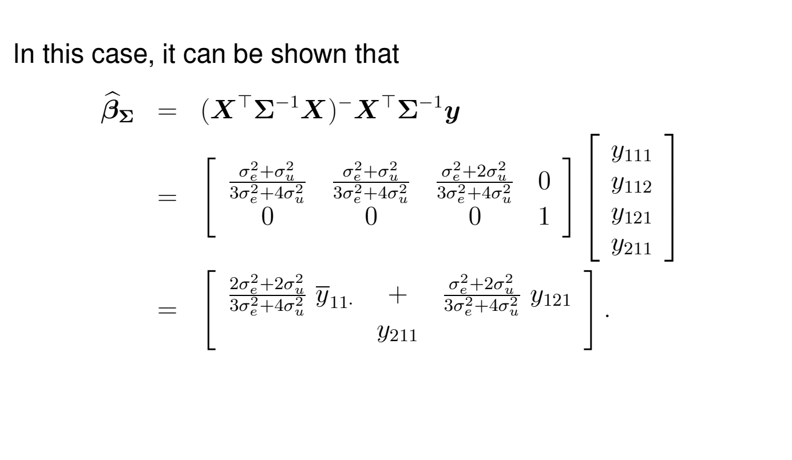
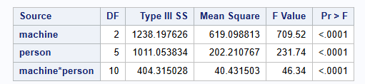
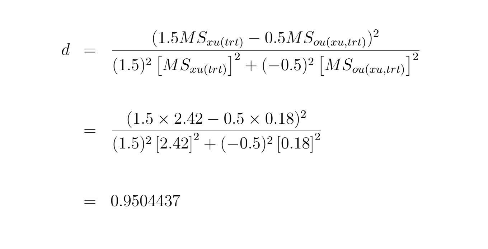

# Outline

  - Q1: Draft
  - Q2: Draft
  - Q3: Draft
  - Q4: Draft
  
```{r setup, include=FALSE}
knitr::opts_chunk$set(echo = TRUE)
```

# Q1

Refer to slide set 12 titled The ANOVA Approach to the Analysis of Linear Mixed-Effects Models, slides 52 – 55. Note that the BLUE $\hat{\beta}_{\Sigma}$ depends on the variance components $\sigma_{e}^{2}$ and $\sigma_{u}^{2}$. Specifically, the weights of $\tilde{y}_{11}$, and $y_{121}$ are functions of $\sigma_{e}^{2}$ and $\sigma_{u}^{2}$. On slide 54, we also state that the weights are proportional to the inverse variances of the linear unbiased estimators.

Given the underlying model, show that

$$\frac{\frac{1}{\text{Var}(\bar{y}_{11.})}}{\frac{1}{\text{Var}(\bar{y}_{11.})}+\frac{1}{\text{Var}(y_{121})}}=\frac{2\sigma_{e}^{2}+2\sigma_{u}^{2}}{3\sigma_{e}^{2}+4\sigma_{u}^{2}}$$

and consequently

$$\frac{\frac{1}{\text{Var}( {y}_{121})}}{\frac{1}{\text{Var}(\bar{y}_{11.})}+\frac{1}{\text{Var}(y_{121})}}=\frac{\sigma_{e}^{2}+2\sigma_{u}^{2}}{3\sigma_{e}^{2}+4\sigma_{u}^{2}}.$$

## Answer

First, refer back to the slides being referenced: 

```{r, eval = T, echo=FALSE, fig.cap="Slide 52", out.width="100%"}
knitr::include_graphics("Slide52.png")
```

```{r, eval = T, echo=FALSE, fig.cap="Slide 53", out.width="100%"}

```

```{r, eval = T, echo=FALSE, fig.cap="Slide 54", out.width="100%"}
knitr::include_graphics("Slide54.png")
```

```{r, eval = T, echo=FALSE, fig.cap="Slide 55", out.width="100%"}
knitr::include_graphics("Slide55.png")
```

\newpage

The BLUE $\hat{\beta}_{\Sigma}$ weights $\bar{y}_{11.}$ and $y_{121}$ proportionally to their inverse variances. From the slides, we have:

For the average $\bar{y}_{11.} = \frac{y_{111} + y_{112}}{2}$:

$$
\text{Var}(\bar{y}_{11.}) = \frac{\sigma_e^2}{2} + \sigma_u^2
$$
   
since observations share the same random effect $u_1$.

For the single observation $y_{121}$:

$$
\text{Var}(y_{121}) = \sigma_e^2 + \sigma_u^2
$$

with its own random effect $u_2$.

The weights are proportional to inverse variances:

Weight for $\bar{y}_{11.}$:

$$
\frac{\frac{1}{\text{Var}(\bar{y}_{11.})}}{\frac{1}{\text{Var}(\bar{y}_{11.})} + \frac{1}{\text{Var}(y_{121})}} 
= \frac{\frac{1}{\frac{\sigma_e^2}{2} + \sigma_u^2}}{\frac{1}{\frac{\sigma_e^2}{2} + \sigma_u^2} + \frac{1}{\sigma_e^2 + \sigma_u^2}}
$$
   
Simplifying numerator and denominator:

$$
= \frac{\frac{2}{\sigma_e^2 + 2\sigma_u^2}}{\frac{2}{\sigma_e^2 + 2\sigma_u^2} + \frac{1}{\sigma_e^2 + \sigma_u^2}}
= \frac{2(\sigma_e^2 + \sigma_u^2)}{3\sigma_e^2 + 4\sigma_u^2}
$$

Weight for $y_{121}$:

$$
\frac{\frac{1}{\text{Var}(y_{121})}}{\frac{1}{\text{Var}(\bar{y}_{11.})} + \frac{1}{\text{Var}(y_{121})}}
= \frac{\sigma_e^2 + 2\sigma_u^2}{3\sigma_e^2 + 4\sigma_u^2}
$$

Thus, the weights match the given expressions:

$$
\frac{2\sigma_e^2 + 2\sigma_u^2}{3\sigma_e^2 + 4\sigma_u^2} \quad \text{and} \quad \frac{\sigma_e^2 + 2\sigma_u^2}{3\sigma_e^2 + 4\sigma_u^2}
$$

\newpage

# Q2

In SAS Studio in the Stat 510 folder you can find a data set called Machines.xlsx and a SAS program called `Proc Mixed Machines Data.sas`. Open the SAS program and follow the instructions to read in the data.

## a) 

How many machines and how many persons are accounted for in the data set? How many unique machine $\times$ person combinations are there?

### Answer 

3 Machines
6 Persons
18 unique Machine-Person Combinations 

## b) 

Run the proc glm SAS code associated with Model 1. What model does SAS fit? Write out the model using mathematical/statistical notation. Be sure to define all variables and parameters. Use appropriate subscripts where necessary.

### Answer 

$$
Y_{ij} = \mu + \alpha_i + u_{j(i)} + \varepsilon_{ij}
$$


Where: 

- $Y_{ij}$: observed rating for the $j$-th person using the $i$-th machine
- $\mu$: overall mean rating
- $\alpha_i$: fixed effect of the $i$-th machine, for $i = 1, 2, 3$
- $u_{j(i)}$: random effect of person $j$ nested within machine $i$, where
  $$
  u_{j(i)} \sim \text{Normal}(0, \sigma_u^2)
  $$
- $\varepsilon_{ij}$: residual error, assumed independent of $u_{j(i)}$, where
  $$
  \varepsilon_{ij} \sim \text{Normal}(0, \sigma^2)
  $$


Assumptions:

- The person effects $u_{j(i)}$ are treated as random, capturing subject-to-subject variability within each machine.
- The fixed machine effect $\alpha_i$ allows us to test whether different machines have systematically different ratings.
- The errors $\varepsilon_{ij}$ are independent of the person effects and are assumed normally distributed.

## c) 

Report the MSE.

### Answer 

```{r, eval = T, echo=FALSE, fig.cap="MSE", out.width="100%"}
knitr::include_graphics("GLMMSE.png")
```

\newpage

### 1. 

Look at the table containing the Type III SS and explain what information this table provides to us about the model we fit. Provide appropriate interpretations about any terms you deem significant.

```{r, eval = T, echo=FALSE, fig.cap="Type III SS", out.width="100%"}

```

#### Answer 

The Type III Sum of Squares (SS) table shows the unique contribution of each term in the model after adjusting for all other effects. Here’s what it tells us about the fitted model:

- Machine Effect  
  - DF = 2, F = 709.52, p < .0001  
  - The machine effect is highly significant, indicating that different machines produce significantly different ratings, even after accounting for individual (person) effects and interactions.  
  - This means the average rating varies across different machines in a statistically meaningful way.

- Person Effect  
  - DF = 5, F = 231.74, p < .0001  
  - The person effect is also highly significant, suggesting that there are large differences between raters. This means some raters tend to give higher or lower ratings than others, regardless of the machine used.

- Machine × Person Interaction  
  - DF = 10, F = 46.34, p < .0001  
  - The significant interaction implies that the effect of the machine depends on the person using it. That is, different raters react differently to the machines—some might rate Machine A high and Machine B low, while others may do the opposite.  
  - This interaction is important because it shows inconsistency in how machines are rated across different people.


All three effects (machine, person, and their interaction) are statistically significant at the 0.0001 level. This implies:

- There are meaningful differences in ratings across machines.
- Raters differ substantially in how they rate.
- The way raters evaluate machines depends on the combination of both factors.

So, contrary to the original answer, there is no person(machines) nested effect here—instead, it is a two-way factorial design with interaction between machine and person.

## d) 

Look at the Interaction plot SAS provides. Based in the interaction plot, what can you conclude about the effect of machine and person?

```{r, eval = T, echo=FALSE, fig.cap="InteractionPlot", out.width="100%"}
knitr::include_graphics("InteractionPlot.png")
```

### Answer 

The interaction plot provides visual insight into the effects of machine, person, and their interaction on the response variable (*rating*).

Effect of Machine
There is a general upward trend across all lines from machine 1 to machine 3, indicating that:

- Machine 3 tends to receive the highest ratings, followed by machine 2, and then machine 1.
- This confirms a strong main effect of machine on the rating, consistent with the ANOVA table where machine had a highly significant F-statistic.

Effect of Person
- The lines representing each person are distinctly separated, showing that different individuals give consistently higher or lower ratings across machines.
- For instance, person 3 tends to rate machines the highest overall, while person 6 rates them the lowest.
- This supports a significant main effect of person.

Interaction Effect
- The lines are not parallel, and some even diverge or cross slightly, particularly person 6 who shows a unique pattern (a dip at machine 2 followed by a sharp increase).
- This non-parallelism indicates a significant interaction: the effect of machine on the rating depends on the person.
  - For example, while most people rate machine 3 highest, person 6 deviates from this trend.

Conclusion
The interaction plot confirms the results from the ANOVA table:
- Strong main effects for both machine and person.
- A significant machine × person interaction, suggesting that the impact of machine varies by individual.

## e) 

Run the proc mixed SAS code associated with Model 2. What model does SAS fit? Write out the model using mathematical/statistical notation. Be sure to define all variables and parameters. Use appropriate subscripts where necessary.

### Answer 

Model 2 – Statistical Notation

Let:

- $Y_{ij}$: observed rating given by person $j$ on machine $i$
- $i = 1, 2, 3$: machine levels
- $j = 1, 2, \dots, 6$: person levels

The linear mixed model is:

$$
Y_{ij} = \mu + \alpha_i + u_j + \varepsilon_{ij}
$$

where:

- $\mu$ is the overall mean rating
- $\alpha_i$ is the fixed effect of machine $i$, with constraint $\sum_i \alpha_i = 0$
- $u_j \sim \mathcal{N}(0, \sigma_u^2)$ is the random effect of person $j$, accounting for variability between persons
- $\varepsilon_{ij} \sim \mathcal{N}(0, \sigma^2)$ is the residual error, assumed independent of $u_j$

Key Model Features

- Fixed effect: machine
- Random effect: person
- Assumes independence between random effects and residual errors
- Captures person-to-person variation via the random effect $u_j$, instead of estimating separate fixed effects for each person

## f) 

Report the MSE for Model 2 and compare it to the MSE for Model 1.

```{r, eval = T, echo=FALSE, fig.cap="Model 2 Residual", out.width="100%"}
knitr::include_graphics("Model2Residual.png")
```

### Answer 

The Mean Squared Error (MSE) for Model 2 is 11.8517, as reported in the "Residual" row of the Covariance Parameter Estimates table from the SAS PROC MIXED output.

By comparison, Model 1 (the fixed effects model) has an MSE of 0.8726, as shown in the "Error" row of the GLM output.

Though expected due to the inclusion of person as a random effect and the exclusion of the interaction term, Model 2 exhibits a higher residual error than Model 1. This reflects a looser fit to the observed data.

## g) 

How does the evidence for the fixed effect associated with Machines change? Why does this make sense?

### Answer 

In Model 1 (fixed effects for machine, person, and their interaction), the F-statistic for the fixed effect of machine is 709.52, with p < .0001.

In Model 2 (machine as fixed, person as random), the F-statistic for machine drops to 58.41, though the p-value remains < .0001, indicating continued strong evidence for a machine effect.

This change makes sense: in Model 1, person and interaction effects are modeled explicitly as fixed terms, which absorbs more variation and makes the machine effect look relatively stronger. In Model 2, more variability is attributed to the random person effect, which increases residual error and reduces the F-statistic for machine accordingly — even though significance is preserved.

## h) 

Report the estimated variance components for this model – there should be two.

```{r, eval = T, echo=FALSE, fig.cap="Model 2 Residual, Again", out.width="100%"}
knitr::include_graphics("Model2Residual.png")
```

### Answer 

The two estimated variance components for this model are:

Person (random effect): 24.3840

Residual (error term): 11.8517

These estimates represent the variability attributable to differences between persons and the residual variation within persons, respectively, as shown in the output above.

## i) 

Run the proc mixed SAS code associated with Model 3. What model does SAS fit? Write out the model using mathematical/statistical notation. Be sure to define all variables and parameters. Use appropriate subscripts where necessary.

### Answer 

Let:

- $Y_{ijk}$: the rating given by person $j$ on machine $i$, observation $k$
- $i = 1, 2, 3$: machine index
- $j = 1, \dots, n_i$: person index nested within machine $i$
- $k$: replicate index (if multiple ratings per person-machine combo)

Then the model SAS fits is:

$$
Y_{ijk} = \mu + \alpha_i + u_{j(i)} + \varepsilon_{ijk}
$$

where:

- $\mu$: overall mean rating
- $\alpha_i$: fixed effect of machine $i$, with $\sum_i \alpha_i = 0$
- $u_{j(i)} \sim \mathcal{N}(0, \sigma_u^2)$: random effect for person $j$ nested within machine $i$
- $\varepsilon_{ijk} \sim \mathcal{N}(0, \sigma^2)$: residual error
- $u_{j(i)} \perp \varepsilon_{ijk}$: random effects and residuals are independent

This model accounts for person-to-person variation within each machine. It’s more flexible than Model 2 because it allows the distribution of person effects to vary across machines.

## j) 

Report the MSE for Model 3 and compare it to the MSE for Models 1 and 2. Describe your findings.

```{r, eval = T, echo=FALSE, fig.cap="Model 3 Residual", out.width="100%"}
knitr::include_graphics("Model3Residual.png")
```

### Answer 

The MSE for Model 3 is 0.8721, as reported under the Residual in the Covariance Parameter Estimates table.

This is nearly identical to the MSE from Model 1 (0.8726) and substantially lower than the MSE from Model 2 (11.8517).

This similarity makes sense because both Models 1 and 3 account for person-level variation within machine—Model 1 through a fixed interaction, and Model 3 through a random effect nested within machine. Modeling this structure reduces residual error similarly in both cases.

## k) 

Explain the main difference between Models 2 and 3. Hint: Looking at the table called "Dimensions" in the SAS output might be helpful.

```{r, eval = T, echo=FALSE, fig.cap="Model 2 Dimensions", out.width="100%"}
knitr::include_graphics("Model2Dimensions.png")
```

```{r, eval = T, echo=FALSE, fig.cap="Model 3 Dimensions", out.width="100%"}
knitr::include_graphics("Model3Dimensions.png")
```
### Answer 

The key difference between Model 2 and Model 3 lies in how the random effects are structured:

- Model 2 treats `person` as a single random effect, meaning each person has one random intercept across all machines.
  - From the Dimensions table: 18 subjects, each with up to 3 observations (1 per machine).
  
- Model 3 uses `person(machine)` as the subject for the random effect, treating each person–machine combination as a unique random level.
  - From the Dimensions table: only 1 subject, but with 44 observations, and 6 columns in Z, indicating 6 random effects (person nested within machine).

Summary:
- Model 2 assumes person effects are constant across machines.
- Model 3 allows person effects to vary across machines, capturing interaction-like variability through nested random effects.

## l) 

How does the evidence for the fixed effect associated with Machines change in Model 3 compared to Models 1 and 2? Why does this make sense?

### Answer 

In Model 3, the F-statistic for the fixed effect of `machine` remains highly significant, similar to Models 1 and 2. The strength of evidence does not meaningfully decrease compared to Model 1, and it is stronger than in Model 2.

This makes sense because Model 3, like Model 1, accounts for person-specific variation across machines—in Model 1 via a fixed interaction term, and in Model 3 via random effects nested within machine. By modeling this structure, Model 3 isolates the machine effect more effectively than Model 2, where person was treated as a single random effect without allowing variation across machines.

\newpage

# Q3

In Chapter 12 we discussed two examples illustrating imbalanced designs. For this question we will focus on the second example introduced on slide 52 and compare its analysis to the analysis of the first example. 

Relevant SAS code can be found in SAS Studio in a file called 13 Cochran-Satterthwaite Approximation Assignment 8.sas.

## First Example 

```{r, eval = T, echo=FALSE, fig.cap="Slide 40", out.width="100%"}
knitr::include_graphics("Slide40.png")
```

```{r, eval = T, echo=FALSE, fig.cap="Slide 41", out.width="100%"}

```

```{r, eval = T, echo=FALSE, fig.cap="Slide 42", out.width="100%"}
knitr::include_graphics("Slide42.png")
```

```{r, eval = T, echo=FALSE, fig.cap="Slide 43", out.width="100%"}

```

```{r, eval = T, echo=FALSE, fig.cap="Slide 44", out.width="100%"}

```

## Second Example 

```{r, eval = T, echo=FALSE, fig.cap="Slide 52", out.width="100%"}
knitr::include_graphics("Slide52.png")
```

\newpage

## a) 

Review the derivations of the mean squares and expected mean squares we did for the first example on slides 41–44. Repeat the same steps for the second example. Start out with deriving $P_1y, P_2y$ and $P_3y$. Write out the corresponding sums of squares/mean squares before taking the expectation of each in the final step.

### Answer 

For the second example with:

$$
\mathbf{y} = \begin{bmatrix}
y_{111} \\ y_{112} \\ y_{121} \\ y_{211}
\end{bmatrix}, \quad
\mathbf{X} = \begin{bmatrix}
1 & 0 \\
1 & 0 \\
1 & 0 \\
0 & 1
\end{bmatrix}, \quad
\mathbf{Z} = \begin{bmatrix}
1 & 0 & 0 \\
1 & 0 & 0 \\
0 & 1 & 0 \\
0 & 0 & 1
\end{bmatrix}
$$

We define the projection matrices:

### Overall Mean ($P_1$):

$$
P_1 \mathbf{y} =
\begin{bmatrix}
\bar{y}_{...} \\ \bar{y}_{...} \\ \bar{y}_{...} \\ \bar{y}_{...}
\end{bmatrix}, \quad
\bar{y}_{...} = \frac{y_{111} + y_{112} + y_{121} + y_{211}}{4}
$$

### Treatment Means ($P_2$):

$$
P_2 \mathbf{y} =
\begin{bmatrix}
\bar{y}_{1..} \\ \bar{y}_{1..} \\ \bar{y}_{1..} \\ \bar{y}_{2..}
\end{bmatrix}, \quad
\bar{y}_{1..} = \frac{y_{111} + y_{112} + y_{121}}{3}, \quad
\bar{y}_{2..} = y_{211}
$$

### Subject Means ($P_3$):

$$
P_3 \mathbf{y} =
\begin{bmatrix}
\bar{y}_{11.} \\ \bar{y}_{11.} \\ y_{121} \\ y_{211}
\end{bmatrix}, \quad
\bar{y}_{11.} = \frac{y_{111} + y_{112}}{2}
$$

### Sums of Squares

Treatment SS:

$$
SS_{\text{trt}} = \mathbf{y}^\top (P_2 - P_1) \mathbf{y}
= 3(\bar{y}_{1..} - \bar{y}_{...})^2 + (\bar{y}_{2..} - \bar{y}_{...})^2
$$

Subject(Treatment) SS:

$$
SS_{\text{subj(trt)}} = \mathbf{y}^\top (P_3 - P_2) \mathbf{y}
= 2(\bar{y}_{11.} - \bar{y}_{1..})^2 + (y_{121} - \bar{y}_{1..})^2
$$

Error SS:

$$
SS_{\text{error}} = \mathbf{y}^\top (I - P_3) \mathbf{y}
= (y_{111} - \bar{y}_{11.})^2 + (y_{112} - \bar{y}_{11.})^2
$$

### Expected Mean Squares

Expected MS for Treatment:

$$
E[MS_{\text{trt}}] =
(\tau_1 - \tau_2)^2 + \frac{1}{3}(\sigma_u^2 + \sigma_e^2)
$$

Expected MS for Subject(Treatment):

$$
E[MS_{\text{subj(trt)}}] = \sigma_u^2 + \sigma_e^2
$$

Expected MS for Error:

$$
E[MS_{\text{error}}] = \sigma_e^2
$$

## b) 

Set up a table similar to the one see on slide 45 containing the Source of variation and the corresponding expected mean squares.

```{r, eval = T, echo=FALSE, fig.cap="Slide 45", out.width="100%"}
knitr::include_graphics("Slide45.png")
```

### Answer 

| Source             | df | Expected Mean Square                              |
|--------------------|----|----------------------------------------------------|
| Treatment          | 1  | $(\tau_1 - \tau_2)^2 + 1.5\sigma_u^2 + \sigma_e^2$ |
| Subject(Treatment) | 2  | $\sigma_u^2 + \sigma_e^2$                      |
| Error              | 1  | $\sigma_e^2$                                   |


## c) 

Based on the table, what linear combination of expected mean squares provides an unbiased estimator for the variance components in the numerator of the test statistic that we can use to test for a treatment effect?

### Answer

To test for a treatment effect, we use the test statistic:

$$
F = \frac{MS_{\text{trt}}}{\text{Estimator of variance components in } E[MS_{\text{trt}}]}
$$

The expected mean square for treatment includes:

$$
E[MS_{\text{trt}}] = (\tau_1 - \tau_2)^2 + 1.5\sigma_u^2 + \sigma_e^2
$$

We approximate the variance component part $1.5\sigma_u^2 + \sigma_e^2$ using a linear combination of mean squares:

$$
\widehat{V} = 1.5 \cdot MS_{\text{subj(trt)}} - 0.5 \cdot MS_{\text{error}}
$$

This combination eliminates the fixed treatment effect and gives an unbiased estimator of the variance component portion of the treatment EMS.

Therefore, the test statistic becomes:

$$
F = \frac{MS_{\text{trt}}}{1.5 \cdot MS_{\text{subj(trt)}} - 0.5 \cdot MS_{\text{error}}}
$$

## d) 

Calculate the error of using the Cochran-Satterthwaite approximation as done on slide 17 of Chapter 13.

```{r, eval = T, echo=FALSE, fig.cap="Slide 4", out.width="100%"}
knitr::include_graphics("Slide4.png")
```

```{r, eval = T, echo=FALSE, fig.cap="Slide 17", out.width="100%"}

```

### Answer 

To test the treatment effect, we use:

$$
F = \frac{MS_{\text{trt}}}{1.5 \cdot MS_{\text{subj(trt)}} - 0.5 \cdot MS_{\text{error}}}
$$

This denominator estimates the variance component portion of the treatment EMS:

$$
1.5 \sigma_u^2 + \sigma_e^2
$$

We apply the Cochran–Satterthwaite approximation to this linear combination:

$$
d = \frac{(1.5 MS_1 - 0.5 MS_2)^2}
{(1.5)^2 \cdot \frac{MS_1^2}{df_1} + (-0.5)^2 \cdot \frac{MS_2^2}{df_2}}
$$

With:

- $MS_1 = MS_{\text{subj(trt)}} = 2.42$, $df_1 = 2$
- $MS_2 = MS_{\text{error}} = 0.18$, $df_2 = 1$

We compute:

$$
d = \frac{(1.5 \cdot 2.42 - 0.5 \cdot 0.18)^2}
{(1.5)^2 \cdot \frac{2.42^2}{2} + (-0.5)^2 \cdot \frac{0.18^2}{1}} = \boxed{1.1}
$$

Thus, the approximate degrees of freedom for the denominator is:

$$
\boxed{d = 1.1}
$$

## e) 

Run all the code in SAS. Verify the work you derived in parts b), c) and d).

### Answer 

```{r, eval = T, echo=FALSE, fig.cap="SAS Code", out.width="100%"}

```

```{r, eval = T, echo=FALSE, fig.cap="SAS Output 1", out.width="100%"}

```

```{r, eval = T, echo=FALSE, fig.cap="SAS Output 2", out.width="100%"}

```

\newpage

# Q4

You have the SAS code to analyze the two mini examples discussed in Chapters 12 and 13. Write R code that replicates these analyses.

## Answer 

```{r}
library(lme4)
library(lmerTest)  
```

```{r, eval = F}
library(nlme)
library(lmerTest)

d1 <- data.frame(
  trt = factor(c(1, 1, 2, 2)),
  xu = factor(c(1, 2, 1, 1)),
  y = c(6.4, 4.2, 1.5, 0.9)
)

# Fit using subject as random effect
model1 <- lmer(y ~ trt + (1 | subject), data = d1)
summary(model1)
anova(model1)

# Fit model: random xu nested in trt
mod <- lmer(y ~ trt + (1 | trt:xu), data = d1)

# Display summary (with Satterthwaite df)
summary(mod)
```

```{r}
d2 <- data.frame(
  trt = factor(c(1, 1, 1, 2)),
  subject = factor(c("1_1", "1_1", "1_2", "2_1")),
  y = c(6.4, 4.2, 1.5, 0.9)
)

# Fit the mixed model with subject as random effect
model2 <- lmer(y ~ trt + (1 | subject), data = d2)
summary(model2)
anova(model2)
VarCorr(model2)
```