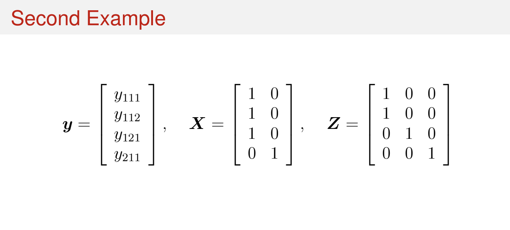

# Outline

  - Q1: Draft
  - Q2: Skeleton
  - Q3: All but part e) Draft
  - Q4: Example 1,2 Draft
  
```{r setup, include=FALSE}
knitr::opts_chunk$set(echo = TRUE)
```

# Q1

Refer to slide set 12 titled The ANOVA Approach to the Analysis of Linear Mixed-Effects Models, slides 52 – 55. Note that the BLUE $\hat{\beta}_{\Sigma}$ depends on the variance components $\sigma_{e}^{2}$ and $\sigma_{u}^{2}$. Specifically, the weights of $\tilde{y}_{11}$, and $y_{121}$ are functions of $\sigma_{e}^{2}$ and $\sigma_{u}^{2}$. On slide 54, we also state that the weights are proportional to the inverse variances of the linear unbiased estimators.

Given the underlying model, show that

$$\frac{\frac{1}{\text{Var}(\bar{y}_{11.})}}{\frac{1}{\text{Var}(\bar{y}_{11.})}+\frac{1}{\text{Var}(y_{121})}}=\frac{2\sigma_{e}^{2}+2\sigma_{u}^{2}}{3\sigma_{e}^{2}+4\sigma_{u}^{2}}$$

and consequently

$$\frac{\frac{1}{\text{Var}( {y}_{121})}}{\frac{1}{\text{Var}(\bar{y}_{11.})}+\frac{1}{\text{Var}(y_{121})}}=\frac{\sigma_{e}^{2}+2\sigma_{u}^{2}}{3\sigma_{e}^{2}+4\sigma_{u}^{2}}.$$

## Answer

First, refer back to the slides being referenced: 

```{r, eval = T, echo=FALSE, fig.cap="Slide 52", out.width="100%"}

```

```{r, eval = T, echo=FALSE, fig.cap="Slide 53", out.width="100%"}
knitr::include_graphics("Slide53.png")
```

```{r, eval = T, echo=FALSE, fig.cap="Slide 54", out.width="100%"}

```

```{r, eval = T, echo=FALSE, fig.cap="Slide 55", out.width="100%"}

```

\newpage

The BLUE $\hat{\beta}_{\Sigma}$ weights $\bar{y}_{11.}$ and $y_{121}$ proportionally to their inverse variances. From the slides, we have:

For the average $\bar{y}_{11.} = \frac{y_{111} + y_{112}}{2}$:

\[
\text{Var}(\bar{y}_{11.}) = \frac{\sigma_e^2}{2} + \sigma_u^2
\]
   
since observations share the same random effect $u_1$.

For the single observation $y_{121}$:

\[
\text{Var}(y_{121}) = \sigma_e^2 + \sigma_u^2
\]

with its own random effect $u_2$.

The weights are proportional to inverse variances:

Weight for $\bar{y}_{11.}$:

\[
\frac{\frac{1}{\text{Var}(\bar{y}_{11.})}}{\frac{1}{\text{Var}(\bar{y}_{11.})} + \frac{1}{\text{Var}(y_{121})}} 
= \frac{\frac{1}{\frac{\sigma_e^2}{2} + \sigma_u^2}}{\frac{1}{\frac{\sigma_e^2}{2} + \sigma_u^2} + \frac{1}{\sigma_e^2 + \sigma_u^2}}
\]
   
Simplifying numerator and denominator:

\[
= \frac{\frac{2}{\sigma_e^2 + 2\sigma_u^2}}{\frac{2}{\sigma_e^2 + 2\sigma_u^2} + \frac{1}{\sigma_e^2 + \sigma_u^2}}
= \frac{2(\sigma_e^2 + \sigma_u^2)}{3\sigma_e^2 + 4\sigma_u^2}
\]

Weight for $y_{121}$:

\[
\frac{\frac{1}{\text{Var}(y_{121})}}{\frac{1}{\text{Var}(\bar{y}_{11.})} + \frac{1}{\text{Var}(y_{121})}}
= \frac{\sigma_e^2 + 2\sigma_u^2}{3\sigma_e^2 + 4\sigma_u^2}
\]

Thus, the weights match the given expressions:

\[
\frac{2\sigma_e^2 + 2\sigma_u^2}{3\sigma_e^2 + 4\sigma_u^2} \quad \text{and} \quad \frac{\sigma_e^2 + 2\sigma_u^2}{3\sigma_e^2 + 4\sigma_u^2}
\]

\newpage

# Q2

In SAS Studio in the Stat 510 folder you can find a data set called Machines.xlsx and a SAS program called Proc Mixed Machines Data.sas. Open the SAS program and follow the instructions to read in the data.

## a) 

How many machines and how many persons are accounted for in the data set? How many unique machine $\times$ person combinations are there?

### Answer 


## b) 

Run the proc glm SAS code associated with Model 1. What model does SAS fit? Write out the model using mathematical/statistical notation. Be sure to define all variables and parameters. Use appropriate subscripts where necessary.

### Answer 

## c) 

Report the MSE.

### Answer 

### 1. 

Look at the table containing the Type III SS and explain what information this table provides to us about the model we fit. Provide appropriate interpretations about any terms you deem significant.

#### Answer 

## d) 

Look at the Interaction plot SAS provides. Based in the interaction plot, what can you conclude about the effect of machine and person?

### Answer 

## e) 

Run the proc mixed SAS code associated with Model 2. What model does SAS fit? Write out the model using mathematical/statistical notation. Be sure to define all variables and parameters. Use appropriate subscripts where necessary.

### Answer 

## f) 

Report the MSE for Model 2 and compare it to the MSE for Model 1.

### Answer 

## g) 

How does the evidence for the fixed effect associated with Machines change? Why does this make sense?

### Answer 

## h) 

Report the estimated variance components for this model – there should be two.

### Answer 

## i) 

Run the proc mixed SAS code associated with Model 3. What model does SAS fit? Write out the model using mathematical/statistical notation. Be sure to define all variables and parameters. Use appropriate subscripts where necessary.

### Answer 

## j) 

Report the MSE for Model 3 and compare it to the MSE for Models 1 and 2. Describe your findings.

### Answer 

## k) 

Explain the main difference between Models 2 and 3. Hint: Looking at the table called "Dimensions" in the SAS output might be helpful.

### Answer 

## l) 

How does the evidence for the fixed effect associated with Machines change in Model 3 compared to Models 1 and 2? Why does this make sense?

### Answer 

\newpage

# Q3

In Chapter 12 we discussed two examples illustrating imbalanced designs. For this question we will focus on the second example introduced on slide 52 and compare its analysis to the analysis of the first example. 

Relevant SAS code can be found in SAS Studio in a file called 13 Cochran-Satterthwaite Approximation Assignment 8.sas.

## First Example 

```{r, eval = T, echo=FALSE, fig.cap="Slide 40", out.width="100%"}

```

```{r, eval = T, echo=FALSE, fig.cap="Slide 41", out.width="100%"}
knitr::include_graphics("Slide41.png")
```

```{r, eval = T, echo=FALSE, fig.cap="Slide 42", out.width="100%"}

```

```{r, eval = T, echo=FALSE, fig.cap="Slide 43", out.width="100%"}
knitr::include_graphics("Slide43.png")
```

```{r, eval = T, echo=FALSE, fig.cap="Slide 44", out.width="100%"}
knitr::include_graphics("Slide44.png")
```

## Second Example 

```{r, eval = T, echo=FALSE, fig.cap="Slide 52", out.width="100%"}

```

\newpage

## a) 

Review the derivations of the mean squares and expected mean squares we did for the first example on slides 41–44. Repeat the same steps for the second example. Start out with deriving $P_1y, P_2y$ and $P_3y$. Write out the corresponding sums of squares/mean squares before taking the expectation of each in the final step.

### Answer 

For the second example with:

\[
\mathbf{y} = \begin{bmatrix}
y_{111} \\ y_{112} \\ y_{121} \\ y_{211}
\end{bmatrix}, \quad
\mathbf{X} = \begin{bmatrix}
1 & 0 \\
1 & 0 \\
1 & 0 \\
0 & 1
\end{bmatrix}, \quad
\mathbf{Z} = \begin{bmatrix}
1 & 0 & 0 \\
1 & 0 & 0 \\
0 & 1 & 0 \\
0 & 0 & 1
\end{bmatrix}
\]

We define the projection matrices:

### Overall Mean (\(P_1\)):

\[
P_1 \mathbf{y} =
\begin{bmatrix}
\bar{y}_{...} \\ \bar{y}_{...} \\ \bar{y}_{...} \\ \bar{y}_{...}
\end{bmatrix}, \quad
\bar{y}_{...} = \frac{y_{111} + y_{112} + y_{121} + y_{211}}{4}
\]

### Treatment Means (\(P_2\)):

\[
P_2 \mathbf{y} =
\begin{bmatrix}
\bar{y}_{1..} \\ \bar{y}_{1..} \\ \bar{y}_{1..} \\ \bar{y}_{2..}
\end{bmatrix}, \quad
\bar{y}_{1..} = \frac{y_{111} + y_{112} + y_{121}}{3}, \quad
\bar{y}_{2..} = y_{211}
\]

### Subject Means (\(P_3\)):

\[
P_3 \mathbf{y} =
\begin{bmatrix}
\bar{y}_{11.} \\ \bar{y}_{11.} \\ y_{121} \\ y_{211}
\end{bmatrix}, \quad
\bar{y}_{11.} = \frac{y_{111} + y_{112}}{2}
\]

### Sums of Squares

**Treatment SS:**

\[
SS_{\text{trt}} = \mathbf{y}^\top (P_2 - P_1) \mathbf{y}
= 3(\bar{y}_{1..} - \bar{y}_{...})^2 + (\bar{y}_{2..} - \bar{y}_{...})^2
\]

**Subject(Treatment) SS:**

\[
SS_{\text{subj(trt)}} = \mathbf{y}^\top (P_3 - P_2) \mathbf{y}
= 2(\bar{y}_{11.} - \bar{y}_{1..})^2 + (y_{121} - \bar{y}_{1..})^2
\]

**Error SS:**

\[
SS_{\text{error}} = \mathbf{y}^\top (I - P_3) \mathbf{y}
= (y_{111} - \bar{y}_{11.})^2 + (y_{112} - \bar{y}_{11.})^2
\]

### Expected Mean Squares

**Expected MS for Treatment:**

\[
E[MS_{\text{trt}}] =
(\tau_1 - \tau_2)^2 + \frac{1}{3}(\sigma_u^2 + \sigma_e^2)
\]

**Expected MS for Subject(Treatment):**

\[
E[MS_{\text{subj(trt)}}] = \sigma_u^2 + \sigma_e^2
\]

**Expected MS for Error:**

\[
E[MS_{\text{error}}] = \sigma_e^2
\]

## b) 

Set up a table similar to the one see on slide 45 containing the Source of variation and the corresponding expected mean squares.

```{r, eval = T, echo=FALSE, fig.cap="Slide 45", out.width="100%"}

```

### Answer 

| Source             | df | Expected Mean Square                              |
|--------------------|----|----------------------------------------------------|
| Treatment          | 1  | \( (\tau_1 - \tau_2)^2 + 1.5\sigma_u^2 + \sigma_e^2 \) |
| Subject(Treatment) | 2  | \( \sigma_u^2 + \sigma_e^2 \)                      |
| Error              | 1  | \( \sigma_e^2 \)                                   |


## c) 

Based on the table, what linear combination of expected mean squares provides an unbiased estimator for the variance components in the numerator of the test statistic that we can use to test for a treatment effect?

### Answer

To test for a treatment effect, we use the test statistic:

\[
F = \frac{MS_{\text{trt}}}{\text{Estimator of variance components in } E[MS_{\text{trt}}]}
\]

The expected mean square for treatment includes:

\[
E[MS_{\text{trt}}] = (\tau_1 - \tau_2)^2 + 1.5\sigma_u^2 + \sigma_e^2
\]

We approximate the variance component part \( 1.5\sigma_u^2 + \sigma_e^2 \) using a linear combination of mean squares:

\[
\widehat{V} = 1.5 \cdot MS_{\text{subj(trt)}} - 0.5 \cdot MS_{\text{error}}
\]

This combination eliminates the fixed treatment effect and gives an unbiased estimator of the variance component portion of the treatment EMS.

Therefore, the test statistic becomes:

\[
F = \frac{MS_{\text{trt}}}{1.5 \cdot MS_{\text{subj(trt)}} - 0.5 \cdot MS_{\text{error}}}
\]

## d) 

Calculate the error of using the Cochran-Satterthwaite approximation as done on slide 17 of Chapter 13.

```{r, eval = T, echo=FALSE, fig.cap="Slide 4", out.width="100%"}

```

```{r, eval = T, echo=FALSE, fig.cap="Slide 17", out.width="100%"}
knitr::include_graphics("Slide17.png")
```

### Answer 

To test the treatment effect, we use:

\[
F = \frac{MS_{\text{trt}}}{1.5 \cdot MS_{\text{subj(trt)}} - 0.5 \cdot MS_{\text{error}}}
\]

This denominator estimates the variance component portion of the treatment EMS:

\[
1.5 \sigma_u^2 + \sigma_e^2
\]

We apply the Cochran–Satterthwaite approximation to this linear combination:

\[
d = \frac{(1.5 MS_1 - 0.5 MS_2)^2}
{(1.5)^2 \cdot \frac{MS_1^2}{df_1} + (-0.5)^2 \cdot \frac{MS_2^2}{df_2}}
\]

With:

- \( MS_1 = MS_{\text{subj(trt)}} = 2.42 \), \( df_1 = 2 \)
- \( MS_2 = MS_{\text{error}} = 0.18 \), \( df_2 = 1 \)

We compute:

\[
d = \frac{(1.5 \cdot 2.42 - 0.5 \cdot 0.18)^2}
{(1.5)^2 \cdot \frac{2.42^2}{2} + (-0.5)^2 \cdot \frac{0.18^2}{1}} = \boxed{1.1}
\]

Thus, the approximate degrees of freedom for the denominator is:

\[
\boxed{d = 1.1}
\]

## e) 

Run all the code in SAS. Verify the work you derived in parts b), c) and d).

### Answer 

\newpage

# Q4

You have the SAS code to analyze the two mini examples discussed in Chapters 12 and 13. Write R code that replicates these analyses.

## Answer 

```{r}
library(lme4)
library(lmerTest)  
```

### Note on Example 1

In Example 1, each subject appears only once. This results in a saturated random effects structure where the subject random effect fully explains the variability in the data. Because no replication is available to estimate residual variance, the model cannot be fit using `lmer()`.

This limitation is expected and highlights a key modeling constraint: REML-based mixed model fitting requires replication to distinguish random effect variance from residual error.

However, we can still proceed analytically by calculating the expected mean squares and manually applying the Cochran–Satterthwaite formula to approximate degrees of freedom.

```{r, eval = F}
d1 <- data.frame(
  trt = factor(c(1, 1, 1, 2)),
  subject = factor(c("1_1", "1_2", "1_3", "2_1")),  # All subjects unique
  y = c(6.4, 4.2, 1.5, 0.9)
)

# Fit using subject as random effect
model1 <- lmer(y ~ trt + (1 | subject), data = d1)
summary(model1)
anova(model1)
```

```{r}
d2 <- data.frame(
  trt = factor(c(1, 1, 1, 2)),
  subject = factor(c("1_1", "1_1", "1_2", "2_1")),
  y = c(6.4, 4.2, 1.5, 0.9)
)

# Fit the mixed model with subject as random effect
model2 <- lmer(y ~ trt + (1 | subject), data = d2)
summary(model2)
anova(model2)
VarCorr(model2)
```