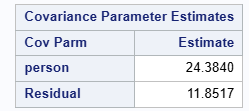

  
```{r setup, include=FALSE}
knitr::opts_chunk$set(echo = TRUE)
```

# Q1

Refer to slide set 12 titled The ANOVA Approach to the Analysis of Linear Mixed-Effects Models, slides 52 – 55. Note that the BLUE $\hat{\beta}_{\Sigma}$ depends on the variance components $\sigma_{e}^{2}$ and $\sigma_{u}^{2}$. Specifically, the weights of $\tilde{y}_{11}$, and $y_{121}$ are functions of $\sigma_{e}^{2}$ and $\sigma_{u}^{2}$. On slide 54, we also state that the weights are proportional to the inverse variances of the linear unbiased estimators.

Given the underlying model, show that

$$\frac{\frac{1}{\text{Var}(\bar{y}_{11.})}}{\frac{1}{\text{Var}(\bar{y}_{11.})}+\frac{1}{\text{Var}(y_{121})}}=\frac{2\sigma_{e}^{2}+2\sigma_{u}^{2}}{3\sigma_{e}^{2}+4\sigma_{u}^{2}}$$

and consequently

$$\frac{\frac{1}{\text{Var}( {y}_{121})}}{\frac{1}{\text{Var}(\bar{y}_{11.})}+\frac{1}{\text{Var}(y_{121})}}=\frac{\sigma_{e}^{2}+2\sigma_{u}^{2}}{3\sigma_{e}^{2}+4\sigma_{u}^{2}}.$$

## Answer

The BLUE of $\hat{\beta}_{\Sigma}$ uses weights on $\bar{y}_{11.}$ and $y_{121}$ proportionally to their inverse variances. 

From the slides, we have:

For the average $\bar{y}_{11.} = \frac{y_{111} + y_{112}}{2}$, with Variance: 

$$
\text{Var}(\bar{y}_{11.}) = \frac{\sigma_e^2}{2} + \sigma_u^2
$$
   
(Since the two observations share the same random effect $u_1$)

For the single observation $y_{121}$, with Variance:

$$
\text{Var}(y_{121}) = \sigma_e^2 + \sigma_u^2
$$

(As no other observations share the one random effect $u_2$)

As the weights are proportional to inverse variances, we have: 

Weight for $\bar{y}_{11.}$:

$$
\frac{\frac{1}{\text{Var}(\bar{y}_{11.})}}{\frac{1}{\text{Var}(\bar{y}_{11.})} + \frac{1}{\text{Var}(y_{121})}} 
= \frac{\frac{1}{\frac{\sigma_e^2}{2} + \sigma_u^2}}{\frac{1}{\frac{\sigma_e^2}{2} + \sigma_u^2} + \frac{1}{\sigma_e^2 + \sigma_u^2}}
= \frac{\frac{2}{\sigma_e^2 + 2\sigma_u^2}}{\frac{2}{\sigma_e^2 + 2\sigma_u^2} + \frac{1}{\sigma_e^2 + \sigma_u^2}}
= \frac{2(\sigma_e^2 + \sigma_u^2)}{3\sigma_e^2 + 4\sigma_u^2}
$$

And the weight for $y_{121}$:

$$
\frac{\frac{1}{\text{Var}(y_{121})}}{\frac{1}{\text{Var}(\bar{y}_{11.})} + \frac{1}{\text{Var}(y_{121})}}
= \frac{\frac{1}{\sigma_e^2 + \sigma_u^2}}{\frac{1}{\frac{\sigma_e^2 + 2\sigma_u^2}{2}} + \frac{1}{\sigma_e^2 + \sigma_u^2}}
= \frac{\frac{1}{\sigma_e^2 + \sigma_u^2}}{\frac{2}{\sigma_e^2 + 2\sigma_u^2} + \frac{1}{\sigma_e^2 + \sigma_u^2}}
= \frac{\sigma_e^2 + 2\sigma_u^2}{3\sigma_e^2 + 4\sigma_u^2}
$$

Thus, the weights match the given expressions:

$$\frac{\frac{1}{\text{Var}(\bar{y}_{11.})}}{\frac{1}{\text{Var}(\bar{y}_{11.})}+\frac{1}{\text{Var}(y_{121})}}=\frac{2\sigma_{e}^{2}+2\sigma_{u}^{2}}{3\sigma_{e}^{2}+4\sigma_{u}^{2}}$$

And: 

$$\frac{\frac{1}{\text{Var}( {y}_{121})}}{\frac{1}{\text{Var}(\bar{y}_{11.})}+\frac{1}{\text{Var}(y_{121})}}=\frac{\sigma_{e}^{2}+2\sigma_{u}^{2}}{3\sigma_{e}^{2}+4\sigma_{u}^{2}}.$$

\newpage

# Q2

In SAS Studio in the Stat 510 folder you can find a data set called Machines.xlsx and a SAS program called `Proc Mixed Machines Data.sas`. Open the SAS program and follow the instructions to read in the data.

## a) 

How many machines and how many persons are accounted for in the data set? How many unique machine $\times$ person combinations are there?

### Answer 

3 Machines
6 Persons
18 unique Machine-Person Combinations 

## b) 

Run the proc glm SAS code associated with Model 1. What model does SAS fit? Write out the model using mathematical/statistical notation. Be sure to define all variables and parameters. Use appropriate subscripts where necessary.

### Answer 

Let:

- $Y_{ij}$: observed rating given by person $j$ on machine $i$
- $i = 1, 2, 3$: machine levels
- $j = 1, 2, \dots, 6$: person levels
- $k = 1, 2, 3$: replications of experimental units; not necessarily balanced across all machine-person levels. 

The Model formula is given by: 

$$
Y_{ijk} = \mu + \alpha_i + \beta_j + \gamma_{ij} + \varepsilon_{ijk}
$$

Where:

- $Y_{ijk}$: Rating for the $k$-th observation of the $i$-th machine and $j$-th person.
- $\mu$: Overall mean, no subscripts.
- $\alpha_i$: Fixed effect of machine $i$.
- $\beta_j$: Fixed effect of person $j$.
- $\gamma_{ij}$: Fixed interaction effect between machine $i$ and person $j$.
- $\varepsilon_{ijk}$: Residual error, with assumption $\varepsilon_{ijk} \sim N(0, \sigma^2)$.

\newpage 

## c) 

Report the MSE.

### Answer 

```{r, eval = T, echo=FALSE, fig.cap="MSE", out.width="100%"}

```

Reported MSE is 0.872564. 

\newpage

## d) 

Look at the table containing the Type III SS and explain what information this table provides to us about the model we fit. Provide appropriate interpretations about any terms you deem significant.

```{r, eval = T, echo=FALSE, fig.cap="Type III SS", out.width="100%"}
knitr::include_graphics("Type3.png")
```

### Answer 

All three fixed effects (machine, person, and machine-person interactions) are statistically significant at the 0.0001 level, meaning we have overwhelming evidence against the null hypothesis for each of the sources in the table. Within the context of the study, this is evidence that (1) There are meaningful differences in average ratings across machines, even after accounting for the effects of people and machine-people interactions (2) There are meaningful differences in average ratings across people, even after accounting for the effects of machine and machine-people interactions, and (3) There are meaningful interaction effects, i.e. that machine differences (effects) are not consistent across people. 

## e) 

Look at the Interaction plot SAS provides. Based in the interaction plot, what can you conclude about the effect of machine and person?

```{r, eval = T, echo=FALSE, fig.cap="InteractionPlot", out.width="100%"}

```

### Answer 

Effect of Machine: There is a general upward trend across all lines from machine 1 to machine 3, though not always from machine 1 to machine 2. This is evidence that machine 3 on average received the highest ratings, followed by machine 2, and then machine 1. This is consistent with the ANOVA table where machine had a statistically significant F-statistic.

Effect of Person: The lines representing each person are distinctly separated, despite some intersections when moving from machine 1 to machine 2. Overall this shows that that different individuals tended to receive different ratings across machines. In particular, person 3 tended to receive the highest average ratings while person 6 tended to receive the lowest average ratings. This is consistent with the ANOVA table where person had a statistically significant F-statistic. 

Interaction Effect: The lines are not parallel, changing slope or even intersecting (changing signage). The lines not being parallel indicate an interaction effect, i.e., that the effect of machine on the rating depends on the person. This is also consistent with the ANOVA table where person-machine interaction effect had a statistically significant F-statistic. 

\newpage 

## f) 

Run the proc mixed SAS code associated with Model 2. What model does SAS fit? Write out the model using mathematical/statistical notation. Be sure to define all variables and parameters. Use appropriate subscripts where necessary.

### Answer 

Let:

- $Y_{ij}$: observed rating given by person $j$ on machine $i$
- $i = 1, 2, 3$: machine levels
- $j = 1, 2, \dots, 6$: person levels
- $k = 1, 2, 3$: replications of experimental units; not necessarily balanced across all machine-person levels. 

The Model formula is given by: 

$$
Y_{ij} = \mu + \alpha_i + u_j + \varepsilon_{ij}
$$

Where:

- $\mu$ is the overall mean rating
- $\alpha_i$ is the fixed effect of machine $i$, with sum-to-zero constraint $\sum_i \alpha_i = 0$
- $u_j \sim \mathcal{N}(0, \sigma_u^2)$ is the random effect of person $j$
- $\varepsilon_{ij} \sim \mathcal{N}(0, \sigma^2)$ is the residual error, assumed independent of $u_j$

## g) 

Report the MSE for Model 2 and compare it to the MSE for Model 1.

```{r, eval = T, echo=FALSE, fig.cap="Model 2 Residual", out.width="100%"}

```

### Answer 

The MSE for Model 2 is 11.8517, as reported in the table. This is larger than the MSE for Model 1. Though expected due to the inclusion of person as a random effect and the exclusion of the interaction term in the model, is does appear Model 2 has a "worse" fit compared to Model 1 in having a larger MSE. 

\newpage 

## h) 

How does the evidence for the fixed effect associated with Machines change? Why does this make sense?

### Answer 

Model 1: The F-statistic for the fixed effect of machine is 709.52, with p < .0001.

Model 2: The F-statistic for machine drops to 58.41, though the p-value remains < .0001.

While both models show overwhelming evidence for a machine effect (both having p < 0.0001), the F-statistic is much larger in Model 1 because it treats person and interaction effects as fixed, artificially reducing residual variance. Model 2 accounts for person-level variability (main effect of person) as random, which is a more conservative estimate of the model variability. In a word: The smaller F-statistic in Model 2 reflects better partitioning of the variance components, which should not (probably) be conflated as "weaker evidence".

## i) 

Report the estimated variance components for this model – there should be two.

```{r, eval = T, echo=FALSE, fig.cap="Model 2 Residual, Again", out.width="100%"}

```

### Answer 

The two estimated variance components for this model are:

Person (random effect): 24.3840

Residual (error term): 11.8517

## j) 

Run the proc mixed SAS code associated with Model 3. What model does SAS fit? Write out the model using mathematical/statistical notation. Be sure to define all variables and parameters. Use appropriate subscripts where necessary.

### Answer 

Let:

- $Y_{ij}$: observed rating given by person $j$ on machine $i$
- $i = 1, 2, 3$: machine levels
- $j = 1, 2, \dots, 6$: person levels
- $k = 1, 2, 3$: replications of experimental units; not necessarily balanced across all machine-person levels. 

The Model formula is given by: 

$$
Y_{ijk} = \mu + \alpha_i + u_{ij} + \varepsilon_{ijk}
$$

Where:

- $\mu$: overall mean rating
- $\alpha_i$: fixed effect of machine $i$, with $\sum_i \alpha_i = 0$
- $u_{ij} \sim \mathcal{N}(0, \sigma_u^2)$: random effect for person $j$ nested within machine $i$
- $\varepsilon_{ijk} \sim \mathcal{N}(0, \sigma^2)$: residual error, independent of the random effects for person

## k) 

Report the MSE for Model 3 and compare it to the MSE for Models 1 and 2. Describe your findings.

```{r, eval = T, echo=FALSE, fig.cap="Model 3 Residual", out.width="100%"}

```

### Answer 

Model 3 MSE is 0.8721.

This is nearly identical to the MSE from Model 1 (0.8726) and substantially lower than the MSE from Model 2 (11.8517). This similarity makes sense because both Models 1 and 3 account interaction effects between person and machine, albeit somewhat differently--Model 1 through a fixed interaction, and Model 3 through a random effect nested within machine. In both cases, our model has smaller MSE through the inclusion of an interaction effect of some kind. 

## l) 

Explain the main difference between Models 2 and 3. Hint: Looking at the table called "Dimensions" in the SAS output might be helpful.

```{r, eval = T, echo=FALSE, fig.cap="Model 2 Dimensions", out.width="100%"}

```

```{r, eval = T, echo=FALSE, fig.cap="Model 3 Dimensions", out.width="100%"}

```

### Answer 

Dimensions tables for Models 2 and 3 are provided. There is a noticeable differences between the two models considered in this question:  

Model 2 treats `person` as a single random effect, meaning each person has one random intercept across all machines, hence why the Dimensions table reports 44 subjects, each with up to 1 observation per person-machine combination.
  
By contrast, Model 3 uses `person(machine)` as the subject for the random effect, treating each person–machine combination as a unique random level, which in turn is why the respective Dimensions table reports only 1 subject, but with 18 observations, each with up to 3 observations per person-machine combination. This is also with 6 columns in Z, indicating 6 random effects to account for nesting `person` within `machine`.

## m) 

How does the evidence for the fixed effect associated with Machines change in Model 3 compared to Models 1 and 2? Why does this make sense?

```{r, eval = T, echo=FALSE, fig.cap="Model 3 Output", out.width="100%"}

```

### Answer 

In Model 3, the F-statistic for the fixed effect of machine remains highly significant, consistent with Models 1 and 2. While the level of significance is somewhat lower than in the previous models, such that it would not meet the strict $\alpha = 0.001$ threshold in a decision framework (which we hate and openly rebel against in favor of "strength of evidence arguments"), and say that the evidence against the null hypothesis of no differences in mean scores of the machines remains strong. 

This similarity with Model 1 is expected because both models account for person interacting with machine, though in different ways: Model 1 includes a fixed interaction term, whereas Model 3 models the interaction as a random effect through nesting person within machine.

Compared to Model 2, Model 3 better partitions variation by including this interaction structure. Model 2 treats person as a single random effect, which carries the assumption of no interaction effect between person-machine across machines, which we have evidence in support of this being an unrealistic assumption (based on the arguments/conclusions of the above questions).

Overall, it makes sense that the evidence for the fixed effect of machine is less statistically significant in Model 3 compared to Models 1 and 2. The reduced significance reflects a more appropriate modeling of the data structure, specifically in capturing and partitioning the sources of variability due to the inclusion of a `person` variable and its interaction effect with `machine`. As a result, some variation previously attributed to machine is now absorbed by the random effects, leading to a more conservative estimate of its fixed effect.

\newpage

# Q3

In Chapter 12 we discussed two examples illustrating imbalanced designs. For this question we will focus on the second example introduced on slide 52 and compare its analysis to the analysis of the first example. 

Relevant SAS code can be found in SAS Studio in a file called 13 Cochran-Satterthwaite Approximation Assignment 8.sas.

## a) 

Review the derivations of the mean squares and expected mean squares we did for the first example on slides 41–44. Repeat the same steps for the second example. Start out with deriving $P_1y, P_2y$ and $P_3y$. Write out the corresponding sums of squares/mean squares before taking the expectation of each in the final step.

### Answer 

As given in the slides: 

$$
\mathbf{y} = \begin{bmatrix}
y_{111} \\ y_{112} \\ y_{121} \\ y_{211}
\end{bmatrix}, \quad
\mathbf{X} = \begin{bmatrix}
1 & 0 \\
1 & 0 \\
1 & 0 \\
0 & 1
\end{bmatrix}, \quad
\mathbf{Z} = \begin{bmatrix}
1 & 0 & 0 \\
1 & 0 & 0 \\
0 & 1 & 0 \\
0 & 0 & 1
\end{bmatrix}
$$

Projection Matrices

Note, for the following we can take a true inverse, which eases computation. 

$X_1 = \mathbf{1} \rightarrow P_1 = \mathbf{1}(\mathbf{1}^\top \mathbf{1})^{-}\mathbf{1}^{\top}$

$$
P_1
= \frac{1}{4}
\begin{bmatrix}
1 & 1 & 1 & 1 \\
1 & 1 & 1 & 1 \\
1 & 1 & 1 & 1 \\
1 & 1 & 1 & 1
\end{bmatrix}
$$

$X_2 = \mathbf{X} \rightarrow P_2 = \mathbf{X}(\mathbf{X}^\top \mathbf{X} )^{-}\mathbf{X}^{\top}$

$$
P_2 
= \begin{bmatrix}
\frac{1}{3} & \frac{1}{3} & \frac{1}{3} & 0 \\
\frac{1}{3} & \frac{1}{3} & \frac{1}{3} & 0 \\
\frac{1}{3} & \frac{1}{3} & \frac{1}{3} & 0 \\
0 & 0 & 0 & 1
\end{bmatrix}
$$

$X_3 = \mathbf{Z} \rightarrow P_3 = \mathbf{Z}(\mathbf{Z}^\top \mathbf{Z} )^{-}\mathbf{Z}^{\top}$

$$ 
P_3 
= \begin{bmatrix}
\frac{1}{2} & \frac{1}{2} & 0 & 0 \\
\frac{1}{2} & \frac{1}{2} & 0 & 0 \\
0 & 0 & 1 & 0 \\
0 & 0 & 0 & 1
\end{bmatrix}
$$ 

### Sums of Squares

General Form: 

$$
\mathbf{y}^\top (P_{i+1} - P_{i}) \mathbf{y}
$$

#### Treatment sum of squares:

$$
SS_{\text{trt}} = \mathbf{y}^T (P_2 - P_1) \mathbf{y}
$$

First term: 

$$
P_2 \mathbf{y} = 
\begin{bmatrix}
\bar{y}_{1..} \\
\bar{y}_{1..} \\
\bar{y}_{1..} \\
y_{211}
\end{bmatrix}
$$

Where: 

$$
\bar{y}_{1..} = \frac{1}{3}y\left( y_{111} + y_{112} + y_{121} \right)
$$

So, the second projection matrix expression is given by:

$$
\mathbf{y}^\top P_2 \mathbf{y} 
= \bar{y}_1(y_{111} + y_{112} + y_{121}) + y_{211}^2
= \frac{1}{3}(y_{111} + y_{112} + y_{121})^2 + y_{211}^2
$$

The first projection matrix expression is given by: 

$$
P_1 \mathbf{y} = 
\begin{bmatrix}
\bar{y}_{...} \\
\bar{y}_{...} \\
\bar{y}_{...} \\
\bar{y}_{...}
\end{bmatrix}
$$

Such that the expression is given by: 

$$
\mathbf{y}^\top P_1 \mathbf{y} 
= \sum_{i=1}^4 y_i \cdot \bar{y}
= \bar{y}(y_{111} + y_{112} + y_{121} + y_{211})
= 4\bar{y}^2
= \frac{1}{4}(y_{111} + y_{112} + y_{121} + y_{211})^2
$$

Taken together: 

$$
SS_{\text{trt}} = \frac{1}{3}\left( y_{111} + y_{112} + y_{121}\right)^2 + y_{211}^2 - \frac{1}{4}(y_{111} + y_{112} + y_{121} + y_{211})^2
$$

#### Subject within treatment, random effect:

$$
SS_{\text{xu(trt)}} = \mathbf{y}^T (P_3 - P_2) \mathbf{y}
$$

As above we've calculated the expression for the second projection matrix, we need only calculate the expression for the third projection matrix and then combine. To that end: 

For the third projection matrix. 

$$
P_3 \mathbf{y} = 
\begin{bmatrix}
\bar{y}_{11.} \\
\bar{y}_{11.} \\
y_{121} \\
y_{211}
\end{bmatrix}
$$

Giving: 

$$
\mathbf{y}^\top P_3 \mathbf{y} 
= \bar{y}_{11.}(y_{111} + y_{112}) + y_{121}^2 + y_{211}^2 
= \frac{1}{2}(y_{111} + y_{112})^2 + y_{121}^2 + y_{211}^2
$$

Combining with the known expression for the second projection matrix, we have: 

$$
SS_{\text{xu(trt)}} = \frac{1}{2}(y_{111} + y_{112})^2 + y_{121}^2 - \frac{1}{3}(y_{111} + y_{112} + y_{121})^2 
$$

#### Residual:

$$
SS_{\text{Residual}} = \mathbf{y}^T (\mathbf{I_{4 \times 4}} - P_3) \mathbf{y}
$$

There's actually a shortcut we can take instead of comparing differences in projection matrices! Note: only the first two entries contribute to the residual sum of squares, so we know:

$$
SS_{\text{Residual}} 
= (y_{111} - \bar{y}_{11.})^2 + (y_{112} - \bar{y}_{11.})^2
$$

Simplifying:

$$
SS_{\text{Residual}} = \left( y_{111} - y_{11.} \right) ^2 + \left( y_{112} - \bar{y}_{11.} \right)^2 = \frac{1}{2}(y_{111} - y_{112})^2 
$$

Using the above Projection matrices. 

Rank($X_1$) = 1, 
Rank($X_2$) = 2, 
Rank($X_3$) = 3. 

Giving us the following degrees of freedom. 

Treatment: rank($X_2$) - rank($X_1$) = 1
Subject(Treatment): rank($X_3$) - rank($X_2$) = 1 
Error: rank($I_{4 \times 4}$) - rank($X_3$) = 1

So the Mean Squares are the same as Sum of Squares given above. 

Degrees of freedom: $\text{df}_{\text{trt}} = 1$, $\text{df}_{\text{xu(trt)}} = 1$, $\text{df}_{\text{Residual}} = 1$

### Expected Mean Squares

Note, setup in the model: 

$$
y_{ijk} = \mu + \tau_i + u_{ij} + \varepsilon_{ijk}
$$

Where: 

$$
\bar{y}_{ij.} = \mu + \tau_i + u_{ij} + \bar{e}_{ij.}
$$

#### Residual 

$$
E(MS_{\text{Residual}}) = E(\frac{1}{2}(y_{111} - y_{112})^2 ) = E(\frac{1}{2}(y_{111}^2 - 2y_{111}y_{112} + y_{112}^2)) = \frac{1}{2}\sigma_e^2 + \frac{1}{2}\sigma_e^2
$$

Giving us: 

$$
E[\text{MS}_{\text{Residual}}] = \sigma_e^2
$$

#### Subject within treatment, random effect:

$$
E(MS_{\text{xu(trt)}}) = E\left(\frac{1}{2}(y_{111} + y_{112})^2 + y_{121}^2 - \frac{1}{3}(y_{111} + y_{112} + y_{121})^2\right)
$$

$$
E(MS_{\text{xu(trt)}}) = E\left(\frac{1}{2}(y_{111} + y_{112})^2\right) + E(y_{121}^2) - E\left(\frac{1}{3}(y_{111} + y_{112} + y_{121})^2\right)
$$

Let $a = \mu + \tau_1$

Then: 

$$
y_{111} + y_{112} = 2a + 2u_1 + e_{111} + e_{112} \rightarrow
\frac{1}{2}(y_{111} + y_{112})^2 = \frac{1}{2}(2a + 2u_1 + e_{111} + e_{112})^2
$$

Taking expectations:

$$
E\left[\frac{1}{2}(y_{111} + y_{112})^2\right] = \frac{1}{2}\left(4a^2 + 4 \operatorname{Var}(u_1) + \operatorname{Var}(e_{111} + e_{112})\right)
= \frac{1}{2}\left(4a^2 + 4\sigma_u^2 + 2\sigma_e^2\right) = 2a^2 + 2\sigma_u^2 + \sigma_e^2
$$

We also have: 

$$
y_{121} = a + u_2 + e_{121}
$$

Taking expectation:

$$
E[y_{121}^2] = E[(a + u_2 + e_{121})^2] = a^2 + \sigma_u^2 + \sigma_e^2
$$

The last component of the expression: 

$$
y_{111} + y_{112} + y_{121} = 3a + 2u_1 + u_2 + e_{111} + e_{112} + e_{121}
$$

Taking expectation:

$$
E\left[\frac{1}{3}(y_{111} + y_{112} + y_{121})^2\right] = \frac{1}{3}\left(9a^2 + \operatorname{Var}(2u_1 + u_2) + \operatorname{Var}(e_{111} + e_{112} + e_{121})\right)
= \frac{1}{3}(9a^2 + 5\sigma_u^2 + 3\sigma_e^2) = 3a^2 + \frac{5}{3}\sigma_u^2 + \sigma_e^2
$$

Putting all parts together: 

$$
E[MS_{\text{xu(trt)}}] = \left(2a^2 + 2\sigma_u^2 + \sigma_e^2\right) + \left(a^2 + \sigma_u^2 + \sigma_e^2\right) - \left(3a^2 + \frac{5}{3}\sigma_u^2 + \sigma_e^2\right)
$$

$$
E[MS_{\text{xu(trt)}}] = \left(2\sigma_u^2 + \sigma_e^2\right) + \left(\sigma_u^2 + \sigma_e^2\right) - \left(\frac{5}{3}\sigma_u^2 + \sigma_e^2\right)
$$

$$
E[\text{MS}_{\text{xu(trt)}}] = \frac{4}{3}\sigma_u^2 + \sigma_e^2
$$

#### Treatment 

$$
E(MS_{\text{trt}}) = E(\frac{1}{3}\left( (y_{111} + y_{112} + y_{121}\right)^2 + y_{211}^2 - \frac{1}{4}(y_{111} + y_{112} + y_{121} + y_{211})^2) 
$$

$$
E(MS_{\text{trt}}) = E(\frac{1}{3}\left( (y_{111} + y_{112} + y_{121}\right)^2) + E(y_{211}^2) - E(\frac{1}{4}(y_{111} + y_{112} + y_{121} + y_{211})^2) 
$$

To start, let the following terms be denoted, for convenience:

$$
a = \mu + \tau_1 \rightarrow a^2 = \mu^2 + 2\mu\tau_1 + \tau_1^2
$$

$$
b = \mu + \tau_2 \rightarrow b^2 = \mu^2 + 2\mu\tau_2 + \tau_2^2
$$

$$
d = 4\mu + 3\tau_1 + \tau_2 \rightarrow d^2 = 16\mu^2 + 24\mu\tau_1 + 8\mu\tau_2 + 9\tau_1^2 + 6\tau_1\tau_2 + \tau_2^2
$$


Also, let: 

$$
A = y_{111} + y_{112} + y_{121}
= 3(\mu + \tau_1) + 2u_{11} + u_{12} + \varepsilon_{111} + \varepsilon_{112} + \varepsilon_{121}
$$

And: 

$$
B = y_{211} = \mu + \tau_2 + u_{21} + \varepsilon_{211}
$$

Such that: 

$$
A + B = y_{111} + y_{112} + y_{121} + y_{211}
= 4\mu + 3\tau_1 + \tau_2 + 2u_{11} + u_{12} + u_{21} + \varepsilon_{111} + \varepsilon_{112} + \varepsilon_{121} + \varepsilon_{211}
$$

The above relations taken together give us a simplified expression for the Expected MS for treatment, which is:  

$$
E[MS_{\text{trt}}] = E\left[ \frac{1}{3} A^2 \right] + E[y_{211}^2] - E\left[ \frac{1}{4} (A + B)^2 \right]
$$

Evaluating each term of the above expression: 

$$
E[A^2] = (3a)^2 + \operatorname{Var}(A) = 9a^2 + 5\sigma_u^2 + 3\sigma_e^2 \rightarrow
E\left[\frac{1}{3}A^2\right] = 3a^2 + \frac{5}{3}\sigma_u^2 + \sigma_e^2
$$

And: 

$$
E[y_{211}^2] = E[(b + u_{21} + \varepsilon_{211})^2] = b^2 + \sigma_u^2 + \sigma_e^2
$$

And lastly

$$
E\left[\frac{1}{4}(A + B)^2\right] = \frac{1}{4}(d^2 + 6\sigma_u^2 + 4\sigma_e^2)
$$

So, in total, we have: 

$$
E[MS_{\text{trt}}] = (3a^2 + \frac{5}{3}\sigma_u^2 + \sigma_e^2) + (b^2 + \sigma_u^2 + \sigma_e^2) - \frac{1}{4}(d^2 + 6\sigma_u^2 + 4\sigma_e^2)
$$


Note then, that: 

$$
3a^2 + b^2 - \frac{1}{4}d^2 = \frac{3}{4}(\tau_1 - \tau_2)^2
$$

Explicitly expanding $a = \mu + \tau_1$, $b = \mu + \tau_2$, and $d = 4\mu + 3\tau_1 + \tau_2$, with the appropriate scalars gives us: 

$$
3a^2 + b^2 = 3(\mu + \tau_1)^2 + (\mu + \tau_2)^2 = 4\mu^2 + 6\mu\tau_1 + 2\mu\tau_2 + 3\tau_1^2 + \tau_2^2
$$

$$
\frac{1}{4}d^2 = \frac{1}{4}(4\mu + 3\tau_1 + \tau_2)^2 = 4\mu^2 + 6\mu\tau_1 + 2\mu\tau_2 + \frac{9}{4}\tau_1^2 + \frac{3}{2}\tau_1\tau_2 + \frac{1}{4}\tau_2^2
$$

Subtracting:

$$
3a^2 + b^2 - \frac{1}{4}d^2 = \left(3\tau_1^2 + \tau_2^2\right) - \left( \frac{9}{4}\tau_1^2 + \frac{3}{2}\tau_1\tau_2 + \frac{1}{4}\tau_2^2 \right)
= \frac{3}{4}(\tau_1 - \tau_2)^2
$$

So the fixed effect treatment differences part of the expectation expression is given by:

$$
\frac{3}{4}(\tau_1 - \tau_2)^2
$$

The remaining terms then simplify to: 

$$
\left(\frac{5}{3} + 1 - \frac{6}{4}\right)\sigma_u^2 + \left(1 + 1 - 1\right)\sigma_e^2
= \frac{7}{6}\sigma_u^2 + \sigma_e^2
$$

So, finally, combining terms, we have: 

$$
E[\text{MS}_{\text{trt}}] = \frac{3}{4}(\tau_1 - \tau_2)^2 + \frac{7}{6}\sigma_u^2 + \sigma_e^2
$$

Note: Throughout these calculations, all cross terms involving random effects are zero when taking expectations, due to independence between subject effects and error terms. We also assume independence among the error terms and among the subject random effects, so cross-products within each type also have zero expectation. As a result, only the variances of individual terms contribute to the expected values (in a non-zero way).

\newpage 

## b) 

Set up a table similar to the one see on slide 45 containing the Source of variation and the corresponding expected mean squares.

### Answer 

| Source             | df | Expected Mean Square                              |
|--------------------|----|----------------------------------------------------|
| Treatment          | 1  | $(\tau_1 - \tau_2)^2 + \frac{7}{6}\sigma_u^2 + \sigma_e^2$ |
| Subject(Treatment) | 1  | $\frac{4}{3}\sigma_u^2 + \sigma_e^2$                      |
| Error              | 1  | $\sigma_e^2$                                   |


## c) 

Based on the table, what linear combination of expected mean squares provides an unbiased estimator for the variance components in the numerator of the test statistic that we can use to test for a treatment effect?

### Answer

To test for a treatment effect, we use the test statistic:

$$
F = \frac{MS_{\text{trt}}}{\widehat{V}}
$$

Where: 

$\widehat{V}$ is an unbiased estimator of the variance component portion of $E[MS_{\text{trt}}]$. 

From part c), to get an unbiased estimate of $\frac{7}{6}\sigma_u^2 + \sigma_e^2$, we have a system of linear equations with real-valued constants a and b such that:

$$
\widehat{V} = a \cdot MS_{\text{subj(trt)}} + b \cdot MS_{\text{error}}
$$

And taking expectation: 

$$
E[\widehat{V}] = a(\frac{4}{3} \sigma_u^2 + \sigma_e^2) + b(\sigma_e^2) = \frac{7}{6} \sigma_u^2 + \sigma_e^2
$$

For $\sigma_u^2$: $\frac{4}{3}a = \frac{7}{6} \rightarrow a = \frac{\frac{7}{6}}{\frac{4}{3}} = \frac{7}{8}$, and 

For $\sigma_e^2$: $a + b = 1 \rightarrow b = 1 - \frac{7}{8} = \frac{1}{8}$

So we estimate the variance component part using:

$$
\widehat{V} = \frac{7}{8} \cdot MS_{\text{subj(trt)}} + \frac{1}{8} \cdot MS_{\text{error}}
$$

So the test statistic becomes:

$$
F = \frac{MS_{\text{trt}}}{\frac{7}{8} \cdot MS_{\text{subj(trt)}} + \frac{1}{8} \cdot MS_{\text{error}}}
$$

## d) 

Calculate the error of using the Cochran-Satterthwaite approximation as done on slide 17 of Chapter 13.

### Answer

From part c), we have: 

$$
F = \frac{MS_{\text{trt}}}{\frac{7}{8} MS_{\text{subj(trt)}} + \frac{1}{8} MS_{\text{error}}}
$$

Via the Cochran–Satterthwaite approximation, we use the approximate F-Test to determine the approximated degrees of freedom:

$$
d = \frac{\left(\frac{7}{8} MS_{\text{subj(trt)}} + \frac{1}{8} MS_{\text{error}}\right)^2}{\left(\frac{7}{8} MS_{\text{subj(trt)}}\right)^2 + \left(\frac{1}{8} MS_{\text{error}}\right)^2}
$$

Do we need to simplify this further? If so...

### Some Actual Data

From SAS Output: 

$MS_1 = MS_{\text{subj(trt)}} = 9.626667$, $df_1 = 1$

And: 

$MS_2 = MS_{\text{error}} = 2.42$, $df_2 = 1$

Numerator:

$$
(0.875 \cdot 9.626667 + 0.125 \cdot 2.42)^2 = (8.422333 + 0.3025)^2 = (8.724833)^2 \approx 76.1208
$$

Denominator:

$$
(0.875)^2 \cdot \frac{9.626667^2}{1} + (0.125)^2 \cdot \frac{2.42^2}{1}
= 0.765625 \cdot 92.6827 + 0.015625 \cdot 5.8564
\approx 70.9728 + 0.0915 = 71.0643
$$

Calculating: 

$$
d = \frac{76.1208}{71.0643} \approx 1.0717
$$

\newpage 

## e) 

Run all the code in SAS. Verify the work you derived in parts b), c) and d).

### Answer 

The included SAS output was run and provides verification for parts b), c), and d), particularly in the Type 1 ANOVA table. 

```{r, eval = T, echo=FALSE, fig.cap="SAS Output 2", out.width="100%"}
knitr::include_graphics("Output2.png")
```

\newpage

# Q4

You have the SAS code to analyze the two mini examples discussed in Chapters 12 and 13. Write R code that replicates these analyses.

## Answer 

As noted by Dr. G., this question is specific to Example 2 and is the focus of the below code. For reference, I did also include R code related to Example 1. 

Also, I kept encountering discrepancies with the R output compared to SAS, even after making sure to note Type 1 Sum of Square and usage of the `lme4`, as used in Chapter 17 notes. That notwithstanding...

```{r, message = F, warning = F}
library(lme4)
library(lmerTest)  

d2 <- data.frame(
  trt = factor(c(1, 1, 1, 2)),
  subject = factor(c("1_1", "1_1", "1_2", "2_1")),
  y = c(6.4, 4.2, 1.5, 0.9)
)
```

```{r, message = F, warning = F}
model <- lmer(y ~ trt + (1 | subject), data = d2, REML = FALSE)

# anova_table <- anova(model, type = 1)
# anova_table
model2 <- lmer(y ~ trt + (1 | subject), data = d2)
summary(model2)
# anova(model2, type = 1, ddf = "Satterthwaite")
# anova(model2)
# VarCorr(model2)
```

Here's the oddity. Despite properly nesting things, the above output does not match the output or derivations provided in Q3. Dang! 

### Manual Calculation (Using R!) 

```{r}
y_mean <- mean(d2$y)
y_trt1 <- mean(d2$y[d2$trt == 1])
y_trt2 <- mean(d2$y[d2$trt == 2])
SS_trt <- 3 * (y_trt1 - y_mean)^2 + 1 * (y_trt2 - y_mean)^2
SS_trt
```

```{r}
model2 <- lmer(y ~ trt + (1 | subject), data = d2)

anova_out <- anova(model2, type = 1)
ms_trt <- anova_out$`Mean Sq`[1]  
ss_trt <- anova_out$`Sum Sq`[1]    

vc <- as.data.frame(VarCorr(model2))
ms_error <- vc$vcov[vc$grp == "Residual"]   
ss_error <- ms_error  

ms_subject <- 1.3333 * vc$vcov[vc$grp == "subject"] + ms_error  
ss_subject <- ms_subject  

ss_trt
ss_subject
ss_error
```

For Type 1 SS Specifically: 

| Source             | df | Sums of Squares| Mean Square | Expected Mean Square|                             
|--------------------|----|----------------------------------------------------|
| Treatment          | 1  | 7.363333   	       | 7.363333    	     |  $(\tau_1 - \tau_2)^2 + \frac{7}{6}\sigma_u^2 + \sigma_e^2$       |
| Subject(Treatment) | 1  | 9.626487   	       | 9.626487    	     |  $\frac{4}{3}\sigma_u^2 + \sigma_e^2$       | 
| Error              | 1  | 2.42   	           | 2.42     	     |  $\sigma_e^2$       |

Notably, the Cochran-Satterthwaite Df Approximation from R is 1.1019. This is somewhat different, but approximately equal, to SAS because of differences in calculation. From what I gathered, it is REML-related. 

### Bonus - Example 1

```{r, eval = F}
library(nlme)
library(lmerTest)

d1 <- data.frame(
  trt = factor(c(1, 1, 2, 2)),
  xu = factor(c(1, 2, 1, 1)),
  y = c(6.4, 4.2, 1.5, 0.9)
)

model1 <- lmer(y ~ trt + (1 | subject), data = d1)
summary(model1)
anova(model1)
mod <- lmer(y ~ trt + (1 | trt:xu), data = d1)
summary(mod)
```