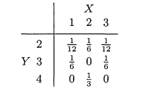

# Q1 

Consider continuous random vector (X, Y) where $X \sim N(0, 1)$ (standard normaly) and $Y | X = x \sim N(x, 1)$ (the conditional distribution of Y given X= x is normal with mean x and variance 1). 

## (a) 

Find the joint pdf of (X, Y).

## (b) 

Find the marginal distribution of Y. 

## (c) 

Consider random vector (V, W) where $W \sim N(0, 2)$ (normal with mean 0 and variance 2). How should the conditional distribution V | W = w be chosen so that (V, W) has the same distribution as (X, Y)? 

\newpage

# Q2: 4.7 Casella & Berger

A woman leaves for work between 8AM and 8:30AM and takes between 40 and 50 minutes to get there. Let the random variable X denote her time of departure, and the random variable Y the travel time. Assuming that these variables are independent and uniformly distributed, find the probability the the woman arrives at work before 9AM. 

\newpage

# Q3: 4.10 Casella & Berger

The random pair (X, Y) has the distribution: 

```{r, echo=FALSE, fig.cap="Img", out.width = '100%'}

```

## (a) 

Show that X and Y are dependent. 

## (b) 

Give a probability table for random variables U and V that have the same marginals as X and Y but are independent. 

\newpage

# Q4 

Suppose X and Y are independent random variables, where both have the same (marginal) geometric(p) distribution for 0 < p < 1. Find the conditional distribution of X given X + Y = k (integer k $\geq 2$).

\newpage

# Q5: 4.27 Casella & Berger 

Let $X \sim n(\mu, \sigma^2)$, and let $Y \sim n(\gamma, \sigma^2)$. Suppose X and Y are independent. Define: U = X + Y and V = X - Y. Show that U and V are independent normal random variables. Find the distribution of each of them. 

\newpage

# Q6: 4.42 Casella & Berger  

Let X and Y be independent random variables with means $\mu_X, \mu_Y$ and variances $\sigma_X^2, \sigma_Y^2$. Find an epxression for the correlation of XY and Y in terms of these means and variances. 

Said differently, we want to find: 

$$
Cov(XY, Y)
$$

\newpage

# Q7 

Suppose that random variables $X_1, X_2, X_3$ have joint pdf $f(x_1, x_2, x_3)= 6$ for $0 < x_1 < x_2 < x_3 < 1$. 

## (a) 

Are $X_1, X_2, X_3$ independent? Give an intuitive explanation. 

No they are not independent, as knowing the value of one of the random variables limits the range of possible values that the other random variables can take. 

## (b) 

Find the marginal pdf of $X_2$ and identify the distribution of $X_2$ as a member of an important family of distributions. 

## (c) 

Find the conditional pdf $f(x_1, x_3 | x_2)$ of $X_1, X_3 \text{ given } X_2 = x_2 \in (0,1)$.

## (d) 

Show that $X_1, X_3$ are independent given $X_2 = x_2 \in (0, 1)$ (i.e., think of what must be true of the conditional pdf of $f(x_1, x_3 | x_2)$ in this case). 

## (e) 

Find the covariance of $X_1 \text{ and } X_2$ given $X_2 = x_2$.