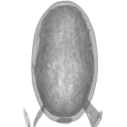

  
# 1. 

Magnetic Resonance Imaging (MRI) is a noninvasive radiologic technique used to image tissue structure and physiology. The imaging modality works on the principle of characterizing tissues based on the basis of their physical and chemical properties which can be adequately summarized in terms of three physical quantities: the longitudinal or spin-lattice relaxation time ($T_1$), spin-spin relaxation time ($T_2$), and the proton density ($\rho$). These physical quantities are themselves not directly observable but together determine image intensity with respect to photon density. Determination of image contrast is achieved by changing user-defined pulse sequence parameters which modulate the influence of the $T_1$, $T_2$, and $\rho$ values at a voxel, and hence the photon intensity. 

In spin-echo imaging, there are two design parameters – these are the repetition time (TR) and the echo time (TE). The relationship between $T_1$, $T_2$, $\rho$, and the true MR signal, in the spin-echo sequence of MR imaging, denoted by $\nu$, can be expressed in terms of a solution to the Bloch equation, an empirical expression describing nuclear magnetic resonance phenomena. Thus, the true MR signal ($\nu_{i,j,k}$) at the image pixel (or matrix element) $(i,j)$ for the $j$th set of design parameters (TE$_k$, TR$_k$) is given by:

$$
\nu_{i,j,k} = F(\rho_{ij}, T_{1ij}, T_{2ij}; \text{TE}_k, \text{TR}_k) = \rho_{ij} \exp\left(-\frac{\text{TE}_k}{T_{2ij}}\right) \left\{1 - \exp\left(-\frac{\text{TR}_k}{T_{1ij}}\right)\right\}.
$$

Different pairs of (TE, TR) values can be used to highlight contrasts between different tissue types. In a clinical context, this means that tuning the design parameters at different settings can be used to highlight various tissue types, providing a method for tissue classification in individuals. Therefore, in principle at least, a radiologist can acquire images for a range of values and then select from these images to optimize the contrasts between different tissue types. However, the optimal control parameters are patient- and/or application-specific and generally not known in advance. A systematic exploration of plausible (TE, TR) pairs is impractical because of constraints in time and expense and also because of patient motion and image registration issues. So, therefore a few (typically no more than three) are acquired. Once obtained, the radiologist could estimate the ($\rho$, $T_1$, $T_2$) at the $(i,j)$ voxel and use these estimates to synthetically predict images (Digital Object Identifier [10.1109/TMI.2009.2039487](https://doi.org/10.1109/TMI.2009.2039487)) at other (unobserved) (TE, TR) values.

The file 2dMRI-SE-phantom.dat contains intensity values of MRI images of a physical phantom (man-made object) acquired at 18 settings (in seconds) of (TE, TR) = $\{0.03, 0.06, 0.04, 0.08, 0.05, 0.10\} \times \{1, 2, 3\}$. For your convenience, these settings are also provided in the file te-tr.dat. The file 2dMRI-SE-phantom.dat should be read in as a vector and further the sequence of images is as follows: the first 256\(^2\) values are for the MR image acquired at the first (TE, TR) setting (i.e., at (0.03, 1.0)), the next 256\(^2\) values are for the MR image acquired at the second (TE, TR) setting (i.e., at (0.06, 1.0)), and so on.

## (a) 

Read in the dataset and store as a three-dimensional array. [5 points]  

```{r}
nx <- 256
ny <- 256
nz <- 18

data <- scan("2dMRI-SE-phantom.dat")
phantomArr <- array(data, dim = c(nx, ny, nz))
# Check dimensions of phantom 
dim(phantomArr)
```

## (b) 

Display the data as 18 images on one page. Make sure that all the 18 images have the same scale and use a scale of light to dark (in grays) to display the images. (Consider using the "GE" logo that exists on the phantom to make sure that your images are correctly displayed.) [10 points]  

```{r}
teTrSettings <- read.table("te-tr.dat", header = FALSE)
colnames(teTrSettings) <- c("TE", "TR")

par(mfrow = c(3, 6), mar = c(2, 2, 2, 2)) 
# need min and max for dimensions
# "pad" empty spaces if they don't meet min, max
globalMin <- min(phantomArr)
globalMax <- max(phantomArr)

# yucky for loop version
# for (i in 1:nz) {
#   image(
#     matrix(phantomArr[, , i], nrow = nx, byrow = TRUE),
#     col = gray.colors(256, start = 1, end = 0), 
#     zlim = c(globalMin, globalMax), 
#     axes = FALSE,
#     main = paste0("TE=", teTrSettings$TE[i], ", TR=", teTrSettings$TR[i])
#   )
# }

mapply(
  # UDF! 
  FUN = function(slice, te, tr) {
    image(
      t(matrix(slice, nrow = nx, byrow = TRUE)[nx:1, ]), # Flip vertically
      col = gray.colors(256, start = 1, end = 0), # Light to dark grayscale
      zlim = c(globalMin, globalMax), # Consistent scaling
      axes = FALSE,
      main = paste0("TE=", te, ", TR=", tr)
    )
  },
  # MoreArgs
  # argumnts to "vectorize" over
  slice = split(phantomArr, rep(1:nz, each = nx * ny)), # Extract slices as list
  te = teTrSettings$TE,
  tr = teTrSettings$TR
)
```

We see some "GE" logos, so this is a good sign that things are going right. 

## (c) 

Write a function in R that takes in values of ($\rho$, $T_1$, $T_2$) and (TE, TR) and returns the mean observed intensity value for that setting as per Equation 1. [10 points]  

```{r}
# what do you...mean? ;) 
meanIntensity <- function(rho, T1, T2, TE, TR) {
  # I'm trying to add more failsafes to my functions 
  # and this was a problem I encountered
  if (!all(dim(rho) == dim(T1), dim(T1) == dim(T2))) {
    stop("Inputs are not all the same dimension! Check dim of rho, T1, T2!")
  }
  # if not problematic
  # just a quick and dirty mean 
  # signal equation provided, bless 
  signal <- rho * exp(-TE / T2) * (1 - exp(-TR / T1))
  mean(signal)
}
```

## (d) 

Obtain the least-squares (LS) estimates of ($\rho$, $T_1$, $T_2$) given the observed image intensities at the set (TE, TR)s. Our goal therefore is to find ($\rho_{ij}$, $T_{1ij}$, $T_{2ij}$) at the $(i,j)$th image coordinate (matrix entry) that minimizes

$$
\psi(\rho_{ij}, T_{1ij}, T_{2ij}; (\text{TE}_k, \text{TR}_k), Y_{i,j,k}, k = 1, 2, \dots, 18) = \sum_{k=1}^{18} 1_{\left[Y_{i,j,k} > 0\right]} \left[Y_{i,j,k} - f(\rho_{ij}, T_{1ij}, T_{2ij}; \text{TE}_k, \text{TR}_k)\right]^2.
$$

Where $Y_{ij,k}$ is the intensity of the image at the $(i, j)$-th coordinate (matrix entry) acquired at $(\text{TE}_k, \text{TR}_k)$, and the indicator function $1_{[Y_{ij,k} > 0]}$ is simply to avoid inconsistencies in the estimation. Write a function in R that evaluates Equation (2). 

```{r}
objectiveFun <- function(params, Y, TE, TR) {
  # Extract parameters
  rho <- params[1]
  T1 <- params[2]
  T2 <- params[3]
  
  # Predicted intensities using meanIntensity function
  predictions <- sapply(1:length(TE), function(k) {
    meanIntensity(rho, T1, T2, TE[k], TR[k])
  })
  
  # Ensure valid indices for Y > 0
  valid_indices <- Y > 0
  residuals <- (Y[valid_indices] - predictions[valid_indices])
  
  # Return the sum of squared residuals
  sum(residuals^2)
}

estimateParams <- function(Y, TE, TR, init = c(1, 1000, 100)) {
  result <- optim(
    par = init,
    fn = objectiveFun,
    Y = Y,
    TE = TE,
    TR = TR,
    method = "L-BFGS-B",  # Constrained optimization method
    lower = c(0, 0, 0)    # Parameters must be non-negative
  )
  
  # Return parameters as a list
  list(rho = result$par[1], 
       T1 = result$par[2], 
       T2 = result$par[3], 
       value = result$value)
}
```

## (e) 

We will now estimate ($\rho_{ij}, T_{1ij}, T_{2ij}$) for each imaging coordinate given the 18 values.  

In so doing, note that the value is indeterminate if there are no more than two $Y_{i,j,k}$s that are non-zero for any $(i,j)$. For these cases, we will set $\rho_{ij} = 0$, $T_{1ij} = 4.0$, and $T_{2ij} = 0.001$. For the other $(i,j)$s, use the R function `optim` (note: not `optimize`) to estimate ($\rho_{ij}, T_{1ij}, T_{2ij}$). Restrict $\rho$ to be in $[0,3000]$, $T_1$ to be in $[0.01, 4.0]$, and $T_2$ to be in $[0.001,2.0]$ by writing your function such that if these values are breached in any case, then the value returned is $\infty$. The function `optim` also needs initial values: use (1500, 1.5, 0.1) as starting values. Store the estimated $\rho, T_1, T_2$ values in three 256 $\times$ 256 matrices. [25 points]  

```{r}
# Objective function for optimization
objectiveFun <- function(params, Y, TE, TR) {
  # Extract parameters
  rho <- params[1]
  T1 <- params[2]
  T2 <- params[3]
  
  # Check bounds: return infinity if any parameter is out of bounds
  if (rho < 0 || rho > 3000 || T1 < 0.01 || T1 > 4.0 || T2 < 0.001 || T2 > 2.0) {
    return(Inf)
  }
  
  # Compute predicted intensities
  predictions <- sapply(1:length(TE), function(k) {
    rho * exp(-TE[k] / T2) * (1 - exp(-TR[k] / T1))
  })
  
  # Apply indicator function for valid Y values
  valid_indices <- Y > 0
  residuals <- (Y[valid_indices] - predictions[valid_indices])
  
  # Return the sum of squared residuals
  sum(residuals^2)
}
```

```{r}
estimateImageParams2 <- function(imageDat, TE, TR) {
  nx <- dim(imageDat)[1] # Number of rows (256)
  ny <- dim(imageDat)[2] # Number of columns (256)
  nz <- dim(imageDat)[3] # Number of TE-TR settings (18)
  
  # Reshape the 3D array into a 2D matrix: rows = 256*256 voxels, cols = 18 TE-TR pairs
  imageDat2D <- matrix(imageDat, nrow = nx * ny, ncol = nz, byrow = TRUE)
  
  # Initialize matrices to store results
  rhoMat <- matrix(0, nrow = nx, ncol = ny)
  t1Mat <- matrix(4.0, nrow = nx, ncol = ny)
  t2Mat <- matrix(0.001, nrow = nx, ncol = ny)
  
  # Define the objective function
  objectiveFun <- function(params, Y, TE, TR) {
    rho <- params[1]
    T1 <- params[2]
    T2 <- params[3]
    
    # Return infinity if parameters are out of bounds
    if (rho < 0 || rho > 3000 || T1 < 0.01 || T1 > 4.0 || T2 < 0.001 || T2 > 2.0) {
      return(Inf)
    }
    
    # Compute predicted intensities
    predictions <- sapply(1:length(TE), function(k) {
      rho * exp(-TE[k] / T2) * (1 - exp(-TR[k] / T1))
    })
    
    # Check if predictions contain non-finite values
    if (any(!is.finite(predictions))) {
      return(Inf)
    }
    
    # Calculate residuals for non-zero Y values
    valid_indices <- Y > 0
    residuals <- Y[valid_indices] - predictions[valid_indices]
    
    # Return sum of squared residuals
    sum(residuals^2)
  }
  
  # Define the function to process each pixel
  processPixel <- function(Y) {
    # Check if there are more than two non-zero values
    if (sum(Y > 0) <= 2) {
      return(c(0, 4.0, 0.001)) # Default values for indeterminate cases
    }
    
    # Attempt optimization
    result <- tryCatch({
      optim(
        par = c(1500, 1.5, 0.1), # Initial values
        fn = function(params) objectiveFun(params, Y, TE, TR),
        method = "L-BFGS-B",
        lower = c(0, 0.01, 0.001),
        upper = c(3000, 4.0, 2.0)
      )
    }, error = function(e) {
      # Handle any errors by returning default values
      message("Optimization error: ", e$message)
      return(list(par = c(0, 4.0, 0.001), value = Inf))
    })
    
    # Check if optimization returned finite values
    if (!is.finite(result$value)) {
      return(c(0, 4.0, 0.001)) # Default values for failed optimization
    }
    
    return(result$par)
  }
  
  # Apply the process to each row (voxel) of the 2D data matrix
  results <- t(apply(imageDat2D, 1, processPixel))
  
  # Reshape each parameter into 256 x 256 matrices
  rhoMat <- matrix(results[, 1], nrow = nx, ncol = ny, byrow = TRUE)
  t1Mat <- matrix(results[, 2], nrow = nx, ncol = ny, byrow = TRUE)
  t2Mat <- matrix(results[, 3], nrow = nx, ncol = ny, byrow = TRUE)
  
  # Return the results as a list
  list(rho = rhoMat, t1 = t1Mat, t2 = t2Mat)
}

```

```{r}
te <- teTrSettings$TE
tr <- teTrSettings$TR
# call and get actual data
# results <- estimateImageParams2(imageDat = phantomArr,
#                                TE = te,
#                                TR = tr)
# saveRDS(results, file = "q1v2.rds")

results <- readRDS("q1v2.rds")
rhoMat <- results$rho
t1Mat <- results$t1
t2Mat <- results$t2

dim(rhoMat)
dim(t1Mat)
dim(t2Mat)
```

```{r}
# Define the objective function
psi_function <- function(params, Y_ijk, TE, TR) {
  rho <- params[1]
  T1 <- params[2]
  T2 <- params[3]
  
  # Constraint: Return Inf if parameters are out of bounds
  if (rho < 0 || rho > 3000 || T1 < 0.01 || T1 > 4.0 || T2 < 0.001 || T2 > 0.2) {
    return(Inf)
  }
  
  # Calculate model-predicted values
  model_values <- rho * exp(-TE / T2) * (1 - exp(-TR / T1))
  
  # Sum of squared differences (only where Y_ijk > 0)
  residuals <- (Y_ijk - model_values)[Y_ijk > 0]
  return(sum(residuals^2))
}
```

```{r}
estimate_parameters <- function(Y_ij, TE, TR) {
  # Initialize matrices to store results
  nrow <- dim(Y_ij)[1]
  ncol <- dim(Y_ij)[2]
  
  rho_matrix <- matrix(0, nrow, ncol)
  T1_matrix <- matrix(4.0, nrow, ncol) # Default value
  T2_matrix <- matrix(0.001, nrow, ncol) # Default value
  
  # Loop over each pixel
  for (i in 1:nrow) {
    for (j in 1:ncol) {
      Y_ijk <- Y_ij[i, j, ]
      
      # Check if enough non-zero values
      if (sum(Y_ijk > 0) <= 2) {
        rho_matrix[i, j] <- 0
        T1_matrix[i, j] <- 4.0
        T2_matrix[i, j] <- 0.001
      } else {
        # Debugging: Check Y_ijk and TE/TR before optimization
        if (any(is.nan(Y_ijk)) || any(is.infinite(Y_ijk))) {
          cat("Invalid Y_ijk for pixel (", i, ",", j, ")\n")
        }
        if (any(is.na(TE)) || any(is.na(TR))) {
          stop("TE or TR contains invalid values!")
        }
        
        # Perform optimization
        result <- tryCatch({
          optim(
            par = c(1500, 1.5, 0.1), # Initial values
            fn = psi_function,
            Y_ijk = Y_ijk,
            TE = TE,
            TR = TR,
            method = "L-BFGS-B",
            lower = c(0, 0.01, 0.001),
            upper = c(3000, 4.0, 0.2)
          )
        }, error = function(e) {
          cat("Optimization failed for pixel (", i, ",", j, "):", e$message, "\n")
          list(par = c(0, 4.0, 0.001)) # Default values on failure
        })
        
        # Store results
        rho_matrix[i, j] <- result$par[1]
        T1_matrix[i, j] <- result$par[2]
        T2_matrix[i, j] <- result$par[3]
      }
    }
  }
  
  return(list(rho = rho_matrix, T1 = T1_matrix, T2 = T2_matrix))
}

```

```{r}
# Load the observed data (Y_ij), TE, and TR
# Assuming `Y_ij` is a 256x256x18 array, and `TE` and `TR` are vectors of length 18
# Estimate parameters
results <- estimate_parameters(phantomArr, te, tr)

saveRDS(results, file = "q1v2.rds")
results <- readRDS("q1v2.rds")
# Access the results
rho_matrix <- results$rho
T1_matrix <- results$T1
T2_matrix <- results$T2
```

## (f) 

Display the $\rho, T_1$, and $T_2$ images estimated as per part (e) above. [5 points] 

3 images 

```{r}
image(rho_matrix,
      main = "Estimated Rho", 
      col = gray.colors(256, start = 1, end = 0))
```

```{r}
image(T1_matrix, 
      main = "Estimated T1", 
      col = gray.colors(256, start = 1, end = 0))
```

```{r}
image(T2_matrix, 
      main = "Estimated T2", 
      col = gray.colors(256, start = 1, end = 0))
```

## (g) 

Our final objective here is to plug in the 18 (TE, TR) values to the $\rho, T_1$, and $T_2$ images estimated as per part (e) and to obtain fitted images at the 18 (TE, TR) settings. Use the function you wrote in part (c) along with the estimates obtained in part (e) to obtain the fitted images. Display these images using the same scale as in part 1b above. [15 points]  

18 Images


```{r}
fitted_values <- function(rho, T1, T2, TE, TR) {
  # Calculate fitted values based on the equation
  rho * exp(-TE / T2) * (1 - exp(-TR / T1))
}
```

```{r}
# Function to compute fitted images
compute_fitted_images <- function(rho_matrix, T1_matrix, T2_matrix, TE, TR) {
  nrow <- nrow(rho_matrix)
  ncol <- ncol(rho_matrix)
  num_settings <- length(TE)
  
  # Initialize an array to store fitted images
  fitted_images <- array(0, dim = c(nrow, ncol, num_settings))
  
  for (k in 1:num_settings) {
    for (i in 1:nrow) {
      for (j in 1:ncol) {
        rho <- rho_matrix[i, j]
        T1 <- T1_matrix[i, j]
        T2 <- T2_matrix[i, j]
        
        # Calculate fitted value for this pixel at TE[k], TR[k]
        fitted_images[i, j, k] <- fitted_values(rho, T1, T2, TE[k], TR[k])
      }
    }
  }
  
  return(fitted_images)
}
```

```{r}
# Example TE and TR values (replace with actual data)
TE <- seq(0.01, 0.18, length.out = 18)
TR <- seq(0.1, 1.8, length.out = 18)

# Assuming rho_matrix, T1_matrix, T2_matrix are obtained from part (e)
fitted_images <- compute_fitted_images(rho_matrix, T1_matrix, T2_matrix, TE, TR)
```

```{r}
# Display the fitted images
for (k in 1:length(TE)) {
  image(fitted_images[,,k], main = paste("Fitted Image at TE =", TE[k], "TR =", TR[k]), col = gray.colors(256))
}
```

\newpage 

# 2 

The dataset MPRAGE0.nii.gz contains the anatomic MR image volume of a healthy female in NIFTI format. The R package oro.nifti is required to read this file, with the function `readNIfTI`. The component `.Data` in the stored object (accessed via the `@` operator) contains the three-dimensional array containing the image voxel values. Display the volume via a three-dimensional contour display such as using the `contour3d` function in the misc3d package. Note that slices do not have the same dimensions (in particular, the vertical axis in the volume has slices that are 1.5 mm apart while the slices on the other two axes are 0.94 mm apart). Account for these differences by scaling the axes appropriately by checking out the recordings from the last virtual asynchronously recorded lecture on 3D graphics. Also test out several viewpoints and display the view that portrays the image the best in your opinion. [30 points]

```{r}
library("oro.nifti")
library("misc3d")
library("rgl")

niftiDat <- readNIfTI("MPRAGEco.nii.gz", reorient = FALSE)
imageVolume <- niftiDat@.Data

dims <- dim(imageVolume)
spacing <- c(0.94, 0.94, 1.5) 

x <- seq(0, dims[1] - 1) * spacing[1]
y <- seq(0, dims[2] - 1) * spacing[2]
z <- seq(0, dims[3] - 1) * spacing[3]

contour3d(
  imageVolume, 
  x = x, y = y, z = z,
  level = mean(imageVolume), 
  alpha = 0.2,                
  draw = TRUE
)

# used this for messing around and getting the image I then knit 
# I crashed my computer a few times for this
# view3d(theta = 0, phi = 0, zoom = 0.5)
# rglwidget()
# rgl.snapshot("3d_plot_snapshot.png")
```

```{r, eval = T, echo = T, fig.cap="CocoMelon", out.width = '100%'}

```

My computer is very close. I ended up with a "top down" image as the others just seemed a bit "off", with weird borders around the edge (non brain/head parts), which you still see, though not to a large extent. 

\newpage 

# 3 

The K-means algorithm iteratively partitions a dataset $\{X_1, X_2, \dots, X_n\}$ into groups $G_k$ for $k = 1, 2, \dots, K$ and group mean vectors for the observations in that partition by minimizing the objective function:

$$
SSW = \min \sum_{i=1}^n \sum_{k=1}^K I[X_i \in G_k] \|X_i - \mu_k\|^2. \tag{3}
$$

Both $I[X_i \in G_k]$ and $\mu_k$ are parameters that are estimated by the algorithm which finds locally optimizing solutions in the vicinity of its initialization, therefore it is recommended that the algorithm be run to completion from several starting points. However, this approach is time-consuming so Maitra (2009) ([Digital Object Identifier no. 10.1109/TCBB.2007.70244](https://doi.org/10.1109/TCBB.2007.70244)) suggested running the K-means algorithm for one iteration from multiple ($M$) starting points and then choosing the one that has the lowest values of $SSW$ and then running that to convergence. A further modification would choose the starting points with the $m$ lowest values of $SSW$ and then running K-means to convergence for each of these $m$ values and then choosing the one with the lowest $SSW$ as the optimal partitioning. 

The thinking behind this approach is that algorithms with poorer starting values can not hope to recover much and need not be labored over, but rather that the time can be more profitably used by searching over a larger set of initializing values. A further unpublished suggestion, made by former Iowa State University student Wei-Chien Chen (Ph.D., Statistics, 2013) can be modified to run the K-means algorithm not to convergence but for a small number ($I$) of iterations and then performing the evaluations suggested by Maitra (2009). We will use the R function `kmeans` to easily implement the smorgasbord of suggestions resulting from Maitra (2009) in an embarrassingly parallel setting. [30 points]

## (a) 

Write a function in which R’s `kmeans` function in parallel for $M$ randomly initialized starting points and runs each initialized K-means algorithm for $I$ iterations, chooses the $m$ best solutions and then runs each to convergence, finally choosing the solution with the lowest $SSW$. Note that the `kmeans` function in R has all the arguments (`iter.max`, `nstart`) that you need and in particular that the function returns the objective function (tot.withinss) as well as the centers (`centers`) and grouping (`cluster` at iteration). [30 points]

```{r}
library(parallel)

optimizedKMeans <- function(data, k, m, i, numBestSolutions) {
  # data, byeah 
  # k clusters
  # m random starts
  # i iterations
  # numBestSolutions, yeah

  # set up parallel processing 
  cl <- makeCluster(detectCores() - 1)  
  clusterExport(
    cl, 
    varlist = c("data", "k", "i"),  
    envir = environment()
  )
  
  # k means call, using parallel processing
  initialResults <- parLapply(cl, 1:m, function(x) {
    kmeans(
      x = data,         
      centers = k,      
      iter.max = i,     
      nstart = 1        
    )
  })
  
  # SAVE YOUR RESOURCES MY GOD WHAT HAVE I DONE 
  stopCluster(cl)

  # method SSW for determining "best" 
  initialSsw <- sapply(initialResults, function(res) res$tot.withinss)  

  # identify "best" result 
  bestIndices <- order(initialSsw)[1:numBestSolutions]  
  bestInitializations <- initialResults[bestIndices]  
  
  # call original kmeans method
  finalResults <- lapply(bestInitializations, function(initRes) {
    kmeans(
      x = data,                   
      centers = initRes$centers,  
      iter.max = 100,             
      nstart = 1                  
    )
  })

  # get "final" best
  finalSsw <- sapply(finalResults, function(res) res$tot.withinss)  
  # extract needed elements from "best" 
  bestSolutionIndex <- which.min(finalSsw)  
  bestSolution <- finalResults[[bestSolutionIndex]]  

  bestSolution
}
```

## (b) 

K-means color quantization is used in computer graphics to reduce the number of colors in an image without appreciably losing its visual quality. The importance of this process comes from a need to display images on devices that are not completely capable of dealing with multicolor images. It is also used for some image storing standards such as the Graphics Interchange Format (GIF).

Each pixel in an image is represented in terms of its primary components namely Red, Green, and Blue. Therefore, each pixel has a certain amount of Red, a certain amount of Green, and a certain amount of Blue. This way of representing color is known as RGB format. So, every picture can be presented as a three-dimensional dataset with the number of observations depending on its size: thus an image of size $P \times Q$ pixels is transformed into a dataset with $M = N$ observations. K-means color quantization ([Digital Object Identifier: 10.1080/01621459.2011.646935](https://doi.org/10.1080/01621459.2011.646935)) applies the K-means algorithm, suitably initialized, to such a dataset to yield a palette of $K$ colors for representing the image. We note that K-means represents one of several approaches to color quantization. We use the function written in part 3a to represent an image using 16 colors.

### i. 

Reading in a TIFF image.  
The file provided jubabrinda.tif in the usual places provides a digital file in the Tagged Image File Format (TIFF) of bamboo-handiwork decorations at a street-side exhibit during Kolkata’s (formerly, Calcutta) famed (Sharadiyutsab) fall festival. The currently archived R package rtiff can read in this file as follows:

`library(rtiff)`
`juba <- readTIFF(fn="jubabrinda.tif")`
`plot(juba)`

The amount of the primary colors at each pixel can be obtained from the read TIFF file by using: `juba@red`, `juba@green`, `juba@blue`. Note that these are all matrices of the same dimension as the image. (Make sure that you look at the help on `pixmap-class` to get an idea of what the components of `pixmap` are). Note also that these values are all between 0 and 1.

The alternative R package tiff may also be used. To read in the file, we use:

`library(tiff)`
`xx <- readTIFF(source="jubabrinda.tif")`
`img <- as.raster(xx)`
`plot(img)`

The object `xx` is a 3-dimensional array with RGB values in the last dimension. (If it is a 4-dimensional array, it has alpha, that is, transparency values, in the last dimension.)  

Read in the TIFF image and convert to a dataset of 375000 3-dimensional observations. [10 points]

```{r}
library("tiff")
xx <- readTIFF(source="jubabrinda.tif")
img <- as.raster(xx)
plot(img)
```

```{r}
imgArr <- readTIFF(source = "jubabrinda.tif")
dataMat <- matrix(imgArr, ncol = 3, byrow = FALSE)

dim(imgArr)
# head(imgArr)
dim(dataMat)
# head(dataMat) 
```

### ii. 

Use K-means with $K = 16$ and your function in part 3a with $M = 10000$, $I = 3$, and $m = 10$.  

(If your resources permit, you may try larger values of $M$.) Note that this exercise may take up to an hour. Pack the cluster output from your K-means function into a matrix of the size of the image and display using the image function and a categorical palette (e.g., Set2 of RColorBrewer). [20 points]

```{r, cache = T}
# optimizedKMeans <- function(data, k, m, i, numBestSolutions) {
# data might be image_matrix? 
# I MADE A BAILOUT 
# I LOVE MY COMPUTER 
# result <- optimizedKMeans(
#   data = dataMat,  
#   k = 16,          
#   m = 10000,       
#   i = 3,           
#   numBestSolutions = 10  
# )
# 
# saveRDS(result, file = "optimKMeansDat.rds")
```

The above was run and used for creating a "bailout" object. There were warnings when calling the function, but for brevity the bailout was used so this all knit together in under an hour. 

```{r}
result <- readRDS("optimKMeansDat.rds")
```

```{r}
imgX <- dim(imgArr)[1]
imgY <- dim(imgArr)[2]
clusterImg <- matrix(result$cluster, 
                     nrow = imgX, 
                     ncol = imgY)
```

```{r}
library(RColorBrewer)

tImg <- t(clusterImg)
flipImg <- tImg[, ncol(tImg):1]

image(
  flipImg,                       
  col = brewer.pal(16, "Set2"), 
  main = "K-means Clustering with K=16",
  useRaster = TRUE,                   
  xlab = "", ylab = ""
)
```

### iii. 

Replace the cluster indicator for each pixel with the means obtained from your function.  

Thus we get a matrix for the red (consisting of 16 distinct values), another matrix for the green (consisting of 16 distinct values), and a third matrix for the blues (again having 16 distinct values). Use `pixmap` to combine these matrices and the function `writeTIFF` to write to a TIFF file your quantized image. Display using R as in part 3(b)i. Comment on how well your quantized image reproduced the original. [30 points]

```{r, cache = T}
library("pixmap")
library("tiff")

clusterCenters <- result$centers
quantDat <- clusterCenters[result$cluster, ] 

imgX <- dim(imgArr)[1]
imgY <- dim(imgArr)[2]

quantImgArr <- array(quantDat, 
                     dim = c(imgX, imgY, 3)
                     )

quantImg <- pixmapRGB(data = quantImgArr)
# second bailout
# saveRDS(quantImg, file = "quantImg.rds")
```

```{r}
quantImg <- readRDS("quantImg.rds")
```

```{r}
# Display original image
plot(as.raster(imgArr))  
title(main = "Original (JUBA) Image")  
```

```{r}
# K Means
tImg <- t(clusterImg)
flipImg <- tImg[, ncol(tImg):1]

image(
  flipImg,
  col = brewer.pal(16, "Set2"),
  main = "K-means Clustering with K=16",
  useRaster = TRUE,
  xlab = "", ylab = ""
)
```

```{r}
library(pixmap)
# Display quantized image
# quantized_raster <- as.raster(quantized_image)
plot(quantImg, main = "K-means Image")
```
