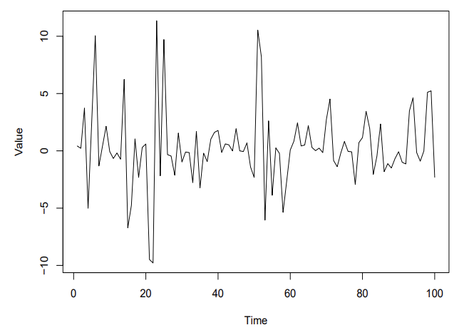

```{r setup, include=FALSE}
knitr::opts_chunk$set(echo = TRUE)
```

# Overall Evaluation - Thoughts 

Overall, going through each question and grading based on available points, I'd give AI 106/150 ($\approx$ 71%).

In broad strokes, there are some consistent issues with the AI answers:

* It sometimes does not directly answer the question (Q4, Q5, AQ4 part (d)).
* It fails to connect important concepts and ideas together (Q3, AQ5).
* It is overly verbose or restates given information (AQ1, AQ6).
* It occasionally gets the answer outright incorrect (Q5, Q6 part (b)).

I also want to note my experience and perspective in answering these questions, as I believe it helps illustrate what I think is the missing "secret ingredient" in the AI answers. 

On the first day of class, in reviewing the syllabus, one aspect of this course stuck with me:

> The learning objectives of this course are for students to develop the ability to approach problems from a methodologically mature viewpoint.

Treating "methodologically mature" as exchangeable with "statistical maturity" (though not in the formal statistical sense), I have taken that objective to heart, though aspirational and ongoing. As you went on to note, statistical maturity is connecting the dots between otherwise seemingly disparate ideas. I would also say it involves searching for related, and often not explicitly cited, literature, taking the time to review more than just the Course Notes, and generally refusing to confine concepts in tidy, "This-is-X-kind-of-Statistics" type of box. It is in this respect that I have grown to appreciate this course. And it is in this respect that I believe AI fell short. 

# Short Answer Questions

# 1. 

In lecture, we discussed an example taken from the book *Generalized Linear Models* by McCullagh and Nelder that illustrated the use of basic quasi-likelihood. In that example, use was made of Pearson residuals,

$$r_i = \frac{(y_i - \hat{\mu}_i)}{[\text{var}(\hat{\mu}_i)]^{1/2}}.$$

Why are Pearson residuals better suited for use with quasi-likelihood than are deviance residuals?

## Answer - Me 

Pearson residuals are better suited for quasi-likelihood (specifically diagnostics) because quasi-likelihood specifies only the first two moments of the response --- $E(Y_i) = \mu_i$ and $\text{var}(Y_i) = (1/\phi)V(\mu_i)$ --- and Pearson residuals are defined entirely in terms of those moments. Deviance residuals, by contrast, require a fully specified log-likelihood to construct the deviance, which is precisely what quasi-likelihood forgoes. In that sense, deviance residuals are not naturally available in the quasi-likelihood framework.

There is also a related, though distinct, argument concerning their *use*. Pearson residuals are constructed by standardizing $(y_i - \hat{\mu}_i)$ by the model-implied standard deviation, so their magnitude reflects precisely how well $V(\mu_i)$ accounts for the observed variability. If the variance function is correctly specified, the Pearson residuals should behave like a standardized sample; systematic departures, conversely, signal misspecification of $V(\mu_i)$, making them a natural tool for probing the central assumption quasi-likelihood actually makes. Deviance residuals require a fully specified likelihood simply to be constructed, and the asymptotic justification for treating them as diagnostics (essentially their approximate normality in large samples) inherits a full distributional assumption that quasi-likelihood does not require (or even make).

## Answer - AI 

Pearson residuals are better suited for quasi-likelihood because **quasi-likelihood methods do not fully specify a probability model**, and Pearson residuals depend only on the **mean–variance relationship**, which is exactly what quasi-likelihood keeps.

## Evaluation 

(2/5): AI correctly identifies that Pearson residuals require only the mean–variance relationship, which is all quasi-likelihood specifies, but the answer stops there. In this sense, I would regard it as incomplete as it doesn't directly address the *"for use"* aspect of the question. 

# 2.

In any problem involving censored observations for which we will use a likelihood that contains terms for left censored observations and/or interval censored observations and/or right censored observations, what is a major assumption that affects the validity of the analysis?

## Answer - Me 

That major assumption is that the censoring mechanism is independent of the mechanism producing observed values, and the Notes go on to say, *"which is similar to an assumption of missing at random or, in a situation lacking covariates, missing completely at random."*

## Answer - AI 

A key assumption in likelihood-based analysis with left/right/interval censored data is:

> **The censoring mechanism is non-informative (a.k.a. independent or ignorable) given the model parameters.**

## Evaluation 

(4/5): The AI answer correctly identifies the core assumption, but lacks additional context I believe is meaningful (not just because of how it was explicitly noted in the course text).

# 3. 

There is some evidence that Fisher may have considered aspects of a testing problem such as normality, constant variance, and perhaps even independence as part of the hypothesis to be tested. This would not be possible under a Neyman-Pearson framework in which these aspects of the test must be given as assumptions under which the test is valid. Why?

## Answer - Me 

The core issue is the Neyman-Pearson (NP) framework is decision-based. The NP framework is built around choosing either $H_0$ or $H_1$. If distributional assumptions (normality, constant variance, independence) are folded into $H_0$, rejecting $H_0$ no longer points toward a specific, actionable alternative. As the text notes, it becomes unclear how one should *"behave under a decision that a null hypothesis is not entirely true, but any one of an array of other possibilities might be."* The decision rule collapses because $H_0$ and $H_1$ no longer constitute a logical disjunction, i.e., they no longer partition $\Theta$, which is the foundational requirement of the Neyman-Pearson setup.

This non-specificity of the alternative hypothesis also destroys the power machinery of the NP framework. Type II error and power are defined relative to a *specific* alternative: to compute $\beta(\theta)$, one needs the distribution of the test statistic under $H_1$, which requires a fully specified model. The NP framework is fundamentally a pre-data precision procedure, whose coherence derives from pre-committing to error rates $\alpha$ and $\beta$ before observing data. If $H_1$ is effectively "anything other than a normal distribution with equal variances and independent errors," (to take a standard example) there is no single $\beta$ to pre-commit to, and with it any claim to optimality (UMP or otherwise) is lost.

## Answer - AI 

The short answer is: the Neyman–Pearson framework requires a **fully specified probabilistic model before you even define the test**, whereas Ronald Fisher treated model features more flexibly—as things that could themselves be scrutinized by the data.

In the Neyman–Pearson framework, assumptions like normality and independence are **built into the mathematical foundation of the test**. If you tried to test them within the same framework, you would lose the very distributional results needed to control error rates—so the procedure would no longer be valid.

## Evaluation 

(7/10): The AI gets the spirit of the question but not the mechanism. It never addresses that $H_0$ and $H_1$ must partition $\Theta$, nor that $\beta(\theta)$ requires a fully specified alternative; consequently, it misses that the NP framework's decision-based structure collapses entirely when additional (non-distributional) assumptions are folded into $H_0$.

# 4. 

What is the purpose of using what in class was called a comparison function $h(\theta, \hat{\theta}_n)$ in a parametric bootstrap?

## Answer - Me 

The comparison function $h(\theta, \hat{\theta}_n)$ (referred to in the Notes as a discrepancy function) serves to reduce or eliminate the dependence of the sampling distribution of $\hat{\theta}_n$ on the unknown true parameter $\theta$. Because the sampling distribution of $\hat{\theta}_n$ itself depends on $\theta$, the bootstrap instead targets the distribution of $h(\theta, \hat{\theta}_n)$. The ideal choice of $h$ is a pivotal quantity, where the distribution of $h(\theta, \hat{\theta}_n)$ is entirely free of $\theta$, making the bootstrap approximation as stable and reliable as possible. The choice of $h$ is otherwise flexible, and different choices characterize different aspects of the estimator's sampling behavior, leading to different bootstrap interval procedures. In practice, discrepancy functions should correspond to appropriately centered and scaled versions of estimators for which a limit distribution is known to exist. It is worth emphasizing that the bootstrap is approximating the distribution of $h(\theta, \hat{\theta}_n)$, not the distribution of $\hat{\theta}_n$ itself.

## Answer - AI 

It lets you replace the unknown distribution: $h(\theta, \hat{\theta}_n)$

with the computable bootstrap approximation: $h(\hat{\theta}_n, \hat{\theta}_n^*).$

So instead of trying to approximate the distribution of ($\hat{\theta}_n$) directly, you approximate a **transformed version** that behaves the same in both worlds.

## Evaluation 

(3/5): AI identifies the *what*, but lacks detail on the *why*. Specifically, AI does not address what $h$ is actually designed to accomplish, which is reducing or eliminating the dependence of the sampling distribution of $\hat{\theta}_n$ on the unknown $\theta$.

# 5. 

Why are normed profile likelihoods of no help in finding maximum likelihood estimates?

## Answer - Me 

In a word: using the normed profile likelihood to find maximum likelihood estimates is circular. As the Notes make clear, the normed profile likelihood for $\theta_1$,

$$R_n^p(\theta_1) = \max_{\boldsymbol{\theta}_2} \left[ \frac{L_n(\theta_1,
\boldsymbol{\theta}_2)}{L_n(\hat{\boldsymbol{\theta}}_n)} \right]$$

requires the unrestricted joint MLE $\hat{\boldsymbol{\theta}}_n = (\hat{\theta}_1, \hat{\boldsymbol{\theta}}_2)$ in the denominator, the very quantity one is trying to find.

## Answer - AI 

The crucial point:

$$
\arg\max_{\theta} \tilde{L}_p(\theta)
=
\arg\max_{\theta} L_p(\theta).
$$

Multiplying or dividing by a **positive constant** does not change where the maximum occurs.

So:

* The MLE is determined by where the likelihood is largest.
* Normalizing only changes the *scale*, not the *location* of the maximum.

## Evaluation 

(0/5): AI does not directly answer the question, and is simply wrong for that.

# 6.

Assessment of a Bayesian analysis is often approached through use of the posterior predictive distribution for new observations,

$$p(\mathbf{y}^0 \mid \mathbf{y}) = \int f(\mathbf{y}^0 \mid \boldsymbol{\theta})\, p(\boldsymbol{\theta} \mid \mathbf{y}) \, d\boldsymbol{\theta}.$$

## (a) 

For this definition to hold, $\mathbf{Y}^0$ must follow the same distribution as $\mathbf{Y}$, depending on the same value of $\boldsymbol{\theta}$. What else must be true about the relation between $\mathbf{Y}^0$ and $\mathbf{Y}$ for this definition of a posterior predictive distribution to be valid?

### Answer - Me 

The other thing that must hold is $\mathbf{Y}^0$ and $\mathbf{Y}$ must be *conditionally independent given $\boldsymbol{\theta}$*. This allows the factorization $f(\mathbf{y}^0, \mathbf{y} \mid \boldsymbol{\theta}) = f(\mathbf{y}^0 \mid \boldsymbol{\theta})\, f(\mathbf{y} \mid \boldsymbol{\theta})$, which is necessary to reduce the joint predictive to the integral form shown.

### Answer - AI 

In addition to ($\mathbf{Y}^0$) and ($\mathbf{Y}$) sharing the same sampling model conditional on ($\boldsymbol{\theta}$), a crucial requirement is:

> **Conditional independence given the parameter $(\boldsymbol{\theta})$.**

Formally, we must have: $\mathbf{Y}^0 \perp \mathbf{Y} \mid \boldsymbol{\theta}.$

### Evaluation 

(5/5): AI answer is correct and complete, missing only a minor detail (the factorization) that I included in my answer. 

## (b) 

There are two other predictive distributions that can be useful in a Bayesian analysis. One can be used with the standard data model and prior setup consisting of a data model $f(\mathbf{y}|\boldsymbol{\theta})$ and a prior $\pi(\boldsymbol{\theta})$. The other is connected specifically with hierarchical models consisting of $f(\mathbf{y}|\boldsymbol{\theta})$, $g(\boldsymbol{\theta}|\boldsymbol{\lambda})$ and $\pi(\boldsymbol{\lambda})$. Define these predictive distributions, and indicate their primary uses.

### Answer - Me 

The first is the *prior predictive distribution*, applicable under a standard data model and prior $f(\mathbf{y} \mid \boldsymbol{\theta})$, $\pi(\boldsymbol{\theta})$ (i.e., not restricted to hierarchical model settings): 

$$p(\mathbf{y}) = \int f(\mathbf{y} \mid \boldsymbol{\theta})\, \pi(\boldsymbol{\theta})\, d\boldsymbol{\theta}.$$

Its primary uses are prior predictive model checking, i.e., assessing whether the model implies plausible data before observing $\mathbf{y}$, in addition to being the marginal likelihood in Bayes factor model comparisons.

The second is the *posterior predictive distribution for new random parameters* $\boldsymbol{\theta}^*$, connected specifically with hierarchical models viewed as mixtures (rather than multi-stage priors), where the scientific mechanism is embodied in the mixing distribution $g(\boldsymbol{\theta} \mid \boldsymbol{\lambda})$ rather than in the data model parameters $\boldsymbol{\theta}_i$ themselves:

$$p(\boldsymbol{\theta}^* \mid \mathbf{y}) = \int g(\boldsymbol{\theta}^* \mid \boldsymbol{\lambda})\, p(\boldsymbol{\lambda} \mid \mathbf{y})\, d\boldsymbol{\lambda}.$$

Its primary use is making probability statements about what will occur in new, unobserved situations drawn from the same mechanism, e.g., predicting the economic optimal nitrogen rate in a future trial, as used in the Notes. This is preferred over using the individual posteriors $p(\boldsymbol{\theta}_i \mid \mathbf{y})$ directly, since those form only a collection of conditional distributions without a natural structure for inference about the distribution of $\boldsymbol{\theta}$ across situations. It is also preferred over evaluating $g(\boldsymbol{\theta}^* \mid \hat{\boldsymbol{\lambda}})$ at a point estimate, since it propagates full posterior uncertainty in $\boldsymbol{\lambda}$.

### Answer - AI 

#### 1. Prior predictive distribution (marginal predictive)

Given a standard Bayesian model:

* likelihood: ($f(\mathbf{y}\mid \boldsymbol{\theta})$)
* prior: ($\pi(\boldsymbol{\theta})$)

the **prior predictive distribution** is:

$$
p(\mathbf{y}) = \int f(\mathbf{y}\mid \boldsymbol{\theta}), \pi(\boldsymbol{\theta}), d\boldsymbol{\theta}.
$$

This is the distribution of the data **before seeing any observations**, integrating over prior uncertainty in ($\boldsymbol{\theta}$).

Primary uses

1. **Model checking (prior-to-data coherence)**

   * Do simulated datasets from the model “look like” plausible data?
   * Helps detect whether the prior + likelihood combination is unreasonable.

2. **Design / prior sensitivity assessment**

   * Shows what kinds of data the model expects a priori.
   * Useful for diagnosing overly informative or implausible priors.

3. **Bayesian model comparison (marginal likelihood)**

   * This is the key quantity in Bayes factors: $p(\mathbf{y}\mid M)$

#### 2. Prior predictive for hierarchical models (conditional predictive at the hyperparameter level)

Now consider a hierarchical model:

* ($f(\mathbf{y}\mid \boldsymbol{\theta})$)
* ($g(\boldsymbol{\theta}\mid \boldsymbol{\lambda})$)
* ($\pi(\boldsymbol{\lambda})$)

The **hierarchical prior predictive distribution** is:

$$
p(\mathbf{y}) =
\int \int f(\mathbf{y}\mid \boldsymbol{\theta}), g(\boldsymbol{\theta}\mid \boldsymbol{\lambda}), \pi(\boldsymbol{\lambda}) , d\boldsymbol{\theta}, d\boldsymbol{\lambda}.
$$

Equivalently:

$$
p(\mathbf{y}) =
\int f(\mathbf{y}\mid \boldsymbol{\lambda}), \pi(\boldsymbol{\lambda}), d\boldsymbol{\lambda},
\quad \text{where } f(\mathbf{y}\mid \boldsymbol{\lambda}) = \int f(\mathbf{y}\mid \boldsymbol{\theta})g(\boldsymbol{\theta}\mid \boldsymbol{\lambda})d\boldsymbol{\theta}.
$$

This is the distribution of data **before observing anything**, but now accounting for both:

* within-group variation ($(\boldsymbol{\theta}\mid \boldsymbol{\lambda})$)
* between-group variation ($(\boldsymbol{\lambda})$)

Primary uses

1. **Hierarchical model checking**

   * Does the full multilevel model generate realistic data?
   * Important for checking whether shrinkage assumptions are plausible.

2. **Assessing prior structure at multiple levels**

   * Evaluates whether hyperpriors imply reasonable variability across groups.

3. **Understanding induced marginal behavior**

   * Shows what marginal distributions the hierarchy implies for observables (often heavy-tailed or overdispersed forms).

### Evaluation 

(2/5): AI is largely correct on the prior predictive distribution, but is fully incorrect about the second predictive distribution relevant to this question. For the second distribution, the AI answers a different question entirely and doesn't acknowledge the conceptual distinction between the hierarchical model as mixture vs. multi-stage prior framing.

# Additional Questions

# 1. 

A set of environmental samples (say soil samples) have been taken to determine the level of contamination of a site by polychlorinated biphenyls (PCBs). Two laboratories were used to analyze the samples, with $n_1$ samples being sent to Lab 1 and $n_2$ samples sent to Lab 2. Lab 1 has a detection limit of $0.01\ \mu\text{g/L}$, while Lab 2 has a detection limit of $0.03\ \mu\text{g/L}$. Both labs have a precision of $0.005\ \mu\text{g/L}$ for values reported to two decimal places. The data recorded are laboratory (1 or 2), sample number, concentration in $\mu\text{g/L}$, and an indicator as to whether the sample was below detection limits (1) or not (0). We have decided to model concentrations with a gamma distribution, parameterized for a random variable $X$ and parameters $\alpha > 0$ and $\beta > 0$ as,

$$f(x \mid \alpha, \beta) = \frac{\beta^\alpha}{\Gamma(\alpha)}\, x^{\alpha - 1} \exp(-\beta x); \quad x > 0.$$

Write the likelihood function for the entire collection of $n_1$ samples analyzed at Lab 1 and $n_2$ samples analyzed at Lab 2. Assume independence of samples, and note that our objective is to estimate the distribution of concentrations, NOT to compare the results between the two laboratories.

**HINT:** Define random variables and set up your indexing system first.

## Answer - Me 

Let $i \in \{1, 2\}$ index the laboratory and $j = 1, \ldots, n_i$ index the sample within lab $i$, where $n_1$ and $n_2$ denote the number of samples sent to Lab 1 and Lab 2, respectively.

Let $X_{ij}$ denote the true PCB concentration of sample $j$ analyzed at lab $i$, with

$$X_{ij} \overset{\text{iid}}{\sim} \text{Gamma}(\alpha, \beta), \quad i = 1, 2, \quad j = 1, \ldots, n_i.$$

Note: Because the samples themselves are taken from the same site, we do not have lab-specific parameters for the true PCB concentration. 

Further, each sample is associated with an indicator

$$
\mathbb{1}_{ij} =
\begin{cases}
1, & X_{ij} < c_i \quad \text{(sample below detection limit)} \\
0, & X_{ij} \ge c_i \quad \text{(sample at or above detection limit)}
\end{cases}
$$

Note: When $\mathbb{1}_{ij} = 0$, a reported concentration $y_{ij}$ is recorded to precision $\Delta = 0.005\ \mu\text{g/L}$.

Since $X_{ij}$ is modeled as a continuous random variable, $\Pr(X_{ij} = c_i) = 0$ and the distinction between strict and non-strict inequality at the boundary is inconsequential.

Next, define the index sets

$$\mathcal{D}_i = \{j : \mathbb{1}_{ij} = 0\}, \quad \mathcal{U}_i = \{j : \mathbb{1}_{ij} = 1\}, \quad |\mathcal{D}_i| + |\mathcal{U}_i| = n_i.$$

Assuming independence across all samples, the likelihood factors as a product over both labs and all samples within each lab. Each observation contributes a probability mass under the Gamma model corresponding to its censoring type: Detected samples contribute an interval probability of width $2\Delta$, while below-detection samples contribute the probability of falling below the lab's detection limit $c_i$. Because the Gamma distribution has support on $(0, \infty)$, the effective lower bound for interval-censored observations is $\max(y_{ij} - \Delta,\, 0)$; in this problem this distinction is inconsequential because the smallest possible reported value from Lab 1 is $c_1 = 0.01\ \mu\text{g/L}$, giving $y_{ij} - \Delta \ge 0.01 - 0.005 = 0.005 > 0$, and similarly for Lab 2, $y_{ij} - \Delta \ge 0.03 - 0.005 = 0.025 > 0$.

The likelihood may then be written as 

$$L(\alpha, \beta) = \prod_{i=1}^{2} \left[\prod_{j \in \mathcal{D}_i} \Big[ F(y_{ij} + \Delta \mid \alpha, \beta) - F(y_{ij} - \Delta \mid \alpha, \beta) \Big] \prod_{j \in \mathcal{U}_i} F(c_i \mid \alpha, \beta) \right]$$

where $F(\,\cdot \mid \alpha, \beta)$ is the Gamma CDF, $\Delta = 0.005\ \mu\text{g/L}$ is the common reporting precision, and $c_1 = 0.01$, $c_2 = 0.03\ \mu\text{g/L}$ are the detection limits for Labs 1 and 2, respectively. 

Note that $F(0 \mid \alpha, \beta) = 0$ for the Gamma distribution, so the left-censored contribution simplifies directly to $F(c_i \mid \alpha, \beta)$. The shared parameters $(\alpha, \beta)$ across both labs reflect our objective of estimating a single underlying concentration distribution.

## Answer - AI 

Let ($X_{ij}$) denote the true PCB concentration for sample (j) analyzed at lab (i), where

* ($i = 1,2$) indexes the laboratory,
* ($j = 1,\dots,n_i$),
* and ($X_{ij} \stackrel{\text{ind}}{\sim} \text{Gamma}(\alpha,\beta)$) with density

$$
f(x\mid \alpha,\beta)=\frac{\beta^\alpha}{\Gamma(\alpha)}x^{\alpha-1}e^{-\beta x},\quad x>0.
$$

Let ($c_1 = 0.01$) and ($c_2 = 0.03$) be the detection limits for Lab 1 and Lab 2 respectively.

Define an indicator:

$$
\delta_{ij} =
\begin{cases}
1, & X_{ij} < c_i \quad \text{(below detection limit)} \\
0, & X_{ij} \ge c_i \quad \text{(detected)}
\end{cases}
$$

We observe:

* If ($\delta_{ij}=0$): we observe the actual value ($x_{ij}$).
* If ($\delta_{ij}=1$): we only know ($X_{ij} < c_i$), so we observe a censored contribution.

Likelihood contribution for one observation

(i) Detected observation ($(\delta_{ij}=0)$)

$$
L_{ij} = f(x_{ij}\mid \alpha,\beta)
$$

(ii) Non-detect ($(\delta_{ij}=1)$)

$$
L_{ij} = P(X_{ij} < c_i) = \int_0^{c_i} f(x\mid \alpha,\beta),dx = F(c_i\mid \alpha,\beta)
$$

where ($F(\cdot)$) is the Gamma CDF.

Assuming independence across all samples (and across labs), the likelihood is:

$$
L(\alpha,\beta)
=
\prod_{i=1}^2 \prod_{j=1}^{n_i}
\Big[
f(x_{ij}\mid \alpha,\beta)^{1-\delta_{ij}}
; F(c_i\mid \alpha,\beta)^{\delta_{ij}}
\Big].
$$

Substituting the gamma density:

$$
L(\alpha,\beta)
=
\prod_{i=1}^2 \prod_{j=1}^{n_i}
\left[
\left(\frac{\beta^\alpha}{\Gamma(\alpha)} x_{ij}^{\alpha-1} e^{-\beta x_{ij}}\right)^{1-\delta_{ij}}
\left(F(c_i\mid \alpha,\beta)\right)^{\delta_{ij}}
\right].
$$ 

## Evaluation 

(10/20): The AI answer is lacking significant details. AI treats detected observations as exact values, rather than interval probabilities, ignoring the stated instrument precision $\Delta = 0.005\ \mu\text{g/L}$ provided in the problem statement. It also never justifies why $(\alpha, \beta)$ are shared across labs, and the explicit density substitution at the end is unnecessary.

# 2. 

Consider four random variables $X_1$, $X_2$, $Y$, and $Z$. You are told that $X_1$ and $X_2$ are conditionally independent given the pair $(Y, Z)$ but that $Y$ and $Z$ are not independent. Determine two conditions, similar in form but one for $X_1$ and one for $X_2$, that are sufficient for $[X_1, X_2 \mid Y, Z] = [X_1 \mid Y][X_2 \mid Z]$.

## Answer - Me 

Begin from the definition of conditional independence of $X_1$ and $X_2$ given $(Y, Z)$ 

$$[X_1, X_2 \mid Y, Z] = [X_1 \mid Y, Z]\,[X_2 \mid Y, Z].$$

For this to equal $[X_1 \mid Y][X_2 \mid Z]$, it suffices to impose the following two conditions:

1. $X_1 \perp Z \mid Y$, such that $[X_1 \mid Y, Z] = [X_1 \mid Y]$;
2. $X_2 \perp Y \mid Z$, such that $[X_2 \mid Y, Z] = [X_2 \mid Z]$.

Substituting both into the factorization above then gives

$$[X_1, X_2 \mid Y, Z] = [X_1 \mid Y]\,[X_2 \mid Z],$$

as desired.

## Answer - AI 

The two sufficient conditions are:

$$
\boxed{X_1 \perp Z \mid Y}
\quad \text{and} \quad
\boxed{X_2 \perp Y \mid Z.}
$$

## Evaluation 

(10/10): AI is correct, stating the two conditions without derivation. The missing "train of thought" (the derivations) is a moot critique though --- the question only asks to *determine* the conditions, and if anything, AI's tendency to overexplain is the bigger sin throughout this document.

# 3. 

Consider a situation in which we have two scientific or substantive processes of interest. These could, for example, be two environmental processes in a rainforest such as tree growth and evapotranspiration, or two constructs in the social sciences such as access to preventative health care and social status in rural areas. We may have some scientific basis to believe these processes are not independent of one another. We also have two observable quantities that we believe are direct reflections of those processes, such as vegetative biomass and respiration in sample plots for the rainforest example, or number of rural medical centers and poverty rates in counties for the social science example.

## (a)

First, define some notation to make a problem such as those described (two non-independent processes and two direct indicators) fit into the notational framework of the previous question. That is, define $X_1$, $X_2$, $Y$, and $Z$ in terms of processes (say process 1 and process 2), and observables (say observable 1 and observable 2). You can, without additional notation, assume that writing down one observable random variable implies a collection of values from sampling units.

### Answer - Me 

Let $Y$ and $Z$ represent Process 1 and Process 2, respectively. These processes are not independent of one another, i.e., $[Y, Z] \neq [Y][Z]$, reflecting the substantive belief that the two underlying processes are related.

Let $X_1$ and $X_2$ represent Observable 1 and Observable 2, respectively, where $X_1$ is a direct reflection of Process 1 and $X_2$ is a direct reflection of Process 2.

### Answer - AI 

Let the two underlying scientific processes of interest be:

* Process 1: ($P_1$) (e.g., tree growth rate, or access to healthcare)
* Process 2: ($P_2$) (e.g., evapotranspiration, or poverty level)

We assume these processes are **not independent**, i.e., ($P_1 \not\perp  P_2$).

Now define two observable quantities that are measured from sampling units and serve as proxies or indicators of these processes:

* Observable 1: ($O_1$), which reflects Process 1
* Observable 2: ($O_2$), which reflects Process 2

To align with the previous conditional independence framework, define:

* ($X_1 := O_1$) (observable indicator of Process 1)
* ($X_2 := O_2$) (observable indicator of Process 2)
* ($Y := P_1$) (latent underlying Process 1)
* ($Z := P_2$) (latent underlying Process 2)

Under this mapping:

* ($X_1$) is a direct measurement of Process 1
* ($X_2$) is a direct measurement of Process 2
* (Y) and (Z) are the true (possibly dependent) scientific processes generating the system
* The observables ($X_1, X_2$) are assumed to arise from their respective processes (possibly with measurement error or sampling variation)

Thus, the structure is: $X_1 \leftarrow Y, \quad X_2 \leftarrow Z, \quad \text{with } Y \not\perp Z.$

This places the scientific example directly into the probabilistic framework of the earlier question, where the goal is to understand conditional relationships of observables given underlying dependent processes.

### Evaluation 

(5/5): AI is correct but overly verbose, and introduces unnecessary notation (the $P_1, P_2, O_1, O_2$) before mapping to the $X_1, X_2, Y, Z$. This is meandering and loses the plot a bit as a result.

## (b)

Using an extension of your notation from (a), identify the distributional forms that will be needed to formulate a hierarchical model. For example, if I desire to model the distribution of a random variable $W$ conditional on the value of another random variable $S$ with a density or mass function that has a parameter $\theta$ I would say I need to formulate a model for $[W \mid S, \theta]$.

### Answer - Me 

A hierarchical model for this setting requires three distributional components. We start by noting that any valid statistical model (hierarchical or otherwise) is a collection of probabilistic assignments and specified relations among components that leads to a joint distribution over all random variables in the problem.

At the data level, we need a model for each observable given its directly associated process:

$$[X_1 \mid Y, \boldsymbol{\theta}_1] \quad \text{and} \quad [X_2 \mid Z, \boldsymbol{\theta}_2]$$

where $\boldsymbol{\theta}_1$ and $\boldsymbol{\theta}_2$ parameterize the relationship between each observable and its respective process.

At the process level, because $Y$ and $Z$ are not independent, we require a joint model for the two processes:

$$[Y, Z \mid \boldsymbol{\theta}_3]$$

where $\boldsymbol{\theta}_3$ governs the marginal behavior of each process as well as the dependence between them. 

The full parameter vector is $\boldsymbol{\theta} = (\boldsymbol{\theta}_1, \boldsymbol{\theta}_2, \boldsymbol{\theta}_3)$, and the three components combine to give the joint distribution over all random variables:

$$[X_1, X_2, Y, Z \mid \boldsymbol{\theta}] = [X_1 \mid Y, \boldsymbol{\theta}_1]\,[X_2 \mid Z, \boldsymbol{\theta}_2]\,[Y, Z \mid \boldsymbol{\theta}_3].$$

### Answer - AI 

Putting the layers together, the full model requires specifying:

(i) Latent process layer $[Y, Z \mid \phi]$

(ii) Observation layer 1 $[X_1 \mid Y, \theta_1]$

(iii) Observation layer 2 $[X_2 \mid Z, \theta_2]$

### Evaluation 

(5/10): AI is correct in broad strokes, but missing a few things. First, there is no explicit description of what each component represents. Second, there is no closing factorization combining all three components into a joint distribution, i.e., actually formulating the model. Finally, AI answers in a reversed order, starting at the process level rather than the data level, which is less intuitive.

## (c) 

Suppose we are willing to assume the conditions given and identified in your answer to the previous question. Now identify what part(s) of the model formulation from part (b) is(are) made more simple as a result of that assumption.

### Answer - Me 

The conditions from the prior question — that $X_1 \perp Z \mid Y$ and $X_2 \perp Y \mid Z$ — affect only the *data level* of the model. Without those conditions, we would in general need to formulate a joint model for the two observables given both processes, i.e., specify $[X_1, X_2 \mid Y, Z, \boldsymbol{\theta}_1, \boldsymbol{\theta}_2],$ which could require specifying a dependence structure between $X_1$ and $X_2$ even after conditioning on $(Y, Z)$. 

Under the stated conditions, this joint model factorizes as $[X_1, X_2 \mid Y, Z, \boldsymbol{\theta}_1, \boldsymbol{\theta}_2] = [X_1 \mid Y, \boldsymbol{\theta}_1]\,[X_2 \mid Z, \boldsymbol{\theta}_2],$ so each observable need only be modeled conditionally on its own directly associated process. The two data-level components from part (b) can therefore be specified independently of one another.

The process-level component $[Y, Z \mid \boldsymbol{\theta}_3]$, by contrast, is not simplified. The processes $Y$ and $Z$ remain non-independent by assumption, so a joint model for the two processes is still required.

### Answer - AI 

The assumption simplifies the model specifically by:

1. **Forcing factorization of the observation model**

$$
[X_1, X_2 \mid Y, Z] \to [X_1 \mid Y]\,[X_2 \mid Z]
$$

2. **Removing any need for a joint measurement error or dependence structure between ($X_1$) and ($X_2$)**

3. **Allowing complete separation of observation parameters**

$$
\theta \to (\theta_1, \theta_2)
$$

4. **Yielding a fully factorized hierarchical likelihood**

$$
[Y, Z \mid \phi]\,[X_1 \mid Y, \theta_1]\,[X_2 \mid Z, \theta_2].
$$

In short: the assumption collapses what could have been a coupled, potentially complex observation model into two conditionally independent measurement models, greatly simplifying both specification and inference.

### Evaluation 

(7/10): AI is correct but disorganized, lacking descriptive value in what the derivations actually mean. Also, the likelihood framing in point 4 is misguided; the question asks about model formulation, not inference, and introducing likelihood here gets ahead of the actual question being asked.

## (d)

In one or possibly two (but one should really do it) sentence or sentences, state what the assumption implies about the actual processes and observable quantities involved in the problem. If you wish, you may use one of the hypothetical examples given in the preamble to this question to make things more concrete (but you certainly do not have to do that).

### Answer - Me 

The assumption implies that each observable is driven entirely by its own associated process --- once the value of that process is known, the other process contributes no additional information about the observable.

### Answer - AI 

The assumption implies that, conditional on their respective underlying processes, each observable quantity depends only on its own process and carries no additional information about the other process or its measurement, so any association between the two observables is entirely mediated through the dependence between the underlying processes themselves. In other words, once we account for (say) tree growth affecting biomass and evapotranspiration affecting respiration, biomass tells us nothing further about evapotranspiration beyond what is already encoded through the latent ecological linkage between the two processes.

### Evaluation 

(3/5): AI really didn't take the *"In one or possibly two (but one should really do it) sentence"* to heart. Getting into the weeds of the example also detracts from the core takeaway: separability between the two processes (apologies in advance for this one being more than one sentence too).

# 4.

If you have heard any news about the stock market over the past 10 weeks or so, you know that there have been some days with extreme losses, some with sizable "bounce-back" gains, and some with relatively little movement. This is called high "volatility" in the market. There are all kinds of ways one might model a high volatility situation, but suppose we suggest the following:

Let $\{Y_t : t = 1, \ldots, T\}$ denote random variables associated with the change in an index of the stock market on day $t$ (change from day $t - 1$). Formulate the following model

$$Y_t = \mu + \epsilon_t$$

$$\epsilon_t \sim N(0,\, S_t^2)$$

$$S_t = \alpha S_{t-1} + v_t$$

$$v_t \stackrel{\text{iid}}{\sim} N(0,\, \sigma^2)$$

## (a) 

Determine the expected values, variances, and one-step covariances of $S_t$ (that is, the covariance of $S_t$ with $S_{t-1}$ or $S_{t+1}$).

*Hint: If you recall them, you may use the results we obtained in class for AR(1) processes without derivation.*

### Answer - Me 

The model places an AR(1) structure on $S_t$, the conditional standard deviation of $\epsilon_t$, so AR(1) results apply directly.

Since $E[v_t] = 0$ for all $t$, iterating expectations gives $E[S_t] = 0.$

Assuming second-order stationarity, which requires $|\alpha| < 1$, the AR(1) variance result gives $\text{var}(S_t) = \frac{\sigma^2}{1 - \alpha^2}.$

From the general AR(1) covariance formula $\text{cov}(S_t, S_{t-k}) = \alpha^k \sigma^2 / (1 - \alpha^2)$, evaluated at lag $k = 1$, $\text{cov}(S_t, S_{t-1}) = \frac{\alpha\sigma^2}{1 - \alpha^2},$ which is equivalent to $\text{cov}(S_{t+1}, S_{t})$.

### Answer - AI 

We recognize that (${S_t}$) is an AR(1) process: $S_t = \alpha S_{t-1} + v_t,\quad v_t \stackrel{iid}{\sim} N(0,\sigma^2).$

Assume ($|\alpha| < 1$) so the process is (weakly) stationary.

Take expectations on both sides: $\mathbb{E}[S_t] = \alpha \mathbb{E}[S_{t-1}] + \mathbb{E}[v_t].$

Since ($\mathbb{E}[v_t]=0$), stationarity implies ($\mathbb{E}[S_t]=\mathbb{E}[S_{t-1}] = \mu_S$), so:

$$
\mu_S = \alpha \mu_S \quad \Rightarrow \quad (1-\alpha)\mu_S = 0 \quad \Rightarrow \quad \mu_S = 0.
$$

So, $\boxed{\mathbb{E}[S_t] = 0.}$

Let ($\gamma_0 = \mathrm{Var}(S_t)$). Then: $\mathrm{Var}(S_t) = \mathrm{Var}(\alpha S_{t-1} + v_t).$

Using independence of ($S_{t-1}$) and ($v_t$): $\gamma_0 = \alpha^2 \gamma_0 + \sigma^2.$

Solve:

$$
\gamma_0(1-\alpha^2) = \sigma^2
\quad \Rightarrow \quad
\boxed{\mathrm{Var}(S_t) = \frac{\sigma^2}{1-\alpha^2}}.
$$

For one-step covariances

(i) $Cov(S_t, S_{t-1})$

$$
\mathrm{Cov}(S_t, S_{t-1}) = \mathrm{Cov}(\alpha S_{t-1} + v_t, S_{t-1})
= \alpha \mathrm{Var}(S_{t-1}) + 0
$$

So: $\boxed{\mathrm{Cov}(S_t, S_{t-1}) = \alpha \frac{\sigma^2}{1-\alpha^2}}.$

(ii) $Cov(S_t, S_{t+1})$

Use:

$$
S_{t+1} = \alpha S_t + v_{t+1}.
$$

Then: $\mathrm{Cov}(S_t, S_{t+1}) = \mathrm{Cov}(S_t, \alpha S_t + v_{t+1}) = \alpha \mathrm{Var}(S_t).$

So: $\boxed{\mathrm{Cov}(S_t, S_{t+1}) = \alpha \frac{\sigma^2}{1-\alpha^2}}.$

### Evaluation 

(5/5): While correct, the AI answer is overly verbose: Assumptions are restated, full results are derived rather than treated as available, and the two functionally equivalent versions of the one-step covariance are evaluated separately.

## (b) 

Determine the expected values, variances, and one-step covariances of $\epsilon_t$.

*Hint: Use of the standard conditioning argument for expected values and variances might be valuable here.*

### Answer - Me 

For the expected value, by the law of total expectation, and conditioning on $S_t$, we have 

$$E[\epsilon_t] = E\bigl[E[\epsilon_t \mid S_t]\bigr] = E[0] = 0,$$

since $\epsilon_t \mid S_t \sim N(0, S_t^2)$.

For the variances, by the law of total variance (EVVE),

$$\text{var}(\epsilon_t) = E\bigl[\text{var}(\epsilon_t \mid S_t)\bigr] + \text{var}\bigl(E[\epsilon_t \mid S_t]\bigr) = E[S_t^2] + \text{var}(0) = E[S_t^2].$$

Since $E[S_t^2] = \text{var}(S_t) + (E[S_t])^2 = \sigma^2/(1-\alpha^2) + 0$, we have

$$\text{var}(\epsilon_t) = \frac{\sigma^2}{1 - \alpha^2}.$$

For the one-step covariance, since both marginal means are zero, $\text{cov}(\epsilon_t, \epsilon_{t-1}) = E[\epsilon_t \epsilon_{t-1}]$. Conditioning on $(S_t, S_{t-1})$ and using conditional independence of $\epsilon_t$ and $\epsilon_{t-1}$ given their respective scales by the model structure, the conditional expectation factors:

$$E[\epsilon_t \epsilon_{t-1}] = E\bigl[E[\epsilon_t \epsilon_{t-1} \mid S_t, S_{t-1}]\bigr] = E\bigl[E[\epsilon_t \mid S_t]\, E[\epsilon_{t-1} \mid S_{t-1}]\bigr] = E[0 \cdot 0] = 0.$$

Therefore $\text{cov}(\epsilon_t, \epsilon_{t-1}) = 0$.

### Answer - AI 

Using the law of iterated expectation: $\mathbb{E}[\epsilon_t] = \mathbb{E}\big[\mathbb{E}[\epsilon_t \mid S_t]\big].$

But $\mathbb{E}[\epsilon_t \mid S_t] = 0,$

so $\boxed{\mathbb{E}[\epsilon_t] = 0.}$

Use the law of total variance: $\mathrm{Var}(\epsilon_t) = \mathbb{E}[\mathrm{Var}(\epsilon_t \mid S_t)] + \mathrm{Var}(\mathbb{E}[\epsilon_t \mid S_t]).$

The second term is zero since the conditional mean is zero.

So: $\mathrm{Var}(\epsilon_t) = \mathbb{E}[S_t^2].$

Now: $\mathbb{E}[S_t^2] = \mathrm{Var}(S_t) + (\mathbb{E}[S_t])^2 = \frac{\sigma^2}{1-\alpha^2}.$

Thus: $\boxed{\mathrm{Var}(\epsilon_t) = \frac{\sigma^2}{1-\alpha^2}.}$

We compute ($\mathrm{Cov}(\epsilon_t, \epsilon_{t-1})$).

Using iterated expectation: $\mathrm{Cov}(\epsilon_t, \epsilon_{t-1}) = \mathbb{E}[\epsilon_t \epsilon_{t-1}]$ (since both have mean 0).

Now condition on ($S_t, S_{t-1}$): $\mathbb{E}[\epsilon_t \epsilon_{t-1}] = \mathbb{E}\Big[\mathbb{E}[\epsilon_t \epsilon_{t-1} \mid S_t, S_{t-1}]\Big].$

Given ($S_t, S_{t-1}$), we have:

* ($\epsilon_t \sim N(0,S_t^2)$)
* ($\epsilon_{t-1} \sim N(0,S_{t-1}^2)$)
* and they are independent conditional on the volatility process (standard assumption in this type of model).

So: $\mathbb{E}[\epsilon_t \epsilon_{t-1} \mid S_t, S_{t-1}] = 0.$

Therefore: $\boxed{\mathrm{Cov}(\epsilon_t, \epsilon_{t-1}) = 0.}$

By the same argument: $\boxed{\mathrm{Cov}(\epsilon_t, \epsilon_{t+1}) = 0.}$

### Evaluation 

(5/5): Similar to part (a), the AI answer is correct but overly verbose. Notably, the conditional independence of $\epsilon_t$ and $\epsilon_{t-1}$ is treated as a *"standard assumption in this type of model"* rather than justified from the model structure itself.

## (c)

Determine the expected values, variances, and one-step covariances of $Y_t$.

### Answer - Me 

Since $Y_t = \mu + \epsilon_t$, these follow directly from part (b).

Expected value is given by 

$$E[Y_t] = \mu + E[\epsilon_t] = \mu.$$

Variance is given by 

$$\text{var}(Y_t) = \text{var}(\epsilon_t) = \frac{\sigma^2}{1 - \alpha^2}.$$

The one-step covariance is given by

$$\text{cov}(Y_t, Y_{t-1}) = \text{cov}(\epsilon_t, \epsilon_{t-1}) = 0.$$

### Answer - AI 

$$
\mathbb{E}[Y_t] = \mathbb{E}[\mu + \epsilon_t]
= \mu + \mathbb{E}[\epsilon_t]
= \mu.
$$

So, $\boxed{\mathbb{E}[Y_t] = \mu.}$

Since ($\mu$) is constant: $\mathrm{Var}(Y_t) = \mathrm{Var}(\epsilon_t).$

Thus, $\boxed{\mathrm{Var}(Y_t) = \frac{\sigma^2}{1-\alpha^2}.}$

We compute: $\mathrm{Cov}(Y_t, Y_{t-1}).$

Substitute: $Y_t = \mu + \epsilon_t,\quad Y_{t-1} = \mu + \epsilon_{t-1}.$

Constants drop out: $\mathrm{Cov}(Y_t, Y_{t-1}) = \mathrm{Cov}(\epsilon_t, \epsilon_{t-1}).$

From the previous part: $\mathrm{Cov}(\epsilon_t, \epsilon_{t-1}) = 0.$

So: $\boxed{\mathrm{Cov}(Y_t, Y_{t-1}) = 0.}$

Similarly: $\boxed{\mathrm{Cov}(Y_t, Y_{t+1}) = 0.}$

### Evaluation 

(5/5): AI is again correct, but overly verbose.  AI fails to recognize that these results follow directly from part (b) and ends up re-deriving each quantity from scratch (including two one-step covariance calculations rather than noting equivalence).

## (d)

What does this model then imply about a sequence of changes in the index of stock market prices over the given time period?

*Note: Just for information (but not really important for this question), an example series of values $Y_1, \ldots, Y_T$ with $T = 100$, $\mu = 0$, $\sigma^2 = 1.5$ and $\alpha = 0.90$ is shown in Figure 1.*

```{r fig1, echo=FALSE, fig.align="center", out.width="50%", fig.cap="A realization of the model from Additional Question 4."}

```

### Answer - Me 

The results of parts (b) and (c) together illustrate an apparent tension. The $Y_t$ have constant mean $\mu$, constant marginal variance $\sigma^2/(1-\alpha^2)$, and zero one-step covariance. So marginally, the sequence behaves as uncorrelated white noise with no systematic drift. 

However, the $Y_t$ are not independent. The variance of $Y_t$ is governed by $S_t^2$, and $S_t$ follows an AR(1) process with coefficient $\alpha$. When $\alpha$ is close to 1 (as in the $\alpha = 0.90$ example), the volatility process is highly persistent, in that a large $|S_t|$ today tends strongly to be followed by a large $|S_{t+1}|$ tomorrow. This induces an apparent "clustering effect", i.e., periods of large swings in the index tend to cluster together in time, as do periods of relative calm, even though successive changes are marginally uncorrelated.

This is consistent with the behavior visible in Figure 1, where episodes of extreme positive and negative changes (around $t = 15$--$25$) are concentrated in time rather than distributed uniformly across the series, while other stretches show comparatively little movement. The model therefore captures a key empirical feature of financial markets, in that the magnitude of daily price changes is predictable in a way that the direction is not.

### Answer - AI 

This model implies a classic empirical fact of financial data:

> **Returns are approximately uncorrelated, but volatility is strongly autocorrelated.**

So a stock index path under this model:

* looks like random noise in direction
* but with **time-varying intensity (“volatility bursts”)**

### Evaluation 

(2/5): AI provides what I would describe as a surface level answer, which, while correct, lacks detail and doesn't directly reference or acknowledge the parts of the prior problem (though I asked AI each question successively).

# 5. 

Consider a formal Goodness of Fit test, such as the Chi-squared test of Karl Pearson. Briefly discuss why Pearson's notion of testing goodness of fit does not fit squarely into either the Fisherian theory of significance tests, or the Neyman-Pearson theory of hypothesis tests.

Addendum: 

> What implications do you think the issues involved in this topic have for tests constructed as part of a simulation-based model assessment or for the interpretation of posterior predictive p-values in a Bayesian analysis? 

## Answer - Me 

Pearson's notion of goodness of fit (GOF) resists clean placement in either the Fisherian or the Neyman-Pearson (NP) theories for several related reasons. Most fundamentally, NP testing requires a null and alternative that together form a logical disjunction, but GOF tests have no such alternative. In Pearson's GOF framework, a theoretical distribution that cannot be rejected is deemed an acceptable "graduation" of the data, but is neither accepted in the NP decision-theoretic sense nor claimed to be unique, since multiple theoretical distributions may simultaneously pass the test.

The direction of evidence is also reversed relative to Fisherian significance testing. Where a small $p$-value constitutes evidence against the null in Fisher's framework, Karl Pearson's goal was to achieve a large $p$-value, and the closer to 1.0 the better; as cited in the Course Notes, Fisher objected to this explicitly, stating that under a true model, $p = 0.999$ is no more expected than $p = 0.001$. Fundamentally, Pearson regarded the posited distribution not as a falsifiable scientific claim but as a mathematical construct for graduating observed data, explicitly denying that such curves represent natural laws or bear any meaningful relationship to hypothesis or its reverse, which fails the Fisherian requirement of a hypothesis against which evidence can accumulate.

Finally, Pearson's interpretation of $p$-values relied on overlaying a hypothetical random generating mechanism on the data regardless of whether actual random sampling occurred, effectively folding the assumption of random sampling into the hypothesis under test rather than treating it as a precondition for the test's validity. Neither NP nor Fisherian frameworks *explicitly* accommodate this (though Question 3 is all the more interesting given this point); this leaves the inferential basis of GOF tests, as the text puts it, *"wandering in the wilderness."*

Regarding the Addendum: GOF testing, as Karl Pearson envisioned it, asks a single blunt question about global distributional agreement, namely whether the theoretical distribution provides an adequate "graduation" of the observed frequency distribution regardless of where the data actually came from. This framing, while coherent on its own terms, is precisely what makes Pearson's approach resistant to the kind of decomposition that gives simulation-based and Bayesian methods their practical advantage. Posterior predictive $p$-values, by contrast, decompose that question into multiple targeted diagnostics each of which probes specific structural features of the data such as extreme tail behavior, mean-variance relationship, or other aspects of distributional form. The text makes this recommendation explicit, going so far as to advocate abandoning the search for any one omnibus GOF procedure in all but the simplest problems, noting that it is normal, not unusual, for multiple $p$-values to vary in magnitude precisely because they are measuring different characteristics of the model (a recommendation I personally agree with).

My own view is that the inferential basis for preferring targeted test quantities over an omnibus statistic lies in their relationship to sufficient statistics. Posterior predictive distributions already condition on the data through the likelihood, so test quantities that are functions of sufficient statistics are circular. The posterior has already absorbed whatever "information" those quantities contain, rendering the resulting predictive $p$-values uninformative regardless of model fit. Targeted test quantities, chosen to reflect aspects of data structure not already absorbed by the model's sufficient statistics, are what give posterior predictive checks diagnostic value. That said, this is a practical recommendation about making posterior predictive checks *informative*, and is in no way a resolution of the inferential ambiguity brought about by trying to square where (and how) Pearson's GOF test belongs. At the expense of being "cute": Whether simulation-based (and Bayesian) approaches have truly escaped the wilderness, or simply found a more navigable corner of it, is a question that may be as much semantic as it is philosophical.

## Answer - AI 

In the Fisherian view, a significance test is primarily an evidential procedure: one specifies a null model $H_0$, computes a test statistic measuring discrepancy from the model, and evaluates the extremeness of the observed result through a $p$-value. Pearson's chi-squared goodness-of-fit test resembles this aspect because it measures discrepancy between observed and expected frequencies and reports a tail probability under $H_0$. However, Pearson's notion goes beyond pure Fisherian significance testing because the goal is not merely to assess surprise under $H_0$, but to determine whether the proposed model adequately represents the data-generating mechanism.

At the same time, the procedure does not fit comfortably into the Neyman-Pearson framework. In NP theory, hypothesis testing is fundamentally a decision problem between explicitly specified competing hypotheses $H_0$ and $H_1$, with attention paid to Type I and Type II error rates and optimal rejection regions. Pearson's goodness-of-fit tests lack a clearly defined alternative, leaving no uniquely optimal rejection region, no clear power function against a specific alternative, and no direct decision-theoretic interpretation in the NP sense.

These same issues carry over into Bayesian posterior predictive checking. A posterior predictive check asks whether replicated data from the posterior predictive distribution resemble the observed data according to some discrepancy measure. These $p$-values are not uniformly distributed under the null and therefore are not classical frequentist $p$-values; they are generally conservative because the data are used both to fit the model and to assess it. As a result, posterior predictive checks function more naturally as diagnostic tools than as formal hypothesis tests.

## Evaluation 

(6/10): The AI correctly identifies the lack of a specified alternative but frames it imprecisely, omitting the NP requirement of a logical disjunction, and further misses the reversal of evidential direction, the graduation-curve framing, and the hypothetical randomization context. The conclusion that GOF is a *"model adequacy diagnostic"* could describe almost any assessment procedure and ignores the historically specific tensions that make Pearson's GOF such an odd duck. On the Addendum, the AI raises one point my answer omits, that posterior predictive $p$-values are non-uniform under the null due to double-use of data, but this is tangential to what the question is driving at; the AI misses both the sufficient statistics argument and the omnibus-versus-targeted distinction, which are essential to actually answering the Addendum.

# 6.

Consider two continuous, independent random variables $X$ and $Y$ that have distributions with densities $p(x|\theta)$ and $p(y|\lambda)$, respectively, with each having support on the entire real line. Suppose we would like to compute a Monte Carlo approximation to $\Pr(Y > X)$ for given values of $\theta$ and $\lambda$.

There are two Monte Carlo approximations to $\Pr(Y > X)$ that immediately suggest themselves. Both procedures are based on a sample of values $\{(x_m, y_m) : m = 1, \ldots, M\}$ where the $x_m$ are simulated from $p(x|\theta)$ and the $y_m$ are independently simulated from $p(y|\lambda)$. Approximation A is,

$$P_M^{(A)}(Y > X) = \frac{1}{M} \sum_{m=1}^{M} I(y_m > x_m),$$

where $I(\cdot)$ is the usual indicator function. Approximation B is

$$Pr_M^{(B)}(Y > X) = \frac{1}{M} \sum_{m=1}^{M} \frac{1}{M} \sum_{j=1}^{M} I(y_j > x_m).$$

## (a) 

Identify the explicit integral forms, both equal to $\Pr(Y > X)$, that $P_M^{(A)}$ and $P_M^{(B)}$ are approximating. That is, there are any number of integral expressions that are equal to $\Pr(Y > X)$. You don't get credit for some form just because it is equal to $\Pr(Y > X)$. What we want are those forms that translate directly into the Monte Carlo approximations A and B.

### Answer - Me 

Both approximations equal $\Pr(Y > X)$ but arise from structurally distinct integral representations.

(1): $P_M^{(A)}(Y > X)$ approximates the integral

$$
\Pr(Y > X) = \int_{-\infty}^{\infty} \int_{-\infty}^{\infty} I(y > x)\, p(x \mid \theta)\, p(y \mid \lambda)\, dx\, dy,
$$

which is $E[I(Y > X)]$ with respect to the joint density $p(x \mid \theta)\, p(y \mid \lambda)$. Each simulated pair $(x_m, y_m)$ drawn jointly from this density contributes a single indicator value, giving $P_M^{(A)}(Y > X) = \frac{1}{M}\sum_{m=1}^M I(y_m > x_m)$ directly as a sample mean of the form

$$E_M\{g(X)\} = \frac{1}{M} \sum_{m=1}^{M} g(X_m^*).$$

(2): $Pr_M^{(B)}(Y > X)$ approximates the iterated integral

$$
\Pr(Y > X) = \int_{-\infty}^{\infty} \left[\int_{-\infty}^{\infty} I(y > x)\, 
p(y \mid \lambda)\, dy\right] p(x \mid \theta)\, dx,
$$

where the inner bracket, $\Pr(Y > x)$ with $x$ treated as a fixed constant, is itself approximated by a Monte Carlo average: for each $x_m$, all $M$ simulated $y_j$ values contribute via $\frac{1}{M}\sum_{j=1}^M I(y_j > x_m)$. Averaging this over the $M$ simulated $x_m$ values yields $\Pr_M^{(B)}(Y > X)$. Approximation B therefore exploits all $M^2$ pairs $(x_m, y_j)$, whereas Approximation A uses only the $M$ matched pairs $(x_m, y_m)$.

### Answer - AI 

Let ($X \sim p(x\mid \theta)$) and ($Y \sim p(y\mid \lambda)$) be independent.

Start from the basic definition:

$$
\Pr(Y > X) = \iint I(y > x)\, p(x\mid \theta)\, p(y\mid \lambda)\, dx\, dy.
$$

Approximation A uses **paired draws** ((x_m, y_m)), so it directly approximates the joint expectation over independent draws of ((X,Y)):

$$
\Pr(Y > X)
= \mathbb{E}[I(Y > X)]
= \int I(y > x)\, p(x\mid \theta)\, p(y\mid \lambda)\, dx\, dy.
$$

This is the integral form that matches: $P_M^{(A)} = \frac{1}{M}\sum_{m=1}^M I(y_m > x_m).$

Approximation B uses **conditioning on (X)** and then averaging over (Y) given (X):

$$
\Pr(Y > X)
= \int \Pr(Y > x \mid X=x)\, p(x\mid \theta)\, dx.
$$

Since independence implies ($p(y\mid x)=p(y)$), we get:

$$
\Pr(Y > x \mid X=x) = \int I(y > x)\, p(y\mid \lambda)\, dy.
$$

So the full expression is: 

$$
\Pr(Y > X)
= \int \left[ \int I(y > x)\, p(y\mid \lambda)\, dy \right] p(x\mid \theta) dx.
$$

This is exactly what the nested Monte Carlo in B approximates.

### Evaluation 

(10/10):Overall, the AI answer is correct, but has two weaknesses. First, the LaTeX did not render cleanly and required manual adjustment for proper compilation. Second, in its treatment of Approximation B, it redundantly re-derives independence rather than proceeding directly to the iterated integral, an assumption already stipulated in the problem.

## (b) 

Identify, in terms of expectation operators, again both equal to $\Pr(Y > X)$, the expected values that $P_M^{(A)}$ and $P_M^{(B)}$ are approximating.

*Hint: Just because $X$ and $Y$ are independent, that does not preclude us from thinking about the conditional distribution of one given the other. It just means that $p(x|y) = p(x)$, and similarly for $Y$.*

*Note About the Question: While these approximations are asymptotically equivalent, there can be differences in Monte Carlo variance for finite Monte Carlo sample sizes, $M$. In particular, approximation B seems to have a smaller Monte Carlo error than approximation A. Even more interesting, the variances have a nearly constant ratio $V^{(B)}/V^{(A)}$ of about 0.65 to 0.70 as $M \to \infty$ (giving relative efficiency), although both variances are converging to 0, of course.*

### Answer - Me 

(1): $P_M^{(A)}(Y > X)$ approximates the single expected value of $I(Y > X)$ with respect to the joint distribution of $(X, Y)$, $\Pr(Y > X) = E_{X,Y}[I(Y > X)].$

Each matched pair $(x_m, y_m)$ is a single draw from the joint distribution, contributing one evaluation of $I(y_m > x_m)$.

(2): $\Pr_M^{(B)}(Y > X)$ approximates the iterated expectation, $\Pr(Y > X) = E_X\!\left[E_Y[I(Y > X) \mid X]\right],$ where the inner expectation $E_Y[I(Y > X) \mid X = x_m]$ is approximated by the inner Monte Carlo average over all $M$ draws $y_j$ for each fixed $x_m$, and the outer expectation is approximated by averaging the $M$ resulting values over all $x_m$. The two forms are equal by the law of total expectation, and independence simply implies $E_Y[I(Y > X) \mid X = x] = \Pr(Y > x)$.

And regarding the note: The iterated structure suggests why the second approximation (B) may achieve lower Monte Carlo variance than the first one (A). Approximation B effectively Rao-Blackwellizes $I(Y > X)$ by conditioning on $X$, replacing the raw indicator with its conditional expectation $E_Y[I(Y>X)\mid X]$; and by the law of total variance,

$$\text{Var}_{X,Y}(I(Y > X)) = E_X[\text{Var}_Y(I(Y > X) \mid X)] + \text{Var}_X(E_Y[I(Y > X) \mid X]),$$

so the variance of the Rao-Blackwellized integrand is no worse than that of the original, though the precise Monte Carlo variance of B is complicated by the fact that the same draws $\{y_j\}$ are shared across all $x_m$ in the double sum.

### Answer - AI 

Because (X) and (Y) are independent, we may write $\Pr(Y>X)=E\left[I(Y>X)\right].$

The two Monte Carlo procedures correspond to two different ways of expressing this expectation through iterated expectations.

#### Approximation A

The estimator is $P_M^{(A)}(Y>X) = \frac{1}{M}\sum_{m=1}^M I(y_m>x_m).$

Each pair ($(x_m,y_m)$) is an i.i.d. draw from the joint distribution $p(x,y\mid \theta,\lambda)=p(x\mid\theta)p(y\mid\lambda).$

Thus ($P_M^{(A)}$) is the standard Monte Carlo approximation to the joint expectation $\Pr(Y>X) = E_{X,Y}\left[I(Y>X)\right].$

Equivalently, 

$$
\Pr(Y>X)
=
\int\int I(y>x)\,p(x\mid\theta)p(y\mid\lambda)\,dx\,dy.
$$

#### Approximation B

The estimator is $P_M^{(B)}(Y>X) = \frac{1}{M}\sum_{m=1}^M \left[ \frac{1}{M}\sum_{j=1}^M I(y_j>x_m) \right].$

For a fixed value ($x_m$), $\frac{1}{M}\sum_{j=1}^M I(y_j>x_m)$ approximates $E_Y\left[I(Y>x_m)\mid x_m\right] = \Pr(Y>x_m).$

Then averaging over the simulated ($x_m$)'s approximates $E_X\left[E_Y\left[I(Y>X)\mid X\right]\right].$

Hence Approximation B is approximating the iterated expectation $\Pr(Y>X) = E_X\left[\Pr(Y>X\mid X)\right] = E_X\left[E_Y\left[I(Y>X)\mid X\right]\right].$

Equivalently,

$$
\Pr(Y>X)
=
\int
\left[
\int I(y>x),p(y\mid\lambda),dy
\right]
p(x\mid\theta),dx.
$$

Therefore: $\boxed{P_M^{(A)} \quad \text{approximates} \quad E_{X,Y}[I(Y>X)]}$ and $\boxed{ P_M^{(B)} \quad \text{approximates} \quad E_X\left[E_Y[I(Y>X)\mid X]\right].}$ By the law of iterated expectation, both equal ($\Pr(Y>X)$).

### Evaluation 

(10/10): AI correctly identifies both expectation forms and presents them clearly, but again had some LaTeX rendering issues that aren't presented here. The one minor critique of the content is that AI uses slightly informal conditioning notation, e.g., uses $(\cdot \mid X)$ instead of $( \cdot \mid X = x_m)$.